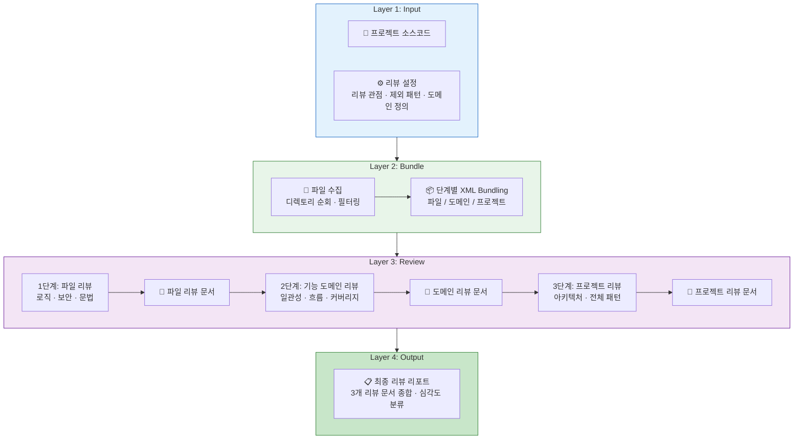
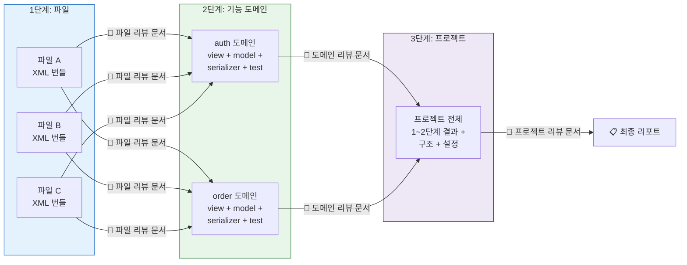
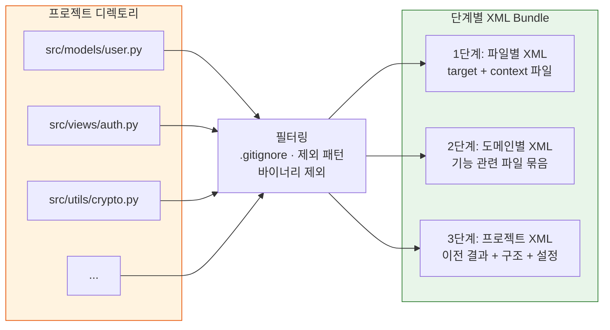
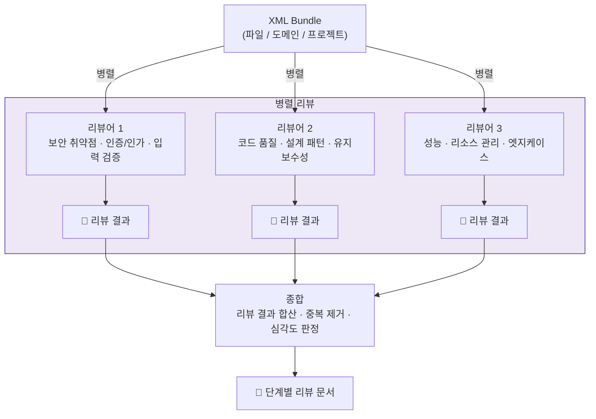
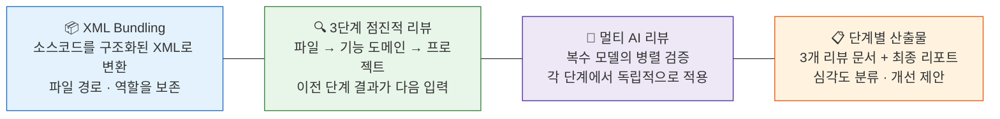

# Deep Analysis 워크플로우

## 아키텍처

```mermaid
flowchart TB
    subgraph L1["Layer 1: Input"]
        SRC["📁 프로젝트 소스코드"] & CFG["⚙️ 리뷰 설정<br/>리뷰 관점 · 제외 패턴 · 도메인 정의"]
    end

    subgraph L2["Layer 2: Bundle"]
        COLLECT["📂 파일 수집<br/>디렉토리 순회 · 필터링"] --> XML["📦 단계별 XML Bundling<br/>파일 / 도메인 / 프로젝트"]
    end

    subgraph L3["Layer 3: Review"]
        direction LR
        S1["1단계: 파일 리뷰<br/>로직 · 보안 · 문법"] --> D1["📄 파일 리뷰 문서"]
        D1 --> S2["2단계: 기능 도메인 리뷰<br/>일관성 · 흐름 · 커버리지"] --> D2["📄 도메인 리뷰 문서"]
        D2 --> S3["3단계: 프로젝트 리뷰<br/>아키텍처 · 전체 패턴"] --> D3["📄 프로젝트 리뷰 문서"]
    end

    subgraph L4["Layer 4: Output"]
        REPORT["📋 최종 리뷰 리포트<br/>3개 리뷰 문서 종합 · 심각도 분류"]
    end

    L1 --> L2
    L2 --> L3
    L3 --> L4
    style L1 fill: #e3f2fd, stroke: #1565C0
    style L2 fill: #e8f5e9, stroke: #2E7D32
    style L3 fill: #f3e5f5, stroke: #6A1B9A
    style L4 fill: #c8e6c9, stroke: #2E7D32
```

## 3단계 점진적 리뷰

```mermaid
graph LR
    subgraph S1["1단계: 파일"]
        F1["파일 A<br/>XML 번들"]
        F2["파일 B<br/>XML 번들"]
        F3["파일 C<br/>XML 번들"]
    end

    subgraph S2["2단계: 기능 도메인"]
        D1["auth 도메인<br/>view + model +<br/>serializer + test"]
        D2["order 도메인<br/>view + model +<br/>serializer + test"]
    end

    subgraph S3["3단계: 프로젝트"]
        P1["프로젝트 전체<br/>1~2단계 결과 +<br/>구조 + 설정"]
    end

    F1 & F2 & F3 -->|" 📄 파일 리뷰 문서 "| D1 & D2
    D1 & D2 -->|" 📄 도메인 리뷰 문서 "| P1
    P1 -->|" 📄 프로젝트 리뷰 문서 "| REPORT["📋 최종 리포트"]
    style S1 fill: #e3f2fd, stroke: #1565C0
    style S2 fill: #e8f5e9, stroke: #2E7D32
    style S3 fill: #ede7f6, stroke: #4527A0
```

## XML Bundling

```mermaid
graph LR
    subgraph Source["프로젝트 디렉토리"]
        F1["src/models/user.py"]
        F2["src/views/auth.py"]
        F3["src/utils/crypto.py"]
        FN["..."]
    end

    FILTER["필터링<br/>.gitignore · 제외 패턴<br/>바이너리 제외"]

    subgraph Bundles["단계별 XML Bundle"]
        B1["1단계: 파일별 XML<br/>target + context 파일"]
        B2["2단계: 도메인별 XML<br/>기능 관련 파일 묶음"]
        B3["3단계: 프로젝트 XML<br/>이전 결과 + 구조 + 설정"]
    end

    F1 & F2 & F3 & FN --> FILTER --> B1 & B2 & B3
    style Source fill: #fff3e0, stroke: #E65100
    style Bundles fill: #e8f5e9, stroke: #2E7D32
```

## 멀티 AI 리뷰 (각 단계 공통)

```mermaid
graph TD
    INPUT["XML Bundle<br/>(파일 / 도메인 / 프로젝트)"]

    subgraph Reviewers["병렬 리뷰"]
        R1["리뷰어 1<br/>보안 취약점 · 인증/인가 · 입력 검증"] --> RD1["📄 리뷰 결과"]
        R2["리뷰어 2<br/>코드 품질 · 설계 패턴 · 유지보수성"] --> RD2["📄 리뷰 결과"]
        R3["리뷰어 3<br/>성능 · 리소스 관리 · 엣지케이스"] --> RD3["📄 리뷰 결과"]
    end

    AGG["종합<br/>리뷰 결과 합산 · 중복 제거 · 심각도 판정"]
    INPUT -->|" 병렬 "| R1 & R2 & R3
    RD1 & RD2 & RD3 --> AGG
    AGG --> DOC["📄 단계별 리뷰 문서"]
    style Reviewers fill: #ede7f6, stroke: #4527A0
```

## 설계 원칙

```mermaid
graph LR
    P1["📦 XML Bundling<br/>소스코드를 구조화된 XML로 변환<br/>파일 경로 · 역할을 보존"]
    P2["🔍 3단계 점진적 리뷰<br/>파일 → 기능 도메인 → 프로젝트<br/>이전 단계 결과가 다음 입력"]
    P3["🤖 멀티 AI 리뷰<br/>복수 모델의 병렬 검증<br/>각 단계에서 독립적으로 적용"]
    P4["📋 단계별 산출물<br/>3개 리뷰 문서 + 최종 리포트<br/>심각도 분류 · 개선 제안"]
    P1 --- P2 --- P3 --- P4
    style P1 fill: #e3f2fd, stroke: #1565C0
    style P2 fill: #e8f5e9, stroke: #2E7D32
    style P3 fill: #ede7f6, stroke: #4527A0
    style P4 fill: #fff3e0, stroke: #E65100
```
