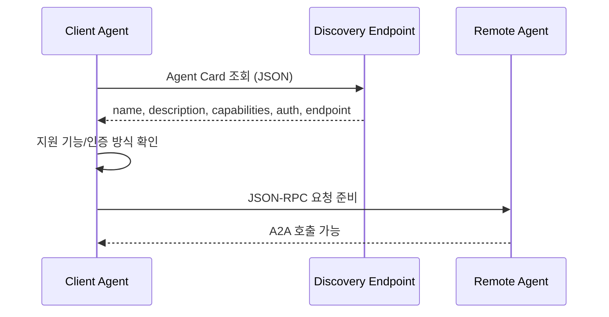
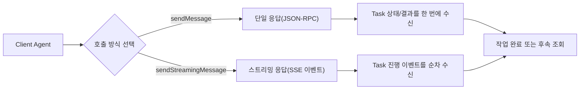
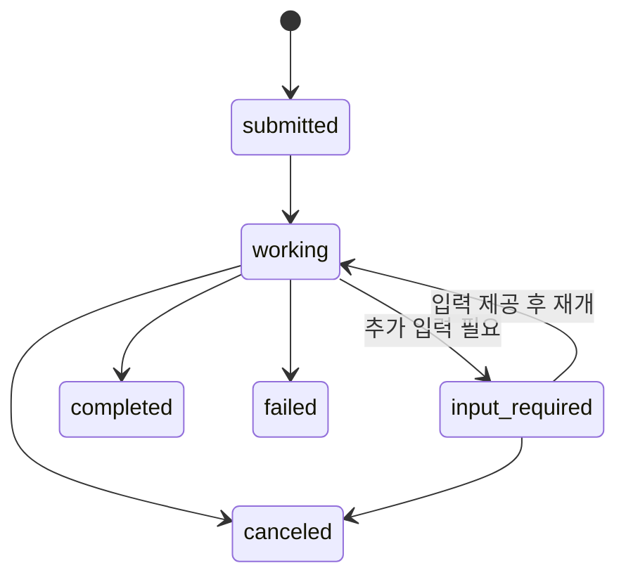
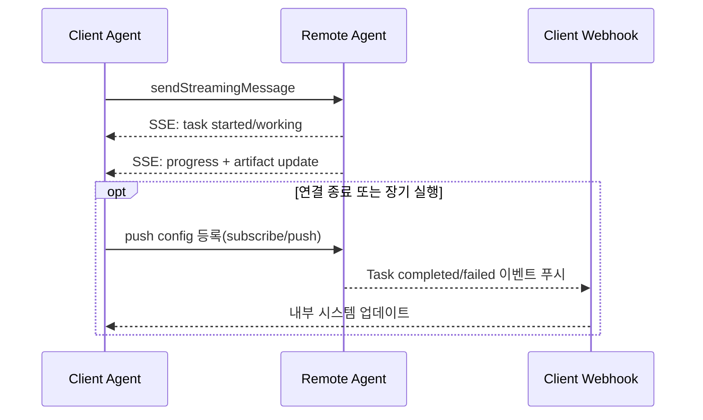
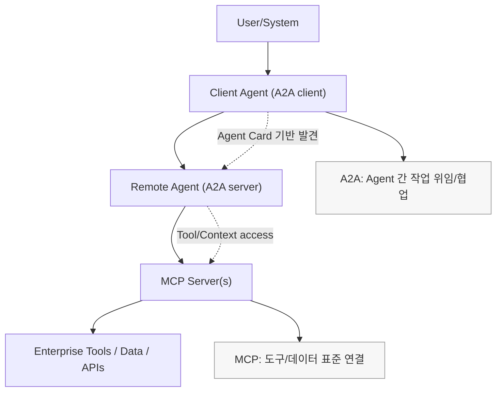

# A2A 아키텍처 다이어그램

## 1. Discovery와 Agent Card

```mermaid
sequenceDiagram
    participant C as Client Agent
    participant D as Discovery Endpoint
    participant R as Remote Agent

    C->>D: Agent Card 조회 (JSON)
    D-->>C: name, description, capabilities, auth, endpoint
    C->>C: 지원 기능/인증 방식 확인
    C->>R: JSON-RPC 요청 준비
    R-->>C: A2A 호출 가능
```

## 2. sendMessage vs sendStreamingMessage

```mermaid
flowchart LR
    C["Client Agent"] --> CH{"호출 방식 선택"}
    CH -->|"sendMessage"| SM["단일 응답(JSON-RPC)"]
    CH -->|"sendStreamingMessage"| SS["스트리밍 응답(SSE 이벤트)"]

    SM --> R1["Task 상태/결과를 한 번에 수신"]
    SS --> R2["Task 진행 이벤트를 순차 수신"]

    R1 --> OUT["작업 완료 또는 후속 조회"]
    R2 --> OUT
```

## 3. Task Lifecycle

```mermaid
stateDiagram-v2
    [*] --> submitted
    submitted --> working
    working --> input_required: 추가 입력 필요
    input_required --> working: 입력 제공 후 재개
    working --> completed
    working --> failed
    working --> canceled
    input_required --> canceled
```

## 4. Streaming(SSE) + Push Notification 비동기 패턴

```mermaid
sequenceDiagram
    participant C as Client Agent
    participant R as Remote Agent
    participant W as Client Webhook

    C->>R: sendStreamingMessage
    R-->>C: SSE: task started/working
    R-->>C: SSE: progress + artifact update

    opt 연결 종료 또는 장기 실행
        C->>R: push config 등록(subscribe/push)
        R-->>W: Task completed/failed 이벤트 푸시
        W-->>C: 내부 시스템 업데이트
    end
```

## 5. A2A + MCP 조합

```mermaid
flowchart TD
    User["User/System"] --> CA["Client Agent (A2A client)"]
    CA --> RA["Remote Agent (A2A server)"]
    RA --> MCP["MCP Server(s)"]
    MCP --> Tools["Enterprise Tools / Data / APIs"]

    CA -. Agent Card 기반 발견 .-> RA
    RA -. Tool/Context access .-> MCP

    Note1["A2A: Agent 간 작업 위임/협업"]:::note
    Note2["MCP: 도구/데이터 표준 연결"]:::note
    CA --> Note1
    MCP --> Note2

    classDef note fill:#f7f7f7,stroke:#999,color:#333;
```

