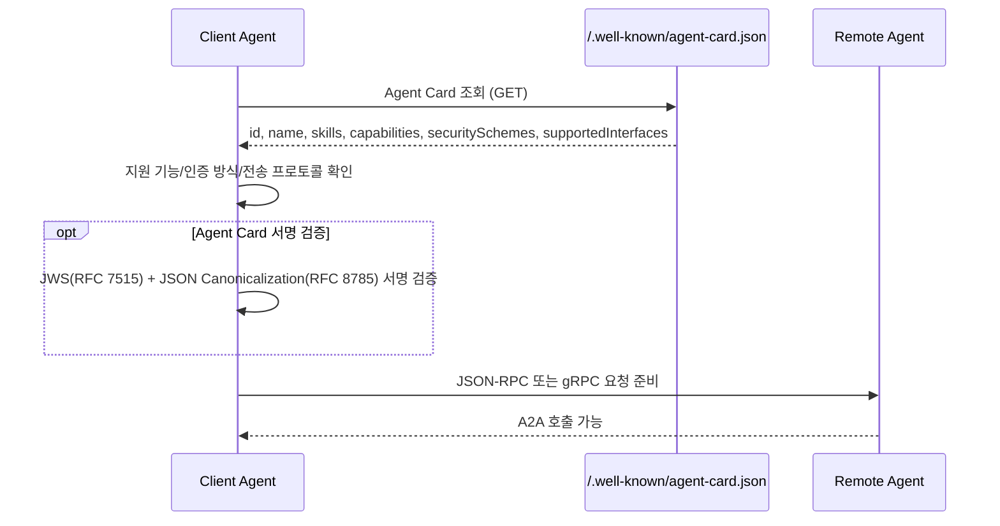
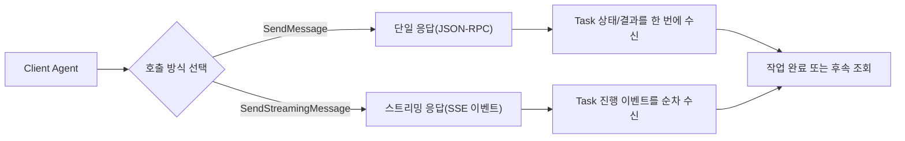
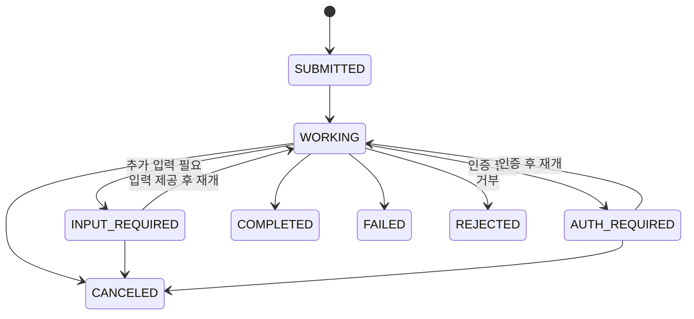
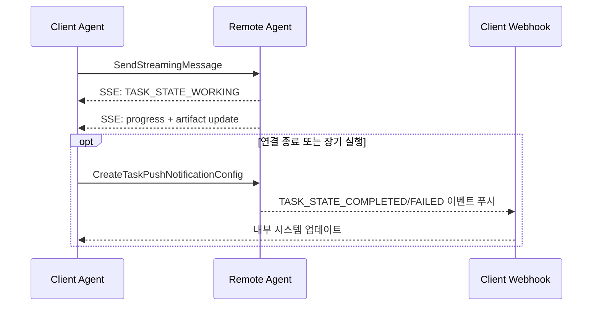
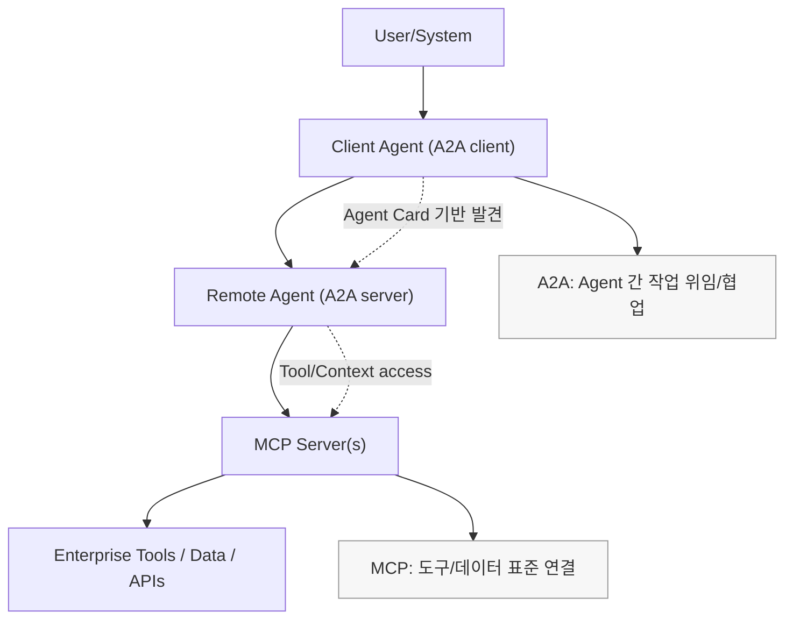
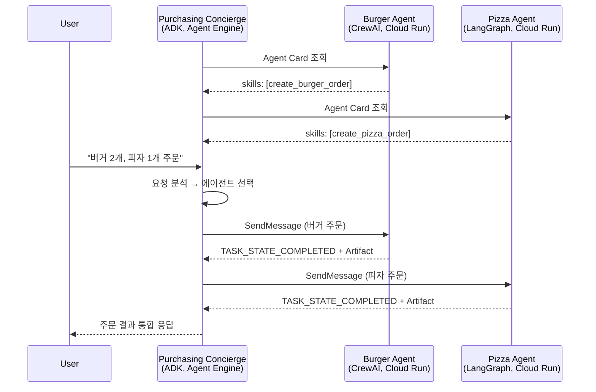
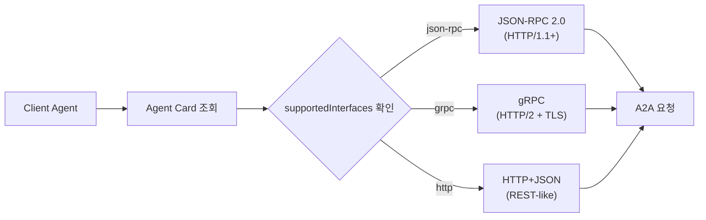
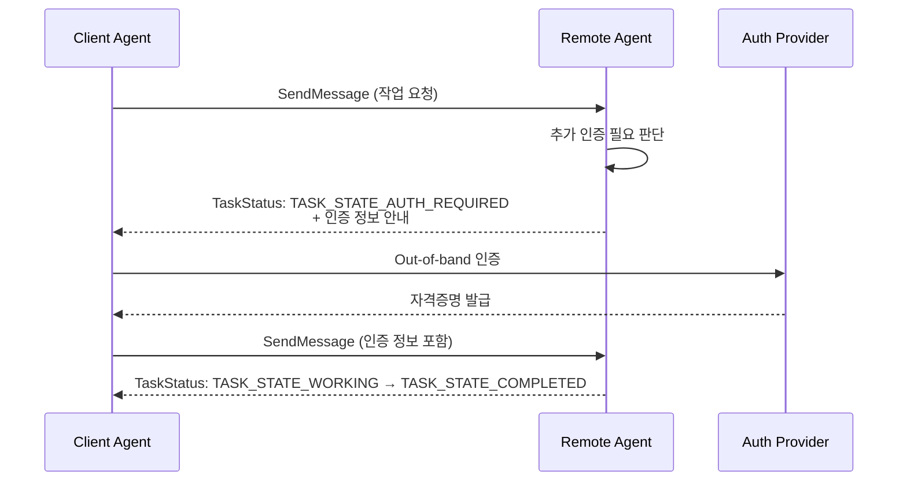

# A2A 아키텍처 다이어그램

## 1. Discovery와 Agent Card

## 2. SendMessage vs SendStreamingMessage

## 3. Task Lifecycle

## 4. Streaming(SSE) + Push Notification 비동기 패턴

## 5. A2A + MCP 조합

## 6. 멀티 에이전트 위임 패턴 (Codelab 예제)

## 7. 전송 프로토콜 선택

## 8. In-Task Authentication

