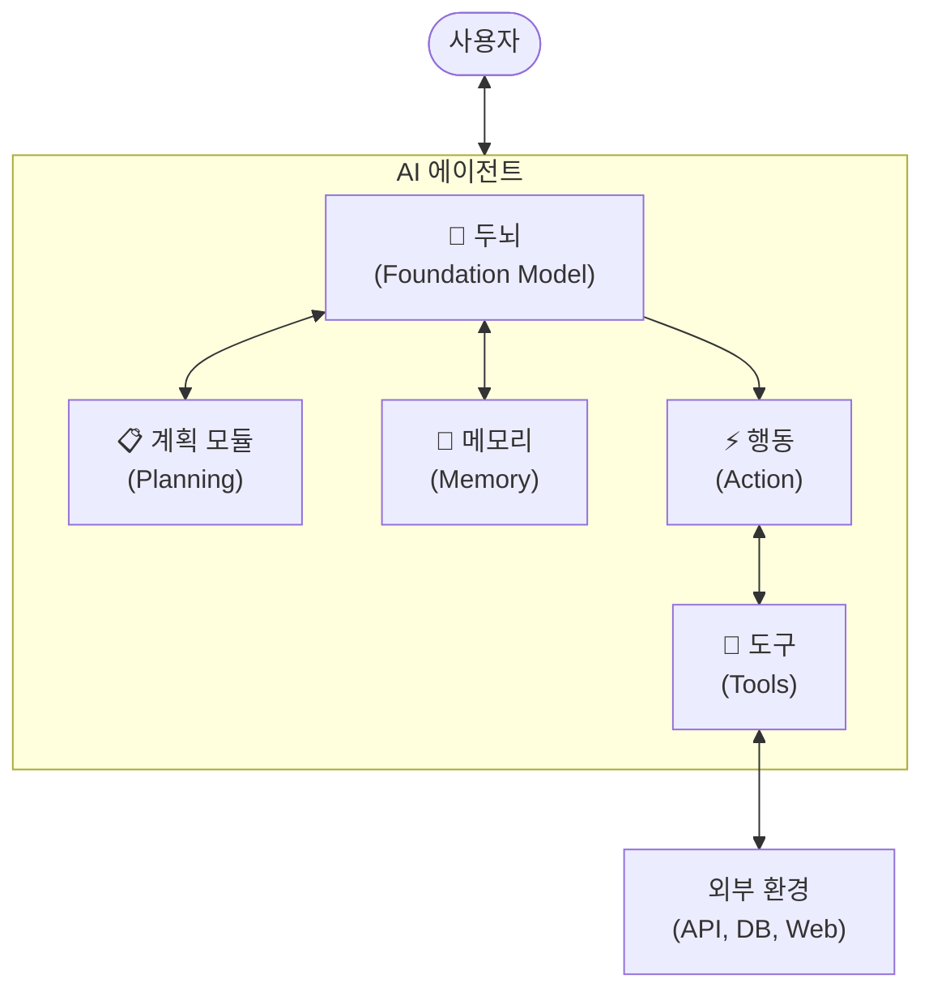
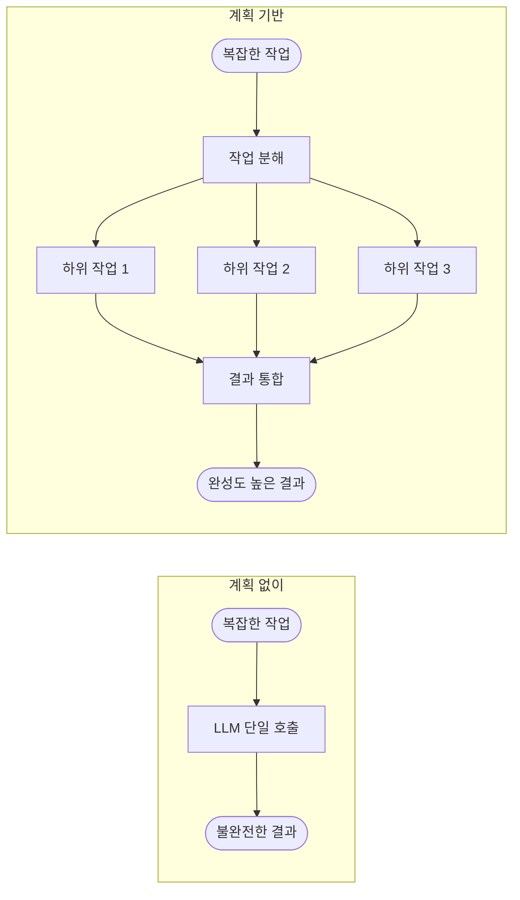
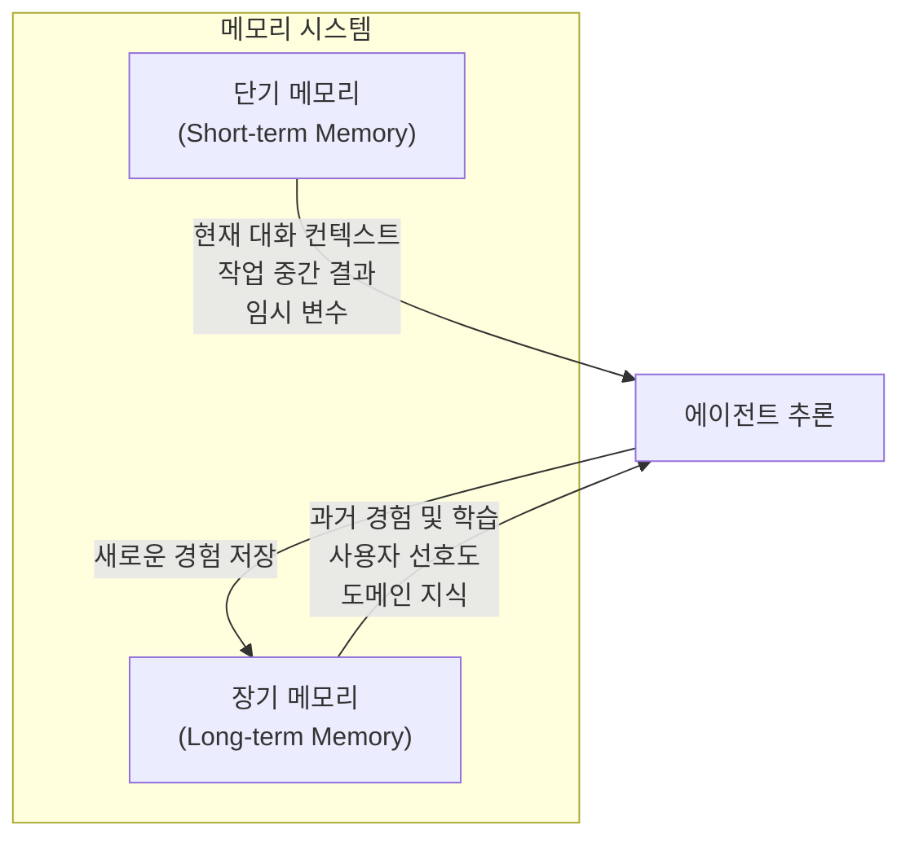
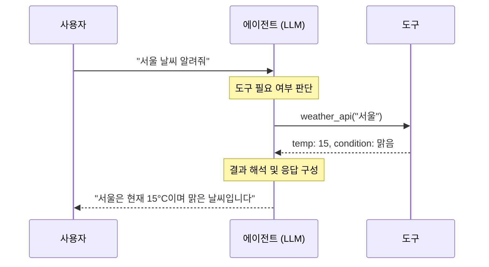
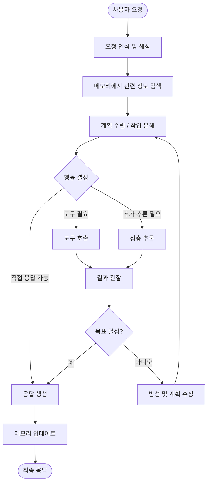

# 에이전트 구성 요소

AI 에이전트는 여러 핵심 모듈이 유기적으로 결합되어 작동하는 시스템입니다.
이 문서에서는 에이전트를 구성하는 핵심 요소와 각 요소의 역할을 살펴봅니다.

---

## 아키텍처 개요

---

## 핵심 구성 요소

### 1. 두뇌 (Brain / Foundation Model)

에이전트의 **중앙 추론 엔진**으로, 대형 언어 모델(LLM)이 이 역할을 수행합니다.

**주요 역할:**

- 사용자 요청의 의도 파악 및 해석
- 작업 수행을 위한 추론(reasoning)
- 도구 선택 및 활용 결정
- 최종 응답 생성

**핵심 능력:**

| 능력         | 설명                          |
|------------|-----------------------------|
| **자연어 이해** | 사용자의 의도와 맥락을 파악             |
| **추론**     | 논리적 사고를 통해 문제 해결 방안 도출      |
| **생성**     | 텍스트, 코드, 계획 등 다양한 형식의 출력 생성 |
| **의사결정**   | 여러 선택지 중 최적의 행동 결정          |

---

### 2. 계획 모듈 (Planning)

복잡한 작업을 **관리 가능한 하위 작업으로 분해**하고 실행 순서를 결정합니다.

**계획 수립 방식:**

**주요 계획 전략:**

- **작업 분해 (Task Decomposition)**: 큰 목표를 작고 실행 가능한 단계로 분해
- **다단계 추론 (Chain of Thought)**: 단계별로 논리적 사고를 전개
- **동적 재계획 (Re-planning)**: 실행 중 결과에 따라 계획 수정

---

### 3. 메모리 (Memory)

에이전트가 **과거 경험과 컨텍스트를 저장하고 활용**하는 시스템입니다.

**메모리 유형:**

| 유형         | 저장 범위    | 예시                         |
|------------|----------|----------------------------|
| **단기 메모리** | 현재 세션/대화 | 대화 이력, 중간 계산 결과, 현재 작업 상태  |
| **장기 메모리** | 세션 간 영속적 | 사용자 프로필, 과거 작업 패턴, 학습된 선호도 |

**구현 기술:**

- **컨텍스트 윈도우**: LLM의 입력으로 직접 제공 (단기 메모리)
- **벡터 데이터베이스**: 임베딩 기반 유사도 검색 (장기 메모리)
- **구조화된 저장소**: 관계형 DB, 키-값 저장소 등

---

### 4. 도구 (Tools)

에이전트가 **외부 환경과 상호작용**하기 위해 사용하는 기능들입니다.

LLM 단독으로는 최신 정보를 알지 못하거나, 정확한 계산을 수행하지 못하는 한계가 있습니다. 도구를 통해 이러한 한계를 보완합니다.

**도구 활용 흐름:**

**주요 도구 유형:**

| 분류         | 도구 예시                | 용도              |
|------------|----------------------|-----------------|
| **정보 검색**  | 웹 검색, RAG, 데이터베이스 조회 | 최신 정보 및 사실 확인   |
| **코드 실행**  | Python 인터프리터, 셸      | 계산, 데이터 처리, 자동화 |
| **외부 API** | REST API, GraphQL    | 외부 서비스 연동       |
| **파일 시스템** | 파일 읽기/쓰기, 디렉터리 탐색    | 문서 처리, 데이터 관리   |
| **커뮤니케이션** | 이메일, 메신저, 알림         | 사용자 및 시스템 간 소통  |

---

### 5. 행동 (Action)

에이전트의 추론 결과를 **실제로 실행에 옮기는** 구성 요소입니다.

행동은 두뇌의 의사결정에 따라 도구를 호출하거나, 사용자에게 응답을 생성하거나, 환경의 상태를 변경합니다.

**행동 유형:**

- **도구 호출**: 외부 도구를 실행하여 결과 확보
- **응답 생성**: 사용자에게 최종 결과 전달
- **상태 변경**: 메모리 업데이트, 계획 수정 등 내부 상태 변경
- **에스컬레이션**: 사람의 판단이 필요한 경우 인간에게 전달

---

## 에이전트 작동 흐름

아래 다이어그램은 에이전트가 작업을 수행하는 전체 흐름을 보여줍니다.

---

## 에이전트 유형

에이전트의 자율성과 복잡도에 따라 다양한 유형으로 분류할 수 있습니다.

| 유형         | 자율성   | 특징                | 예시               |
|------------|-------|-------------------|------------------|
| **단순 반응형** | 낮음    | 규칙 기반으로 입력에 직접 반응 | 챗봇, FAQ 시스템      |
| **모델 기반**  | 중간    | 내부 모델을 통해 환경 이해   | RAG 시스템, 검색 에이전트 |
| **목표 기반**  | 높음    | 목표 달성을 위한 계획 수립   | 코드 에이전트, 연구 에이전트 |
| **학습 기반**  | 매우 높음 | 경험에서 학습하여 성능 향상   | 자율 주행, 게임 AI     |

---

## 참고 자료

- [IBM: AI 에이전트의 구성 요소](https://www.ibm.com/kr-ko/think/topics/components-of-ai-agents)
- [Lilian Weng: LLM Powered Autonomous Agents](https://lilianweng.github.io/posts/2023-06-23-agent/)
- [LangChain: Agent Architecture](https://docs.langchain.com/oss/python/langchain/agents)
- [AWS: Agentic AI Patterns](https://docs.aws.amazon.com/prescriptive-guidance/latest/agentic-ai-patterns/introduction.html)
