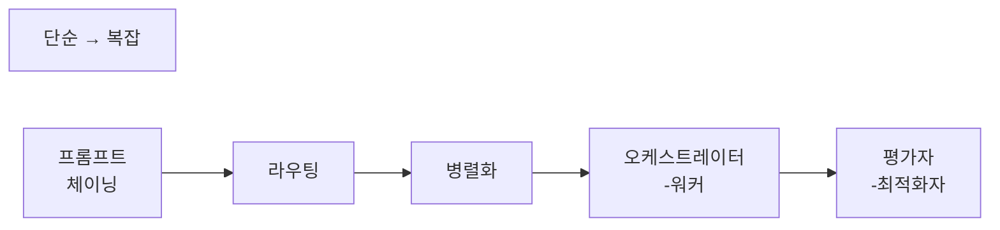
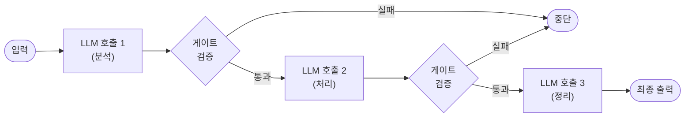
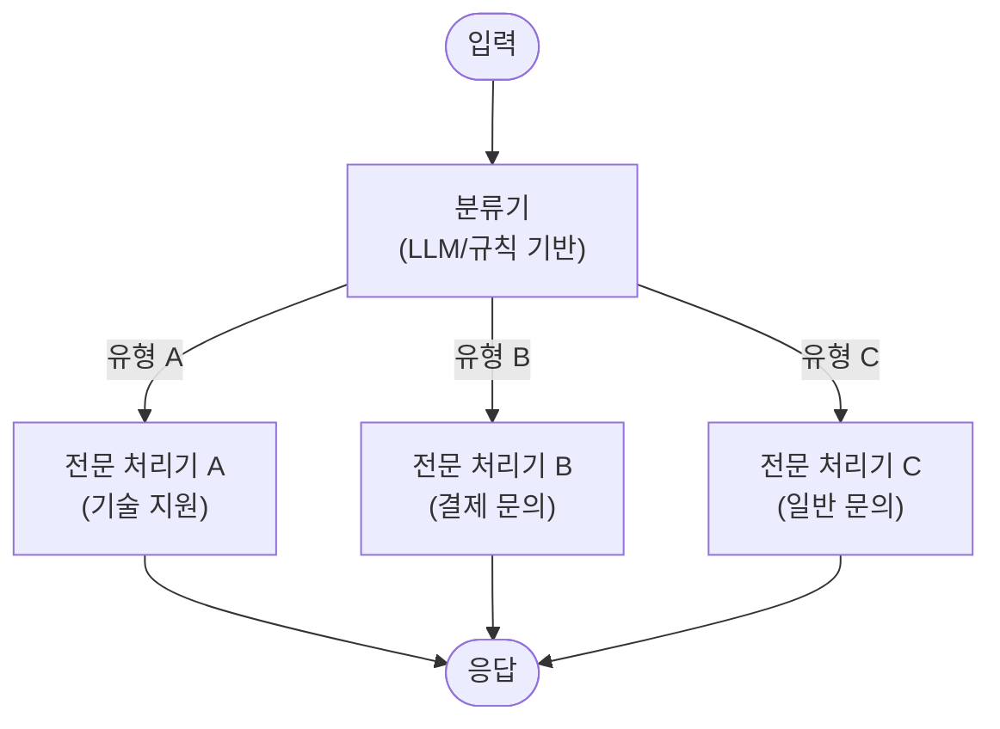
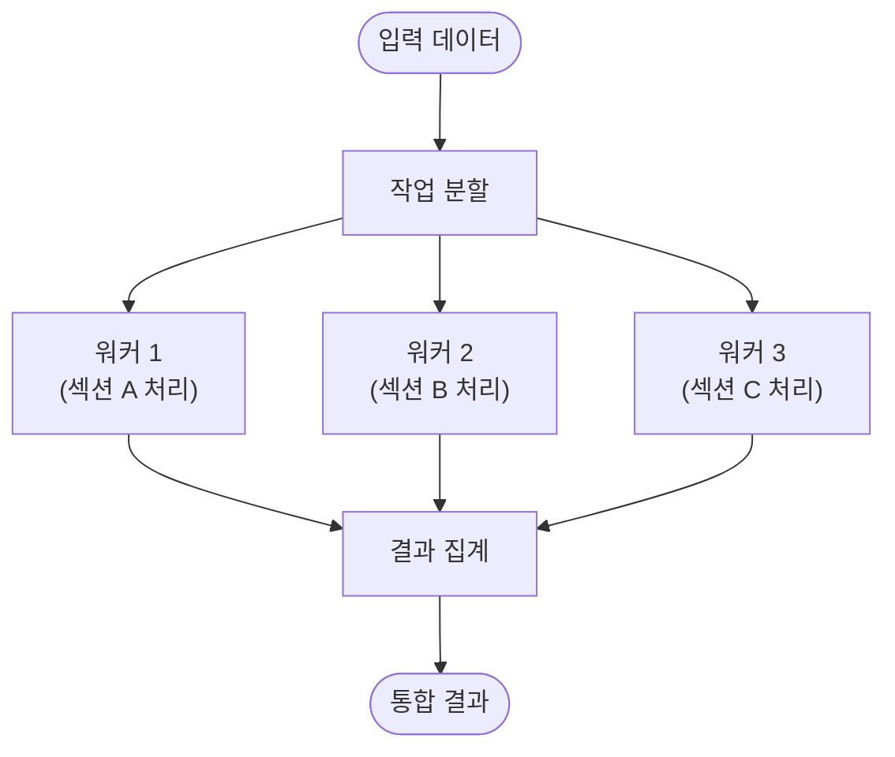
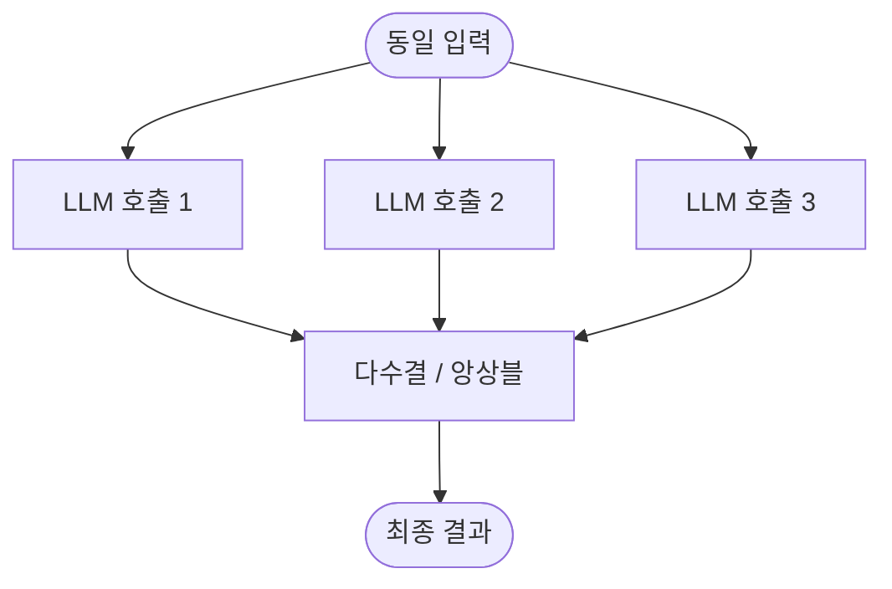
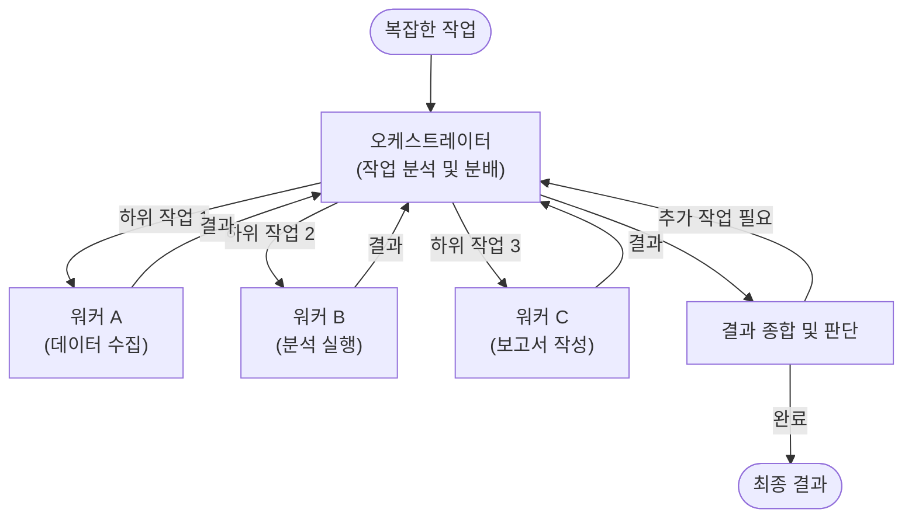
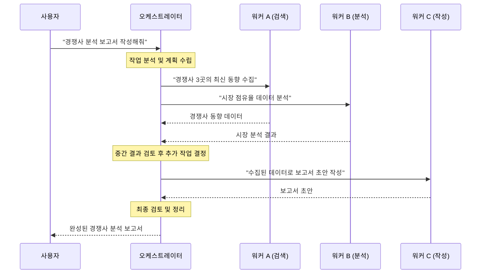
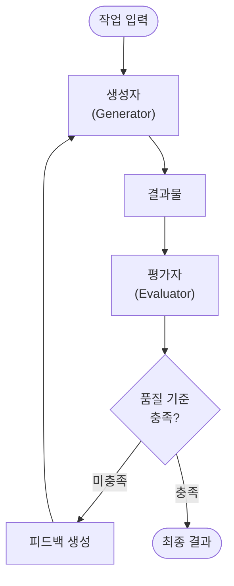
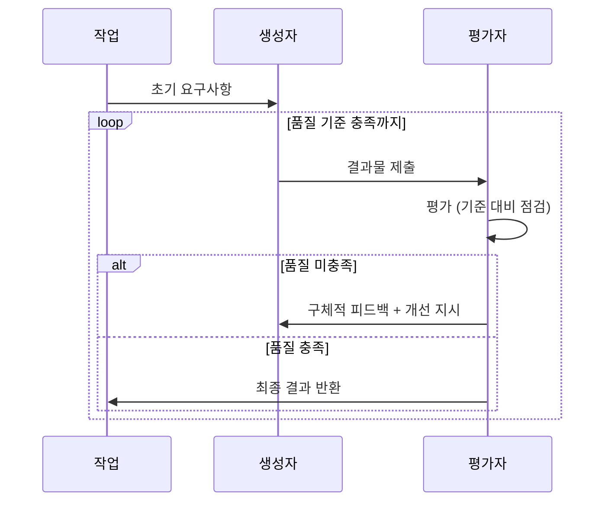
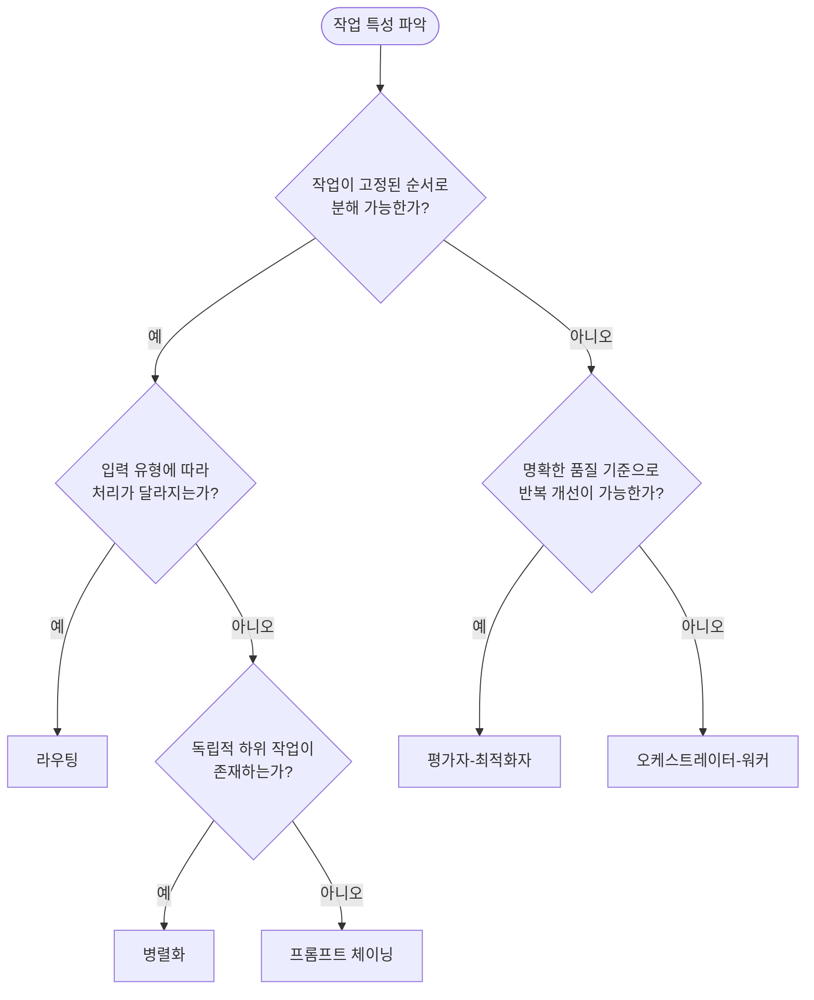

# 구현 패턴

Agentic Workflow를 실제 시스템으로 구현할 때 활용할 수 있는 구체적인 아키텍처 패턴을 정리합니다.
이 패턴들은 [핵심 디자인 패턴](/agentic-workflow/03-core-patterns.md)을 실무에 적용하기 위한 구체적인 구현 방법입니다.

---

## 패턴 개요

| 패턴                                               | 핵심 개념                    | 적합한 상황                  |
|--------------------------------------------------|--------------------------|-------------------------|
| [프롬프트 체이닝](#1-프롬프트-체이닝-prompt-chaining)          | 순차적 LLM 호출, 이전 출력이 다음 입력 | 고정된 단계의 파이프라인 처리        |
| [라우팅](#2-라우팅-routing)                            | 입력 분류 후 전문 처리기로 분기       | 입력 유형에 따라 다른 처리가 필요한 경우 |
| [병렬화](#3-병렬화-parallelization)                    | 독립 작업의 동시 실행 또는 다수결      | 처리 속도, 신뢰도 향상이 필요한 경우   |
| [오케스트레이터-워커](#4-오케스트레이터-워커-orchestrator-workers) | 중앙 오케스트레이터가 동적 작업 분배     | 복잡한 다단계 동적 작업           |
| [평가자-최적화자](#5-평가자-최적화자-evaluator-optimizer)      | 생성-평가-개선 반복 루프           | 명확한 품질 기준이 있는 반복 개선     |

---

## 1. 프롬프트 체이닝 (Prompt Chaining)

### 정의

복잡한 작업을 **순차적인 LLM 호출 체인**으로 분해하여 처리하는 패턴입니다.
각 단계의 출력이 다음 단계의 입력이 되며, 중간에 게이트(gate) 단계를 두어 품질을 검증할 수 있습니다.

### 근거 (Rationale)

- 각 LLM 호출의 역할을 단순화하여 정확도 향상
- 중간 결과를 검증할 수 있어 오류 전파 방지
- 단계별 프롬프트 최적화가 가능

### 작동 흐름

### 실제 사용 예시

- **문서 생성**: 개요 작성 → 초안 작성 → 스타일 편집 → 최종 검수
- **데이터 처리**: 데이터 추출 → 변환 → 검증 → 적재
- **번역**: 직역 → 의역 → 현지화 검수

### 장단점

| 구분        | 내용                    |
|-----------|-----------------------|
| ✅ **장점**  | 단계별 명확한 책임 분리, 디버깅 용이 |
| ✅ **장점**  | 중간 검증으로 오류 조기 발견      |
| ⚠️ **단점** | 단계 수에 비례하여 지연 시간 증가   |
| ⚠️ **단점** | 초기 단계 오류가 후속 단계에 영향   |

---

## 2. 라우팅 (Routing)

### 정의

입력을 **분류하고 적절한 전문 처리기(handler)로 전달**하는 패턴입니다.
하나의 범용 프롬프트 대신, 각 입력 유형에 최적화된 전문 프롬프트를 사용하여 처리 품질을 높입니다.

### 근거 (Rationale)

- 다양한 유형의 입력을 하나의 프롬프트로 처리하면 품질이 저하됨
- 각 유형에 특화된 프롬프트와 도구를 사용하면 정확도 향상
- 관심사 분리(Separation of Concerns) 원칙 적용

### 작동 흐름

### 실제 사용 예시

- **고객 서비스**: 문의 유형(기술/결제/일반) 분류 → 전문 처리기 연결
- **코드 리뷰**: 언어 감지(Python/Java/JS) → 언어별 전문 리뷰어 할당
- **콘텐츠 모더레이션**: 콘텐츠 유형(텍스트/이미지/영상) 분류 → 전문 검토기 적용

### 장단점

| 구분        | 내용                     |
|-----------|------------------------|
| ✅ **장점**  | 각 유형에 최적화된 처리로 품질 향상   |
| ✅ **장점**  | 새로운 유형 추가가 용이 (확장성)    |
| ⚠️ **단점** | 분류 오류 시 부적절한 처리기로 전달   |
| ⚠️ **단점** | 처리기 수 증가에 따른 관리 복잡도 증가 |

---

## 3. 병렬화 (Parallelization)

### 정의

**독립적인 하위 작업을 동시에 실행**하거나, **동일 작업을 여러 번 수행하여 다수결로 최적 결과를 선택**하는 패턴입니다.

### 근거 (Rationale)

- 독립 작업의 동시 처리로 총 소요 시간 단축
- 다수결(Voting) 방식으로 단일 LLM 응답의 편향 감소
- 대용량 입력을 분할하여 병렬 처리 가능

### 작동 흐름

#### 섹션 분할 (Sectioning)

#### 투표 (Voting)

### 실제 사용 예시

- **코드 검토**: 보안 분석 + 성능 분석 + 스타일 분석을 동시 수행
- **문서 번역**: 대용량 문서를 섹션별로 분할하여 병렬 번역
- **콘텐츠 분류**: 동일 콘텐츠에 3회 분류 수행 후 다수결 결정

### 장단점

| 구분        | 내용                  |
|-----------|---------------------|
| ✅ **장점**  | 처리 속도 대폭 향상 (섹션 분할) |
| ✅ **장점**  | 결과 신뢰도 향상 (투표 방식)   |
| ⚠️ **단점** | 동시 API 호출에 따른 비용 증가 |
| ⚠️ **단점** | 결과 통합 로직의 복잡도       |

---

## 4. 오케스트레이터-워커 (Orchestrator-Workers)

### 정의

**중앙 오케스트레이터 에이전트가 작업을 분석하고, 전문 워커 에이전트에게 동적으로 작업을 분배**하는 패턴입니다.
프롬프트 체이닝과 달리, 실행 경로가 고정되지 않고 작업의 특성에 따라 동적으로 결정됩니다.

### 근거 (Rationale)

- 사전에 작업 흐름을 정의할 수 없는 복잡한 동적 작업에 적합
- 오케스트레이터가 전체 맥락을 유지하며 최적의 작업 배분 결정
- 워커의 추가/변경이 유연하여 시스템 확장성 확보

### 작동 흐름

### 오케스트레이션 상세 흐름

### 실제 사용 예시

- **코딩 에이전트**: 오케스트레이터가 파일 수정 범위를 판단하고 각 파일별 워커에게 수정 작업 분배
- **연구 에이전트**: 주제 분석 → 문헌 검색 워커 + 데이터 분석 워커 → 결과 종합
- **DevOps 에이전트**: 장애 감지 → 로그 분석 워커 + 모니터링 워커 → 원인 분석 및 대응

### 장단점

| 구분        | 내용                          |
|-----------|-----------------------------|
| ✅ **장점**  | 동적이고 예측 불가한 작업에 유연하게 대응     |
| ✅ **장점**  | 워커를 독립적으로 추가/교체 가능          |
| ✅ **장점**  | 오케스트레이터가 전체 맥락을 유지하여 일관성 확보 |
| ⚠️ **단점** | 오케스트레이터가 병목 지점이 될 수 있음      |
| ⚠️ **단점** | 시스템 설계 및 디버깅 복잡도 높음         |
| ⚠️ **단점** | 다수의 LLM 호출로 비용 증가           |

---

## 5. 평가자-최적화자 (Evaluator-Optimizer)

### 정의

**생성자(Generator)가 결과물을 만들고, 평가자(Evaluator)가 그 결과를 검토하여 피드백을 제공하며, 이를 반복하여 결과를 점진적으로 개선**하는 패턴입니다.

[Reflection 패턴](/agentic-workflow/03-core-patterns.md#1-reflection-반성)의 구현 형태로, 생성과 평가를 별도의 역할로 명확히 분리한 것이 특징입니다.

### 근거 (Rationale)

- 생성과 평가를 분리하면 각 역할에 최적화된 프롬프트/모델 사용 가능
- 명확한 품질 기준이 있을 때 자동화된 반복 개선이 효과적
- 사람의 코드 리뷰 프로세스(작성 → 리뷰 → 수정)와 유사한 자연스러운 패턴

### 작동 흐름

### 평가-최적화 사이클

### 실제 사용 예시

- **코드 생성**: 코드 작성 → 코드 리뷰 에이전트의 피드백 → 수정 반복
- **프롬프트 최적화**: 프롬프트 생성 → 벤치마크 평가 → 프롬프트 개선
- **콘텐츠 작성**: 초안 작성 → 편집 기준(톤, 길이, SEO) 대비 평가 → 수정
- **UI/UX 디자인**: 디자인 생성 → 접근성/사용성 평가 → 디자인 수정

### 장단점

| 구분        | 내용                           |
|-----------|------------------------------|
| ✅ **장점**  | 명확한 품질 기준에 의한 체계적 개선         |
| ✅ **장점**  | 생성과 평가의 관심사 분리               |
| ✅ **장점**  | 자동화된 반복 개선으로 일관된 품질 확보       |
| ⚠️ **단점** | 반복 횟수에 비례하여 비용 및 시간 증가       |
| ⚠️ **단점** | 평가 기준이 불명확하면 무한 루프 위험        |
| ⚠️ **단점** | 평가자가 생성자보다 항상 우수하다고 보장할 수 없음 |

---

## 패턴 선택 가이드

---

## 비교 요약

| 패턴         | 복잡도 | 비용 | 지연 시간 | 유연성 |
|------------|-----|----|-------|-----|
| 프롬프트 체이닝   | 낮음  | 낮음 | 중간    | 낮음  |
| 라우팅        | 낮음  | 낮음 | 짧음    | 중간  |
| 병렬화        | 중간  | 중간 | 짧음    | 중간  |
| 오케스트레이터-워커 | 높음  | 높음 | 길음    | 높음  |
| 평가자-최적화자   | 중간  | 변동 | 변동    | 중간  |

---

## 참고 자료

- [AWS: Agentic AI Patterns](https://docs.aws.amazon.com/prescriptive-guidance/latest/agentic-ai-patterns/introduction.html)
- [Anthropic: Building Effective Agents](https://www.anthropic.com/engineering/building-effective-agents)
- [Google Cloud: Choose a design pattern for an agentic AI system](https://docs.cloud.google.com/architecture/choose-design-pattern-agentic-ai-system)
- [LangGraph: Multi-Agent Patterns](https://docs.langchain.com/langgraph/)
