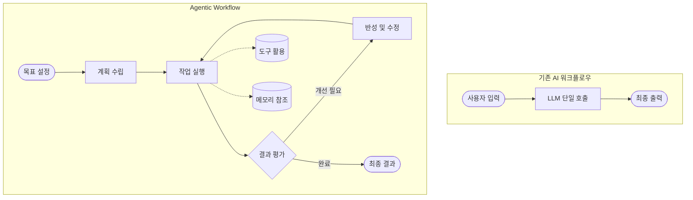
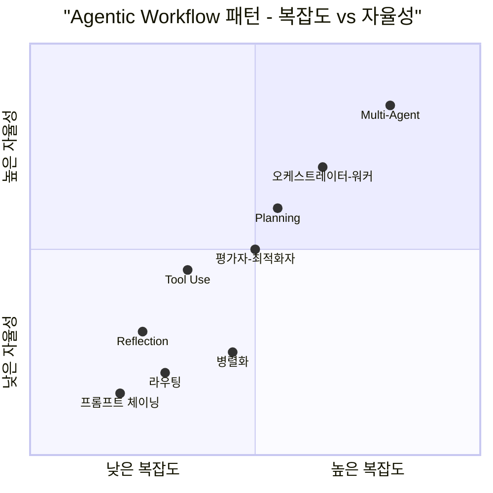

# Agentic Workflow

Agentic AI의 핵심 개념과 워크플로우 패턴을 체계적으로 정리한 문서입니다.

---

## 문서 구성

| 문서                                       | 내용                                                                |
|------------------------------------------|-------------------------------------------------------------------|
| [개념 및 정의](/agentic-workflow/01-introduction.md)          | Agentic Workflow의 정의, 전통적 AI와의 차이, 핵심 특성                          |
| [에이전트 구성 요소](/agentic-workflow/02-components.md)         | AI 에이전트의 아키텍처와 핵심 모듈 (두뇌, 계획, 메모리, 도구, 행동)                        |
| [핵심 디자인 패턴](/agentic-workflow/03-core-patterns.md)       | Andrew Ng의 4대 핵심 패턴 (Reflection, Tool Use, Planning, Multi-Agent) |
| [구현 패턴](/agentic-workflow/04-implementation-patterns.md) | 실무 구현 패턴 (프롬프트 체이닝, 라우팅, 병렬화, 오케스트레이터-워커, 평가자-최적화자)               |

---

## Agentic Workflow 개요

Agentic Workflow는 AI 에이전트가 단순한 프롬프트-응답 방식을 넘어, **자율적으로 계획을 수립하고, 도구를 활용하며, 반복적으로 결과를 개선**하는 작업 흐름입니다.

---

## 패턴 복잡도 비교

---

## 참고 자료

- [Samsung SDS: Agentic Workflow - Agentic AI 이후의 새로운 패러다임](https://www.samsungsds.com/kr/insights/agentic-workflow-a-new-paradigm-after-agentic-ai.html)
- [IBM: AI 에이전트의 구성 요소](https://www.ibm.com/kr-ko/think/topics/components-of-ai-agents)
- [ByteByteGo: Top AI Agentic Workflow Patterns](https://blog.bytebytego.com/p/top-ai-agentic-workflow-patterns)
- [AWS: Agentic AI Patterns](https://docs.aws.amazon.com/prescriptive-guidance/latest/agentic-ai-patterns/introduction.html)
- [Anthropic: Building Effective Agents](https://www.anthropic.com/engineering/building-effective-agents)
- [Andrew Ng: Agentic Design Patterns (DeepLearning.AI)](https://www.deeplearning.ai/the-batch/how-agents-can-improve-llm-performance/)
