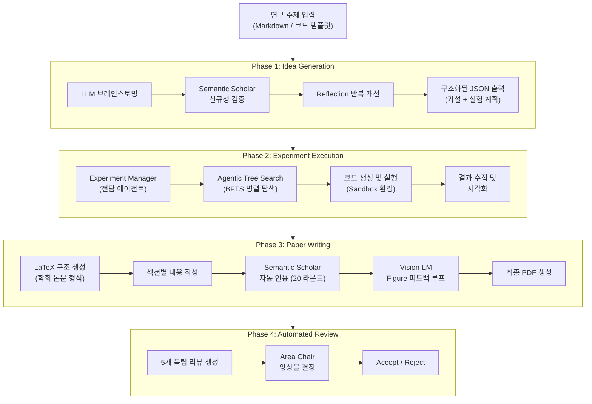
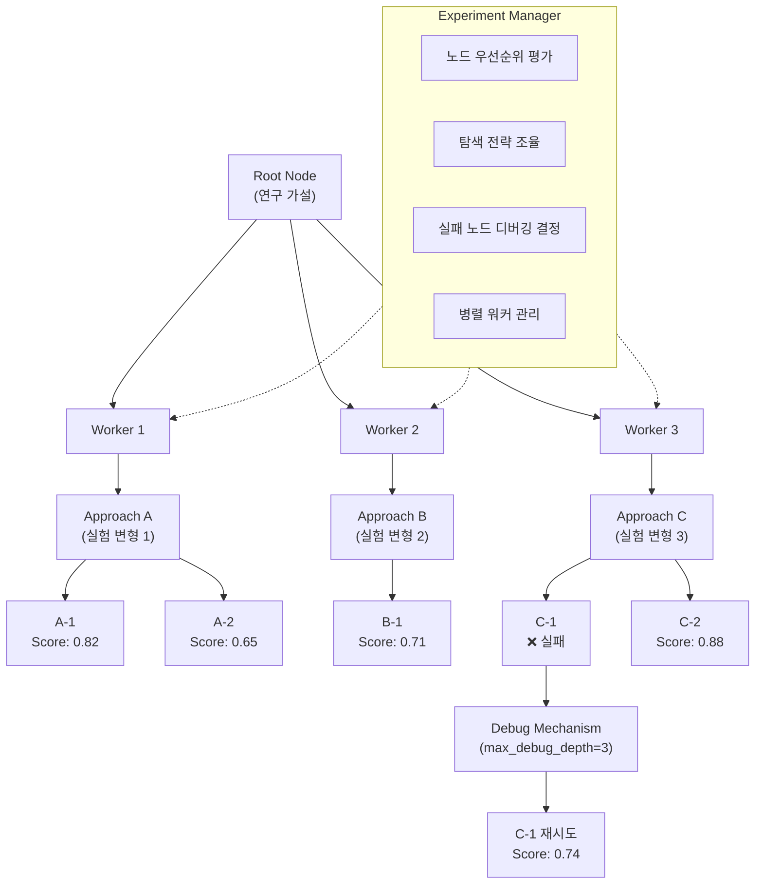
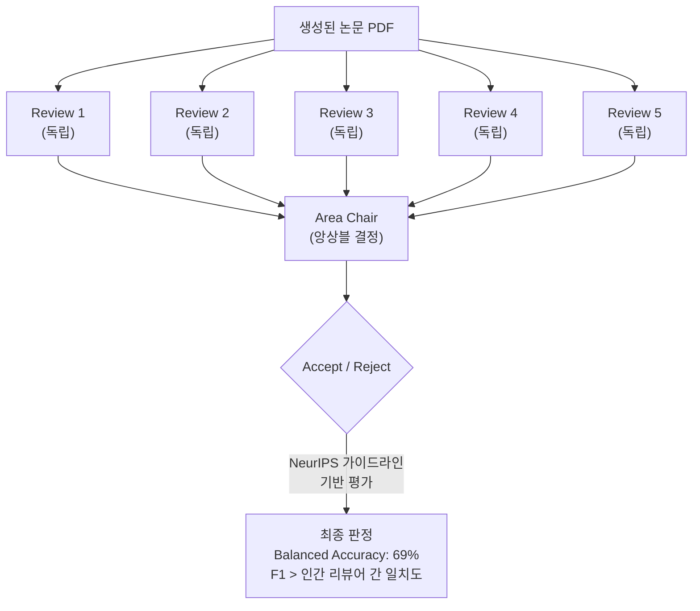
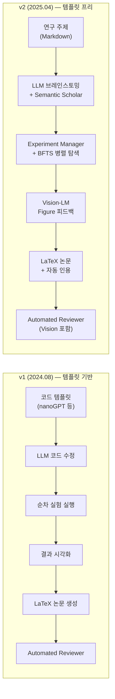
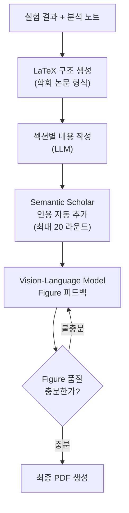
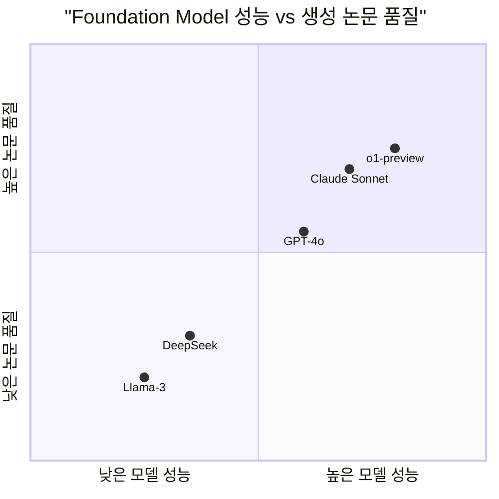
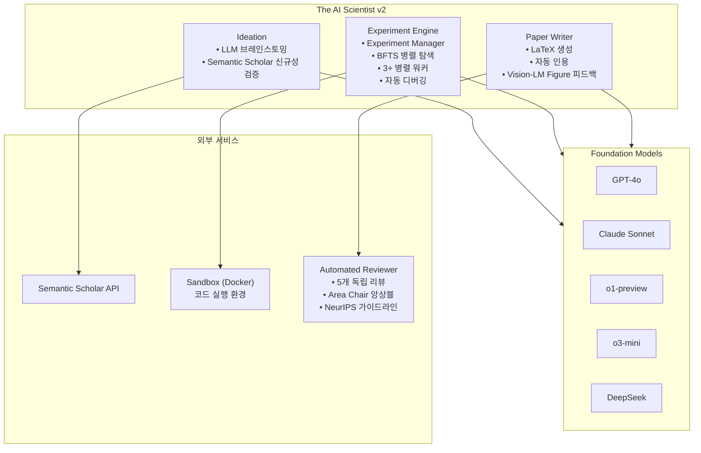
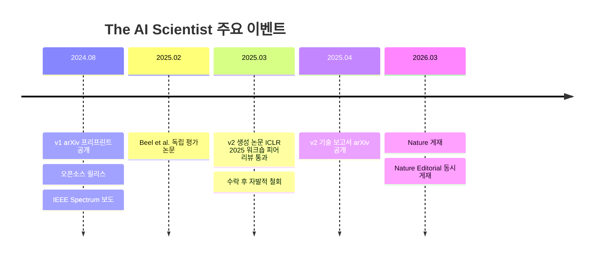
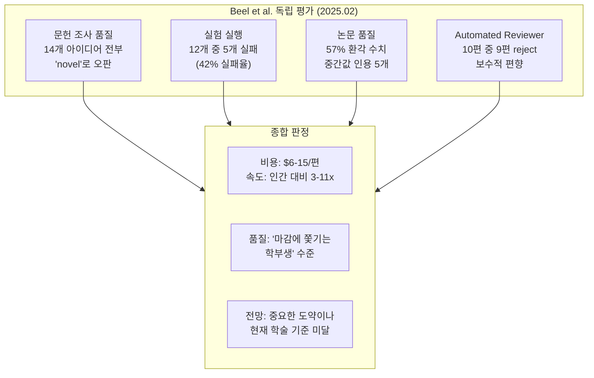

# The AI Scientist 아키텍처 다이어그램

## 1. 전체 파이프라인

## 2. Agentic Tree Search (BFTS) 상세

## 3. Automated Reviewer 구조

## 4. v1 vs v2 아키텍처 비교

## 5. Paper Writing 피드백 루프

## 6. Foundation Model별 논문 품질 스케일링

## 7. 시스템 구성 요소 맵

## 8. 타임라인

## 9. 독립 평가 결과 요약

