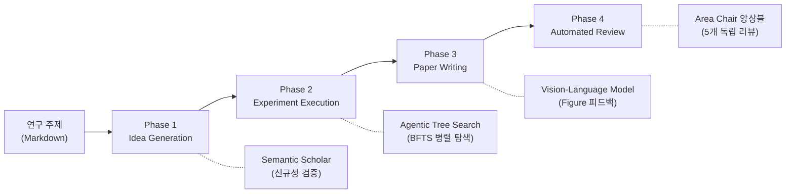

# The AI Scientist 분석

Sakana AI의 **The AI Scientist** 시스템의 작동 방식 및 워크플로우를 공개 문서, 논문, 독립 평가 기준으로 정리한 문서입니다.
[Nature - Towards end-to-end automation of AI research](https://www.nature.com/articles/s41586-026-10265-5) 를 기반으로
작성되었습니다.

> The AI Scientist는 Foundation Model 기반 에이전트가 **AI 연구의 전체 라이프사이클을 자율적으로 수행**하는 시스템입니다.
> 아이디어 생성 → 문헌 조사 → 실험 설계/실행 → 논문 작성 → 자동 피어 리뷰까지 end-to-end로 자동화합니다.
>
> v2에서 생성된 논문이 ICLR 2025 워크숍 피어 리뷰를 통과(6.33/10, 상위 55%)한 최초 사례를 달성했습니다.

---

## 문서 구성

| 문서                                                | 내용                                                                     |
|---------------------------------------------------|------------------------------------------------------------------------|
| [아키텍처 다이어그램](/ai-scientist/00-diagram.md)         | 전체 파이프라인, Phase별 상세 흐름, BFTS 탐색 트리, Automated Reviewer, v1 vs v2, 타임라인 |
| [시스템 설계 및 워크플로우 분석](/ai-scientist/01-analysis.md) | 설계 원칙, Phase별 작동 방식, 실행 명령, 실험 결과, 독립 평가, 학술 커뮤니티 반응, 한계점              |

---

## 아키텍처 개요

### 핵심 설계 포인트

- **End-to-End 자동화**: 아이디어 → 실험 → 논문 → 리뷰 전체 사이클을 자율 수행
- **Agentic Tree Search**: v2에서 도입된 Best-First Tree Search로 실험 경로를 병렬 탐색
- **Vision 피드백 루프**: Vision-Language Model이 Figure를 직접 보고 반복 개선
- **스케일링 법칙**: Foundation Model 성능 향상 → 논문 품질 비례 향상
- **비용 효율**: 논문 1편당 $15-25, 인간 대비 3-11배 빠른 속도

### 버전 비교

| 구분         | v1 (2024.08)      | v2 (2025.04)                     |
|------------|-------------------|----------------------------------|
| 실험 실행      | 코드 템플릿 기반 순차 실행   | Agentic Tree Search (BFTS) 병렬 탐색 |
| 도메인 범위     | 템플릿이 있는 특정 ML 도메인 | 범용 ML 연구 도메인                     |
| Figure 피드백 | 없음 (Vision 미지원)   | Vision-Language Model 기반 반복 개선   |
| 논문 품질      | Weak Accept 수준    | 워크숍 피어 리뷰 통과 (6.33/10)           |
| 템플릿 의존성    | 높음 (시작 코드 템플릿 필수) | 없음 (템플릿 프리)                      |

### 기술 스택

| 구분                | 기술                                                            |
|-------------------|---------------------------------------------------------------|
| Foundation Models | GPT-4o, Claude Sonnet, DeepSeek, Llama-3, o1-preview, o3-mini |
| 논문 검색             | Semantic Scholar API                                          |
| 논문 포맷             | LaTeX                                                         |
| 실험 환경             | Python 3.11, PyTorch (CUDA 12.4), Docker (샌드박싱)               |
| 실행 방식             | Best-First Tree Search (BFTS), 병렬 워커                          |

---

## 참고 자료

- [Nature 논문](https://www.nature.com/articles/s41586-026-10265-5)
- [Nature 뉴스: "How to build an AI scientist"](https://www.nature.com/articles/d41586-026-00899-w)
- [Nature 사설: "AI scientists are changing research"](https://www.nature.com/articles/d41586-026-00934-w)
- [Sakana AI 블로그 (Nature 게재)](https://sakana.ai/ai-scientist-nature/)
- [Sakana AI 블로그 (최초 공개)](https://sakana.ai/ai-scientist/)
- [Sakana AI 블로그 (피어 리뷰 통과)](https://sakana.ai/ai-scientist-first-publication/)
- [AI Scientist v1 저장소](https://github.com/SakanaAI/AI-Scientist)
- [AI Scientist v2 저장소](https://github.com/SakanaAI/AI-Scientist-v2)
- [v1 원본 논문 (arXiv:2408.06292)](https://arxiv.org/abs/2408.06292)
- [v2 기술 보고서 (arXiv:2504.08066)](https://arxiv.org/abs/2504.08066)
- [독립 평가: Beel et al. (arXiv:2502.14297)](https://arxiv.org/abs/2502.14297)
- [UBC 보도자료](https://www.cs.ubc.ca/news/2026/03/ai-scientist)
