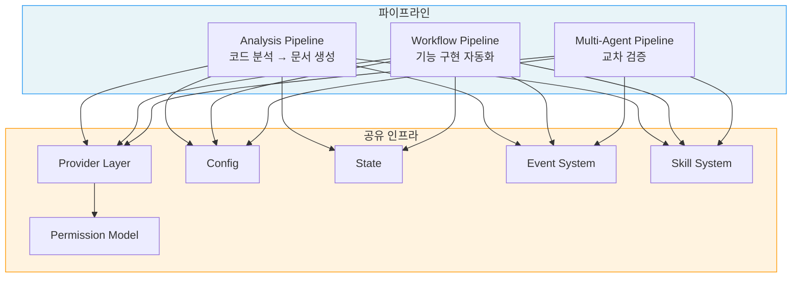
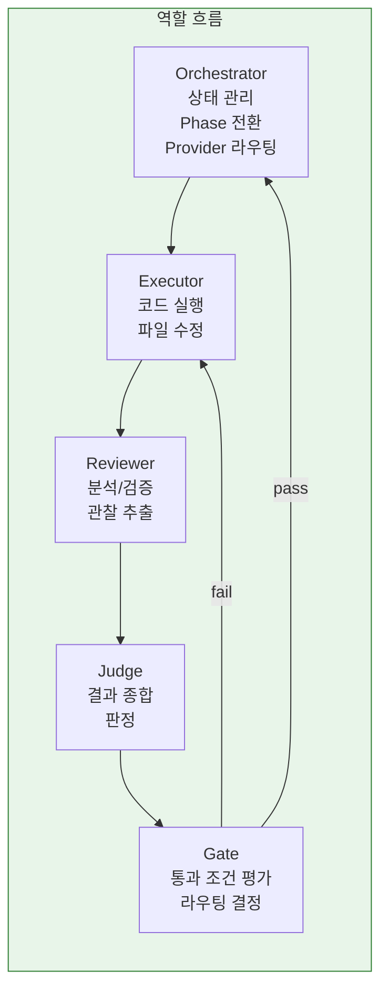
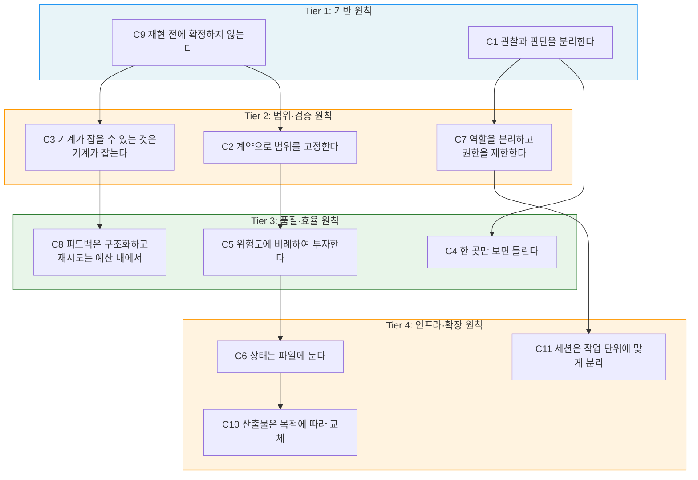

# AI 워크플로우 설계 원칙 다이어그램

---

## 1. 시스템 전체 구조

3개 파이프라인과 공유 인프라 계층의 관계입니다.

### 파이프라인 역할

| 파이프라인 | 목적 | 핵심 패턴 |
|-----------|------|----------|
| Analysis | 코드 분석 → 구조화된 문서 생성 | N-Layer, M-Stage, Writer/Judge |
| Workflow | 기능 구현의 구조화된 자동화 | N-Phase, Gate, Closed-Loop |
| Multi-Agent | 다중 에이전트 교차 검증 | N-Mode, Judge Rules, Synthesis |

---

## 2. 역할 분리

시스템의 5가지 역할과 책임 경계입니다.

### 역할별 권한

| 역할 | 할 수 있는 것 | 할 수 없는 것 |
|------|-------------|-------------|
| Orchestrator | 상태 관리, 라우팅, Phase 전환 | 코드 수정, AI 호출 |
| Executor | allowed_files 내 코드 수정 | forbidden_paths 접근, plan 변경 |
| Reviewer | 관점별 분석, claim 생성 | 코드 수정, 최종 판정 |
| Judge | claim 선별/병합, 일관성 검증 | evidence 수정, 새 claim 생성 |
| Gate | 도구 실행, pass/fail 판정 | AI 판단, 예외 허용 |

---

## 3. 원칙 계층 구조

C1-C11 원칙의 우선순위와 상호 관계입니다.

### 충돌 시 우선순위

| 순위 | 원칙 | 분류 |
|------|------|------|
| 1 | C9 재현 전에 확정하지 않는다 | 기반 |
| 2 | C1 관찰과 판단을 분리한다 | 기반 |
| 3 | C2 계약으로 범위를 고정한다 | 범위 |
| 4 | C3 기계가 잡을 수 있는 것은 기계가 잡는다 | 검증 |
| 5 | C7 역할을 분리하고 권한을 제한한다 | 검증 |
| 6 | C4 한 곳만 보면 틀린다 | 품질 |
| 7 | C8 피드백은 구조화하고 재시도는 예산 내에서 | 효율 |
| 8 | C5 위험도에 비례하여 투자한다 | 효율 |
| 9 | C6 상태는 파일에 둔다 | 인프라 |
| 10 | C11 세션은 작업 단위에 맞게 분리한다 | 운영 |
| 11 | C10 산출물은 목적에 따라 교체한다 | 확장 |

---

## 참고 자료

- [01-principles.md](01-principles.md) — 각 원칙의 정의, 근거, 위반 신호
- [02-architecture.md](02-architecture.md) — 공유 인프라 아키텍처 상세
- [에이전틱 AI 시스템 설계 패턴](/design-pattern/00-diagram.md)
