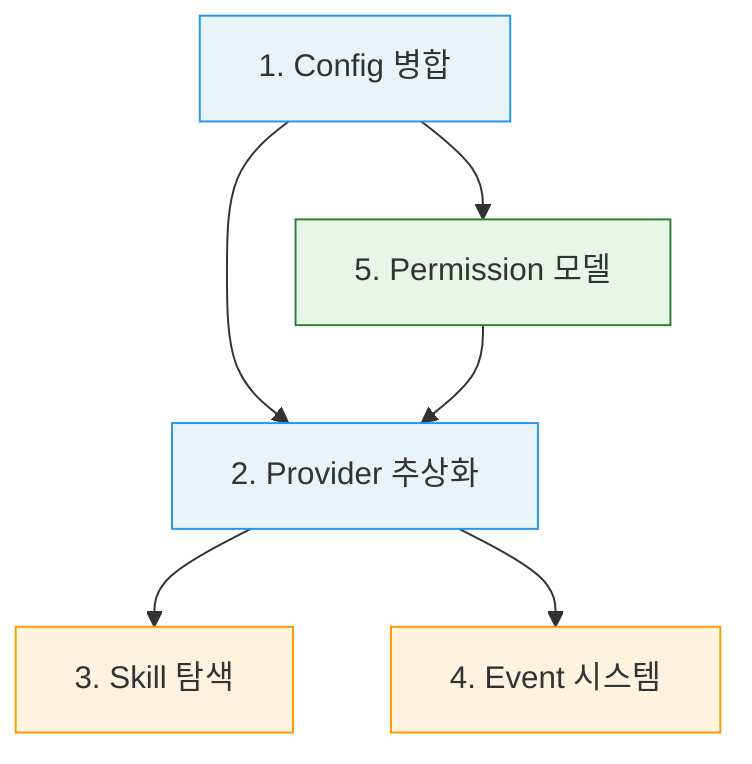
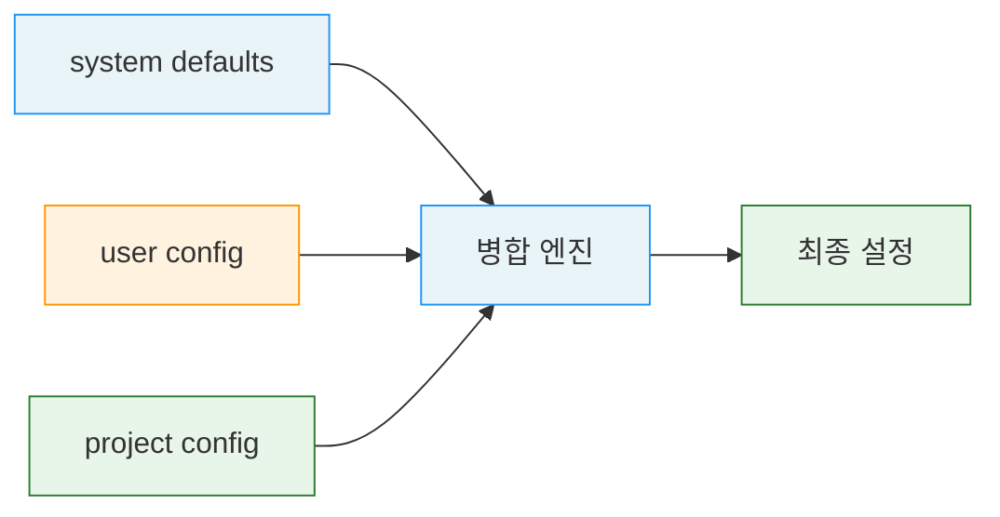
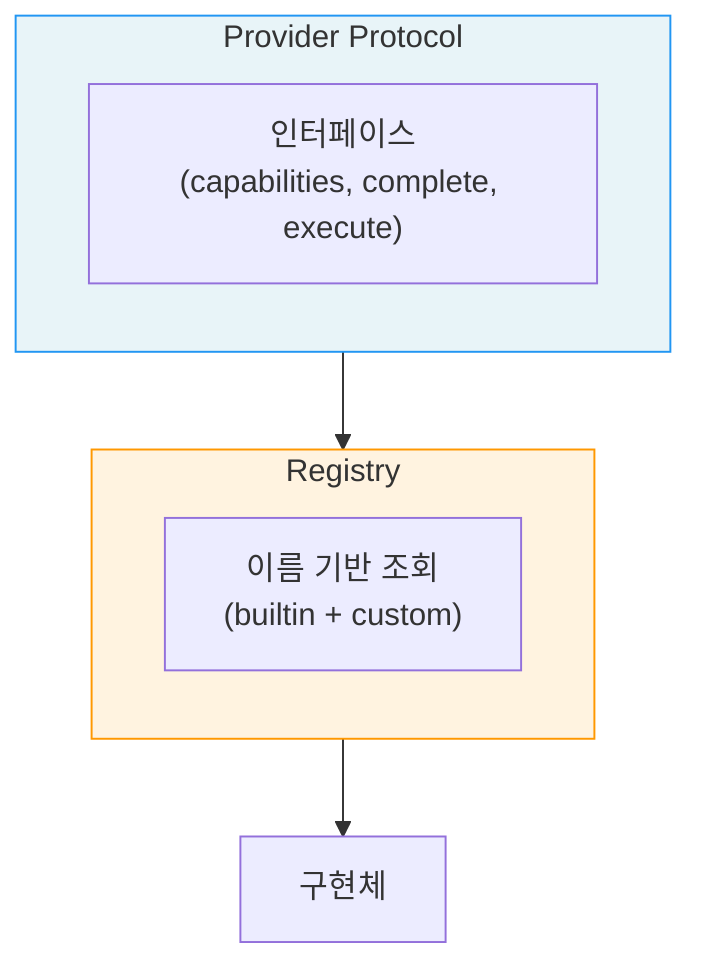
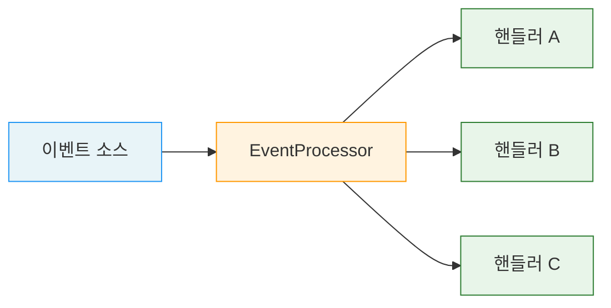
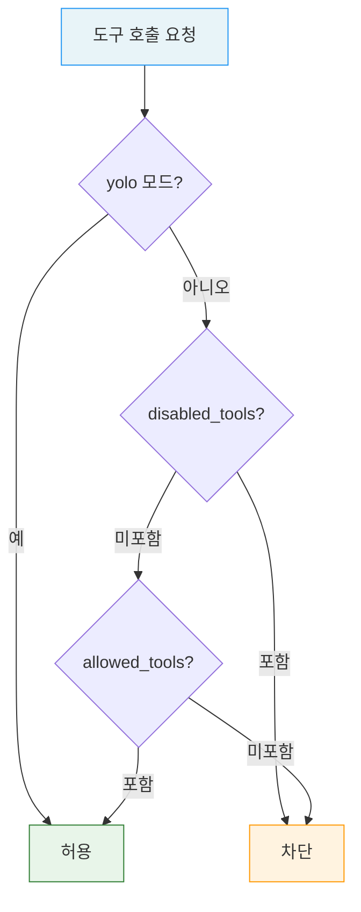

# 시스템 아키텍처

5개 아키텍처 구성요소의 관계와 확장 원칙입니다.

---

## 구성요소 관계

---

## 1. Config 병합

설정은 system, user, project 3개 계층을 병합합니다.

### 불변식

- 병합 순서: system defaults → user config → project config
- 후순위 설정이 선순위를 덮어씁니다
- dict 타입은 재귀적으로 deep merge합니다

### 병합 규칙

| 우선순위 | 계층 | 역할 |
|---------|------|------|
| 1 (최저) | system | 기본값 제공 |
| 2 | user | 사용자 전역 설정 |
| 3 (최고) | project | 프로젝트별 설정 |

---

## 2. Provider 추상화

Provider는 Protocol 추상화 뒤에 위치하며, capability를 노출합니다.

### 불변식

- 모든 Provider는 동일한 Protocol을 구현합니다
- Registry를 통해 이름으로 조회합니다
- Provider 교체 시 파이프라인 코드 변경이 불필요합니다

### 확장 규칙

새 Provider 추가 시 수정 대상:
- Protocol 구현체 추가
- Registry에 등록
- Config에 설정 추가
- Permission에 권한 추가

수정하지 않는 대상:
- 파이프라인 코드 (analysis, workflow, multi-agent)
- 기존 Provider 코드

### 비용 인식 라우팅

작업 특성에 따라 저/중/고비용 Provider를 자동 라우팅합니다. 새 Provider 추가 시 파이프라인 코드 수정이 불필요합니다.

---

## 3. Skill 탐색

Skill은 우선순위 기반 탐색으로 발견됩니다.

### 불변식

- 같은 이름의 skill은 먼저 발견된 것이 우선합니다 (first-found)
- SKILL.md의 YAML frontmatter를 파싱하여 metadata를 생성합니다
- 프롬프트 템플릿은 변수 치환을 지원합니다

### 구성 요소

| 구성 요소 | 역할 |
|----------|------|
| SKILL.md | Skill 메타데이터 정의 (YAML frontmatter) |
| prompts/*.md | 프롬프트 템플릿 (변수 치환 지원) |
| 탐색 엔진 | 우선순위 기반 경로 탐색, 캐시 |

---

## 4. Event 시스템

### 불변식

- 이벤트는 lifecycle, pipeline, worker, artifact, provider, decision 등으로 분류됩니다
- EventProcessor가 이벤트를 수집하고 핸들러에 전달합니다
- 이벤트는 관측성(observability)을 위한 것이며, 제어 흐름에 영향을 주지 않습니다

### 이벤트 카테고리

| 카테고리 | 용도 |
|---------|------|
| lifecycle | 파이프라인 시작/종료 |
| pipeline | Phase/Stage 전환 |
| worker | 워커 실행 상태 |
| artifact | 산출물 생성/변경 |
| provider | Provider 호출/응답 |
| decision | Gate/Judge 판정 |

### EventProcessor 구조

---

## 5. Permission 모델

### 불변식

- Permission은 ruleset과 check 함수로 Provider/tool 접근을 제어합니다
- 매 도구 호출마다 권한을 검사합니다
- Permission 규칙은 config에서 설정합니다

### 검사 순서

1. yolo 모드 확인 (전체 허용)
2. disabled_tools 확인 (명시적 차단)
3. allowed_tools 확인 (명시적 허용)

---

## 구성요소 간 의존 방향

파이프라인은 공유 인프라에 의존하지만, 공유 인프라는 파이프라인을 알지 못합니다.

### 확장 원칙

| 확장 | 수정 대상 | 비수정 대상 |
|------|----------|-----------|
| 새 Provider | protocol, registry, config, permission | 파이프라인 코드 |
| 새 Skill | skill 디렉토리 + SKILL.md | 파이프라인 코드, provider |
| 새 Event | EventType enum, handler | 파이프라인 로직 |
| 새 Tool | permission config | provider, skill |
| 새 Config 키 | defaults, user/project config | 기존 config 소비자 |

---

## 참고 자료

- [00-diagram.md](00-diagram.md) — 시스템 전체 구조 다이어그램
- [01-principles.md](01-principles.md) — 아키텍처 설계의 기반 원칙
- [에이전틱 AI 시스템 설계 패턴](/design-pattern/README.md)
