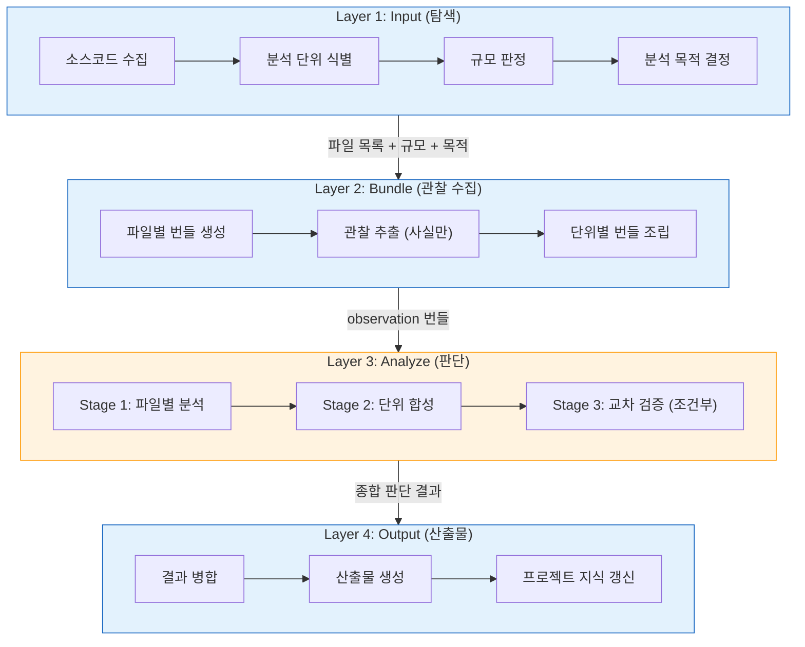
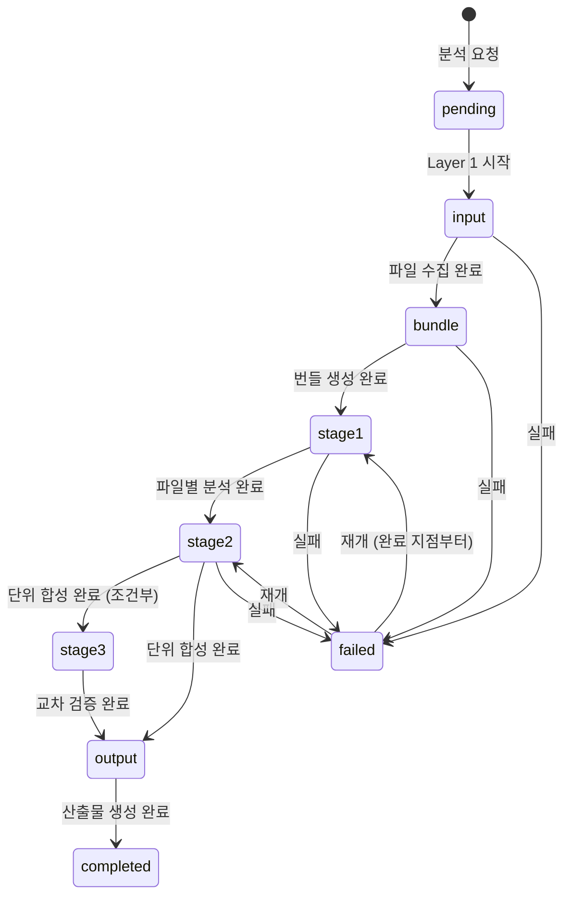
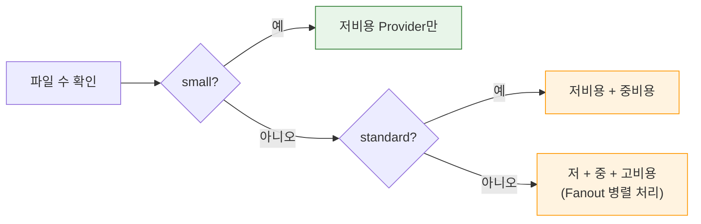
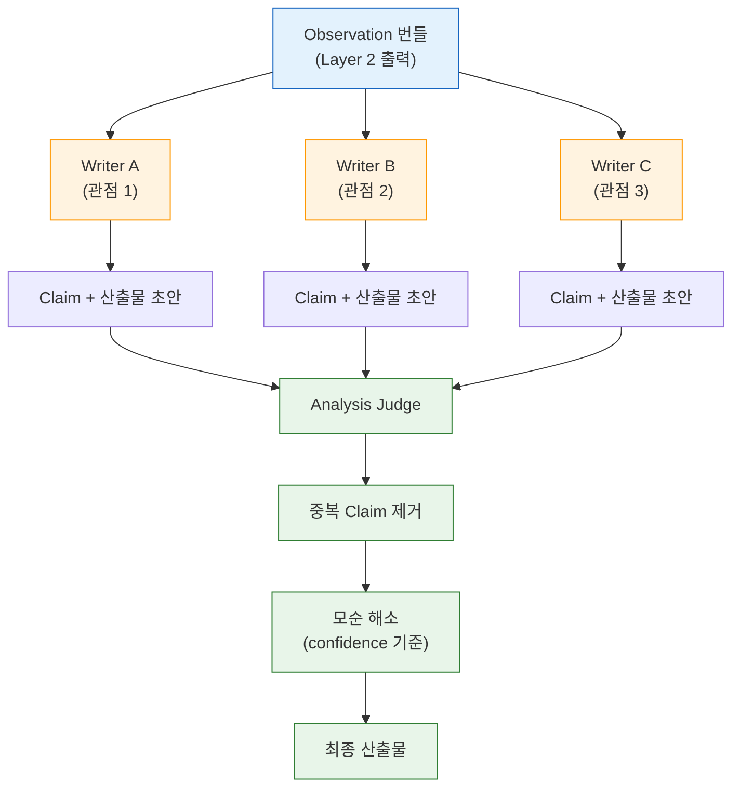

# 코드 분석 파이프라인 다이어그램

## 1. 4-Layer 아키텍처

입력 수집에서 산출물 생성까지의 전체 파이프라인 구조입니다.
각 Layer는 명확한 입출력 계약을 가지며, 독립적으로 교체 가능합니다.

---

## 2. 분석 상태 머신

실패 시 마지막 완료 Stage 이후부터 재개할 수 있습니다.

---

## 3. 규모 기반 Provider 라우팅

분석 대상의 규모(scale)에 따라 Provider 등급과 처리 전략을 결정합니다.

---

## 4. Writer/Judge 파이프라인 흐름

Stage 2에서 사용되는 Writer/Judge 패턴의 데이터 흐름입니다.
다중 Writer가 동일한 observation을 독립적으로 분석하고, Analysis Judge가 최종 통합합니다.

---

## 참고 자료

- [Anthropic: Building Effective Agents](https://www.anthropic.com/engineering/building-effective-agents)
- [Google Cloud: Choose a design pattern for an agentic AI system](https://docs.cloud.google.com/architecture/choose-design-pattern-agentic-ai-system)
