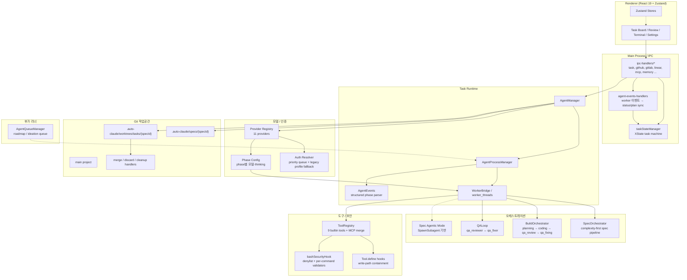
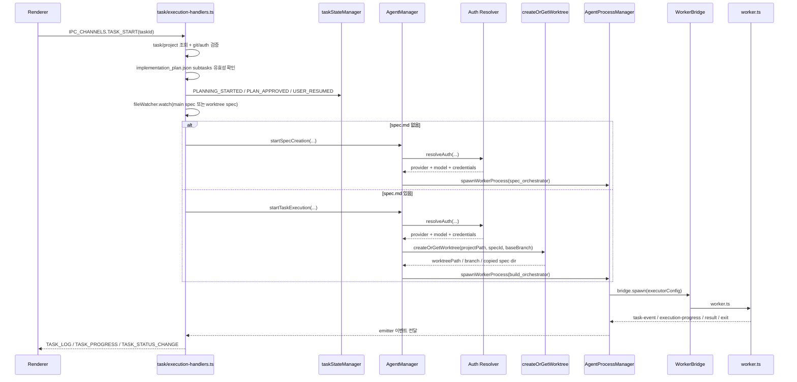
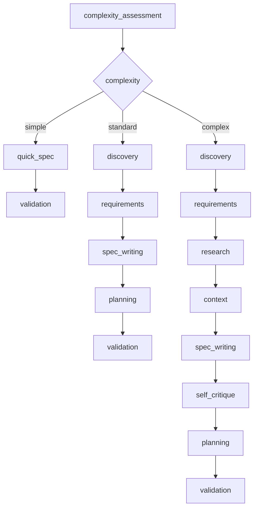
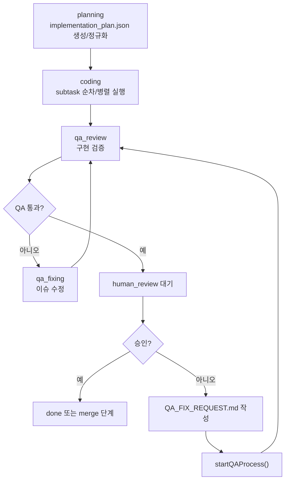
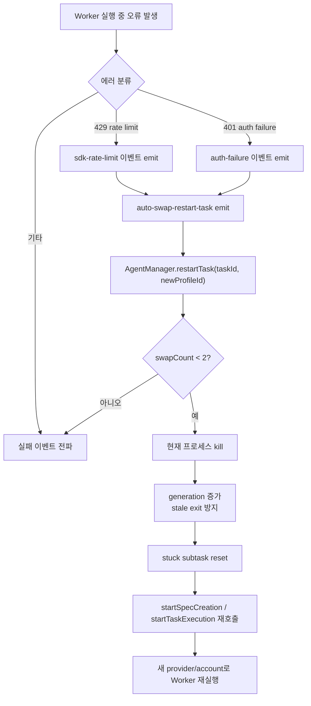
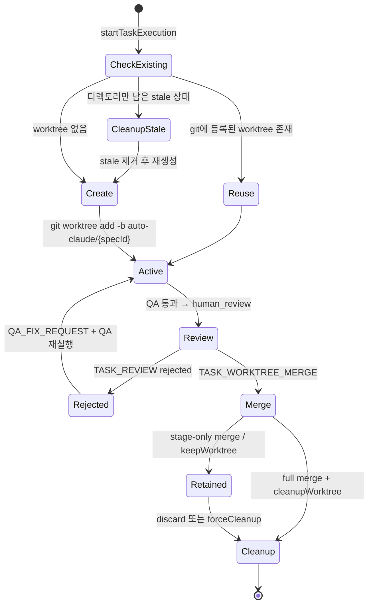
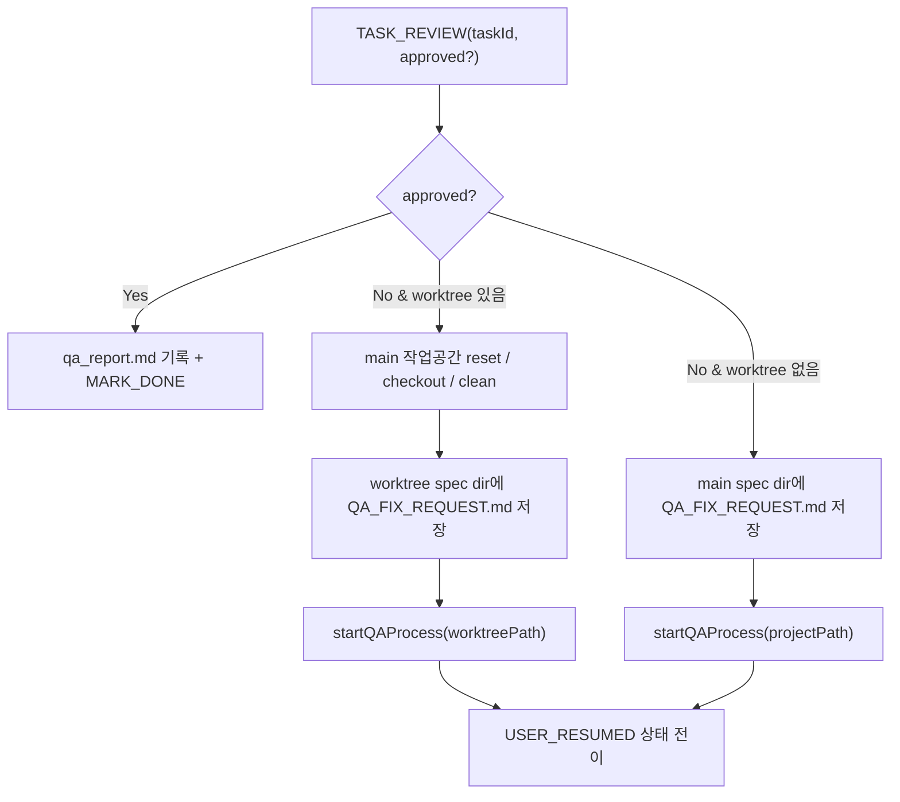
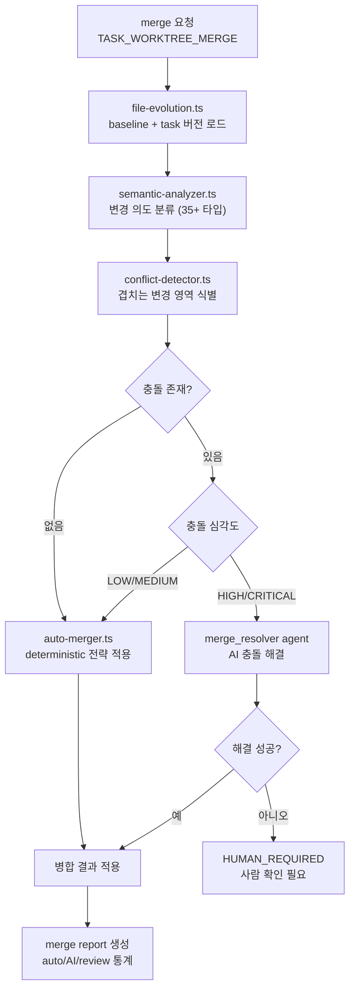
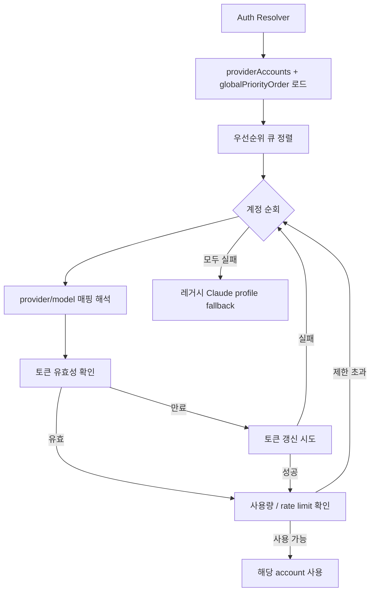

# Aperant 아키텍처 다이어그램

## 1. 전체 계층 구조

## 2. TASK_START 실행 흐름

## 3. 오케스트레이션 파이프라인

### 3.1 스펙 생성 (SpecOrchestrator)

### 3.2 빌드 실행 (BuildOrchestrator + QALoop)

## 4. auto-swap (rate limit/auth failure) 복원 흐름

## 5. worktree 생명주기

## 6. 리뷰/QA 분기

## 7. AI 세션 내부 실행 흐름

```mermaid
flowchart TD
    A["runContinuableSession()<br/>runAgentSession() 감싸기"] --> B["streamText() 호출<br/>— Vercel AI SDK v6"]
    B --> C{"응답 수신"}
    C -->|tool_call| D["ToolRegistry + MCP 도구 조회"]
    D --> E{"쓰기 도구?"}
    E -->|예| F["allowedWritePaths 검사"]
    E -->|아니오| G{"bash 도구?"}
    F --> G
    G -->|예| H["bashSecurityHook<br/>denylist + validator"]
    H -->|deny| I["거부 응답 반환"]
    H -->|allow| J["도구 실행"]
    G -->|아니오| J
    J --> K["결과를 대화에 추가"]
    K --> B
    C -->|text / reasoning / tool-result| L["stream-event 전파"]
    L --> M{"maxSteps / stopWhen 도달?"}
    M -->|아니오| B
    M -->|예| N["세션 종료"]
    C -->|401 / 429| O["onAuthRefresh / onAccountSwitch"]
    O -->|성공| B
    O -->|실패| P["에러 반환"]
    C -->|context 85%+| Q["경고, 90% 이상이면 continuation 또는 abort"]
```

## 8. Semantic Merge 파이프라인

## 9. Provider 인증 해석 흐름

