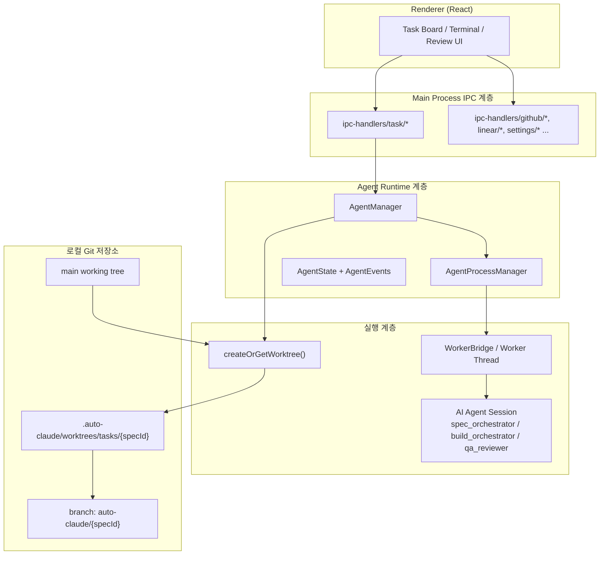
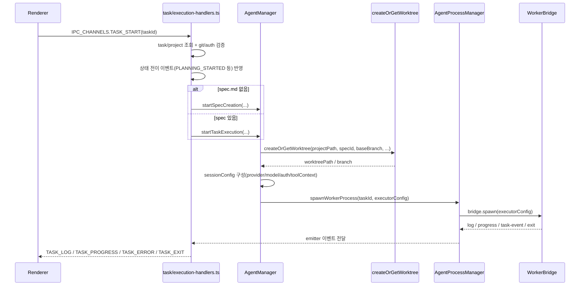
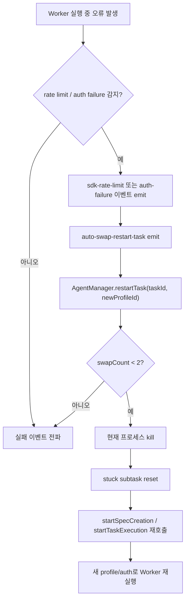
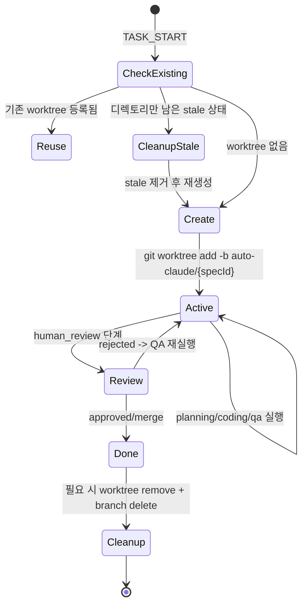
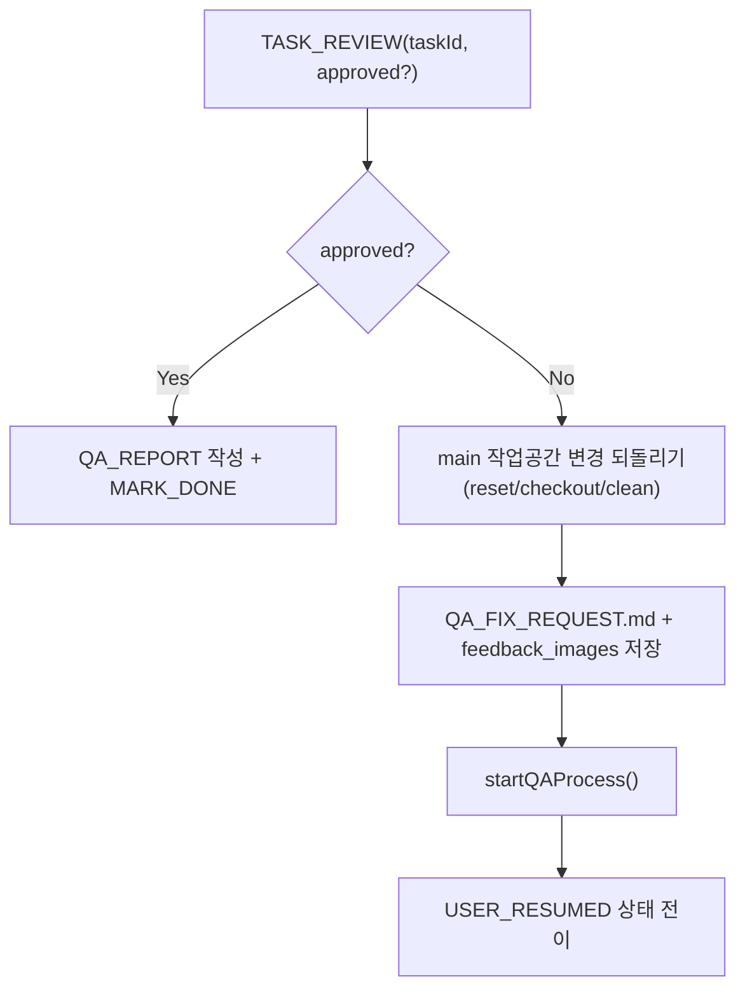

# Aperant 아키텍처 다이어그램

## 1. 전체 계층 구조

```mermaid
flowchart TD
    subgraph UI["Renderer (React)"]
        UI1["Task Board / Terminal / Review UI"]
    end

    subgraph IPC["Main Process IPC 계층"]
        IPC1["ipc-handlers/task/*"]
        IPC2["ipc-handlers/github/*, linear/*, settings/* ..."]
    end

    subgraph Runtime["Agent Runtime 계층"]
        RT1["AgentManager"]
        RT2["AgentProcessManager"]
        RT3["AgentState + AgentEvents"]
    end

    subgraph Execution["실행 계층"]
        EX1["createOrGetWorktree()"]
        EX2["WorkerBridge / Worker Thread"]
        EX3["AI Agent Session<br/>spec_orchestrator / build_orchestrator / qa_reviewer"]
    end

    subgraph Repo["로컬 Git 저장소"]
        RP1["main working tree"]
        RP2[".auto-claude/worktrees/tasks/{specId}"]
        RP3["branch: auto-claude/{specId}"]
    end

    UI1 --> IPC1
    UI1 --> IPC2
    IPC1 --> RT1
    RT1 --> RT2
    RT1 --> EX1
    RT2 --> EX2
    EX2 --> EX3
    EX1 --> RP2
    RP2 --> RP3
    RP1 --> EX1
```

## 2. TASK_START 실행 흐름

```mermaid
sequenceDiagram
    participant UI as Renderer
    participant IPC as task/execution-handlers.ts
    participant AM as AgentManager
    participant WT as createOrGetWorktree
    participant PM as AgentProcessManager
    participant WB as WorkerBridge

    UI->>IPC: IPC_CHANNELS.TASK_START(taskId)
    IPC->>IPC: task/project 조회 + git/auth 검증
    IPC->>IPC: 상태 전이 이벤트(PLANNING_STARTED 등) 반영
    alt spec.md 없음
        IPC->>AM: startSpecCreation(...)
    else spec 있음
        IPC->>AM: startTaskExecution(...)
    end

    AM->>WT: createOrGetWorktree(projectPath, specId, baseBranch, ...)
    WT-->>AM: worktreePath / branch
    AM->>AM: sessionConfig 구성(provider/model/auth/toolContext)
    AM->>PM: spawnWorkerProcess(taskId, executorConfig)
    PM->>WB: bridge.spawn(executorConfig)
    WB-->>PM: log / progress / task-event / exit
    PM-->>IPC: emitter 이벤트 전달
    IPC-->>UI: TASK_LOG / TASK_PROGRESS / TASK_ERROR / TASK_EXIT
```

## 3. auto-swap (rate limit/auth failure) 복원 흐름

```mermaid
flowchart TD
    A["Worker 실행 중 오류 발생"] --> B{"rate limit / auth failure 감지?"}
    B -->|아니오| Z["실패 이벤트 전파"]
    B -->|예| C["sdk-rate-limit 또는 auth-failure 이벤트 emit"]
    C --> D["auto-swap-restart-task emit"]
    D --> E["AgentManager.restartTask(taskId, newProfileId)"]
    E --> F{"swapCount < 2?"}
    F -->|아니오| Z
    F -->|예| G["현재 프로세스 kill"]
    G --> H["stuck subtask reset"]
    H --> I["startSpecCreation / startTaskExecution 재호출"]
    I --> J["새 profile/auth로 Worker 재실행"]
```

## 4. worktree 생명주기

```mermaid
stateDiagram-v2
    [*] --> CheckExisting: TASK_START
    CheckExisting --> Reuse: 기존 worktree 등록됨
    CheckExisting --> CleanupStale: 디렉토리만 남은 stale 상태
    CleanupStale --> Create: stale 제거 후 재생성
    CheckExisting --> Create: worktree 없음

    Create --> Active: git worktree add -b auto-claude/{specId}
    Active --> Active: planning/coding/qa 실행
    Active --> Review: human_review 단계
    Review --> Active: rejected -> QA 재실행
    Review --> Done: approved/merge
    Done --> Cleanup: 필요 시 worktree remove + branch delete
    Cleanup --> [*]
```

## 5. 리뷰/QA 분기

```mermaid
flowchart TD
    A["TASK_REVIEW(taskId, approved?)"] --> B{"approved?"}
    B -->|Yes| C["QA_REPORT 작성 + MARK_DONE"]
    B -->|No| D["main 작업공간 변경 되돌리기(reset/checkout/clean)"]
    D --> E["QA_FIX_REQUEST.md + feedback_images 저장"]
    E --> F["startQAProcess()"]
    F --> G["USER_RESUMED 상태 전이"]
```
