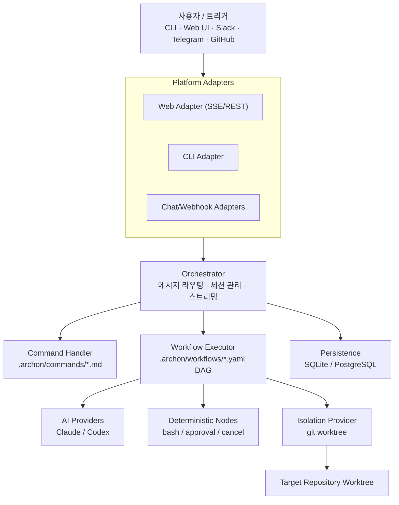
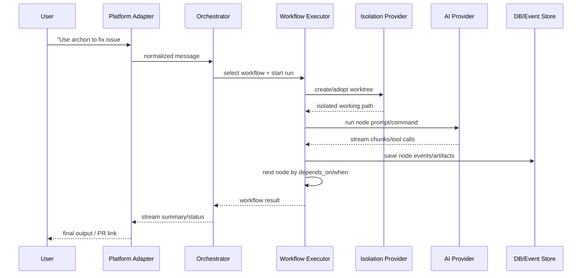
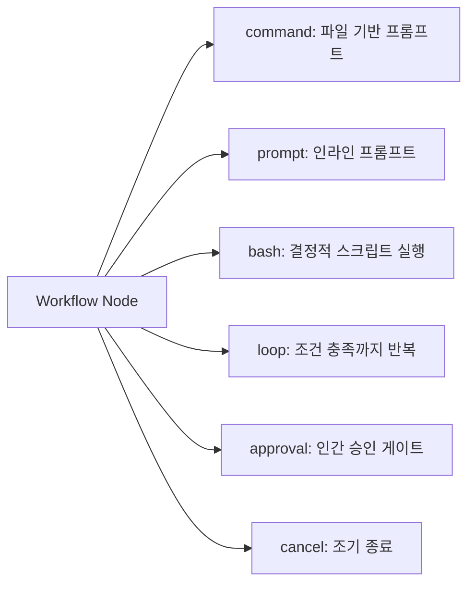

# Archon 아키텍처 다이어그램

## 1. 전체 계층 구조

```mermaid
flowchart TD
    U["사용자 / 트리거<br/>CLI · Web UI · Slack · Telegram · GitHub"] --> ADP

    subgraph ADP["Platform Adapters"]
        A1["Web Adapter (SSE/REST)"]
        A2["CLI Adapter"]
        A3["Chat/Webhook Adapters"]
    end

    ADP --> ORCH["Orchestrator<br/>메시지 라우팅 · 세션 관리 · 스트리밍"]

    ORCH --> CMD["Command Handler<br/>.archon/commands/*.md"]
    ORCH --> WFE["Workflow Executor<br/>.archon/workflows/*.yaml DAG"]

    WFE --> AI["AI Providers<br/>Claude / Codex"]
    WFE --> DET["Deterministic Nodes<br/>bash / approval / cancel"]

    WFE --> ISO["Isolation Provider<br/>git worktree"]
    ISO --> REPO["Target Repository Worktree"]

    ORCH --> DB["Persistence<br/>SQLite / PostgreSQL"]
```

## 2. 워크플로우 실행 플로우

```mermaid
sequenceDiagram
    participant User as User
    participant Adapter as Platform Adapter
    participant Orch as Orchestrator
    participant Exec as Workflow Executor
    participant Iso as Isolation Provider
    participant AI as AI Provider
    participant DB as DB/Event Store

    User->>Adapter: "Use archon to fix issue #42"
    Adapter->>Orch: normalized message
    Orch->>Exec: select workflow + start run
    Exec->>Iso: create/adopt worktree
    Iso-->>Exec: isolated working path
    Exec->>AI: run node prompt/command
    AI-->>Exec: stream chunks/tool calls
    Exec->>DB: save node events/artifacts
    Exec->>Exec: next node by depends_on/when
    Exec-->>Orch: workflow result
    Orch-->>Adapter: stream summary/status
    Adapter-->>User: final output / PR link
```

## 3. 노드 타입 구성

```mermaid
flowchart LR
    N["Workflow Node"] --> C["command: 파일 기반 프롬프트"]
    N --> P["prompt: 인라인 프롬프트"]
    N --> B["bash: 결정적 스크립트 실행"]
    N --> L["loop: 조건 충족까지 반복"]
    N --> A["approval: 인간 승인 게이트"]
    N --> X["cancel: 조기 종료"]
```
