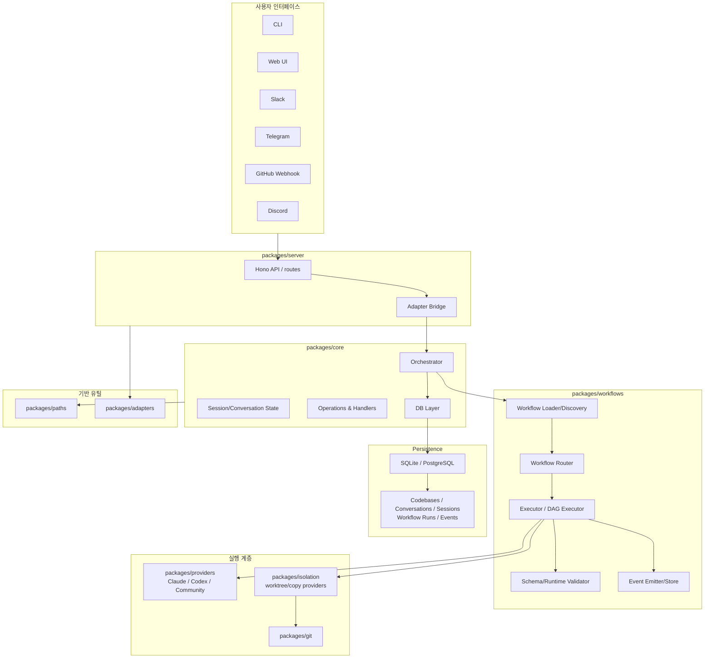
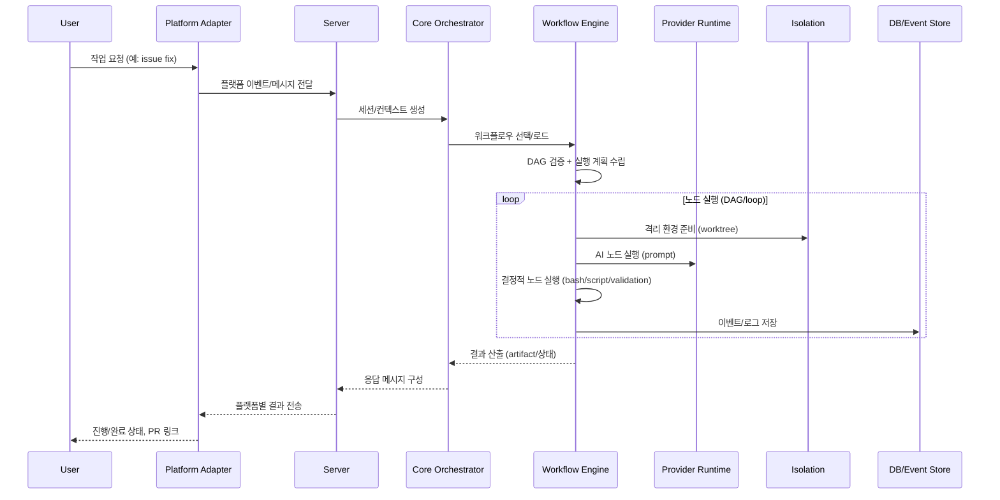
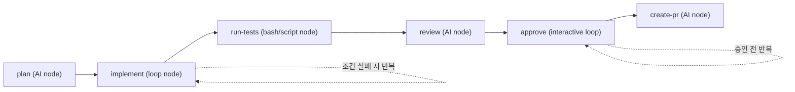

# Archon 아키텍처 다이어그램

## 1. 패키지 구조

```mermaid
flowchart TD
    subgraph Interfaces["사용자 인터페이스"]
        CLI["CLI"]
        Web["Web UI"]
        Slack["Slack"]
        Telegram["Telegram"]
        GitHub["GitHub Webhook"]
        Discord["Discord"]
    end

    subgraph Server["packages/server"]
        API["Hono API / routes"]
        Bridge["Adapter Bridge"]
    end

    subgraph Core["packages/core"]
        Orch["Orchestrator"]
        State["Session/Conversation State"]
        Ops["Operations & Handlers"]
        DB["DB Layer"]
    end

    subgraph Workflows["packages/workflows"]
        Loader["Workflow Loader/Discovery"]
        Router["Workflow Router"]
        Exec["Executor / DAG Executor"]
        Validator["Schema/Runtime Validator"]
        Events["Event Emitter/Store"]
    end

    subgraph Runtime["실행 계층"]
        Providers["packages/providers<br/>Claude / Codex / Community"]
        Isolation["packages/isolation<br/>worktree/copy providers"]
        GitPkg["packages/git"]
    end

    subgraph Shared["기반 유틸"]
        Paths["packages/paths"]
        Adapters["packages/adapters"]
    end

    subgraph Data["Persistence"]
        SQL["SQLite / PostgreSQL"]
        Tables["Codebases / Conversations / Sessions<br/>Workflow Runs / Events"]
    end

    Interfaces --> API
    API --> Bridge
    Bridge --> Orch
    Orch --> Loader
    Loader --> Router
    Router --> Exec
    Exec --> Validator
    Exec --> Events
    Exec --> Providers
    Exec --> Isolation
    Isolation --> GitPkg
    Orch --> DB
    DB --> SQL
    SQL --> Tables
    Core --> Paths
    Server --> Adapters
```

## 2. 워크플로우 실행 흐름

```mermaid
sequenceDiagram
    participant U as User
    participant P as Platform Adapter
    participant S as Server
    participant C as Core Orchestrator
    participant W as Workflow Engine
    participant R as Provider Runtime
    participant I as Isolation
    participant D as DB/Event Store

    U->>P: 작업 요청 (예: issue fix)
    P->>S: 플랫폼 이벤트/메시지 전달
    S->>C: 세션/컨텍스트 생성
    C->>W: 워크플로우 선택/로드
    W->>W: DAG 검증 + 실행 계획 수립

    loop 노드 실행 (DAG/loop)
        W->>I: 격리 환경 준비 (worktree)
        W->>R: AI 노드 실행 (prompt)
        W->>W: 결정적 노드 실행 (bash/script/validation)
        W->>D: 이벤트/로그 저장
    end

    W-->>C: 결과 산출 (artifact/상태)
    C-->>S: 응답 메시지 구성
    S-->>P: 플랫폼별 결과 전송
    P-->>U: 진행/완료 상태, PR 링크
```

## 3. YAML 기반 DAG + 루프 개념

```mermaid
flowchart LR
    Plan["plan (AI node)"] --> Impl["implement (loop node)"]
    Impl --> Tests["run-tests (bash/script node)"]
    Tests --> Review["review (AI node)"]
    Review --> Approve["approve (interactive loop)"]
    Approve --> PR["create-pr (AI node)"]

    Impl -.조건 실패 시 반복.-> Impl
    Approve -.승인 전 반복.-> Approve
```
