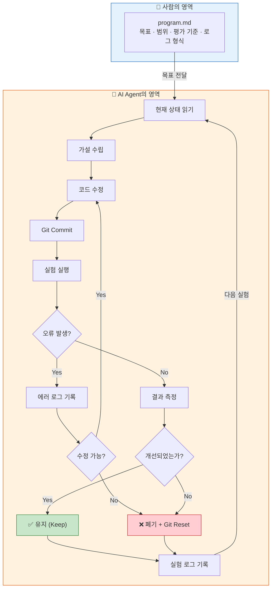
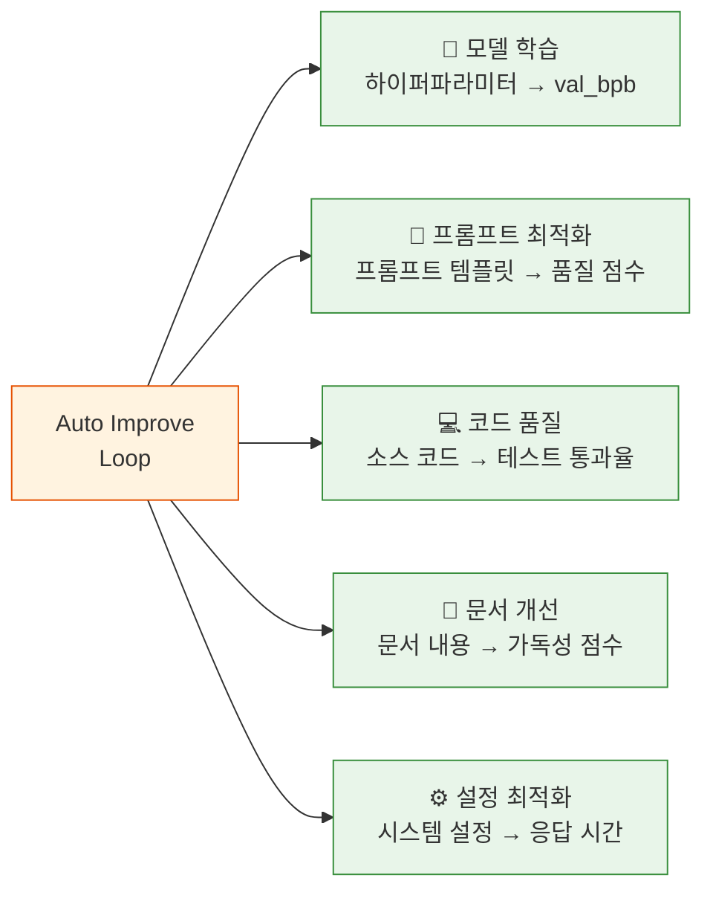

# Auto Improve Loop Diagram

사람이 목표와 규칙을 정의하고, AI가 자율적으로 실험·측정·판단하여 시스템을 개선하는 Auto Improve Loop의 핵심 구조를 종합한 다이어그램입니다.

---

## 전체 구조

Auto Improve Loop는 **역할 분리**(Human vs AI), **고정 평가 기준**, **안전한 롤백**, **실험 로그 관리** 4가지 설계 원칙 위에서 동작합니다. 사람은 `program.md`로
What과 Constraints를 정의하고, AI Agent는 How를 결정하여 가설 수립 → 코드 수정 → 실험 실행 → 결과 측정 → 유지/폐기 루프를 자율 반복합니다.

## 적용 범위

Auto Improve Loop는 모델 학습 외에도 프롬프트 최적화, 코드 품질, 문서 개선, 설정 최적화 등 측정 가능한 모든 영역에 적용 가능합니다.

