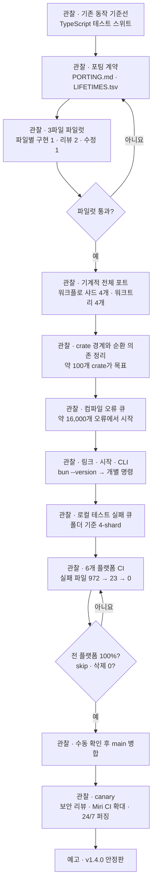
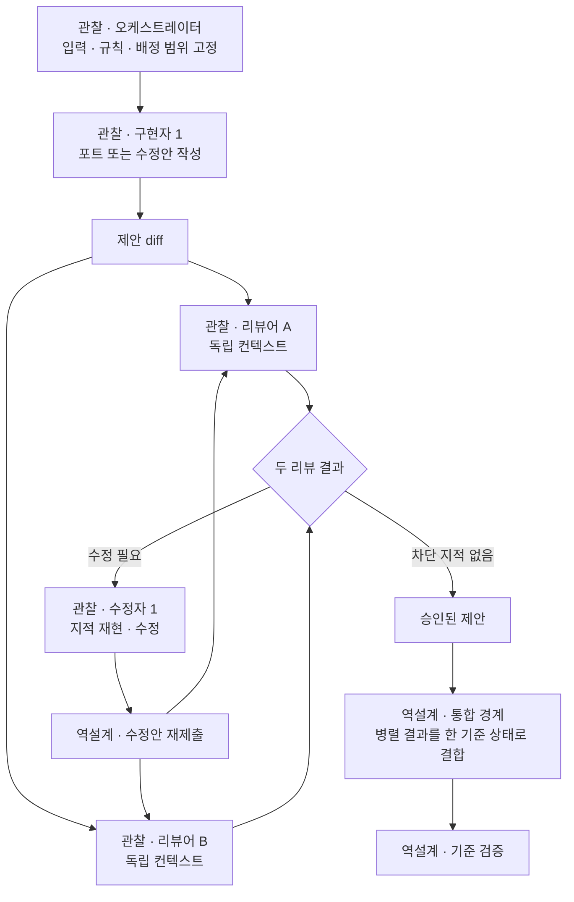
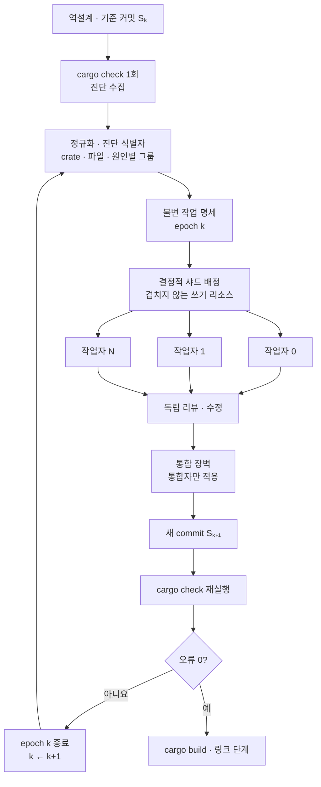
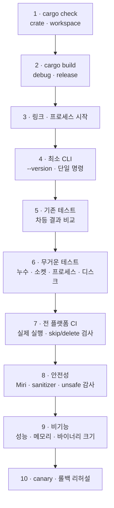
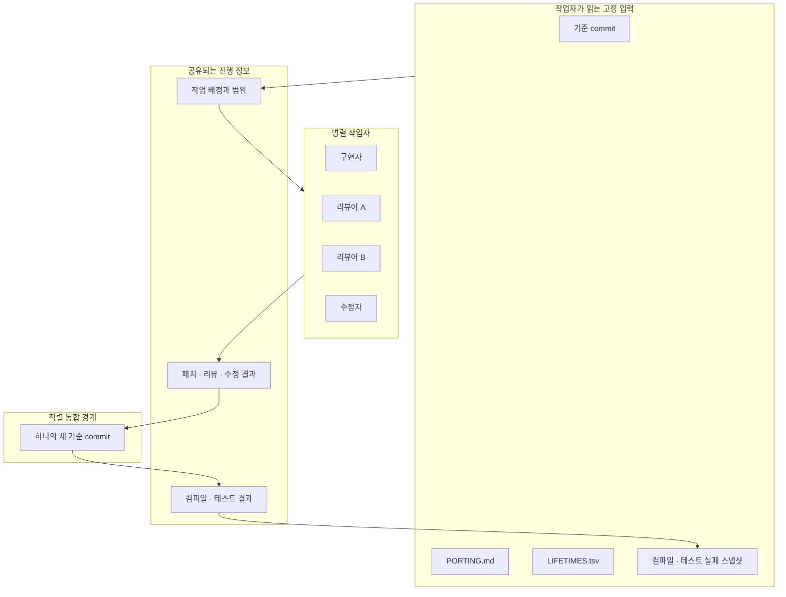

# Bun Rust 포팅 아키텍처와 실행 다이어그램

이 문서는 두 종류의 흐름을 함께 보여준다.

- **관찰:** Bun 공식 회고, 병합 PR, 공개 workflow에서 확인한 실행 방식
- **역설계:** 공개된 실행 흔적을 일관된 시스템으로 설명하기 위해 도출한 개념 모델

둘을 구분하지 않으면 Bun이 실제로 사용한 장치와 공개 흔적에서 추론한 구조가 섞인다.

## 1. 전체 포팅 단계

`main` 병합은 출시와 같은 사건이 아니다. 2026-05-14 병합으로 Rust 구현은 `main`과 canary에 들어갔고, 공식 글은 v1.4.0을 첫 Rust 안정판으로 예고했다.

## 2. 한 작업을 처리하는 역할 셀

공식 회고는 구현자와 리뷰어에게 서로 독립된 컨텍스트를 주었다고 설명한다. 리뷰어는 구현 과정의 대화를 보지 않고 diff만 받으며, 변경이 잘못됐다는 전제에서 문제를 찾는다.

여기서 `1-2-1`은 제품 코드의 영구 조직도가 아니라 한 작업의 검증 셀이다. 병합 커밋에 남은 개별 workflow 중에는 리뷰어 수가 하나인 변형도 있다. 모든 줄을 두 번 리뷰했다는 내용은 공식 회고의 집계이며, 공개 코드만으로 각 줄의 리뷰 원장을 재구성할 수는 없다. 수정본 재검토와 직렬 통합 경계는 공개된 실행 흐름을 일관되게 설명하기 위해 보완한 역설계 요소다.

## 3. 컴파일 오류 목록을 작업 큐로 쓰는 법

오류 큐의 수명은 한 검증 라운드로 해석할 수 있다. 이 문서에서는 이를 `epoch`라고 부른다. 컴파일 결과가 나온 commit의 목록을 나눠 처리하고, 통합 뒤 새 목록을 만든다는 공식 회고의 흐름을 설명하기 위한 용어다.

작업자가 `done`을 썼다고 끝난 것이 아니다. 새 기준 커밋에서 검증을 다시 실행했을 때 해당 진단이 나타나지 않아야 한다. 한 오류를 고치면서 뒤의 오류가 함께 사라지거나 새 오류가 드러날 수 있기 때문이다.

공개된 Bun `phase-d-build-queue`와 `phase-d-crate-shard`도 먼저 빌드 결과를 파일별 작업으로 고정한 뒤 작업자에게 배분한다. Cargo의 `--message-format=json`은 같은 구조를 일반화할 때 package, target, source span 같은 진단 정보를 보존할 수 있는 형식이다.

두 workflow는 같은 아이디어의 서로 다른 변형이다. `phase-d-build-queue`는 "cargo build가 큐"라고 선언하고 오류를 파일별로 묶으며, `phase-d-crate-shard`는 `cargo check -p <crate> --keep-going`을 한 번 실행한다. 명령과 git 정책이 공식 회고의 crate별 최종 서술과 완전히 같지는 않으므로, 이 절의 근거는 "파일 단위로 작업을 고정한다"는 공통 구조까지다. 자세한 차이는 [공식 사례 분석](01-analysis.md) 4.6절 표에 있다.

## 4. 단계별 샤드 경계

단계가 바뀌면 샤드 키도 바뀐다. 각 검증 도구가 독립적으로 판단할 수 있는 작업 단위에 맞춘다.

| 단계 | 관찰된 주 샤드 키 | 공개 workflow의 배정 범위 | 전역 동기화 지점 |
|---|---|---|---|
| 수명 분류 | Zig 파일·필드 | 분류 레코드 | `LIFETIMES.tsv` 검토 |
| 기계적 포트 | 원본 Zig 파일 → Rust 파일 | 고정된 대상 파일 | 파일 포트 완료 후 |
| 컴파일 복구 | crate → 진단 파일 | 주 배정 파일, 일부 변형은 같은 소스 디렉터리의 추가 파일 허용 | crate별 `cargo check` 재실행 |
| 로컬 테스트 | 테스트 폴더·파일 | 실패 원인을 고치는 관련 코드 | 테스트 묶음 재실행 |
| CI 복구 | 플랫폼·실패 원인 시그니처 | 원인별 관련 코드 | CI 전체 재실행 |
| main 추종 | 분기 기준점 이후 커밋 | 동등 변경 또는 제외 결정 | main 동등성 검증 |

Bun의 4개 worktree는 샤딩·격리 단위였고, 최대 약 64개의 Claude 세션은 그 안의 작업자였다. 세션마다 worktree를 만들면 디스크 비용이 커지고 서로의 변경을 통합하기 어렵다. 반대로 여러 작업자가 같은 파일을 쓰면 충돌과 덮어쓰기가 생긴다. 이 사례는 `worktree 수 = 작업자 수`가 아니며, worktree보다 작은 파일·crate 경계가 실제 쓰기 충돌을 제한했음을 보여준다.

공개된 crate shard workflow는 오류가 80개를 넘으면 약 800줄 구간으로 나누는 변형도 사용한다. 같은 파일의 구간별 수정이 서로 영향을 주지 않는다는 증거가 없다면 이 방식은 그대로 복제하지 않는 편이 안전하다.

## 5. 역설계한 검증 사다리

`cargo check` 성공만으로 포트가 끝나지 않는다. Cargo 문서도 `check`가 최종 codegen을 생략하므로 일부 진단은 놓칠 수 있다고 설명한다.

이 사다리는 공식 회고의 단계와 그 단계 사이의 검증 경계를 요약한 분석 모델이다. 기준선, 포팅 계약, 3파일 파일럿, 기계적 파일 포트는 이 그림 앞의 준비·변환 단계다. 세부 관계는 [오케스트레이션 역설계](02-implementation-flow.md) 9절에 정리한다.

각 칸은 앞 단계의 실패가 다음 단계에서 다른 형태로 드러날 수 있음을 보여준다. Bun의 병합 조건은 테스트 삭제와 skip 없이 전 플랫폼 결과가 통과하고 사람이 실제 실행 여부를 확인하는 것이었다.

## 6. 역설계한 공유 상태와 쓰기 경계

작업자의 `git reset`, stash, 공용 branch 조작, 전역 build를 제한한 이유는 병렬 작업이 같은 저장소 상태를 서로 바꾸지 않게 하기 위해서였다. Bun도 초기에는 같은 저장소에서 `stash`, `stash pop`, `reset --hard`를 병렬 실행하다가 변경을 잃었다. 다만 공개 workflow의 Git·추가 파일 정책은 단계마다 달랐고, 작업 배정과 결과가 어떤 저장 장치를 통해 공유됐는지는 보이지 않는다. 이 그림은 공개된 제약과 반복 검증을 하나의 정보 흐름으로 표현한 역설계다.
