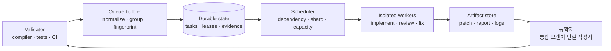
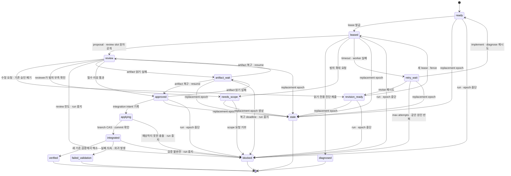
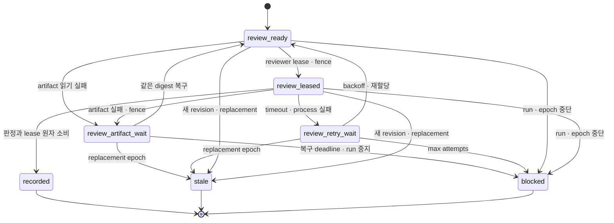
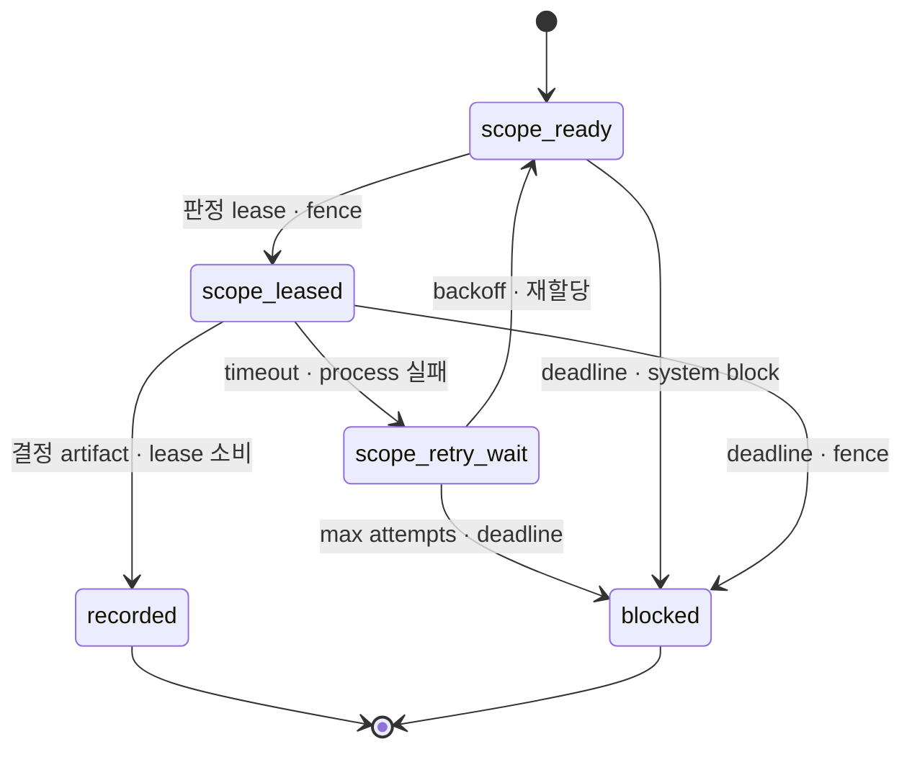
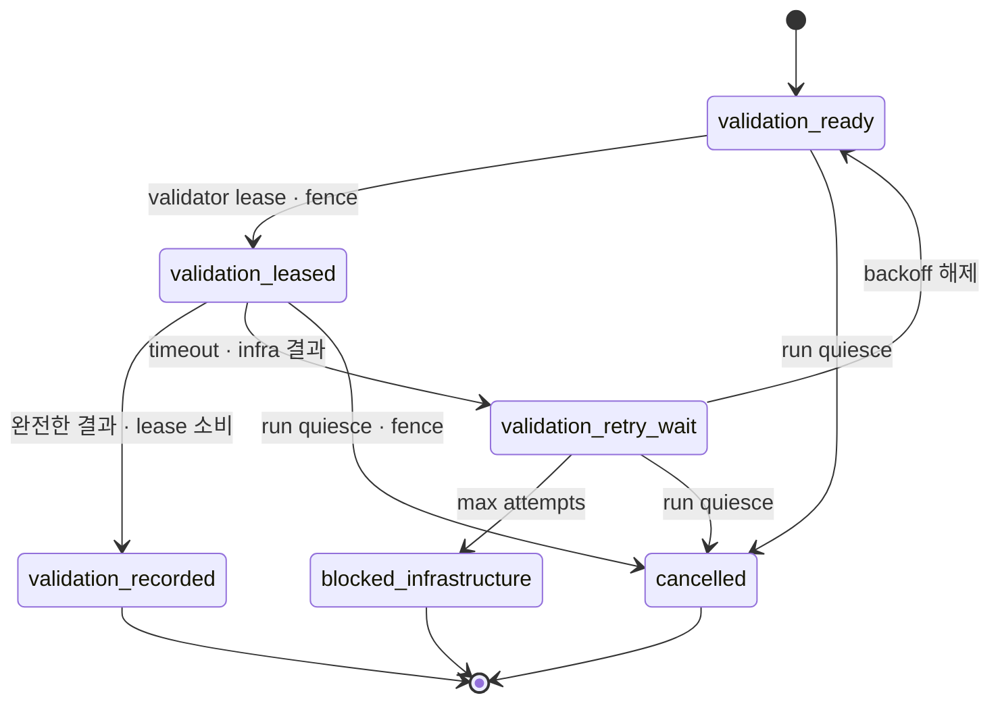
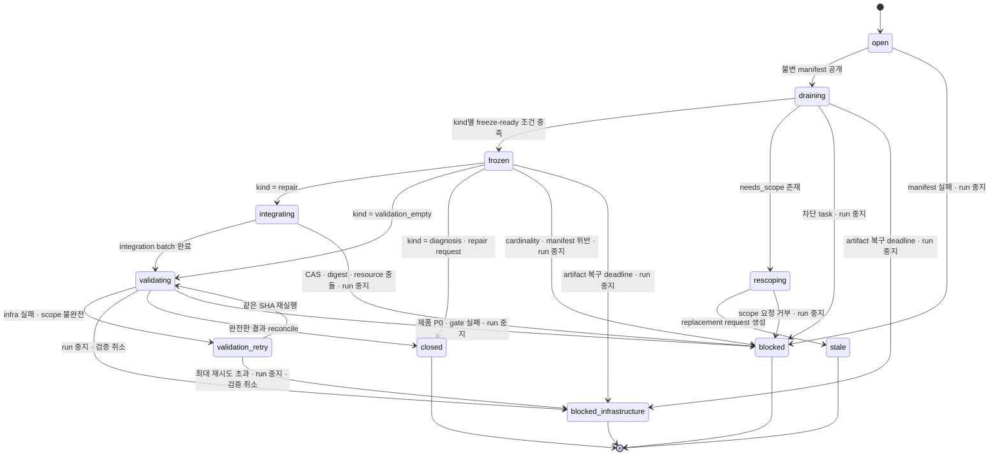

# 대규모 포팅 구현 플로우와 준비도

> **문서 성격:** 아래 내용은 Bun의 공개 workflow를 그대로 옮긴 것이 아니라, 사례에서 확인된 패턴에 재시작·충돌 방지·완료
> 판정 계약을 보강한 권장 설계다. Bun이 실제로 사용했다고 확인되는 부분은 링크와 함께 따로 표시한다.

## 1. 현재 준비도

| 수준 | 통과 조건 | 이 문서 작성 시점의 판정 |
|---|---|---|
| 연구 준비(Research-ready) | 주장마다 출처·측정 정의·시점이 있음 | 통과 |
| 흐름 준비(Flow-ready) | 역할, 상태, 샤드, 게이트, 실패 복구가 명세됨 | 통과: 제어 계약 기준, 실행 증거는 아직 없음 |
| 파일럿 준비(Pilot-ready) | 고정 입력으로 격리 환경의 3파일 파일럿을 반복하고 되돌릴 수 있음 | 프로젝트별 산출물 작성 전에는 미통과 |
| 확장 준비(Scale-ready) | 충돌 없는 쓰기 리소스, 내구성 있는 큐, 장애 복구, 직렬 통합이 실제 실행으로 검증됨 | 미통과 |
| 병합 준비(Merge-ready) | 전 플랫폼·안전성·성능 게이트, 테스트 무결성, canary·rollback rehearsal이 통과함 | 미통과 |

이 문서는 범용 오케스트레이터의 제어 계약과 파일럿 절차를 구현할 만큼의 상세도를 목표로 한다. 언어별 진단 수집기,
저장소별 빌드·테스트 adapter, 실제 DB schema는 대상 프로젝트에서 만들어야 한다. 전체 코드베이스에 작업자를 투입하려면
4절의 프로젝트별 산출물을 채우고 16절의 파일럿 증거를 먼저 만들어야 한다.

위 판정의 근거는 [검증 기록](03-verification.md)에 있다. 흐름 준비는 이 문서와 `docs/system-prompt.md`의 상태 집합
7축, 공개 연산 41개, gate, P0 산출물이 서로 일치하고 12.5절의 fault 시나리오 F01~F31이 모두 16절의 파일럿 단계로
이어진다는 대조 결과에 근거한다. 이 문서의 설계 자체는 외부 자료로 참·거짓을 판정할 대상이 아니며, 실행 증거는 대상
프로젝트에서 만들어야 한다.

## 2. 목표와 비목표

### 목표

- 기존 구현의 동작을 보존하는 기계적 언어 포팅을 병렬화한다.
- 컴파일·테스트 실패를 구조화된 작업으로 바꾼다.
- 여러 작업자가 같은 저장소를 덮어쓰지 못하게 한다.
- 중단 뒤 마지막으로 검증된 commit부터 같은 규칙으로 재개한다.
- 작업자의 보고가 아니라 기준 검증 실행으로 완료를 판정한다.
- 전체 전환 전에 작은 파일럿으로 계약과 비용을 확인한다.

### 비목표

- 포팅과 동시에 아키텍처를 재설계하지 않는다.
- 에이전트가 임의로 테스트를 삭제하거나 skip하지 못하게 한다.
- Bun의 비공개 dynamic workflow 런타임이나 출시 전 모델을 재현하지 않는다.
- 작업자 수를 자동으로 최대화하지 않는다.
- compile green을 동작 동일성이나 메모리 안전성의 증명으로 취급하지 않는다.

### 용어

| 용어 | 이 문서의 뜻 |
|---|---|
| 작업(`task`) | DB에 상태와 증거를 가진 실행 단위 |
| 작업자(`worker`) | lease를 받아 한 번에 구현·진단·리뷰·수정 역할 하나를 실행하는 process |
| 작업 셀(`task_cell_id`) | 한 epoch 동안 쓰기 리소스 집합(`write_resources`)을 독점하는 구현·리뷰·수정 묶음 |
| 샤드(`shard`) | 고정 manifest가 나눈 배정 묶음. worker 수와 같지 않음 |
| epoch | 한 기준 SHA에서 만든 불변 오류 manifest를 처리하고 다시 검증하는 라운드 |
| 쓰기 리소스(`write resource`) | 파일 내용뿐 아니라 생성·삭제·이름 변경·설정·생성물까지 포함한 배타적 쓰기 대상 |
| 작업 임대(`lease`) | 한 작업자에게 만료 시각까지 특정 상태 전이를 시도할 권리를 주는 DB 레코드 |
| fencing token | 재할당 전 소유자의 늦은 쓰기를 막는 단조 증가 세대 번호 |
| 통합 의도(`integration intent`) | Git ref를 바꾸기 전에 남기는 immutable batch와 세대별 CAS·복구 attempt 기록 |
| branch CAS | ref tip이 예상 SHA와 같을 때만 새 SHA로 이동하는 조건부 갱신 |
| idempotency key | 같은 요청의 재전송은 기존 결과를 돌려주고 중복 상태 전이는 막는 식별자 |
| request digest | 정규화한 전체 요청 입력의 hash. 같은 idempotency key로 다른 입력을 보내는 것을 막음 |
| 기준 검증 | 고정 SHA·환경·scope에서 검증자만 실행하고 완전성을 확인한 build·test 결과 |
| `target` | 스키마·Cargo의 원래 필드명에만 사용. 본문에서는 포팅 결과·Cargo 빌드 대상·integration ref·rollback 지점을 구분 |

## 3. 바뀌지 않는 실행 원칙

1. **기준 commit 고정:** 모든 task는 한 epoch의 `epoch_base_sha`를 가진다.
2. **라운드 단위 큐:** compiler와 test task manifest는 한 `epoch` 동안 불변이다.
3. **작업 셀 단일 작성자:** 한 쓰기 리소스 집합은 한 epoch에 하나의 작업 셀만 소유한다.
4. **읽기·쓰기 충돌 차단:** 한 task의 쓰기가 다른 task의 읽기나 쓰기와 겹치면 같은 epoch에서 실행하지 않는다.
5. **역할 분리:** 진단자, 구현자, 리뷰어, 수정자, 통합자, 검증자의 컨텍스트와 권한을 나눈다.
6. **통합 브랜치 단일 작성자:** 작업 셀의 파일 소유권과 별개로 integration ref는 fencing token을 가진 통합자 하나만
   바꾼다.
7. **정확한 revision 승인:** 리뷰는 patch digest에 묶고, 수정된 patch는 이전 승인을 모두 무효화한다.
8. **차단 상태 우선:** 남은 지적, stub, suppression, test skip이 있으면 통과시키지 않는다.
9. **새 검증 우선:** task 상태보다 통합 후 새 기준 검증 결과가 우선한다.
10. **검증 범위 확대:** type-check부터 canary까지 gate를 한 단계씩 연다.

## 4. 시작 전에 고정할 산출물

다음 표에서 P0가 하나라도 빠지면 전체 병렬 포트를 시작하지 않는다.

| 우선순위 | 산출물 | 최소 내용 |
|---|---|---|
| P0 | `run-manifest.yaml` | 원본·포팅 기준 SHA, run 전용 ref·경로, toolchain, model, prompt·workflow SHA, container image digest, host 자원 |
| P0 | `baseline.json` | 기존 빌드·테스트 명령, 플랫폼별 결과, 실패 허용 목록과 소유자 |
| P0 | `test-integrity.json` | 테스트 파일 목록·hash, test/expect 수, skip 목록, 수집 시점 |
| P0 | `inventory.json` | 전체 대상·제외 파일, 원본→포팅 결과 mapping, compile closure, scaffolding, 제외 근거 |
| P0 | `PORTING.md` | 타입·오류·메모리·FFI·동시성·formatting 변환 규칙, 금지 패턴 |
| P0 | `LIFETIMES.tsv` | 심볼·필드별 소유권 분류, 근거, confidence, reviewer, 미결정 상태 |
| P0 | `dependency-graph.json` | 포팅 결과 module·crate DAG, cycle 목록, 해소 결정 |
| P0 | `shards.json` | 고정 shard 수, task별 read/write resource, task-cell owner, wave, 통합 순서 |
| P0 | `queue.db`와 migration | run, epoch, task, lease, review·scope decision, integration·rollback intent/attempt, verification 상태와 제약 |
| P0 | artifact store | immutable patch·review·raw log 저장, content digest, 보존 기간 |
| P0 | `review-policy.yaml` | 필수 reviewer 수, 차단 등급, 증거 형식, 미해결 판정 |
| P0 | `integration-policy.yaml` | coordinator fencing, idempotency key, branch CAS, crash recovery |
| P0 | `validation-matrix.yaml` | gate별 플랫폼·명령·완전성 조건·성능/안전성 임계값·예외 승인 |
| P0 | `evidence-ledger.jsonl` | 명령, SHA, exit code, 로그 digest, 결과 수, 실행 시간 |
| P0 | `rollback.md` | 세 rollback 지점과 검증 digest, 작업 중지, branch·release bundle 복원, 재실행 절차 |
| P0 | `resource-policy.yaml` | shard별 CPU, 메모리, PID, FD, 디스크, IOPS, wall time |
| P0 | `main-parity.json` | branch point 이후 원본 main commit과 포팅 결과의 대응 상태 |

`run-manifest.yaml` 예시는 다음과 같다.

```yaml
experiment_spec_id: port-pilot-spec-v1
run_id: port-2026-07-26-pilot-normal-01
source:
  repository: https://example.invalid/project.git
  sha: 0123456789abcdef
port_result:
  target_base_sha: fedcba9876543210
  integration_ref: refs/heads/port/runs/port-2026-07-26-pilot-normal-01
  staging_ref_prefix: refs/port-staging/port-2026-07-26-pilot-normal-01/
run_namespace:
  db: port-2026-07-26-pilot-normal-01
  artifacts: port-2026-07-26-pilot-normal-01
  worktree_root: /work/port-runs/port-2026-07-26-pilot-normal-01/worktrees
  build_root: /work/port-runs/port-2026-07-26-pilot-normal-01/build
  temp_root: /work/port-runs/port-2026-07-26-pilot-normal-01/tmp
toolchain:
  source_compiler: "pinned-version"
  rust_toolchain: "pinned-version"
  cargo_lock_sha256: "..."
orchestrator:
  code_sha: "..."
  porting_rules_sha256: "..."
  review_policy_sha256: "..."
agent:
  provider: "..."
  model: "exact-model-id"
  prompt_sha256: "..."
environment:
  image: "registry/image@sha256:..."
  cpu: 8
  memory_mb: 16384
  disk_mb: 102400
```

반복 실행은 같은 `experiment_spec_id`와 immutable 입력을 쓰되 매번 새 `run_id`, integration/staging ref, worktree,
build/temp 경로, 빈 DB·artifact namespace를 사용한다. 각 integration ref는 `port_result.target_base_sha`에서 새로
만든다. run 사이에
공유할 수 있는 것은 content digest로 검증하는 읽기 전용 cache뿐이다. 버전 문자열이 `latest`거나 image가 tag만 있고
digest가 없으면 과정 재현이 가능한 상태로 보지 않는다. LLM 출력 자체의 bit-for-bit 동일성은 별도 측정 대상이다.

run bootstrap도 외부 Git ref와 DB 사이의 순서를 고정한다.

1. bootstrap adapter가 서명된 run manifest를 받고
   `git update-ref <integration_ref> <target_base_sha> <zero_oid>`를 실행한다. ref가 이미 정확한 target이면 같은 요청의
   재호출로 인정하고, 다른 tip이면 덮어쓰지 않는다. adapter는 ref·target·manifest digest가 든 receipt를 반환한다.
2. `prepareBaselineValidation` transaction은 아직 run row를 만들지 않고 `run_bootstrap` row와
   `owner_kind=run_baseline` validation request를 만든다. request는 manifest·ref receipt,
   `subject={kind=git_sha,digest=target_base_sha}`, command·environment·coverage spec을 고정한다. bootstrap row 상태
   `BASELINE_VALIDATING`이 이 owner의 guard다.
3. validator가 같은 lease·artifact 공개 계약으로 baseline을 실행한다. `claimValidation`·
   `recordValidationResult`·`recoverValidation`은 `run_baseline` owner일 때 bootstrap row만 잠그며, 완전한 recorded
   result를 만든다. infra 재시도 소진은 bootstrap을 `BLOCKED`로 닫고 run은 만들지 않는다.
4. `initializeRun` transaction은 실제 ref와 receipt, current recorded baseline result ID, 최초 queue manifest를 다시
   확인한다. result의 subject·spec·environment·coverage와 manifest diagnostics가 bootstrap 입력에 맞을 때만 bootstrap
   result를 consumed로 표시하고 run row와 coordinator·rollback fence seed, 첫 typed `next_epoch_request`를 같은
   transaction에 저장한다. run만 있고 request가 없는 중간 상태는 공개하지 않는다.
5. ref 또는 bootstrap artifact 생성 뒤 initialize commit 전 crash는 run namespace 안의 안전한 orphan이다. 같은
   manifest로 재호출해 exact ref·bootstrap request/result를 재사용하고, DB에 없는 namespace는 보존 유예 기간 뒤
   정리한다. initialize commit 뒤 응답 전 crash는 `run_id`와 manifest digest로 기존 run·request를 반환한다.

최초 request의 `base_sha`는 `target_base_sha`이고 predecessor는 baseline validation result다. 이후 모든
`next_epoch_request`는 `predecessor_validation_result_id`를 필수로 가지며, 서버가 그 result의 `subject_sha`에서
`base_sha`를 도출한다. request 소비 시 DB 원장의 current integration tip과 실제 ref tip도 같은 SHA여야 한다.
클라이언트가 임의 SHA를 다음 epoch에 주입할 수 없다. repair integration 뒤에는 batch commit, ref를 움직이지 않는
diagnosis·validation-empty 뒤에는 직전 subject가 계보의 다음 SHA다.
bootstrap을 포함한 모든 epoch는 이 typed request의 중앙 consumer만 생성한다. diagnosis close와 scope 승인도 epoch를
직접 만들지 않고 기존 predecessor를 상속한 successor request를 원자 저장한다.

## 5. 최소 제어 구성



구현은 하나의 서비스로 시작해도 된다. 논리적인 책임과 저장 상태만 분리하면 된다.

| 구성 요소 | 책임 | 하면 안 되는 일 |
|---|---|---|
| validator | 고정 SHA에서 기준 명령 실행, raw log와 exit code 저장 | 결과를 임의로 task 완료 처리 |
| queue builder | 진단 정규화, grouping, fingerprint, epoch manifest 생성 | worker 실행 중 manifest 수정 |
| scheduler | 의존성·read/write resource·자원 한도에 맞춰 lease 발급 | 같은 epoch에 read/write 충돌 허용 |
| 작업자 런타임 | 역할별 lease와 격리 범위 안에서 구현·진단·리뷰·수정 결과 생성 | 공용 branch 수정, 전역 검증 실행 |
| 리뷰 정책 | 정확한 proposal digest에 독립 reviewer slot 배정, actor 독립성 검사 | 구현 대화를 근거로 의도 추정 |
| integrator | 승인 digest 확인, intent 기록, branch CAS로 patch 직렬 적용 | 충돌을 자동으로 임의 해소 |
| evidence writer | 모든 전이와 검증의 digest 기록 | 기존 레코드 덮어쓰기 |

## 6. Task 계약

task는 자연어 파일 하나가 아니라 기계가 검증할 수 있는 레코드여야 한다.

```json
{
  "schema_version": 1,
  "experiment_spec_id": "port-pilot-spec-v1",
  "run_id": "port-2026-07-26-pilot-normal-01",
  "epoch_id": 4,
  "epoch_base_sha": "abc123",
  "task_id": "e4:compile:core:path/to/file.rs:6f2c",
  "task_cell_id": "cell:e4:crates/core/src/file.rs",
  "kind": "compile_error_group",
  "execution_mode": "repair",
  "wave": 2,
  "integration_rank": 17,
  "rules_sha256": "...",
  "scope": {
    "platform": "linux-x64",
    "package_id": "core 0.1.0",
    "crate": "core",
    "source_file": "crates/core/src/file.rs",
    "line_range": null
  },
  "diagnostics": [
    {
      "code": "E0308",
      "level": "error",
      "message_key": "mismatched types",
      "fingerprint": "sha256:...",
      "primary_span": {
        "file": "crates/core/src/file.rs",
        "line": 82,
        "column": 17
      },
      "raw_log_digest": "sha256:..."
    }
  ],
  "group_fingerprint": "sha256:...",
  "read_resources": [
    {
      "key": "repo:PORTING.md",
      "content_digest": "sha256:..."
    },
    {
      "key": "repo:crates/core/src/file.rs",
      "content_digest": "sha256:..."
    }
  ],
  "write_resources": [
    "repo:crates/core/src/file.rs"
  ],
  "depends_on_verified": [],
  "resource_class": "light",
  "state": "approved",
  "active_lease": null,
  "lease_history": [
    {
      "lease_id": "lease:01J...",
      "attempt_no": 1,
      "fencing_token": 42,
      "owner": "worker-07",
      "purpose": "revise",
      "resume_state": "revision_ready",
      "base_proposal_id": "proposal:01H...",
      "finding_digest": "sha256:review-findings",
      "status": "consumed",
      "consumed_at": "2026-07-26T02:58:00Z"
    }
  ],
  "max_attempts": 3,
  "proposal": {
    "proposal_id": "proposal:01J...",
    "revision": 2,
    "author_actor_id": "actor:modifier-02",
    "author_lease_id": "lease:01J...",
    "author_fencing_token": 42,
    "base_sha": "abc123",
    "patch_digest": "sha256:patch-v2",
    "write_resources_digest": "sha256:...",
    "read_resources_digest": "sha256:...",
    "artifact_uri": "artifact://sha256/patch-v2",
    "artifact_receipt_digest": "sha256:durable-put-receipt"
  },
  "reviews": [
    {
      "review_id": "review:A",
      "review_slot_id": "review-slot:A",
      "reviewer_actor_id": "actor:reviewer-11",
      "review_lease_id": "review-lease:01J-A",
      "review_fencing_token": 8,
      "proposal_id": "proposal:01J...",
      "revision": 2,
      "patch_digest": "sha256:patch-v2",
      "rules_sha256": "...",
      "verdict": "approve",
      "lease_status": "consumed"
    },
    {
      "review_id": "review:B",
      "review_slot_id": "review-slot:B",
      "reviewer_actor_id": "actor:reviewer-12",
      "review_lease_id": "review-lease:01J-B",
      "review_fencing_token": 9,
      "proposal_id": "proposal:01J...",
      "revision": 2,
      "patch_digest": "sha256:patch-v2",
      "rules_sha256": "...",
      "verdict": "approve",
      "lease_status": "consumed"
    }
  ],
  "integration": null,
  "verification": null
}
```

필수 규칙:

- `epoch_base_sha`, `rules_sha256`, `epoch_id`, `execution_mode`, read/write resource가 없으면 수정 task를 lease하지
  않는다. `kind`는 `compile_error_group`처럼 업무 종류를 나타내고, `execution_mode`는 `repair|diagnosis` 중 하나로
  epoch kind와 일치해야 한다.
- 제출 시 현재 `lease_id`, 단조 증가하는 `fencing_token`, DB server 기준 만료 전 시각이 모두 맞아야 한다. 만료
  작업자의 늦은 제출은 내용과 관계없이 거부한다.
- task lease는 `purpose=implement|diagnose|revise`, 실패 시 돌아갈 `resume_state`, revision 수정이면 기준 proposal과
  finding digest를 가진다. 만료되면 먼저 `retry_wait`로 옮기고 backoff 뒤 `implement|diagnose`는 `ready`, `revise`는
  `revision_ready`로 돌아간다.
- `claimTask`와 제출 transaction은 다음 대응을 DB constraint로 강제한다. scheduler는 클라이언트가 보낸
  `submission.kind`만 보고 분기하지 않고 저장된 lease의 execution mode·purpose를 먼저 읽는다.

  | task execution mode·상태 | 발급 purpose | 허용 제출 |
  |---|---|---|
  | `repair`, `ready` | `implement` | proposal 또는 patch 없는 scope request |
  | `repair`, `revision_ready` | `revise` | 새 proposal revision 또는 patch 없는 scope request |
  | `diagnosis`, `ready` | `diagnose` | diagnosis result 또는 patch 없는 scope request |

  다른 조합, diagnosis lease의 patch, repair lease의 diagnosis result는 lease를 소비하지 않고 거부한다.
- proposal·diagnosis·scope request 제출은 canonical request digest와 idempotency key를 필수로 받는다. 한 DB
  transaction에서 lease를 `consumed`로 바꾸고 상태를 CAS한다. 같은 lease의 같은 key·digest를 다시 보내면 기존 결과를
  반환하고, key나 digest가 다른 두 번째 제출은 거부한다.
- proposal blob은 먼저 content digest key로 artifact store에 `put-if-absent`하고, 저장소가 돌려준 내구성·크기·digest
  receipt를 확인한다. 그 뒤 proposal 제출 transaction이 lease 소비, artifact reference insert, proposal insert,
  이전 revision의 미완료 review slot 무효화, 현재 revision의 필수 `review_ready` slot 생성, parent task의 `review`
  CAS를 함께 끝낸다. `proposal_recorded` event는 원장에 남지만 `proposed`라는 task 중간 상태는 저장하지 않는다.
- path는 저장소 루트 기준 정규화 경로만 허용한다. 파일 내용뿐 아니라 create/delete/rename, symlink, formatter 설정,
  manifest·lockfile, 생성물도 별도 write resource다.
- task cell이 가진 write resource 예약은 worker lease가 아니라 epoch 종료 때까지 유지한다.
- 두 task의 write/write 또는 write/read resource가 겹치면 같은 epoch에 넣지 않는다.
- `write_resources` 밖의 diff가 한 줄이라도 있으면 proposal을 거부한다.
- proposal은 `proposal_id`, `revision`, `base_sha`, patch·read/write digest를 가진다.
- 리뷰는 정확한 proposal revision, patch digest, rules digest를 참조한다. patch가 바뀌면 기존 승인을 전부 무효화하고
  두 reviewer가 새 revision을 다시 본다.
- 각 reviewer 자리는 durable child job이다. review job도 별도 lease·fencing token·timeout·재할당 상태를 가지며, 만료
  reviewer의 늦은 판정은 거부한다.
- 각 review 제출도 canonical request digest와 idempotency key로 lease 소비와 판정 저장을 한 transaction에서 처리한다.
  필수 slot이 모두 기록되면 별도의 멱등 `decideReviewSet` transaction이 현재 proposal revision·digest, 필수 slot,
  reviewer 독립성을 다시 확인하고 `blocked_stop`, `needs_scope`, `revision_ready`, `approved` 중 하나로 parent task를
  CAS한다. 둘 이상의 조건이 겹치면 이 순서대로 앞선 결과가 우선한다.
  approval·finding·scope set digest도 같은 transaction에 저장한다. reviewer의 범위 확대 요청은 별도 task 제출이
  아니라 review verdict에 포함하고 이 decision transaction에서 확정한다.
- 테스트 삭제·건너뛰기, 쓰기 리소스 위반, 안전성 P0처럼 run 중지 정책에 해당하는 review decision은 parent와 epoch만
  차단하지 않는다. decision artifact와 `RUNNING → QUIESCING`을 같은 transaction에 저장한다.
- proposal의 `author_actor_id`와 task의 이전 구현·수정 actor는 해당 revision의 reviewer가 될 수 없다. 두 reviewer도
  서로 다른 actor와 격리된 context를 사용한다.
- 수정 task가 선언되지 않은 read/write resource를 필요로 하면 현재 epoch의 범위를 늘리지 않는다. patch 없이
  `scope_request`를 제출해 task를 차단하고, 검토된 resource는 새 epoch manifest에만 넣는다.
- 통합 직전 read resource digest와 승인된 artifact digest를 다시 확인한다.
- raw 로그 전체는 artifact store에 두고 task에는 digest와 필요한 발췌만 둔다.
- 같은 diagnostic fingerprint라도 epoch가 다르면 별개의 관찰이다. task identity에는 `run_id`와 `epoch_id`를 함께 쓴다.
- line number는 grouping 힌트일 뿐 task identity의 유일한 기준으로 쓰지 않는다.

### 6.1 artifact 공개 순서

artifact store와 queue DB는 하나의 transaction을 공유하지 않으므로 다음 순서를 고정한다.

1. 작업자가 canonical bytes의 digest를 계산해 `putArtifact(digest, bytes)`를 호출한다. 같은 digest·bytes 재호출은 같은
   receipt를 반환하고, 같은 digest의 다른 bytes는 거부한다.
2. 저장소는 복제·fsync 등 정책상 내구성 조건을 만족한 뒤 receipt를 발급한다. DB는 receipt 서명, digest, 크기와
   `HEAD` 가시성을 확인하지 못하면 proposal을 받지 않는다.
3. `submitProposal` transaction은 blob 자체가 아니라 검증된 receipt와 reference만 저장한다. commit 뒤 review와
   integration은 reference가 실제로 읽히고 digest가 맞을 때만 시작한다.
4. blob 저장 뒤 DB commit 전 crash는 안전한 orphan이다. 같은 digest로 재호출해 기존 receipt를 쓰거나, 참조가 없는
   blob을 보존 유예 기간 뒤 garbage collection한다.
5. DB commit 뒤 응답 전 crash는 같은 idempotency key·request digest 재호출로 기존 proposal과 review slot을
   반환한다. 참조된 blob은 run 보존 기간 동안 삭제할 수 없다.

DB가 가리키는 blob이 없거나 digest가 다르면 task를 `artifact_wait`로 옮기고 직전 `review|approved` 상태를
`artifact_resume_state`에 저장한다. active review lease는 fencing하고 새 review·integration을 막는다. 같은 digest의
내구 저장과 새 receipt를 확인한 `restoreArtifactReference` transaction만 정확한 resume state로 되돌릴 수 있다.
복구 deadline을 넘으면 epoch와 run을 `blocked_infrastructure`·`QUIESCING`으로 함께 중단한다. 자동으로 새 patch를
끼워 넣거나 terminal task에 같은 submission을 재생하지 않는다. deadline transaction은 task와 남은
`review_artifact_wait` slot도 `blocked`로 닫는다.

읽기 전용 진단 task는 `write_resources`와 patch 대신 다음 결과를 낸다.

```json
{
  "kind": "diagnosis_result",
  "task_id": "e7:test:parser:case-42",
  "epoch_base_sha": "abc123",
  "lease_id": "lease:01J...",
  "fencing_token": 77,
  "root_cause_signature": "panic:parser::finish:E14",
  "evidence_digest": "sha256:...",
  "requested_write_resources": [
    {
      "key": "repo:crates/parser/src/finish.rs",
      "reason": "first application frame and failed invariant"
    }
  ],
  "patch_digest": null
}
```

queue builder는 여러 진단 결과를 다음 epoch에서 합친다. 진단자가 요청한 경로가 곧바로 쓰기 권한이 되지는 않는다.

## 7. 상태 머신

### 7.1 task 상태



상태의 의미:

| 상태 | 의미 |
|---|---|
| `ready` | 의존 task가 끝났고 lease 가능 |
| `leased` | 한 작업자가 lease와 fencing token의 유효 기간 동안 실행 가능 |
| `review` | 독립 reviewer들이 diff를 검사 중 |
| `revision_ready` | 지적을 반영할 수정자에게 새 lease와 fencing token을 발급할 수 있음 |
| `approved` | 필수 reviewer가 차단 결함 없음으로 판정한 freeze-ready 상태. 아직 완료가 아님 |
| `artifact_wait` | 참조 blob 복구를 기다리는 일시 중단. 저장된 `review\|approved` 상태로만 복귀 |
| `applying` | DB에 integration intent를 기록하고 branch CAS를 시도 중 |
| `integrated` | integration branch에 적용됐지만 아직 전역 검증 전 |
| `verified` | 새 기준 검증에서 목표 실패가 사라짐 |
| `failed_validation` | 목표 실패가 남거나 회귀가 생겨 다음 epoch에 새 task가 필요 |
| `stale` | 범위 재판정으로 replacement epoch가 생겨 이전 task가 대체됨 |
| `retry_wait` | 일시 실패 뒤 backoff 중 |
| `blocked` | 자동 재시도할 수 없는 계약·의존성·반복 실패 |
| `diagnosed` | 읽기 전용 조사 결과와 요청 write resource가 제출됨 |
| `needs_scope` | immutable scope-request artifact가 있고 같은 base의 replacement epoch가 필요 |

proposal이 기록됐다는 사실, `approved`, `integrated`는 완료가 아니다. 완료는 `verified`뿐이다.

### 7.2 review job 상태



proposal revision마다 reviewer A·B child job을 새로 만든다. task는 두 slot의 유효한 `recorded` 판정이 모이고
`decideReviewSet`이 parent 상태를 원자적으로 확정할 때까지 `review`에 머문다. review lease 제출도 task lease와 같은
원자 소비·idempotency 규칙을 쓴다. `enterArtifactWait`는 unrecorded slot을 `review_artifact_wait`로 옮기고 active
review lease를 fencing한다. 복구하면 그 slot만 `review_ready`로 돌리며 이미 `recorded`인 같은 proposal digest의
판정은 다시 쓰지 않는다. `claimReview`도 artifact readability를 같은 row lock에서 확인하고, 실패하면 단순 오류 대신
이 wait transition을 원자 실행한다. 한 slot이 최대 시도 횟수를 넘으면 `blockReviewSet` transaction이 review job,
parent task, epoch를 함께 `blocked`로 전이하고 모든 sibling task·review lease를 fencing하며 nonterminal child를
정리한 뒤 run을 `QUIESCING`으로 보낸다. 이 연산 뒤 별도 `abortEpoch`를 기다리지 않는다.

### 7.3 scope decision job 상태

첫 `needs_scope`를 처리할 때 `openScopeDecision` transaction이 epoch를 `draining → rescoping`으로 CAS하고 새 task·review
lease를 막는다. active lease를 fencing하고 미통합 proposal·review job을 stale 처리한 뒤, 요청 artifact 전체의 digest를
가진 immutable `scope_set`과 decision job 하나를 만든다. 이후 도착한 늦은 요청은 받지 않는다.



`decideScopeSet`은 정확한 scope-set digest를 다시 확인한다. 승인 시 decision artifact, 이전 epoch의 `stale`, 같은
base·kind·wave의 typed replacement request를 한 transaction에 저장한다. request는 이전 epoch가 소비한
predecessor validation result를 상속한다. 이전 epoch의 nonterminal task만 `stale`로 바꾸며, 이미 `diagnosed`인
task와 immutable 진단 artifact는 그대로 보존한다. replacement manifest는 digest가 맞는 진단 artifact를
`carried_diagnosis_ids`로 참조하고 범위 확대 때문에 다시 조사해야 하는 항목만 새 task identity로 만든다. 중앙
consumer가 request를 소비하면서 계보와 DB·실제 integration ref tip을 다시 확인한 뒤 epoch를 연다.
거부는 유효한 판정 lease로 처리한다. 시도 한도·deadline 초과는 system-owned `blockScopeDecision` transaction이
`scope_ready|scope_leased|scope_retry_wait → blocked`, active lease fencing, sibling 정리, epoch `blocked`를 함께
저장하고, 거부와 system block 모두 run을 `QUIESCING`으로 보낸다. 판정자 crash는 lease 만료 뒤 재할당되며, 만료
fence의 늦은 결정은 거부한다.

### 7.4 validation request 상태

검증자는 임의 artifact를 곧바로 close 연산에 넘기지 않는다.
`subject={kind=git_sha|release_bundle,digest}`, gate, scope, command·toolchain·image digest와
`owner_kind=run_baseline|epoch|rollback_intent`, owner ID가 고정된 durable `validation_request`를 validator 전용
actor가 lease하고 결과를 제출한다. run-baseline owner는 bootstrap row `BASELINE_VALIDATING`, epoch owner는 run
`RUNNING`, rollback owner는 `ROLLING_BACK`에서만 유효하다. run-baseline·epoch subject는 반드시 `git_sha`이고,
rollback subject만 intent 종류에 맞춰 두 kind 중 하나를 쓸 수 있다.



위 `cancelled` 전이는 epoch-owned request에만 적용한다. run-baseline request는 bootstrap을 `BLOCKED`,
rollback-owned request는 `ROLLING_BACK`에서 재시도하거나 typed failure evidence와 함께 `ROLLBACK_FAILED`로 닫는다.

`claimValidation`은 validator role, owner/state matrix, request digest, 현재 typed subject identity를 확인하고 request당 active
lease 하나와 단조 증가 fencing token을 발급한다. validator는 raw log와 구조화 결과를 content-addressed artifact로
먼저 내구 저장한다.
`recordValidationResult` transaction은 lease·fence를 소비하면서 command·environment identity, exit code,
실행된 package·test·platform coverage, test-integrity count, artifact digest를 검증한다. 완전한 제품 결과만
`validation_recorded`로 만든다. timeout·누락 scope·runner 장애는 모든 owner의 request를
`validation_retry_wait`로 보내되 owner 상태는 나눈다. epoch owner만 epoch를 `validation_retry`로 함께 옮기고,
run-baseline은 bootstrap `BASELINE_VALIDATING`, rollback은 rollback phase `validating`을 유지한다. backoff가 끝나면
모든 owner의 request를 lease 없는 `validation_ready`로 돌리고, epoch owner만 epoch를 `validating`으로 함께
되돌린다. 그 뒤 `claimValidation`만 lease 생성과 `validation_ready → validation_leased`를 원자적으로 수행한다.

만료 attempt는 system `recoverValidation`이 outcome을 남기고 DB 시각의 backoff 뒤 다시 lease 가능하게 만든다.
run-baseline request의 최대 시도 소진은 bootstrap `BLOCKED`, epoch-owned request는 epoch
`blocked_infrastructure`와 run `QUIESCING`, rollback-owned request는 typed
`validation_infrastructure_exhausted` evidence, rollback generation revoke와 `ROLLBACK_FAILED`를 각각 같은
transaction에 저장한다. system-owned
`cancelValidation`은 `validation_ready|validation_leased|validation_retry_wait`를 모두 취소할 수 있고, active
lease가 있을 때만 fencing한 뒤 모든 경우에 cancel artifact를 남긴다. `closeValidatedEpoch`는 클라이언트가 만든 next
action을 받지 않으며 epoch-owned request만 처리한다. 현재
epoch·request와 FK로 연결된 `validation_recorded` result ID만 받고, 서버의 `planPostValidationAction`이 task
reconciliation과 다음 동작을 도출한다.

### 7.5 epoch 상태



epoch는 다음 계약을 따른다.

- `openEpoch`는 `epoch_kind=repair|diagnosis|validation_empty`와 `wave_id`를 고정한다. task의 `execution_mode`가
  epoch kind와 다른 manifest와 서로 다른 wave를 거부한다. `validation_empty`는 task 수가 0일 때만, 그리고 task 수가
  0이면 반드시 `validation_empty`만 허용한다. `repair|diagnosis`는 task가 하나 이상이어야 한다.
- `epoch_base_sha`는 manifest 생성부터 종료까지 바뀌지 않는다. 통합자는 별도 staging worktree에서 승인 patch를
  `integration_rank` 순서로 적용하고, 전체 batch가 준비된 뒤 integration branch를 한 번만 이동한다.
- `draining` 중에는 patch를 integration branch에 적용하지 않는다. freeze-ready 조건은 `repair`의 모든 task가 정확한
  proposal revision으로 `approved`, `diagnosis`의 모든 task가 `diagnosed`, `validation_empty`의 task 수가 0인 것이다.
  `approved`는 task terminal 상태가 아니라 통합을 위한 barrier 상태다. 조건을 만족하면 manifest를 `frozen`으로 바꾸고
  repair proposal을 `integration_rank` 순서로 적용한다.
- 차단 task가 하나라도 있으면 실패를 숨긴 채 부분 통합하지 않고 epoch를 `blocked`로 닫는다.
- `validation_retry`에서 run이 중지되면 `blocked`가 아니라 `blocked_infrastructure`로 닫는다. epoch가
  `validation_retry`인 동안 request는 `validation_retry_wait`이므로 recorded product result가 존재할 수 없고, 따라서
  제품 실패로 판정할 근거가 없다. backoff가 풀려 request가 `validation_ready`가 될 때 epoch도 `validating`으로 함께
  돌아오므로(9.3절), 제품 판정은 항상 `validating`에서만 일어난다.
- artifact 복구 deadline 초과는 제품 실패가 아니라 인프라 실패이므로 `blocked`가 아니라 `blocked_infrastructure`로
  닫는다. 이 전이는 두 epoch 상태에서 일어날 수 있다. `review`나 `approved` task가 `artifact_wait`에 머무는 동안
  epoch는 freeze-ready 조건을 만족할 수 없어 `draining`에 남고(6.1절), 모든 task가 `approved`가 된 뒤 통합 준비 중
  읽기 손실이 드러나면 epoch는 `frozen`에 남는다(9.3절 `frozen/repair`). 두 경우 모두 run을 `QUIESCING`으로 함께
  보내고 새 patch를 끼워 넣지 않는다.
- `needs_scope`가 하나라도 있으면 승인 patch를 포함해 현재 epoch의 제안을 통합하지 않는다. 요청을 검토해 승인하면
  nonterminal task와 현재 epoch를 `stale`로 닫고, 같은 `epoch_base_sha`, kind, wave에서 범위만 보완한 typed
  replacement request를 같은 transaction에 저장한다. 이미 terminal인 진단 관찰은 상태를 다시 쓰지 않고 digest가
  맞을 때만 새 manifest의 입력으로 carry-forward한다. 중앙 request consumer가 계보와 실제 ref tip을 다시 확인한
  뒤 replacement epoch를 연다. 요청을 거부하면 epoch를 `blocked`로 닫는다.
- 진단이 0인 `validation_empty` manifest는 통합 함수를 거치지 않고 `epoch_base_sha`를 같은 scope로 한 번 더 검증한다.
- diagnosis-only epoch는 요청 write resource를 합쳐 다음 repair manifest와 typed request를 만든 뒤 닫는다. 이
  request는 diagnosis epoch가 소비한 predecessor validation result를 상속하며, 중앙 consumer가 DB·실제 ref tip을
  다시 확인한 뒤 repair epoch를 연다. 실행 가능한 write resource가 하나도 없으면 빈 repair request를 만들지 않고
  `blocked:no-actionable-repair`와 run `QUIESCING`을 함께 저장한다. 아직 고치지 않은 제품 실패를 다시 실행해 성공으로
  오인하지 않는다.
- validation은 exit code뿐 아니라 실행된 package·test·platform의 coverage를 기록한다. timeout이나 인프라 실패로 결과가
  비어 있으면 오류 해소로 판정하지 않는다.
- validation 뒤 각 integrated task를 `verified` 또는 `failed_validation`으로 reconcile한다.
- validation 결과는 `queue_diagnostics`, `blocking_regressions`, `infrastructure_failure`로 나눈다. 남은
  `queue_diagnostics`는 다음 epoch를 만들지만 현재 run을 막지는 않는다. 테스트 무결성 훼손, 범위 밖 회귀, 안전성 P0는
  `blocking_regressions`로 epoch를 차단한다.

## 8. 컴파일 오류 큐 생성

### 8.1 수집

Rust 대상은 먼저 package 단위로 실행한다.

```bash
cargo metadata --format-version=1 --locked
cargo check -p <package> --keep-going --message-format=json
```

[Cargo 공식 문서](https://doc.rust-lang.org/cargo/commands/cargo-check.html)에 따르면 `cargo check`는 최종 codegen을
생략해 빠르지만 일부 진단을 놓친다. `-p`가 선택하는 단위는 package이고, 한 package 안의 Cargo 빌드 대상(crate
target)은 JSON 메시지의 `target` 필드로 구분한다. compile queue가 비면 반드시 `cargo build`와 link gate를 따로
실행한다.

JSON line 중 `reason == "compiler-message"`인 레코드에서 다음 값을 보존한다.

- `package_id`
- target의 이름·종류
- diagnostic level과 code
- rendered message와 child diagnostics
- primary span의 file, line, column
- 해당 실행의 `epoch_base_sha`, command, environment digest

Cargo의 공식 JSON 계약은
[External tools 문서](https://doc.rust-lang.org/cargo/reference/external-tools.html)와
[rustc JSON 문서](https://doc.rust-lang.org/rustc/json.html)를 따른다.

### 8.2 정규화와 fingerprint

진단의 표현 전체를 hash하면 경로와 line 이동만으로 task가 달라진다. 다음 순서로 정규화한다.

1. 절대 경로를 저장소 상대 경로로 바꾼다.
2. ANSI escape와 비결정적인 임시 경로를 제거한다.
3. error code가 있으면 보존한다.
4. primary source file과 주변 symbol을 보존한다.
5. line·column은 기록하되 안정 fingerprint의 핵심에서는 제외한다.
6. message의 숫자·hash처럼 실행마다 바뀌는 토큰만 제한적으로 치환한다.
7. 정규화 전 raw diagnostic digest도 함께 저장한다.

권장 diagnostic fingerprint 입력:

```text
platform | package_id | target_kind | error_code |
normalized_message_key | source_file | enclosing_symbol
```

이 값은 같은 종류의 진단을 라운드 사이에서 비교하는 안정 키다. task identity는
`run_id | epoch_id | group_key | group_fingerprint`로 별도 생성한다. 서로 다른 epoch의 관찰을 하나의 장기 task로
합치지 않고, 이전 결과는 추세 분석에만 사용한다.

### 8.3 grouping

기본 group key는 `(package_id, source_file)`이다.

- 하나의 원인 signature가 여러 테스트나 파일을 깨뜨린 증거가 있으면 root-cause group을 만든다.
- 한 파일의 오류가 너무 많아도 기본값은 파일 전체를 한 작업 셀에 준다.
- line range로 같은 파일을 쪼개려면 함수·module 경계가 겹치지 않고 formatter가 다른 영역을 바꾸지 않는다는 증거가
  있어야 한다.
- 생성 코드, macro expansion, 외부 dependency 오류는 직접 수정 task로 만들지 않고 upstream owner로 라우팅한다.
- 여러 파일 수정이 불가피하면 write resource 전체를 한 task에 선언하고 관련 파일의 다른 task cell을 막는다.

Bun의 공개
[`phase-d-crate-shard.workflow.js`](https://github.com/oven-sh/bun/blob/23427dbc12fdcff30c23a96a3d6a66d62fdc091d/.claude/workflows/phase-d-crate-shard.workflow.js)는
파일별 grouping과 큰 파일의 약 800줄 bucket을 보여준다. 범용 기본값은 충돌 위험이 낮은 파일 단위다.

## 9. 샤딩과 스케줄링

### 9.1 package·crate wave

Cargo package DAG는 `cargo metadata` 결과로 만들고 아래쪽부터 wave로 연다. Bun 사례의 “약 100개 crate”와 구분해,
스케줄러 ID에는 `package_id`와 Cargo 빌드 대상을 함께 기록한다.

```text
wave 0: 다른 포팅 대상 crate에 의존하지 않는 leaf
wave 1: wave 0가 check를 통과해야 의미 있는 crate
...
```

순환이 남아 있으면 작업자를 늘리지 않는다. cycle을 다음 중 하나로 분류해 먼저 결정한다.

- 공통 타입을 하위 crate로 이동
- trait 또는 callback 경계로 역의존 제거
- 데이터 표현을 복제하되 변환 함수를 명시
- 임시 합성 crate로 묶고 후속 분리 issue 기록
- FFI 경계로 유지

cycle 결정은 `dependency-graph.json`에 근거와 owner를 남긴다.

한 epoch에는 DAG wave 하나만 넣는다. wave 1 task는 wave 0의 기준 검증이 끝난 다음 epoch에서 열린다. 따라서
`depends_on_verified`가 아직 같은 epoch에서 검증되지 않은 task를 가리키는 교착이 생기지 않는다.

### 9.2 결정적 배정

같은 manifest에서는 실행 중인 worker 수와 관계없이 같은 배정이 나와야 한다. `shard_count`는 manifest를 만들 때 고정한다.

```text
sort key =
  dependency depth ASC,
  previously_unseen DESC,
  diagnostic_count DESC,
  source_file ASC,
  task_id ASC

shard index = stable_hash(task_id) mod manifest.shard_count
```

실행 시점에는 각 shard의 task를 가용 worker가 가져간다. worker 수가 줄어도 task의 shard는 바뀌지 않는다. manifest 생성
단계에서 write/write와 write/read resource 충돌을 검사한다. queue builder는 같은 원인의 충돌 task를 한 작업 셀로
합친다. 합칠 수 없다면 현재 manifest에서 제외하고, 현재 epoch 검증 뒤 같은 DAG wave의 새 epoch에 넣는다. 의존 검증이
끝나지 않은 task만 다음 DAG wave의 새 epoch로 미룬다. `openEpoch`에는 충돌 없는 manifest만 전달한다.
`depends_on_verified`는 이전 epoch에서 이미 `verified`된 task만 가리킨다.

### 9.3 scheduler 의사코드

```ts
schedulerLoop: while (true) {
  const run = loadRun();
  if (run.state === "ROLLING_BACK") {
    advancePersistedRollbackPhase(run.activeRollbackIntentId);
    continue;
  }
  if (isTerminalRunState(run.state)) {
    return;
  }
  if (run.state === "QUIESCING" || run.stopRequested) {
    quiesceRun(run);
    continue;
  }

  const epochResult = activeEpochResult()
    ?? openDurableNextEpochRequestIfPresent();
  if (epochResult?.kind === "run_state_changed") {
    continue;
  }
  const epoch = epochResult?.epoch ?? null;
  if (!epoch) {
    waitForRunEvent();
    continue;
  }
  const now = databaseTime();

  if (rulesOrSourceChanged(epoch)) {
    requestStopInTransaction(run, {
      reason: "rules-or-source-changed",
    });
    continue;
  }

  const validity = validateRunEpochDigests(run, epoch);
  if (!validity.current) {
    requestStopInTransaction(run, {
      reason: "run-or-epoch-digest-invalid",
    });
    continue;
  }
  if (epoch.state !== "open" && epoch.state !== "draining") {
    advancePersistedEpochPhase(epoch, {
      integrationRecoveryMode: validity.allowNewCas
        ? "normal"
        : "reconcile_only",
    });
    continue;
  }
  if (epoch.state === "open") {
    const published = publishEpochManifestInTransaction(epoch);
    if (!published.ok) {
      abortEpochAndRequestStopInTransaction(run, epoch, {
        state: "blocked",
        reason: published.reason,
      });
    }
    continue schedulerLoop;
  }

  expireTaskLeasesToRetryWait(now);
  releaseTaskRetriesToRecordedResumeState(now);
  expireReviewLeasesToRetryWait(now);
  releaseReviewRetriesToReady(now);

  for (const task of artifactReferencedTasks(epoch.id, ["review", "approved"])) {
    if (!artifactDigestIsDurableAndReadable(task.proposal)) {
      enterArtifactWaitInTransaction(task, {
        resumeState: task.state,
        deadline: now + artifactRecoveryWindow,
      });
    }
  }

  const candidates = leaseableTasks(epoch.id)
    .filter(task => dependenciesVerified(task))
    .sort(stablePriority);

  for (const task of candidates) {
    if (!capacityAvailable(task.resourceClass)) continue;
    claimTaskInTransaction(task, {
      owner: chooseWorker(task),
      purpose: derivePurpose(task.executionMode, task.state),
      epochBaseSha: epoch.baseSha,
      expiresAt: now + leaseDuration(task.kind),
      nextFencingToken: true,
    });
  }

  for (const reviewJob of readyReviewJobs(epoch.id)) {
    claimReviewJobInTransaction(reviewJob, {
      reviewer: chooseIndependentReviewer(reviewJob),
      nextFencingToken: true,
      expiresAt: now + reviewLeaseDuration,
    });
  }

  for (const submission of submittedWork()) {
    const leaseContext = loadCurrentLeaseContext(submission.leaseId);
    if (!submissionAllowedByModeAndPurpose(leaseContext, submission)) {
      reject(submission, "execution-mode-or-purpose-mismatch");
      continue;
    }
    if (submission.kind === "diagnosis_result") {
      consumeLeaseAndRecordDiagnosisInTransaction({
        submission,
        epoch,
        idempotencyKey: submission.idempotencyKey,
        requestDigest: submission.requestDigest,
      });
      continue;
    }
    if (submission.kind === "scope_request") {
      consumeLeaseAndRecordScopeRequestInTransaction({
        submission,
        epoch,
        idempotencyKey: submission.idempotencyKey,
        requestDigest: submission.requestDigest,
      });
      continue;
    }

    const proposalCheck = checkProposalBaseAndResources(submission, epoch);
    if (!proposalCheck.ok) {
      reject(submission, proposalCheck.reason);
      if (proposalCheck.reason === "write-resource-violation") {
        requestStopInTransaction(run, {
          reason: "write-resource-violation",
        });
        continue schedulerLoop;
      }
      continue;
    }
    if (!artifactReceiptIsDurableAndReadable(submission.artifactReceipt)) {
      reject(submission, "artifact-not-durable");
      continue;
    }
    acceptProposalAndOpenReviewsInTransaction({
      submission,
      epoch,
      requiredSlots: requiredReviewers(submission.task),
      idempotencyKey: submission.idempotencyKey,
      requestDigest: submission.requestDigest,
    });
  }

  for (const review of submittedReviews()) {
    consumeReviewLeaseAndRecordVerdictInTransaction({
      review,
      idempotencyKey: review.idempotencyKey,
      requestDigest: review.requestDigest,
    });
  }

  for (const reviewSet of completedReviewSets()) {
    const decision = decideReviewSetInTransaction({
      taskId: reviewSet.taskId,
      currentProposalId: reviewSet.proposalId,
      reviewSetDigest: reviewSet.digest,
      expectedTaskState: "review",
      idempotencyKey: reviewSet.decisionIdempotencyKey,
      requestDigest: reviewSet.decisionRequestDigest,
    });
    if (decision.kind === "blocked_stop") {
      continue schedulerLoop;
    }
  }

  for (const task of artifactWaitTasks(epoch.id)) {
    if (artifactRecoveryDeadlinePassed(task, now)) {
      stopForArtifactInfrastructureInTransaction(run, epoch, task);
      continue schedulerLoop;
    }
    const recoveryReceipt = durableReadableReceipt(task.proposal);
    if (recoveryReceipt) {
      restoreArtifactReferenceInTransaction(task, {
        recoveryReceipt,
        expectedResumeState: task.artifactResumeState,
      });
    }
  }

  const exhausted = exhaustedReviewSets(epoch.id);
  if (exhausted.length > 0) {
    blockReviewSetAndRequestStopInTransaction(run, epoch, exhausted);
    continue schedulerLoop;
  }

  if (epochHasScopeRequest(epoch)) {
    openScopeDecisionInTransaction(epoch);
    continue;
  }

  if (epochHasBlockedTask(epoch)) {
    abortEpochAndRequestStopInTransaction(run, epoch, {
      state: "blocked",
      reason: "blocked-task",
    });
    continue schedulerLoop;
  }
  if (!epochMeetsKindSpecificFreezeBarrier(epoch)) continue;

  const frozen = freezeEpochInTransaction(epoch);
  if (!frozen.ok) {
    abortEpochAndRequestStopInTransaction(run, epoch, {
      state: "blocked",
      reason: frozen.reason,
    });
  }
}
```

위 의사코드에서 생략해 쓴 모든 상태 변경 함수는 최초 `loadRun()` 결과를 신뢰하지 않는다. lease expiry·backoff helper,
`*InTransaction`, `openDurableNextEpochRequestIfPresent`, `advancePersistedEpochPhase`는 공통 `run_guard={run_id, version,
required_state=RUNNING, stop_requested=false}`를 받는다. transaction은 고정된 `run → coordinator → epoch →
task/job → batch/attempt` 순서로 필요한 row를 잠그고 guard를 다시 확인한다. task·review·scope·validation lease의 발급과 소비,
manifest 공개, artifact 복구, review·scope decision, freeze, staging ref·batch·attempt 생성은 이 검사를 통과하지
못하면 아무 상태도 만들지 않는다. pseudocode의 `loadCurrentLeaseContext`는 routing hint일 뿐이며 각 submit
transaction이 mode·purpose·state를 row lock 아래 다시 검사한다.

`requestStop`도 같은 순서로 run row와 coordinator row를 잠근 뒤 `stop_requested_at`과
`RUNNING → QUIESCING`을 저장한다. active normal coordinator가 있으면 진행 중인 writer가 lock 구간을 빠져나오기를
기다린 뒤 같은 transaction에서 generation을 non-renewable로 표시하고 revoke한다. normal generation의 renew도
`RUNNING && !stop_requested`를 다시 검사하므로 stop 뒤 stale owner가 수명을 연장할 수 없다. integration adapter는
`update-ref` 직전에 같은 lock 아래
`RUNNING && !stop_requested`를 다시 검사한다. 따라서 CAS가 먼저 잠금을 잡았다면 stop은 그 결과를 본 뒤 commit하고,
stop이 먼저 commit했다면 오래된 scheduler는 새 lease·batch·attempt·ref 쓰기를 만들 수 없다.

이 `RUNNING` guard는 정상 epoch pipeline 전용이다. stop·quiesce 연산은 `QUIESCING`, rollback effect·rollback-owned
validation 연산은 `ROLLING_BACK`, run-baseline validation은 `run_bootstrap=BASELINE_VALIDATING`을 각각 명시적으로
요구한다. owner kind와 state 조합이 맞지 않으면 같은 validation API라도 상태를 바꾸지 않는다.

`advancePersistedEpochPhase`는 process memory가 아니라 저장된 epoch state로 다음 동작을 고른다.

| 저장 상태 | 재시작·진행 동작 |
|---|---|
| `rescoping` | scope decision lease의 만료·backoff를 처리하고 job을 재할당한다. deadline·시도 한도 초과는 lease 없는 system 연산 `blockScopeDecision`으로 fencing·epoch `blocked`·run `QUIESCING`을 원자 저장한다. 기록된 decision은 `decideScopeSet`으로 typed replacement request 또는 blocked+stop 종료를 저장한다. |
| `frozen/diagnosis` | 요청 쓰기 리소스를 합친다. nonempty manifest면 diagnosis close와 이전 predecessor result를 상속한 typed repair request를 원자 저장한다. 중앙 consumer가 계보·tip을 재검사해 repair epoch를 열며, manifest가 비어 있으면 epoch `blocked:no-actionable-repair`와 run `QUIESCING`을 함께 저장한다. |
| `frozen/repair` | proposal 수·artifact receipt를 먼저 재검사한다. 읽기 손실 task는 resume=`approved`인 `artifact_wait`로 두고 복구 전에는 coordinator·staging을 시작하지 않는다. deadline 초과는 epoch `blocked_infrastructure`·run `QUIESCING`으로 닫는다. 모두 읽히면 run guard 아래 coordinator generation을 claim·renew하고 staging batch를 결정적으로 만든 뒤 durable staging ref를 공개한다. batch insert와 `frozen → integrating`, child `approved → applying`은 한 transaction이다. staging 중 crash면 epoch는 여전히 `frozen`이고, 같은 staging-ref digest만 재사용한다. |
| `frozen/validation_empty` | `{subject_sha=epoch_base_sha, scope_digest, gate_id}` validation request와 `frozen → validating`을 한 transaction에 저장한다. |
| `integrating` | 저장된 batch를 `recoverIntegration`으로 처리한다. applied·reconciled면 child `integrated`, validation subject, `integrating → validating`, coordinator generation 종료를 한 transaction에 저장한다. 이미 유효한 success pointer가 있으면 새 reconcile pointer를 만들지 않는다. base tip에서 새 CAS는 `mode=normal`일 때만 허용한다. |
| `validating` | 저장된 subject·scope·gate request에 `claimValidation` lease를 발급하거나 current `validation_recorded` result를 회수한다. `recordValidationResult`가 완전한 result를 저장하면 서버가 next action을 도출해 close한다. |
| `validation_retry` | `recoverValidation`이 만료 outcome, DB 시각의 backoff와 bounded attempt를 적용한다. backoff 해제 뒤 request를 lease 없는 `validation_ready`, epoch를 `validating`으로 함께 돌리고 후속 claim이 새 lease를 만든다. 한도 초과는 epoch `blocked_infrastructure`와 run `RUNNING → QUIESCING`을 한 transaction에 저장한다. |

`validating`의 성공·제품 실패·인프라 실패 분류는 모두 subject SHA와 scope completeness를 확인한 뒤 저장한다. 완전한
recorded result ID는 `planPostValidationAction`과 `closeValidatedEpoch`로 보내고, 차단 회귀의 `stop_run`은 epoch blocked와 run
`QUIESCING`을 같은 transaction에 기록한다. 이미 `QUIESCING`인 run의 검증 종료는
`closeEpochForQuiesce`가 후속 request 없이 epoch만 terminal로 닫는다. 이 dispatch 때문에 이미 `integrated`인 task가 다시 `approved` freeze
barrier를 통과할 필요가 없다.

모든 active epoch terminal transaction은 run의 다음 durable 동작도 함께 저장한다. 결과는 replacement/next-epoch
request, 다음 gate request, `COMPLETED`, `QUIESCING` 중 정확히 하나다. `RUNNING`인데 active epoch와 미소비 request가
모두 0인 상태를 정상 결과로 만들지 않는다. 자동 복구할 수 없는 `blocked|blocked_infrastructure`는 원인과 human-decision
artifact를 남긴 뒤 `QUIESCING`으로 보낸다. 사람이 계약을 바꿔 재개하려면 같은 run을 되살리지 않고 새 manifest·run을
연다.

실제 구현에서는 `openEpoch` transaction이 task-cell resource를 예약하고, `claimTask` transaction이 lease와 fencing
token을 발급한다. process memory의 mutex만으로는 coordinator 재시작 뒤 중복 lease를 막을 수 없다. 같은 epoch의 모든
worker는 `epoch.baseSha`에서 patch를 만든다.
통합자는 별도 staging worktree에서만 head를 움직이고, 완성된 batch를 integration branch에 한 번 반영한다. manifest가
write/write와 write/read 충돌을 제거했으므로 앞 patch가 존재한다는 이유만으로 뒤 task를 stale로 만들지는 않는다.

`abortEpoch`와 `closeValidatedEpoch`는 서로 다른 transaction이다. public `abortEpoch`는 validation 없이도 epoch를
`blocked|blocked_infrastructure`로 inactive 처리하고, active task·review·scope lease를 revoke한 뒤 fencing token을
증가시키며, 모든 nonterminal child를 `blocked`로 닫는다. `stale`은 typed successor request를 같은 transaction에
저장하는 `decideScopeSet` 내부 전이에서만 허용한다. 이후 proposal·review 제출은 거부하고 integration ref는 건드리지
않는다. 단, 미확정 integration attempt가 있으면 먼저 9.4절의 복구를 끝내야 한다. validation request가 한 번이라도
생긴 epoch는 public abort 대상이 아니며, 정상 close 또는 `cancelValidation` 뒤 `closeEpochForQuiesce`만 쓴다.
`abortEpoch`는 그런 attempt나 request가 남아 있으면 active lease·request 상태와 관계없이 실패한다.
`closeValidatedEpoch`는 현재 epoch·request와 FK로 연결되고 정확한
subject SHA·완전한 scope를
가진 `validation_recorded` result ID가 있을 때만 task reconciliation과 epoch 종료를 함께 저장한다. 서버의
`planPostValidationAction`이 `stop_run → open_epoch → advance_gate|complete_run` 순서로 조건을 평가해 다음 네
`next_action` 중 정확히 하나를 도출하며 client 입력으로 action을 받지 않는다. 앞 조건이 참이면 뒤 조건은 평가하지
않는다.

| `next_action` | 허용 조건 | 원자적 결과 |
|---|---|---|
| `stop_run` | 차단 회귀·무결성·안전성 P0, 또는 gate 실패인데 실행 가능한 다음 manifest가 없음 | epoch `blocked`와 `RUNNING → QUIESCING` |
| `open_epoch` | 차단 결과가 없고 `queue_diagnostics`로 만든 task가 1개 이상 | typed unique next-epoch request 저장 |
| `advance_gate` | 차단·queue diagnostic이 0이고 현재 gate 통과, 다음 gate 존재 | 더 큰 gate ordinal의 `kind=validation_empty` next-epoch request 저장 |
| `complete_run` | 차단·queue diagnostic이 0이고 최종 required gate 통과 | active epoch 종료와 `RUNNING → COMPLETED` |

infra 재시도 소진은 `validation_recorded` result를 만들지 않으므로 이 표에 들어오지 않는다. system
`recoverValidation`이 epoch `blocked_infrastructure`와 run `QUIESCING`을 직접 원자 저장한다.

두 request 모두 `next_epoch_request_id`, predecessor validation result ID, kind, 서버가 도출한 subject/base SHA,
scope digest, gate ID, manifest digest를 가진다.
`openDurableNextEpochRequestIfPresent`는 run guard 아래 request와 active-epoch unique row를 잠그고 정확히 한 번
`openEpoch`를 호출한 뒤 생성된 epoch ID를 request에 기록한다. caller는 request ID와 expected version·digest만
제공하고, predecessor·kind·mode·wave·gate·scope·manifest는 서버가 잠근 immutable request row에서 읽는다. epoch row는
이 payload를 그대로 FK로 참조하며 중복 필드가 하나라도 다르면 transaction을 거부한다. `advance_gate`는 task 0개와
`kind=validation_empty`를 강제하며 `{subject_sha, scope_digest, gate_id}`가 이전 실행과 달라야 한다. 같은 tuple의
빈 검증을 다시 만들 수 없다. scheduler가 request 공개 전후에 죽어도 request ID와 unique key로 재개하며, clean
`validation_empty`는 다음 gate로 가거나 run을 완료하지 같은 검증을 반복하지 않는다. 이미 durable한 request가 schema,
cardinality, resource 검사를 통과하지 못하면 request를 `blocked`로 보존하고 run을 `QUIESCING`으로 보내며, 같은 run에
수정된 request를 끼워 넣지 않는다.

`decideScopeSet`의 승인 경로는 이전 epoch의 `stale`과 typed replacement request 생성을 한 transaction으로 묶는 특수
연산이다. 이전 epoch의 active lease와 review job을 모두 fencing하고, consumed request의 predecessor validation
result를 successor에 상속한다. 중앙 consumer가 같은 base·kind·wave, DB 원장 tip과 실제 ref tip을 재검사한 뒤에만
`openEpoch`로 request를 소비한다.

### 9.4 통합 transaction과 장애 복구

Git ref 갱신과 DB transaction을 하나의 원자 연산으로 묶을 수 없으므로 명시적인 fencing과 복구 계약이 필요하다.

1. DB의 `coordinator_fences`가 run별 단조 증가 `generation`, owner, DB 시각 기준 expiry를 관리한다.
   `claimCoordinator(mode=normal)`은 run row 다음 coordinator row를 잠그고 `RUNNING && !stop_requested`와 active
   owner가 없거나 만료됐는지 확인한 뒤 generation을 증가시킨다. `mode=reconcile_only` claim은 `QUIESCING`에서만
   허용하며 exact-tip 관찰, 이미 일어난 CAS reconcile, base-tip pending abort만 할 수 있다.
   `renewCoordinator`는 만료 전 현재 owner·generation에 더해 mode별 run guard를 다시 확인한다. normal renew는
   `RUNNING && !stop_requested`, reconcile-only renew는 `QUIESCING`에서만 허용한다.
   `expire|revokeCoordinator`와 generation 교체도 같은 row lock을 사용한다. Git CAS가 이 lock을 잡은 동안에는 회수할
   수 없으므로, 새 generation 발급은 이전 writer가 CAS 구간을 빠져나왔다는 drain barrier이기도 하다. Git ref 쓰기
   권한은 이 generation을 검사하는 integration adapter만 가진다.
2. 승인 proposal 수가 frozen expected task 수와 같고 1개 이상인지 확인한 뒤, configured durable bare repository에
   연결된 run 전용 staging worktree에서 artifact를 순서대로 적용한다. 하나라도 충돌하거나 read digest가 달라지면 run 전용 integration ref를 건드리지 않고 epoch
   `blocked`와 run `QUIESCING`을 함께 저장한다.
3. 완성된 tree로 epoch batch commit을 만든다. author·committer identity, timestamp, parent, message·trailer는
   frozen manifest에서 결정적으로 정해 같은 batch key가 같은 commit SHA를 만든다. DB 공개 전에 configured durable bare repository의 결정적
   `staging_ref=<run.staging_ref_prefix>/<batch_key>`에 공개한다. staging adapter도 run→coordinator lock과
   active generation을 확인하고 `update-ref`를 실행한다. 같은 ref 재호출은 exact commit·parent·tree·trailer
   digest가 모두 같을 때만 성공이다. ref 공개 뒤 DB commit 전 crash는 보존 유예 기간 동안 남는 orphan이며 같은
   batch key가 이를 재사용한다.
   `(run_id, epoch_id, frozen_manifest_digest)`를 idempotency key로 삼은
   transaction이 run row와 coordinator row를 잠그고 run guard와 준비를 시작한 generation이 아직 active인지 다시
   확인한다. durable staging ref가 정확한 commit을 가리키는 것도 확인한 상태에서
   immutable `integration_batch`와 child intent를 한 번에 insert하고 모든 child task를 `approved → applying`으로
   CAS한다. batch에는 `batch_commit_sha`, `expected_parent_sha=epoch_base_sha`, tree·child-intent digest와
   `staging_ref`, `prepared_by_generation`이 처음부터 들어간다. 같은 key의 기존 batch는 모든 digest가 같을 때만
   재사용한다. staging ref는 batch terminal과 증거 보존 기간이 끝나기 전에는 삭제하지 않는다.
4. batch의 content row는 바꾸지 않는다. `applied_attempt_id`, `reconciliation_attempt_id`,
   `reconciled_by_generation`, 상태는 별도 `integration_batch_state`에서 CAS한다. batch content에 coordinator
   generation을 소유권처럼 덮어쓰지 않는다.
5. 최초 CAS와 모든 재시도는 별도 `integration_attempt`를 만든다. `beginIntegrationAttempt` transaction은 현재 active
   coordinator generation을 확인하고 `(batch_id, attempt_no, coordinator_generation, operation, expected_tip,
   proposed_tip)`을 immutable row로 append하고, 별도 attempt outcome event에 `pending`을 기록한다.
6. integration adapter는 run→coordinator→epoch→batch→attempt 순서로 row를 DB transaction에서 잠근다.
   `RUNNING && !stop_requested`, attempt generation이 현재 active generation과 같고 아직 `pending`인지
   `update-ref` 직전에 다시 확인한 상태로
   `git update-ref <integration_ref> <batch_commit_sha> <epoch_base_sha>`를 실행한다. generation 발급·회수도 같은
   coordinator row lock을 사용한다.
7. row lock을 풀기 전에 attempt outcome event를 append한다. ref 갱신이 성공한 경우에만 batch state의
   `applied_attempt_id`를 채우고 child task를 `applying → integrated`로 바꾼다. validation subject와
   `integrating → validating`을 저장하고 coordinator generation을 inactive로 만드는 것까지 같은 transaction이다.
   terminal 실패도 outcome과 epoch/run 차단을 저장한 뒤 generation을 끝낸다. transient retry만 expiry 전에
   generation을 renew할 수 있다. 오래된 generation은 base SHA가 아직 같더라도 CAS 구간에 들어갈 수 없다.

```text
Port-Run: <run_id>
Port-Epoch: <epoch_id>
Port-Frozen-Manifest-Digest: sha256:...
Port-Integration-Batch-Key: <idempotency-key>
Port-Child-Intent-Digest: sha256:...
Port-Tree-Digest: sha256:...
```

통합자가 죽고 다시 시작하면 위 claim 절차로 새 active generation을 얻고
`recoverIntegration(batch_key, current_generation, mode)`을 호출한다. attempt core row는 수정하지 않고 outcome event와
복구 attempt를 append한다.

- run 전용 `integration_ref`의 **tip이 정확히** 저장된 `batch_commit_sha`이고, 그 commit의 parent가
  `epoch_base_sha`이며 trailer·tree·child-intent digest가 모두 맞으면 먼저 batch state를 본다. 유효한
  `applied_attempt_id`가 이미 있으면 reconcile attempt나 두 번째 success pointer를 만들지 않고 child·validation
  phase만 맞춘다. success pointer가 둘 다 없으면 같은 batch·expected tip·proposed tip을 가진 durable
  `operation=cas`, last outcome=`pending` attempt가 정확히 하나 있는지 먼저 확인한다. 하나일 때만
  그 attempt를 `originating_cas_attempt_id` FK로 가진 `operation=reconcile` attempt를 현재 generation으로 append하고
  `reconciled_by_generation`과 `reconciliation_attempt_id`를 기록한다. 두 성공 경로 모두 남은 pending outcome을
  exact-tip 관찰에 맞게 종결하고
  child `integrated`, `integrating → validating`, coordinator generation 종료를 한 transaction에 저장한다. 이미 같은
  reconciliation pointer가 있으면 이 transaction을 멱등 재생한다. matching pending CAS attempt가 0개이거나
  복수인데 ref가 batch tip이면 성공으로 세탁하지 않는다. `failed_unattributed_effect` observation과 batch·epoch·child block, run
  `QUIESCING`, generation 종료를 저장하고 운영자 reconciliation 전에는 `STOPPED`로 가지 않는다.
- ref tip이 아직 `epoch_base_sha`고 `mode=normal`이면 staging batch의 tree digest를 다시 확인한다. 한 transaction에서
  이전 generation의 모든 `pending` attempt에 `superseded_before_retry` outcome을 append하고 현재 generation의 새
  `operation=cas` attempt를 만든 뒤에만 CAS를 시도한다. 이전 attempt core와 generation은 덮어쓰지 않는다.
- ref tip이 아직 base여도 run이 `QUIESCING`, epoch가 무효이거나 `mode=reconcile_only`면 새 CAS를 만들지 않는다.
  pending attempt가 있으면 `aborted_before_cas`로 종결한다. batch insert 뒤 첫 attempt 전 crash처럼 attempt가
  0개면 batch state를 `aborted_no_effect`로 만든다. 두 경우 모두 batch terminal, child·epoch `blocked`,
  coordinator generation 종료를 한 transaction에 저장하며 새 ref 쓰기는 하지 않는다.
- ref tip이 descendant를 포함한 다른 commit이면 batch commit이 history에 있더라도 자동 rebase하거나 성공 처리하지
  않는다. 이전 pending attempt에 `failed_tip_mismatch` outcome을 append하고 coordinator generation을 끝낸 뒤
  epoch `blocked`와 run `QUIESCING`을 저장한다.
- read resource digest가 epoch base와 다르거나 앞 patch가 그 resource를 바꿨다면 shard manifest 오류로 epoch를
  `blocked`, run을 `QUIESCING`으로 만든다.

따라서 성공 batch state는 정상 CAS의 `applied_attempt_id` 또는 crash 복구의 `reconciliation_attempt_id` 중 정확히
하나를 가진다. 전자는 해당 attempt generation이 CAS 시점의 active generation이었음을, 후자는
`reconciled_by_generation`이 exact-tip 검사를 수행한 generation이었음을 증명한다.
`mode=normal`은 run·epoch·source·rules digest가 모두 현재이고 stop 요청이 없을 때만 허용한다. 그 외에는
`reconcile_only`만 허용하며 tip이 batch commit일 때 exact-tip reconcile, tip이 base일 때 abort만 수행한다.

### 9.5 오케스트레이터 인터페이스

아래의 모든 상태 변경 연산은 표에 반복하지 않은 경우에도 `caller`, expected state/version, idempotency key, canonical
request digest를 받는다. 같은 key·digest 재호출만 기존 결과를 반환하며, 같은 key의 다른 digest는 거부한다.

| 연산 | 입력 | 성공 결과 | 차단 오류 |
|---|---|---|---|
| `prepareRunRef` | signed run manifest, integration ref, target base SHA, zero expected tip | exact bootstrap ref와 검증 receipt | ref가 다른 tip, manifest 불일치 |
| `prepareBaselineValidation` | run manifest, bootstrap-ref receipt, baseline validation spec, key·digest | `BASELINE_VALIDATING` bootstrap row와 unique run-baseline validation request | ref·manifest·subject 불일치, bootstrap 중복 |
| `initializeRun` | run manifest, bootstrap-ref receipt, current recorded baseline result ID, initial manifest, key·digest | bootstrap consume, `RUNNING` run, fence seed와 최초 typed next-epoch request 원자 생성 | namespace 중복, result owner·subject·spec·coverage·manifest 불일치 |
| `putArtifact` | content digest, bytes, retention class, idempotency key | 검증 가능한 durable receipt와 content-addressed URI | digest 충돌, 내구성 조건 미달 |
| `openEpoch` | run, next-epoch request ID, expected request version·digest | 서버가 request의 predecessor·kind·mode·wave·gate·scope·manifest를 읽어 만든 immutable epoch와 resource reservation | lineage·tip·request payload 불일치, request 재소비, mixed mode·wave, 빈 repair·diagnosis, task가 있는 validation-empty, conflict |
| `claimTask` | task, actor, purpose, expected state | mode·state 대응이 맞는 lease ID·fencing token·resume state·expiry | purpose 불일치, 의존 미검증, capacity 초과 |
| `submitDiagnosis` | diagnose lease·fence, canonical `kind=diagnosis_result`, idempotency key, request digest, evidence, requested resources | lease가 소비된 immutable diagnosis artifact | mode·purpose 불일치, 만료 lease, 쓰기 발생 |
| `submitScopeRequest` | task lease·fence, idempotency key, request digest, evidence, requested resources | immutable scope artifact와 `needs_scope` | mode·purpose 불일치, patch 포함, 근거 없음, 만료 lease |
| `submitProposal` | implement 또는 revise lease·fence, idempotency key, request digest, artifact receipt, author, base SHA, revision, digests | lease 소비·artifact reference·proposal·review slot·parent `review` CAS | mode·purpose 불일치, artifact 누락, 범위 밖 diff, read digest 불일치 |
| `enterArtifactWait` | current `review\|approved` task, exact proposal digest, DB deadline | resume state 저장, task wait, unrecorded review slot wait와 active review lease fencing | 이미 integrated, digest readable |
| `restoreArtifactReference` | `artifact_wait` task, exact proposal digest, 새 durable receipt, expected resume state | 같은 digest의 recovery-receipt event append와 저장된 `review\|approved` resume state 복귀 | digest 불일치, deadline 초과, stale proposal |
| `claimReview` | review slot, actor, proposal digest | readable이면 review lease·fence·expiry, unreadable이면 원자 `enterArtifactWait` | 작성자와 동일, slot 이미 active |
| `recordReview` | review lease·fence, idempotency key, request digest, proposal·rules digest, verdict | lease가 소비된 독립 review record | 자기 리뷰, 이전 revision |
| `decideReviewSet` | current proposal, review-set digest, expected task state, idempotency key, request digest | `blocked_stop\|needs_scope\|revision_ready\|approved` typed decision과 parent·epoch·run CAS | slot 부족, actor 중복, stale revision |
| `blockReviewSet` | exhausted slot, expected parent·epoch·run state | epoch abort, 모든 sibling lease fencing·child 정리와 run `QUIESCING` | slot 재할당 가능, stale parent |
| `openScopeDecision` | active epoch, scope artifacts, expected state | immutable scope set, durable job, epoch `rescoping`, sibling fencing | 일부 통합 존재, 요청 0 |
| `claimScopeDecision` | scope job, actor, expected state | lease·fence·expiry | 이미 active, deadline 초과 |
| `decideScopeSet` | scope lease·fence, verdict, decision artifact, idempotency key, request digest | 승인 시 predecessor를 상속한 typed replacement request, 거부 시 epoch blocked·run `QUIESCING` | stale scope digest, 만료 lease |
| `blockScopeDecision` | scope job, attempts exhausted 또는 DB deadline reason, expected nonterminal state | 조건 재검사, active lease fencing, reason 원장, job·epoch blocked, run `QUIESCING` | attempts가 남았고 아직 deadline 전, 이미 terminal |
| `completeDiagnosisEpoch` | frozen diagnosis epoch, reviewed repair manifest | diagnosis close + predecessor를 상속한 nonempty typed repair request 원자 생성 | 실행 가능한 repair 0, mixed mode·wave |
| `freezeEpoch` | epoch kind, expected task·proposal·diagnosis counts | kind별 barrier를 만족한 frozen manifest digest | cardinality 불일치, active·blocked task |
| `claimCoordinator` | run, expected generation, owner, expiry, normal 또는 reconcile-only mode | drained writer 뒤 mode가 고정된 active generation | 기존 owner 유효, normal에서 run 중지, reconcile-only에서 RUNNING |
| `renewCoordinator` | run, owner, generation, mode, new expiry | run guard가 유효한 같은 generation의 expiry 연장 | 만료·회수·owner 불일치, normal stop 뒤 renew |
| `revokeCoordinator` | run, owner, generation, reason | CAS row lock drain 뒤 generation 종료 | owner·generation 불일치 |
| `integrateEpoch` | frozen repair epoch, coordinator generation, staging·integration ref | durable staging ref, immutable batch, CAS attempt, applied child intents | run stop, proposal 수·fence·CAS·digest·resource 충돌 |
| `recoverIntegration` | batch key, current generation, normal 또는 reconcile-only mode | pending 종결, 새 CAS 또는 조건부 exact-tip reconcile, generation 종료 | validity·parent·tip·digest 불일치 |
| `claimValidation` | owner kind·ID(`run_baseline\|epoch\|rollback_intent`), validation request, validator actor, expected owner state, expiry | active lease·fence·attempt 번호 | actor role·owner/state matrix 불일치, typed subject 변경 |
| `recordValidationResult` | owner kind·ID, validation lease·fence, request digest, result artifact receipt, command·environment·coverage facts | lease 소비, attempt outcome, complete record 또는 owner별 retry 분류 | 만료 lease, artifact·owner·subject·scope 불일치 |
| `recoverValidation` | owner kind·ID, validation request, DB now, expected owner state | 만료 attempt 종결, bounded backoff·retry 또는 bootstrap block·epoch infra stop·typed rollback infra failure | 아직 유효한 lease, owner/state·attempt 한도 불일치 |
| `cancelValidation` | `QUIESCING` run, epoch-owned validation request, expected request state·version, optional current lease·fence | leased면 fencing, 아니면 no-active-lease 확인, cancel artifact와 request cancelled | run·owner·subject 불일치 |
| `abortEpoch` | expected epoch·run state, `blocked\|blocked_infrastructure`, reason, idempotency key, request digest | validation request가 없는 epoch 비활성화, lease fencing, nonterminal child blocked. run을 `QUIESCING`으로 전이하거나 이미 그 상태를 유지 | `stale` 직접 요청, 미확정 integration attempt·기존 validation request |
| `closeValidatedEpoch` | current epoch·epoch-owned validation request와 연결된 `validation_recorded` result ID | 서버가 도출한 task reconciliation과 epoch·run·next request 원자 전이 | cross-owner result, result FK·SHA·scope 불일치, 서버 next action 0개·복수 |
| `closeEpochForQuiesce` | `QUIESCING` run, current epoch-owned validation request ID, 그 request의 recorded result ID 또는 cancel artifact ID | request와 epoch를 함께 terminal, 후속 request 없이 epoch `blocked\|blocked_infrastructure`, run은 `QUIESCING` 유지 | cross-owner·request FK, typed subject·scope·gate·spec 불일치, artifact 불완전 |
| `requestStop` | run, expected run version, idempotency key, request digest | run→coordinator lock 뒤 `RUNNING → QUIESCING`, 이후 신규 lease·batch·attempt·ref 쓰기 차단 | 이미 terminal |
| `quiesceRun` | run, expected ref tip, current coordinator generation | 미소비 next-epoch·nonterminal validation request 취소, pending integration 복구, active epoch 중단, 모든 lease fencing, `STOPPED` | tip·intent 불일치 |
| `beginRollback` | `STOPPED` run, typed SHA 또는 bundle digest, expected ref tip, 검증 명령, key·digest | immutable rollback intent와 `ROLLING_BACK` CAS | 지점 불명, active writer, state·tip 불일치 |
| `claimRollbackAttempt` | rollback intent, expected generation, owner, expiry | fenced attempt generation | 기존 owner 유효, intent terminal |
| `renewRollbackAttempt` | rollback intent, owner, generation, new expiry | 같은 generation 연장 | 만료·owner 불일치 |
| `revokeRollbackAttempt` | rollback intent, owner, generation, reason | writer drain 뒤 generation 종료 | owner·generation 불일치 |
| `recoverRollback` | intent, current generation, expected phase, observed ref·bundle state | effect retry·reconcile, exact effect의 unique rollback-owned validation request, 또는 typed no-effect·mismatch evidence와 generation revoke를 가진 pre-validation `ROLLBACK_FAILED` | intent·phase 불일치, 관찰 불완전 |
| `closeRollbackValidation` | `ROLLING_BACK` run, rollback intent, current rollback-owned `validation_recorded` result ID | result가 통과하면 `ROLLED_BACK`, 완전한 실패면 `ROLLBACK_FAILED`; generation revoke와 run CAS 원자 저장 | cross-owner result, owner·typed target·spec·result FK 불일치, active effect attempt |

각 연산은 `(caller, fencing_token, input_digest, previous_state, next_state, timestamp)`를 append-only 원장에 남긴다.

### 9.6 최소 저장 제약

DB 종류와 관계없이 다음 불변식을 transaction 또는 constraint로 강제한다.

| 불변식 | 저장 제약 |
|---|---|
| run별 mutable namespace 격리 | `integration_ref`, staging ref prefix, DB·artifact·worktree·build/temp namespace 각각 unique |
| run bootstrap | `(run_id, manifest_digest)` unique bootstrap row·run-baseline request/result가 ref receipt·typed target·spec을 참조. initialize는 current recorded result를 consume하면서 run insert와 최초 next-epoch request insert를 한 transaction에 저장 |
| stop 직렬화 | 모든 RUNNING write가 run version·stop flag를 같은 run-row lock에서 검사하고, `requestStop`과 ref adapter도 `run → coordinator` lock 순서를 공유 |
| run당 active epoch 하나 | `(run_id, active=true)` unique |
| next-epoch request 소비 한 번 | 모든 epoch가 typed request를 필수 참조. request ID unique, `consumed_epoch_id` nullable FK, request consume·active epoch insert가 한 transaction. epoch의 predecessor·kind·mode·wave·gate·scope·manifest digest는 request와 전부 같음 |
| SHA 계보 | initial request는 baseline result, 이후 request는 predecessor validation result FK 필수. 저장 base SHA = predecessor subject SHA = DB·실제 current integration tip |
| epoch mode·wave·cardinality | child `execution_mode`가 epoch kind와 일치하고 wave 하나, `validation_empty ⇔ task_count=0`, `repair\|diagnosis ⇒ task_count>0` |
| phase payload 완전성 | `rescoping`은 scope job, `integrating`은 batch, `validating\|validation_retry`는 subject·scope·gate request를 필수 참조 |
| epoch당 write owner 하나 | `(epoch_id, resource_key, mode=write)` unique |
| write/read 충돌 없음 | `openEpoch` commit 전 conflict query가 0이고 query digest를 저장 |
| task당 active lease 하나 | `(task_id, active=true)` unique, execution mode·task state별 purpose 대응, resume state 저장, fencing token 단조 증가 |
| lease 제출 한 번 | lease consumption과 artifact reference insert·state CAS가 한 transaction, `(lease_id, idempotency_key)` unique, 같은 key의 request digest 불변 |
| task 제출 종류 | DB trigger가 `repair+implement/revise → proposal\|scope_request`, `diagnosis+diagnose → diagnosis_result\|scope_request`만 허용하고 scope에는 patch가 없음을 확인 |
| artifact 참조 무결성 | DB reference 전에 durable receipt 검증, referenced digest immutable·삭제 금지, dangling reference query 0, 읽기 손실 시 `artifact_wait`와 exact resume state·deadline·unrecorded review-slot wait 필수 |
| proposal revision 재사용 금지 | `(task_id, revision)` unique |
| proposal 작성자 추적 | proposal이 author actor·lease·fence를 필수 참조 |
| proposal·review slot 원자성 | lease 소비·proposal insert·이전 slot stale·필수 새 slot·parent `review` CAS가 한 transaction, `(proposal_id, revision, slot)` unique |
| review slot lease | slot별 active lease·fence·retry 보존, 기록 시 `(review_lease_id, idempotency_key)` unique |
| 리뷰가 정확한 patch를 참조 | review가 proposal PK와 patch·rules digest를 foreign key 수준으로 참조 |
| reviewer 독립성 | reviewer A·B가 서로 다르고 해당 task의 구현·수정 actor 집합에 속하지 않음 |
| review set 결정 한 번 | `(proposal_id, revision, review_set_digest)` unique, decision과 parent state CAS가 한 transaction |
| scope 판정 내구성 | epoch당 immutable scope-set digest와 active decision job 하나, lease·fence·attempt count·deadline. `attempts_exhausted OR db_now>=deadline` system block과 replacement/abort가 reason을 포함한 한 transaction |
| coordinator 한 세대 | run당 active owner·mode 하나, DB expiry·generation 단조 증가, claim·renew·revoke·batch insert·CAS가 run→coordinator lock으로 writer drain·run guard·active generation 검사. normal renew는 `RUNNING && !stop_requested`, `QUIESCING` generation은 reconcile-only |
| batch 중복 통합 금지 | `(run_id, epoch_id, frozen_manifest_digest)` unique |
| batch object 도달 가능성 | batch insert 전에 결정적 durable staging ref가 exact commit을 가리키고 batch가 ref·parent·tree·trailer digest를 참조 |
| 통합 시도 보존 | `(batch_id, attempt_no)` unique, immutable attempt가 coordinator generation 참조, outcome event append-only. 성공 batch는 applied 또는 reconciliation pointer 중 정확히 하나. applied는 CAS attempt, reconciliation attempt는 `originating_cas_attempt_id`로 matching persisted pending CAS를 참조 |
| 이전 attempt 종결 | 새 CAS attempt insert 전에 다른 generation의 pending attempt가 exact-tip 관찰에 맞는 terminal outcome을 가짐 |
| batch 종료 총체성 | `integrating` batch는 success, terminal failure 또는 `aborted_no_effect` 중 하나. zero-attempt batch도 reconcile-only abort에서 child·epoch와 함께 terminal |
| rollback 중복 효과 금지 | run당 rollback intent 하나, `(intent_id, attempt_no)` unique, persisted phase별 payload FK, generation lease·bounded retry·provider key·deterministic ref 고정. `ROLLED_BACK`은 통과 result 필수. `ROLLBACK_FAILED`는 pre-effect no-effect·mismatch evidence, post-effect 완전한 실패 result 또는 `validation_infrastructure_exhausted` evidence 중 정확히 하나 |
| validation lease·결과 신뢰 | request가 owner kind·ID와 typed subject·spec을 참조. run-baseline은 `BASELINE_VALIDATING`, epoch는 `RUNNING`, rollback은 `ROLLING_BACK`에서만 claim·record·recover 가능. request당 active lease 하나, fencing token 단조 증가, `(validation_request_id, attempt_no)` unique, result가 lease·owner·subject·command·environment·coverage artifact를 FK로 참조 |
| quiesce 검증 결속 | cancelled request는 current request FK의 cancel artifact 정확히 하나를 필수 참조. `closeEpochForQuiesce`의 result 또는 cancel artifact가 owner·typed subject·scope·gate·spec까지 같고 request·epoch terminal CAS가 한 transaction. cancel 뒤 close 전 crash는 기존 artifact로 멱등 재개 |
| epoch 검증 후 행동 하나 | current epoch-owned recorded result당 서버가 `open_epoch`, `advance_gate`, `complete_run`, `stop_run` 중 하나를 도출하고 request·run CAS와 validation close가 한 transaction |
| rollback 검증 후 행동 하나 | current rollback-owned recorded result당 `closeRollbackValidation`이 `ROLLED_BACK\|ROLLBACK_FAILED` 중 하나와 generation revoke를 원자 저장. epoch close와 cross-owner FK 금지 |
| 검증 request 중복 방지 | epoch-owned request는 `(run_id, owner_kind, subject_digest, scope_digest, gate_id)` partial unique와 gate ordinal 증가. rollback은 `(owner_kind, owner_id, validation_spec_digest)`, run-baseline은 `(owner_kind, owner_id, validation_spec_digest)` unique |
| 검증 재시작 | attempt lease·timeout·outcome·cancel 보존, complete result만 `validation_recorded`. infra result는 owner별 request retry와 bootstrap block·epoch stop·rollback failure 중 하나 |
| RUNNING 진행성 | active epoch 종료 transaction은 미소비 next-epoch request, 더 큰 gate request, `COMPLETED`, `QUIESCING` 중 정확히 하나를 함께 저장 |
| run 종료 순서 | `COMPLETED`, `STOPPED`, `ROLLED_BACK`, `ROLLBACK_FAILED`는 active epoch·task/review/scope/validation/rollback lease·coordinator·미확정 attempt·nonterminal integration batch·nonterminal next-epoch request·nonterminal validation request가 0, 상태 CAS와 증거 insert가 한 transaction |
| 증거 변경 금지 | evidence·artifact metadata는 append-only, update/delete 거부 |

SQLite처럼 부분 unique·exclusion constraint가 약한 저장소를 쓰면 `BEGIN IMMEDIATE` transaction과 trigger로 같은 조건을
검사한다. 여러 coordinator process가 뜰 수 있는 환경에서는 DB가 fencing token의 유일한 발급자여야 한다.

## 10. 역할별 컨텍스트와 권한

| 역할 | 받는 입력 | 제출물 | 허용 | 금지 |
|---|---|---|---|---|
| 진단자 | 실패 로그, 읽기 허용 범위, 규칙 | 원인 근거와 요청 write resource | 저장소 읽기, 재현 | 제품 코드·공용 상태 쓰기 |
| 구현자 | task, 선언된 read resource, 포팅 규칙, 관련 수명 행 | patch, 판단 근거, 미해결 목록 | write resource 안의 편집 | git, 전역 build, 범위 밖 편집 |
| 리뷰어 A | 규칙, 원본, proposal revision·digest | 차단 결함과 재현 근거 | 읽기 전용 분석 | 구현 대화 열람, patch 직접 수정 |
| 리뷰어 B | A와 같은 독립 입력 | 독립 판정 | 읽기 전용 분석 | A의 판정 열람 후 시작 |
| 수정자 | 두 리뷰와 제안 patch | 새 revision, 각 지적의 처리 상태 | write resource 안의 편집 | 이전 승인 재사용, 미해결 지적 은폐 |
| 통합자 | frozen manifest, 승인 artifact, coordinator fence | batch commit·CAS·증거 | staging 적용, 직렬 batch 통합 | 의미 충돌 임의 해소 |
| 검증자 | 고정 SHA, 명령·환경·scope manifest | raw log, 구조화 결과, digest | build·test·CI | 제품 코드 수정 |

리뷰는 단순 다수결보다 결함 등급을 사용한다.

| 등급 | 예 | 처리 |
|---|---|---|
| P0 | 동작 변경, 메모리 안전성 위반, 테스트 삭제·skip, stub | 무조건 차단 |
| P1 | 수명 규칙 위반, 오류 경로 누락, 플랫폼 불일치 | 무조건 수정 |
| P2 | 포팅 계약과 다른 표현, 유지보수 위험 | owner가 근거를 남기고 수정 또는 예외 승인 |
| P3 | 취향·향후 idiomatic 개선 | 포팅 gate를 막지 않고 후속 기록 |

리뷰어 둘 중 하나라도 P0/P1을 내면 `approved`로 전이하지 않는다. 수정자가 모든 지적의 `fixed`,
`rejected-with-evidence`, `deferred-P3` 상태를 채운 새 revision을 제출한다. 두 reviewer는 새 patch digest를 다시
확인하며, 이전 revision의 승인은 상속되지 않는다.

## 11. 단계와 gate

### Gate 0 — 기준선

입력:

- 원본 source SHA
- 지원 플랫폼
- 기존 build·test 명령

통과:

- 각 플랫폼의 기존 결과가 `baseline.json`에 있음
- 실패 허용 목록은 issue·owner·만료일이 있음
- test 파일 hash, test/expect 수, skip 수를 기록함
- 같은 환경에서 두 번 실행해 flaky 차이를 분리함

### Gate 1 — 포팅 계약

통과:

- `PORTING.md`의 모든 규칙에 예제와 reviewer가 있음
- 현재 gate 범위의 `LIFETIMES.tsv`에서 `UNKNOWN`이 0임. 미결정 항목이 있는 shard는 owner가 있어도 계속 차단
- FFI와 `unsafe` 예정 지점에 별도 검증 계획이 있음
- 포팅 결과 dependency graph의 cycle이 모두 결정됨

### Gate 2 — 3파일 파일럿

통과 조건은 16절에 정의한다. 실패하면 작업자 수를 늘리지 않고 규칙과 task schema를 고친다.

### Gate 3 — 기계적 파일 포트

입력은 원본 파일 하나, 대상 파일 하나, 포팅 규칙, 해당 수명 레코드다.

통과:

- inventory의 모든 대상 파일에 정확히 하나의 결과가 있음
- 제외 파일마다 근거와 owner가 있고, 포팅 결과의 compile closure와 scaffolding이 inventory에 포함됨
- 원본→포팅 결과 mapping이 중복되지 않음
- stub, placeholder, `TODO(port)`, 임시 `allow`, 문단형 우회 주석이 0
- 쓰기 리소스 위반이 0
- 리뷰 원장에 필수 리뷰 두 건과 처리 결과가 있음

이 단계에서는 전역 compile 성공을 요구하지 않는다.

### Gate 4 — crate와 compiler queue

통과:

- DAG wave 순서대로 package별 `cargo check`가 성공
- 새 epoch의 compiler error가 0
- warning 정책에 포함된 진단이 0
- 작업자가 task 중 전역 build를 실행한 기록이 0
- 모든 integrated task가 새 validation으로 `verified`

### Gate 5 — build, link, startup, CLI

순서:

1. debug `cargo build`
2. release `cargo build --release`
3. linker와 loader
4. 프로세스 startup
5. `--version` 같은 무상태 명령
6. 한 파일을 쓰는 최소 기능 명령
7. subcommand별 smoke

각 단계의 실패만 새 task epoch로 만든다. 뒤의 단계를 먼저 열지 않는다.

### Gate 6 — 로컬 차등 테스트

통과:

- 원본과 포팅 결과가 같은 입력·fixture를 사용
- exit code, stdout/stderr의 의미, 파일·네트워크 side effect를 비교
- known nondeterminism normalization 규칙이 문서화됨
- test/expect/skip 수가 baseline과 같거나 승인된 추가만 있음
- leak·고부하 테스트는 격리된 resource class에서 통과

### Gate 7 — 전 플랫폼 CI

통과:

- 지원 플랫폼과 architecture 전체가 green
- test binary가 실제 실행됐음을 로그와 count로 확인
- 삭제·skip·quarantine 증분 0
- flaky retry의 첫 실패와 최종 결과를 모두 보존
- branch point 이후 원본 main 변경의 parity가 100%

### Gate 8 — 안전성과 비기능

`validation-matrix.yaml`의 각 항목은 `required` 또는 `not-applicable`이어야 한다. `not-applicable`에는 적용할 수 없는
기술적 근거, 승인자, 대체 검증이 필요하다. 다음 항목의 적용 여부를 전부 판정한다.

- 실행 가능한 crate의 Miri
- ASAN, LSAN, TSAN, UBSAN
- coverage-guided fuzzing과 corpus replay
- FFI·`unsafe` 전수 inventory와 safe wrapper 안전성 리뷰
- 메모리 peak, 장기 steady-state, file descriptor·thread·process 수
- cold/warm latency와 throughput
- binary size와 startup time

성능 수치는 원본과 target을 같은 host, workload, sample 수, warm-up, 통계 방식으로 비교한다. pass threshold, sample 수,
노이즈 허용 범위는 포팅 결과를 보기 전에 `baseline.json`과 `validation-matrix.yaml`에 적는다.

### Gate 9 — 릴리스

#### Gate 9a — release candidate

- 최종 SHA의 모든 이전 gate 증거가 연결됨
- 사람이 대표 명령과 테스트 실행 여부를 확인함
- immutable release artifact와 provenance가 생성됨
- 현재·이전 `release_bundle_digest`를 고정함. bundle에는 artifact, config, feature flag, runtime dependency,
  schema-compatibility 판정과 health 검증 명령이 포함됨
- 이전 release bundle의 rollback 절차와 검증 결과가 확인됨
- 이전 bundle과 호환되지 않는 schema·상태 변경이 있으면 canary 진입을 차단함

#### Gate 9b — canary

- traffic 비율, 관찰 시간, error budget이 사전에 정해짐
- 자동·수동 rollback trigger가 있음
- canary 중 main과 release bundle digest가 바뀌지 않음
- rollback rehearsal이 같은 배포 경로에서 성공함

#### Gate 9c — promote 또는 abort

- canary 관찰 창이 끝나고 threshold 위반이 없으면 동일 release bundle을 승격
- threshold를 넘으면 이전 release bundle을 복원하고 health·error-budget 회복을 확인한 뒤 새 run으로 원인을 처리
- canary artifact를 다시 build해 정식판으로 바꾸지 않음

## 12. 테스트 실패 큐

컴파일 오류와 같은 epoch 원칙을 사용하되, 테스트 실패는 수정할 파일을 미리 알기 어렵다. 따라서 두 epoch로 나눈다.

1. **diagnosis epoch:** 제품 코드 쓰기 권한이 없는 진단자가 실패를 재현하고 원인 근거와
   `requested_write_resources`를 제출한다.
2. **repair epoch:** queue builder가 같은 원인과 요청 resource를 합치고, 충돌 없는 task cell과 단일 작성자를 배정한다.

active epoch 안에서 write resource를 늘리지 않는다. 진단 중 추가 파일이 필요하면 읽기 범위 요청을 남기고, 제품 코드
수정은 다음 repair manifest가 공개된 뒤 시작한다.

```text
platform
  → test binary / suite
    → root-cause signature가 구체적이면 signature group
    → 그렇지 않으면 test file / case
```

권장 signature 예:

- panic 위치와 함수
- sanitizer 종류와 첫 application frame
- leak allocation stack의 첫 application frame
- signal과 crash instruction
- assertion의 expected/actual type
- timeout의 마지막 progress marker

`timeout`, `failed`, `exit 1`처럼 일반적인 문구만으로 여러 테스트를 묶지 않는다. 같은 원인이라는 증거가 없으면 test별
diagnosis task로 나눈다. 여러 진단이 같은 write resource를 요청하면 queue builder가 root-cause 근거를 비교해 repair
task 하나로 합치거나 다음 epoch로 분리한다. 테스트 파일 수정은 별도 write resource와 test-integrity reviewer 승인이
없으면 허용하지 않는다.

Bun의
[`categorize-ci-failures.ts`](https://github.com/oven-sh/bun/blob/23427dbc12fdcff30c23a96a3d6a66d62fdc091d/scripts/categorize-ci-failures.ts)는
panic·ASAN·leak signature를 정규화해 root cause별 task manifest를 만드는 실제 예다.

## 13. main drift 큐

11일처럼 긴 포트도 원본 `main`과 벌어진다. branch point 이후 commit을 다음 상태로 관리한다.

```text
unseen → classified → ported | not-applicable | superseded → reviewed → verified
```

각 레코드:

- 원본 commit SHA와 patch-id
- 변경 이유와 관련 test
- 포팅 결과의 대응 commit 또는 `not-applicable` 근거
- reviewer
- 포팅 결과 test 결과

마지막 parity scan 뒤 새 원본 commit이 들어오면 merge gate를 다시 닫는다. Bun 공개
[`phase-h-main-parity.workflow.js`](https://github.com/oven-sh/bun/blob/23427dbc12fdcff30c23a96a3d6a66d62fdc091d/.claude/workflows/phase-h-main-parity.workflow.js)도
기존 main의 commit을 Rust 대응 변경으로 추적하는 단계를 둔다.

## 14. 자원 제어와 관측

### 14.1 resource class

| 등급 | 작업 | 제한 예 |
|---|---|---|
| light | 파일 포트, 정적 리뷰 | CPU 1, 낮은 메모리, 네트워크 없음 |
| build | package check, link | CPU·메모리 상향, 공용 cache는 읽기 중심 |
| test | 일반 단위·통합 테스트 | timeout, PID·FD 제한 |
| heavy | leak, 소켓, process swarm, 대용량 I/O | 전용 host 또는 namespace, 디스크·IOPS 예약 |
| platform | macOS·Windows·ARM CI | 플랫폼별 concurrency cap |

resource limit에 걸린 결과를 제품 실패로 분류하지 않는다. `infra_exhausted`로 기록하고 자원 정책을 고친 뒤 같은 SHA에서
재실행한다.

### 14.2 최소 지표

- epoch별 생성·verified·stale·blocked task 수
- diagnostic count와 unique fingerprint 수
- worker 성공률, attempt 수, lease expiry 수
- reviewer별 P0/P1 발견 수와 reviewer 불일치율
- proposal→integration, integration→verification 지연
- 쓰기 리소스 위반과 integration conflict 수
- crate·test·platform별 wall time
- CPU, peak RSS, PID, FD, disk free, read/write bytes, IOPS
- 토큰·비용·유효 verified task당 비용
- stub·suppression·test integrity 위반 수

처리량은 generated LOC보다 새 검증에서 사라진 오류와 통과한 gate로 본다.

## 15. 재시도, 중지, 롤백

### 재시도

- 작업자 process·network 같은 일시 실패는 지수 backoff 후 최대 3회
- task·review·scope job이 설정된 `max_attempts`를 넘으면 `blocked`
- lease가 만료되면 해당 `lease_id`와 fencing token의 늦은 제출을 거부
- 만료 task·review lease는 각각 `retry_wait`, `review_retry_wait`에서 backoff와 시도 한도를 적용한다. 이후 수정 task는
  `revision_ready`, reviewer는 해당 `review_ready` slot로 돌아가며 기준 digest를 보존한다.
- 성공 제출은 lease를 원자적으로 소비하므로 같은 fence의 다른 두 번째 결과를 거부
- epoch base·source·규칙 digest가 바뀌면 자동 rebase하지 않고 `requestStop`으로 현재 run을 중단한다. `stale`은
  scope 재판정으로 replacement epoch가 생길 때만 쓴다.
- validation infra 실패는 같은 SHA에서 최대 3회 다시 실행하고, 계속 불완전하면 epoch
  `blocked_infrastructure`와 run `QUIESCING`을 함께 저장

### 즉시 중지 조건

- 테스트 삭제·skip 또는 baseline count 감소
- 쓰기 리소스 밖 수정
- 공용 branch에 작업자의 직접 commit
- 안전성 gate의 새 P0
- 디스크 여유, PID, 메모리가 hard limit 아래로 하락
- 같은 파일에서 반복되는 integration conflict
- 모델·prompt·규칙 버전 변경 요청. 현재 run은 중지하고 새 manifest로만 재개
- 원본 main의 high-severity fix가 parity되지 않음

### run 상태

```text
RUNNING ───────────────────────────────────────────→ COMPLETED
RUNNING → QUIESCING → STOPPED → ROLLING_BACK → ROLLED_BACK
                                               ↘ ROLLBACK_FAILED
```

`COMPLETED`는 최종 required gate의 완전한 validation과 무결성 증거가 같은 transaction에서 닫힐 때만 가능하다.
task가 없다는 사실만으로 완료하지 않는다.

`requestStop`은 run→coordinator lock을 잡아 진행 중인 ref writer와 직렬화한 뒤 `stop_requested_at`을 영속화하고
active normal generation을 non-renewable로 표시·revoke하면서 `RUNNING → QUIESCING`을 CAS한다. stale owner의 normal
renew도 같은 stop guard에서 거부한다. scheduler loop는 단순 종료하지 않고 `quiesceRun`을 실행한다.
`QUIESCING`부터 새 task·review·scope lease, staging ref, integration batch·attempt를 만들지 않는다.

quiescence barrier는 먼저 task·review·scope lease를 revoke하고 fencing token을 증가시킨다. 해당 run의 모든
nonterminal epoch-owned validation request를 전역 조회해 `cancelValidation`으로 active lease를 fencing하고 request에
결속된 cancel artifact를 남긴다. active epoch가 아직 소비하지 않은 모든 `next_epoch_request`도 request row를 잠근 뒤
`cancelled:run-stopped`로 terminal 처리한다. request consume과 epoch insert가 한 transaction이므로 같은 request를
cancel하면서 epoch도 여는 중간 상태는 없다. 그 다음 저장된 epoch 상태별로 다음 동작을 실행한다.

`cancelValidation` commit과 epoch close는 별도 transaction이다. 그 사이 process가 죽으면 재시작 dispatcher가
`request=cancelled`와 current request FK의 기존 cancel artifact를 durable handoff로 읽고
`closeEpochForQuiesce`를 멱등 호출한다. 이미 cancelled인 request에 새 artifact를 만들거나 cancel을 다시 발급하지
않는다.

| active epoch 상태 | `QUIESCING` 동작 |
|---|---|
| `open`, `draining` | 새 submission을 막고 모든 nonterminal child를 `blocked:run-stopped`로 중단 |
| `rescoping` | scope job과 sibling을 fencing하고 decision 미적용 상태로 epoch 중단 |
| `frozen` | batch가 아직 없음을 확인하고 active normal coordinator를 writer-drain 뒤 revoke해 epoch를 중단. repair staging ref는 orphan 정책으로 정리 |
| `integrating` | active normal generation을 writer-drain 뒤 revoke하고 `mode=reconcile_only`로 claim한다. ref tip이 batch commit이고 matching persisted CAS attempt가 있으면 exact-tip 복구, attempt가 없으면 `failed_unattributed_effect`로 STOP 차단. base면 pending attempt를 `aborted_before_cas`; attempt가 0이면 batch를 `aborted_no_effect`. 다른 tip이면 STOP 차단 |
| `validating`, `validation_retry` | stop 전에 이미 `validation_recorded`면 그 result로 close. `cancelled`면 current request의 기존 cancel artifact로 멱등 close. ready·leased·retry-wait면 cancel commit 뒤 같은 cancelled 분기로 close하고 늦은 result를 거부한다. `QUIESCING`에서 claim·record·recover로 검증을 더 진행하지 않음 |

tip mismatch처럼 자동으로 원장을 맞출 수 없는 경우 run은 `QUIESCING`을 유지하되 durable
`quiesce_status=blocked`, observed-tip artifact, owner·alert를 저장한다. scheduler는 자동 ref 쓰기나 busy loop를 하지
않는다. 권한 있는 운영자가 원장 오류를 해결하고 reconciliation artifact를 승인해야 같은 barrier를 다시 실행할 수
있으며, 이 상태를 `STOPPED`나 rollback 가능 상태로 오인하지 않는다.

`frozen → integrating`과 batch insert가 한 transaction이므로 batch 없는 `integrating`은 저장 제약 위반이며 자동 진행하지
않는다. 모든 integration attempt가 `applied`, `reconciled`, `failed`, `failed_tip_mismatch`,
`superseded_before_retry`, `superseded_by_reconciliation`, `aborted_before_cas` 중 하나가 되고, zero-attempt batch도
`aborted_no_effect` 같은 terminal state가 된 뒤 coordinator token을 회수한다. active
epoch·task/review/scope/validation/rollback lease·coordinator·미확정 attempt·nonterminal integration
batch·nonterminal next-epoch request·nonterminal validation request가 0이고 현재 ref tip이 원장과 같을 때만
`STOPPED`로 CAS한다.

Gate 9c의 abort도 이 경로를 거친다. `ROLLING_BACK`은 `STOPPED`에서만 시작하므로 조사 후 나중에 롤백하는 경로와 즉시
abort가 같은 계약을 사용한다.

### 롤백 대상

| 대상 | 용도 |
|---|---|
| `target_base_sha` | 파일럿 변경 전체를 걷어내고 시작 상태로 돌아감 |
| `epoch_good_sha` + `passed_gate` | 내부 포팅을 마지막 검증 checkpoint에서 새 branch로 재개 |
| `previous_release_bundle_digest` | artifact·config·flag·runtime dependency·schema compatibility를 묶어 canary·운영 상태를 복원 |

### 롤백 절차

1. `requestStop`과 `quiesceRun`으로 run을 `STOPPED`까지 옮긴다.
2. `beginRollback`에 예상 ref tip, typed 롤백 지점, SHA 또는 bundle digest, 검증 명령, idempotency key와 canonical
   request digest를 전달한다. transaction은 `STOPPED`, active writer 0, 예상 tip을 확인하고 immutable
   `rollback_intent`와 state row를 만든 뒤 `STOPPED → ROLLING_BACK`을 CAS한다.
3. scheduler의 `advancePersistedRollbackPhase`는 DB 시각으로 만료 generation을 정리하고, 없으면
   `claimRollbackAttempt`, 있으면 `renewRollbackAttempt`를 실행한다. 그 generation으로 외부 ref·bundle을 관찰한 뒤
   `recoverRollback`을 호출한다. claim·renew·expire·revoke는 integration coordinator와 같은 row-lock drain 규칙을
   쓴다. lock 순서는 run→rollback fence→intent→attempt이고, adapter는 외부 효과 직전에
   `ROLLING_BACK`, current generation, pending attempt를 다시 확인한다. 모든 외부 효과는 intent별 attempt와
   outcome으로 남긴다.
4. 내부 재개 intent는 `target_base_sha` 또는 `epoch_good_sha`와 결정적인 새 ref 이름을 가진다. adapter는
   `git update-ref <new_ref> <target_sha> <zero_oid>`로 새 ref만 만들고 기존 integration ref는 되감지 않는다.
5. 배포 intent는 `previous_release_bundle_digest`, provider operation id, health 명령과 error budget을 가진다. 배포
   adapter는 intent idempotency key를 외부 provider에도 전달하고 실제 배포된 bundle digest를 관찰할 수 있어야 한다.
   이 두 기능이 없는 provider에서는 운영 rollback gate를 통과시키지 않는다.
6. process가 `ROLLING_BACK` 중 죽으면 위 phase dispatch가 새 generation으로 intent와 외부 상태를 읽는다. 새 ref나 배포
   bundle이 정확한 target이면 이전 pending attempt를 terminal 처리하고 reconcile attempt를 남긴 뒤,
   `owner_kind=rollback_intent`, 내부 ref면 `subject={kind=git_sha,digest=target_sha}`, 배포면
   `subject={kind=release_bundle,digest=bundle_digest}`, 검증 spec을 가진 validation request 하나를
   `effect_observed → validating`과 같은 transaction에 저장한다. 효과가 없으면 이전 attempt를
   `superseded_before_retry`로 닫고 DB 시각의 backoff 뒤 새 attempt를 만든다. no-effect retry는 최대 3회와 intent
   deadline으로 제한하며, 소진하면 typed no-effect artifact와 generation revoke를 저장하고 외부 상태를 덮어쓰지 않은 채
   `ROLLBACK_FAILED`로 닫는다. 다른 ref tip·bundle도 typed mismatch artifact를 저장하고 자동 덮어쓰지 않은 채
   generation을 revoke한 뒤 `ROLLBACK_FAILED`로 차단한다.
7. 내부 롤백은 새 ref에서 기준선·`passed_gate` 명령이 통과하고 기존 run의 늦은 ref 쓰기가 거부돼야 `ROLLED_BACK`이다.
   배포 롤백은 bundle digest와 health·error-budget이 회복돼야 `ROLLED_BACK`이다. rollback-owned request의
   `claimValidation`·`recordValidationResult`·`recoverValidation`은 `ROLLING_BACK` guard를 쓰며, 완전한 recorded
   result만 `closeRollbackValidation`에 전달한다. 검증 실패는 `ROLLBACK_FAILED`다. 이 두 validation terminal
   transaction은 현재 attempt outcome과 검증 artifact를 저장하고 rollback generation을 revoke한 뒤 active rollback
   lease·pending attempt가 0임을 확인해 run 상태를 CAS한다. effect 전 no-effect·mismatch failure는 검증 artifact
   대신 앞 단계의 typed 관찰 artifact를 terminal evidence로 쓴다. effect 뒤 validator infra 재시도 소진은 recorded
   product result로 위장하지 않고 `validation_infrastructure_exhausted` artifact로 같은 terminal CAS를 수행한다.
8. intent, attempt, provider operation id, 상태 CAS와 결과 digest를 queue DB·evidence ledger에 보존하고, 실패 원인과
   계약 변경은 새 run manifest에 기록한다.

`rollback_state`는 process memory 대신 다음 phase와 payload를 저장한다.

| rollback phase | 필수 payload와 재시작 동작 |
|---|---|
| `prepared` | immutable intent·target·expected external state. generation을 claim하고 effect attempt를 만든다. |
| `effect_pending` | provider operation ID 또는 deterministic ref, pending attempt. 외부 상태를 관찰해 retry·mismatch·exact target으로 분류한다. |
| `effect_observed` | exact target digest와 reconcile outcome. rollback intent 소유 validation request를 한 번 만들고 `validating`으로 전이한다. |
| `validating` | `ROLLING_BACK` guard의 기준선·health validation lease·attempt·artifact. expiry를 복구하고 완전한 recorded result만 terminal 판정에 쓴다. |
| `rolled_back` | terminal attempt·통과 validation result·generation revoke event. 이후 외부 쓰기를 거부한다. |
| `rollback_failed` | effect 뒤면 실패 validation result 또는 `validation_infrastructure_exhausted` evidence, effect 전이면 typed no-effect·mismatch evidence, terminal attempt와 generation revoke event. 이후 외부 쓰기를 거부한다. |

phase 전이는 intent row version CAS와 필수 payload FK를 같은 transaction에 저장한다. 따라서 effect reconcile 뒤 validation
전, validation 뒤 run CAS 전 crash도 `advancePersistedRollbackPhase`가 저장 phase에서 재개한다.

rollback은 `git reset --hard`를 작업자가 실행하는 절차가 아니다. rollback adapter가 선택한 SHA에서 명시적 브랜치나 새
워크트리를 만들고, 기존 실패 run과 artifact를 보존한다. branch·bundle 외부 효과만 끝난 상태는 아직 `ROLLED_BACK`이
아니다. 검증과 DB reconcile이 통과해야 `ROLLED_BACK`, 회복하지 못하면 `ROLLBACK_FAILED`로 기록한다.

## 16. 최소 3파일 파일럿

### 16.1 파일 선택

서로 다른 난도를 한 파일씩 고른다.

1. 값 타입과 순수 함수가 중심인 leaf 파일
2. 소유권·오류 경로가 있는 중간 파일
3. FFI, callback, GC 또는 shared state 경계가 있는 파일

이름은 3파일 파일럿이지만 실행 단위는 세 파일이 포함된 **컴파일 가능한 dependency closure** 또는 전용 test harness다.
module 등록, manifest, 생성 코드 같은 scaffolding도 `inventory.json`과 write resource에 넣는다. 세 핵심 파일의
write resource는 겹치지 않아야 하고, 각 파일에는 기존 동작을 직접 확인할 test가 있어야 한다. 여러 파일이 공유하는
scaffolding은 세 구현 task에 중복 배정하지 않는다. 미리 검증한 harness를 `target_base_sha`에 포함하거나 별도 준비
run의 전용 task cell 하나가 만든다.

### 16.2 실행 순서

1. `experiment_spec_id`, source SHA, `target_base_sha`, compile closure와 scaffolding을 고정한다.
2. 깨끗한 실행 환경에서 container image digest를 확인한다.
3. baseline build·세 테스트를 두 번 실행한다.
4. 파일럿 범위의 수명 행을 사람이 검토하고 `UNKNOWN`을 없앤다.
5. 원본→포팅 결과 mapping과 read/write resource를 확정한다. `prepareRunRef`,
   `prepareBaselineValidation`과 validator lease로 current recorded run-baseline result를 만든 뒤 `initializeRun`으로
   integration ref, `RUNNING` row, 그 result를 predecessor로 가진 최초 next-epoch request를 연결한다.
6. 구현자 세 명에게 서로 독립적으로 한 파일씩 lease한다.
7. 각 patch를 독립 reviewer 두 명에게 동시에 보낸다.
8. 수정자가 모든 P0/P1과 계약 위반을 처리하고 새 revision을 다시 리뷰받는다.
9. epoch를 freeze하고 batch commit을 durable staging ref에 공개한 뒤 integration ref를 정확히 한 번 성공적으로
   이동한다.
10. validator lease로 포팅 결과의 compile, debug·release build, 세 test, test-integrity check를 실행하고 recorded
    result ID에서 서버가 close action을 도출한다.
11. 같은 `experiment_spec_id`와 immutable 입력을 쓰되 새 `run_id`, integration/staging ref, worktree, build/temp,
    DB·artifact namespace로 1~10을 반복한다.
12. 별도 implementer-crash run에서 `leased → submitProposal commit` 사이에 구현자를 중단하고, 만료 fencing과
    재할당을 확인한다.
13. 별도 artifact-before-db run에서 durable blob 저장 직후 proposal DB commit 전에 중단한다. 같은 digest 재호출과
    orphan GC를 확인한다.
14. 별도 artifact-after-db run에서 proposal·review slot commit 직후 응답 전에 중단한다. 같은 key 재호출이 기존
    proposal을 반환하고 dangling reference·중복 slot이 0인지 확인한다. 이어 참조 blob 읽기 실패를 주입해
    `artifact_wait`와 review fencing을 확인하고 같은 digest를 복구해 정확한 resume state로 돌아오는지 검사한다. 별도
    subrun에서는 deadline 직후 blob을 readable로 바꿔 restore가 아니라 단 한 번의 infrastructure stop이 선택되는지
    확인한다.
15. 별도 reviewer-crash run에서 review lease 뒤 reviewer를 중단하고, slot 재할당과 늦은 판정 거부를 확인한다.
16. 별도 modifier-crash run에서 `revision_ready → leased` 뒤 수정자를 중단하고, timeout 뒤 `revision_ready` 복귀와
    기준 proposal·finding digest 보존을 확인한다.
17. 별도 scope-decision-crash run에서 scope lease 뒤 판정자를 중단한다. 재할당, 늦은 판정 거부, typed replacement
    request 단일 생성과 중앙 consumer의 predecessor·실제 ref tip 재검사를 확인한다.
18. 별도 manifest-conflict run에서 write/read 충돌 manifest로 `openEpoch`를 호출한다. active epoch와 lease가
    생성되지 않고, 이미 `target_base_sha`에 만든 integration ref tip이 움직이지 않는지 전후 SHA와 count로 확인한다.
19. 별도 proposal-fault run에서 충돌 없는 manifest로 범위 밖 patch를 제출해 proposal이 거부되고 integration ref가
    `target_base_sha`에 남는지 확인한다. repair lease로 `diagnosis_result`, diagnosis lease로 patch도 제출해
    mode·purpose 불일치가 lease 소비 없이 거부되는지 검사한다.
20. 별도 integration-pre-cas-crash run에서 pending attempt 뒤 통합자를 중단한다. 새 generation claim의 writer drain,
    durable staging ref, 이전 attempt의 `superseded_before_retry`, 새 CAS attempt를 확인한다.
21. 서로 다른 integration-post-cas-crash run에서 (a) branch CAS 직후 DB `applied` 기록 전에 중단해 새 generation의
    reconcile attempt와 `superseded_by_reconciliation`을 확인하고, (b) applied pointer·`validating` phase·generation
    종료의 원자 transaction commit 직후 응답 전에 중단해 두 번째 reconcile pointer 없이 validation에서 재개되는지
    확인한다.
22. `frozen`, `integrating`, `validating`, `validation_retry` 각각의 별도 restart run에서 process를 중단하고 저장
    phase dispatch가 중복 freeze·CAS 없이 재개되는지 확인한다.
23. 두 stop-pre-cas subrun에서 (a) batch insert commit 직후 첫 attempt 생성 전에, (b) pending attempt 뒤
    `requestStop`을 보낸다. stop commit 뒤 stale normal coordinator renew와 오래된 scheduler의 task·review·scope
    claim, staging-ref·batch·attempt 생성, CAS를 각각 시도해 모두 거부되는지 확인한다. (a)는 batch
    `aborted_no_effect`, (b)는 attempt `aborted_before_cas`와 terminal batch, sibling fencing, active epoch·nonterminal
    batch 0인 `STOPPED`로 끝나야 한다. (a)의 별도 variant에서 attempt 없이 integration ref만 batch tip으로 바꿔
    `failed_unattributed_effect`·`QUIESCING`이 남고 success pointer가 생성되지 않는지 확인한다.
24. 별도 stop-post-cas와 stop-validation-empty run에서 각각 exact-tip reconcile, validation 취소 artifact와
    `blocked_infrastructure`, active epoch 0을 확인한다. validation request가 `validation_ready`,
    `validation_leased`, `validation_retry_wait`, `validation_recorded`인 네 variant에서 direct `abortEpoch`가 거부되고
    quiesce만 current request의 cancel/result로 epoch를 닫으며, terminal run의 nonterminal validation request가 0인지
    검사한다. `validation_leased` variant는 나머지 셋과 동작이 달라 따로 확인한다. `cancelValidation`이 active lease를
    fencing한 뒤 cancel artifact를 남기고, 만료 fence로 도착한 늦은 `recordValidationResult`가 내용과 무관하게
    거부되며, 그 늦은 결과가 epoch를 닫는 근거로 쓰이지 않아야 한다.
    cancel commit 직후 `closeEpochForQuiesce` 전에 process를 중단한 variant도 기존 cancel artifact 하나로 close를
    재개해야 한다.
25. 별도 rollback-success-crash run에서 이미 같은 SHA·gate를 검증한 `epoch_good_sha`를 대상으로 `beginRollback` 뒤,
    새 ref 생성 뒤, exact effect와 rollback-owned
    validation request를 함께 commit한 뒤, validation result commit 뒤 terminal close 전에 각각 중단한다.
    `recoverRollback`이 정확한 ref를 reconcile하고 `ROLLING_BACK` guard의 재할당 가능한 validator lease로 기준선을
    통과한 뒤 `closeRollbackValidation`이 `ROLLED_BACK`을 한 번만 기록하는지 확인한다. epoch-owned result를 rollback
    close에 넣는 cross-owner 요청도 거부돼야 한다.
26. 서로 다른 rollback-failure run에서 다른 ref tip, release-bundle subject의 잘못된 bundle·health 결과, exact effect
    뒤 validator infra 재시도 소진을 각각 주입한다. 덮어쓰기나 product result 위장 없이 typed
    mismatch·`validation_infrastructure_exhausted` evidence와 `ROLLBACK_FAILED`가 기록돼야 한다.
27. 별도 scope-decision-deadline run에서 `scope_ready`, `scope_leased`, `scope_retry_wait` 각각의 deadline을 넘긴다.
    `blockScopeDecision`이 lease 없이 fencing하고 replacement 없이 epoch를 한 번만 `blocked`, run을 `QUIESCING`으로
    닫는지 확인한다. 별도 variant에서는 deadline 전에 max attempts를 소진해 같은 system block이
    `reason=attempts_exhausted`로 실행되는지 확인한다.
28. 별도 advance-gate-crash run에서 `advance_gate` request commit 직후와 request 소비·epoch insert 직후에 각각
    process를 중단한다. 더 큰 gate ID의 task 0개 `validation_empty` epoch가 정확히 하나 열리고 request에 같은 epoch
    ID가 기록되는지 확인한다.
29. run-baseline owner와 epoch owner의 별도 validation-worker-crash run에서 validation lease 뒤 validator를 중단하고
    expiry·fencing·재할당을 확인한다. 만료 fence, 다른 typed subject·scope·command identity의 result 제출을
    거부한다. baseline result는 initialize에서만 소비되고, current epoch-owned recorded result ID만 server-derived
    next action으로 close할 수 있는지 검사한다. run-baseline result나 다른 epoch request의 cancel artifact를
    `closeEpochForQuiesce`에 넣는 cross-owner·cross-request 호출도 상태 변경 없이 거부돼야 한다.
30. 별도 diagnosis-to-repair-lineage run에서 diagnosis close와 typed repair request commit 뒤, request 소비·repair
    epoch insert 뒤 각각 중단한다. successor가 이전 predecessor validation result를 상속하고 중앙 consumer가
    DB·실제 integration ref tip을 다시 확인하며 repair epoch 하나만 여는지 검사한다. request ID는 유지한 채
    kind·wave·gate·scope·manifest 중 하나를 바꾼 `openEpoch` 요청도 상태 변경 없이 거부돼야 한다.
31. initial·validation-close·diagnosis-close·scope-approval successor request commit 직후와 consumer commit 전에
    각각 `requestStop`을 넣는 subrun을 실행한다. active epoch 없이 남은 request가 모두
    `cancelled:run-stopped`로 terminal 처리되고 `STOPPED`에서 nonterminal request가 0인지 확인한다.
32. 별도 bootstrap-ref-crash run에서 `prepareRunRef`의 `update-ref` 직후 `prepareBaselineValidation` commit 전에
    중단한다. 같은 manifest 재호출이 exact ref를 재사용하고, tip이 다른 ref는 덮어쓰지 않으며, DB에 없는 namespace가
    보존 유예 기간 뒤에만 정리되는지 확인한다. 별도 variant에서 `target_base_sha`가 아닌 tip을 미리 만들어 두고
    재호출이 상태 변경 없이 거부되는지 검사한다.
33. 별도 baseline-initialize-crash run에서 run-baseline `recordValidationResult` commit 직후 `initializeRun` 전과
    `initializeRun` commit 직후 응답 전에 각각 중단한다. baseline result가 정확히 한 번만 consume되고, run row와 최초
    `next_epoch_request`가 같은 transaction으로만 생기며, 같은 `run_id`·manifest digest 재호출이 기존 run과 request를
    반환해 중복 run이 0인지 확인한다. infra 재시도를 소진시킨 variant에서는 bootstrap이 `BLOCKED`로 닫히고 run이
    아예 만들어지지 않는지 검사한다.

12~33의 각 run도 파일럿 준비 단계부터 시작하며 자신의 run 전용 ref·worktree·build/temp·DB·artifact namespace만
사용한다. 32와 33은 `initializeRun` 전 단계를 다루므로 5번의 정상 bootstrap 대신 해당 경계에서 중단한 상태로
시작한다.

### 16.3 합격 기준

- 두 정상 run이 같은 task 경계와 gate 결과를 만든다. 최종 소스가 다르면 diff를 독립 검토해 동작 동등성과 비결정성
  비율을 기록한다.
- 각 run은 bootstrap ref, run-baseline request·recorded result, 최초 request가 한 계보이며 모든 후속 epoch base가
  predecessor validation subject·실제 ref tip과 일치한다.
- bootstrap 두 경계의 crash run은 exact ref와 baseline result를 각각 한 번만 재사용하고, 다른 tip을 덮어쓰지 않으며,
  중복 run과 run 없는 고아 request가 0이다. baseline infra 소진 run은 bootstrap `BLOCKED` 하나만 남기고 run을 만들지
  않는다.
- 기준선과 포팅 결과의 세 test 결과가 같고 debug·release build가 성공한다.
- write-resource 위반, 테스트 삭제·skip, stub, suppression이 0이다.
- 모든 파일에 같은 proposal revision을 본 독립 리뷰 두 건과 처리 원장이 있다.
- 만료 작업자의 늦은 제출이 거부되고 재할당 뒤 중복 통합이 없다.
- reviewer crash 뒤 slot이 재할당되고, 만료 reviewer의 판정은 집계되지 않는다.
- modifier crash 뒤 task가 `revision_ready`로 돌아가 기준 proposal과 review finding을 잃지 않는다.
- artifact 공개 두 경계에서 dangling DB reference와 duplicate review slot이 0이고, orphan은 보존 정책대로 정리된다.
  참조 읽기 손실은 deadline 전에는 terminal task 재생 없이 `artifact_wait → exact resume state`로 복구되고, deadline
  뒤에는 readable 여부와 무관하게 system stop 하나만 남긴다.
- scope 판정 crash 뒤 job이 재할당되고 replacement request와 epoch는 각각 정확히 하나다. deadline·attempt-exhaustion
  run은 해당 reason의 system block 하나만 남긴다.
- 충돌 manifest는 active epoch나 lease를 만들지 않고, 범위 밖 patch는 자동 적용되지 않는다.
- 정상 CAS와 pre-CAS retry를 합쳐 ref 이동은 한 번만 성공한다. 정상 CAS에는 당시 active generation의
  `applied_attempt_id`가, CAS 뒤 장애 복구에는 새 generation의
  `reconciliation_attempt_id`와 `reconciled_by_generation`이 남는다. 두 경우 모두 integration ref tip이 정확한 batch
  commit이고 parent·tree·child-intent digest가 immutable batch와 일치한다. 성공 batch는 두 pointer 중 하나만 가지며
  둘 다 matching persisted CAS attempt를 참조하고 validation 전 active coordinator는 0이다. attempt 없는 exact-tip은
  success pointer 대신 `failed_unattributed_effect`로 차단된다.
- phase별 restart run은 저장된 phase에서 재개하고 이미 integrated인 task를 freeze barrier로 되돌리지 않는다.
- advance-gate crash 뒤 next-epoch request와 `validation_empty` epoch는 1:1이고 같은 gate tuple을 반복하지 않는다.
- diagnosis·scope successor도 predecessor validation result를 상속한 request와 epoch가 1:1이며 중앙 tip 검사를
  우회하지 않는다.
- validation worker crash 뒤 owner별 새 attempt만 결과를 기록하고, result·typed subject·scope·command FK가 맞지
  않거나 cross-owner close면 bootstrap consume·task reconciliation·gate·run 상태가 바뀌지 않는다.
- stop run들은 모든 nonterminal epoch·batch 상태를 닫고 stop commit 이후 normal coordinator renew와 오래된
  scheduler의 lease·batch·attempt·ref 쓰기를 거부한다. 미소비 successor request와 zero-attempt batch도 terminal
  evidence를 가지며 nonterminal validation request는 0이다.
- rollback success·failure run은 intent·attempt·외부 효과 reconcile, rollback-owned validation
  lease·typed SHA 또는 bundle subject·result/infra evidence·terminal close, 기존 ref·artifact 보존과 각자의 단일
  terminal 상태를 재현하고 active rollback generation·validation lease·pending attempt 0으로 끝난다.
- 모든 정상·fault run은 서로 다른 `run_id`와 mutable ref·worktree·build/temp·DB·artifact namespace를 가진다.
- 명령, SHA, exit code, log digest가 evidence ledger에서 연결된다.
- 수동 개입이 있었다면 이유와 재현 절차가 기록된다.

하나라도 실패하면 Pilot-ready가 아니다. prompt를 다듬어 통과 상태로 표시하지 않고, schema·권한·규칙·DAG 중 실패 원인을
수정한 뒤 새 `run_id`로 다시 실행한다.

## 17. 전체 확장 전 체크리스트

### 입력과 기준선

- [ ] 원본·포팅 기준·toolchain·image가 immutable ID로 고정됐다.
- [ ] bootstrap ref receipt, run-baseline request·recorded result, `RUNNING` row와 최초 next-epoch request가 한 계보로
      연결됐다.
- [ ] ref 생성 뒤 baseline commit 전, baseline result 뒤 `initializeRun` 전후의 crash가 fault injection으로 검증됐고
      중복 run·고아 request·다른 tip 덮어쓰기가 0이다.
- [ ] 기존 플랫폼별 build·test 기준선이 두 번 재현됐다.
- [ ] test 파일·count·skip의 무결성 manifest가 있다.
- [ ] 전체 inventory·제외·원본→포팅 결과 mapping·compile closure가 있다.
- [ ] 성능·메모리 임계값을 포팅 결과를 보기 전에 정했다.
- [ ] validation matrix의 모든 항목이 `required` 또는 근거 있는 `not-applicable`이다.

### 포팅 계약

- [ ] 타입, 수명, error, FFI, concurrency 변환 규칙이 있다.
- [ ] `LIFETIMES.tsv`의 `UNKNOWN`과 미검토 P0가 0이다.
- [ ] 포팅 결과 dependency DAG의 cycle 결정이 끝났다.
- [ ] stub, suppression, 우회 주석을 찾는 기계 검사가 있다.

### 큐와 샤드

- [ ] task schema와 상태 전이가 DB constraint로 검증된다.
- [ ] task `kind`와 `execution_mode`가 분리되고, epoch mode·task 수·freeze-ready cardinality가 강제된다.
- [ ] task execution mode·상태·lease purpose·제출 종류 대응표가 API와 DB trigger에서 강제된다.
- [ ] lease ID·fencing token 만료와 늦은 제출 거부가 테스트됐다.
- [ ] 구현자·리뷰어·수정자·scope 판정 lease의 timeout·재할당·resume state가 fault injection으로 검증됐다.
- [ ] task cell의 write/write·write/read resource 격리가 DB 수준에서 보장된다.
- [ ] epoch manifest를 실행 중 바꿀 수 없다.
- [ ] 빈 manifest는 `validation_empty`로만 열리고, 빈 repair·diagnosis는 거부되며, 실행 불가능한 진단은 차단된다.
- [ ] diagnosis·scope 요청이 부분 통합 없이 predecessor를 상속한 typed request를 거쳐 같은 기준 SHA의 replacement
      또는 다음 repair manifest로만 쓰기 리소스를 얻는다.
- [ ] validation 없는 abort와 완전한 validation close가 다른 transaction이며 nonterminal validation request나 active
      child를 남기지 않는다.
- [ ] 저장된 모든 nonterminal epoch phase의 restart dispatch와 필수 payload FK가 테스트됐다.
- [ ] validation close는 typed next-epoch request·run 완료·run 중지 중 정확히 하나만 만들고, 다음 gate request는
      `validation_empty` epoch로 한 번만 소비되며 같은 empty tuple을 반복하지 않는다.
- [ ] 모든 next-epoch request의 base가 predecessor validation subject와 DB·실제 integration ref tip에서 서버에 의해
      도출되고 epoch payload 전체가 request와 같다.
- [ ] frozen batch가 staging에서 stable order로 적용되고 durable staging ref로 보존되며, 여러 attempt가 있어도 branch
      CAS는 정확히 한 번만 성공한다.
- [ ] run별 mutable ref·worktree·build/temp·DB·artifact namespace가 격리됐다.
- [ ] `requestStop`과 모든 claim·batch·attempt·ref adapter가 run→coordinator lock으로 직렬화되고 stale scheduler
      fault injection을 통과했다.
- [ ] coordinator claim·renew·expire·revoke와 writer drain, 이전 pending 종결, generation별 CAS·조건부 reconcile
      attempt, matching CAS attempt 없는 exact-tip 차단, stop 뒤 normal renew 거부, zero-attempt batch 종료,
      validation 전 generation 종료가 검증됐다.
- [ ] 새 기준 validation만 `verified`를 만들 수 있다.

### 리뷰와 증거

- [ ] reviewer 둘은 구현 대화와 서로의 초기 판정을 보지 않는다.
- [ ] content-addressed blob을 내구 저장한 뒤 DB reference를 공개하며 dangling reference가 0이고, 읽기 손실은
      `artifact_wait`에서 exact resume state로 복구된다.
- [ ] lease 소비·proposal 저장·이전 review stale·새 review slot 생성이 한 transaction이다.
- [ ] review가 proposal revision·patch digest·rules digest에 묶인다.
- [ ] review set 결정의 `blocked_stop` 우선순위와 parent·epoch·run CAS가 idempotency key·request digest를 가진 한
      transaction이다.
- [ ] scope-set 판정 job, max-attempt·deadline reason의 system block과 replacement/abort가 durable하고 멱등이다.
- [ ] patch 수정 시 이전 승인이 자동으로 무효화된다.
- [ ] 모든 P0/P1이 다시 확인되기 전에는 승인되지 않는다.
- [ ] command·SHA·exit code·log digest가 append-only 원장에 남는다.
- [ ] immutable artifact store의 patch·review·raw log digest를 원장에서 찾을 수 있다.
- [ ] 사람이 개입한 결정에 owner와 근거가 있다.

### 운영

- [ ] shard별 CPU·메모리·PID·FD·disk·IOPS limit가 있다.
- [ ] infra 실패와 제품 실패가 다른 상태로 분류된다.
- [ ] validator role·lease·fence, result artifact 공개, attempt expiry/retry/cancel과 server-derived close action이
      fault injection으로 검증됐다.
- [ ] validation request의 run-baseline·epoch·rollback owner, typed SHA·bundle subject와
      `BASELINE_VALIDATING`·`RUNNING`·`ROLLING_BACK` guard, owner별 recover·terminal close가 DB 제약과 fault
      injection으로 검증됐다.
- [ ] main drift 큐와 최종 parity gate가 있다.
- [ ] `target_base_sha`, `epoch_good_sha`, 이전 release bundle rollback이 구분된다.
- [ ] 이전 release bundle이 artifact·config·flag·runtime dependency·schema compatibility를 함께 고정한다.
- [ ] `requestStop → QUIESCING → STOPPED` barrier가 모든 epoch phase, 미소비 successor request와 nonterminal
      validation request를 닫고 pending integration과 writer를 정리한다.
- [ ] typed·멱등 rollback intent·bounded attempt·generation claim/renew/revoke·`recoverRollback`, canary trigger,
      rollback-owned validation·`closeRollbackValidation`, 내부 기준선·release health 판정과 pre-validation
      no-effect·mismatch·post-effect validation-infrastructure 실패 rehearsal이 있다.
- [ ] 3파일 파일럿의 clean-host 반복과 fault injection이 통과했다.

## 18. 증거 기반 착수 판정

실행 전에는 각 필수 항목을 다음 네 값 중 하나로 기록한다.

| 상태 | 뜻 | 다음 행동 |
|---|---|---|
| `PROVEN` | 고정 SHA의 명령·로그·artifact로 확인 | 진행 |
| `PARTIAL` | 일부 플랫폼·파일·실패 경로만 확인 | 범위를 넓혀 재검증 |
| `MISSING` | 산출물이나 실행 증거 없음 | 작성·실행 전까지 차단 |
| `CONTRADICTED` | 문서와 실제 결과가 다름 | 원인 해결 전까지 차단 |

예시:

| 요구 | 상태 | 증거 |
|---|---|---|
| 3파일 쓰기 리소스 비중첩 | `PROVEN` | `shards.json` digest, conflict query 결과 |
| worker crash recovery | `MISSING` | fault-injection run 없음 |
| Linux test parity | `PROVEN` | validation run 42 |
| Windows test parity | `PARTIAL` | x64만 실행, arm64 없음 |

P0 항목에 `PARTIAL`, `MISSING`, `CONTRADICTED`가 있으면 scale 실행을 막는다.

## 19. 최종 판정

이 설계가 준비됐다는 최소 증거는 제3자가 고정된 입력으로 3파일 파일럿을 깨끗한 실행 환경에서 두 번 실행하고, lease
만료·resource 충돌·branch CAS 직후 장애를 주입한 뒤, 목적에 맞는 롤백 지점으로 되돌릴 수 있다는 것이다.

Bun의 공개 자료는 연구와 이 제어 구성의 설계 근거로 충분하다. 그러나 비공개 workflow 런타임, 사용 모델, 최종 수명 표,
실행 중 변경된 prompt와 task 원장이 없어 Bun의 11일 실행 자체는 완전 재현할 수 없다. 전체 포팅을 승인하는 근거는
사례의 유명세나 에이전트 수가 아니라, 대상 프로젝트에서 위 산출물과 gate가 실제로 통과한 기록이어야 한다.
