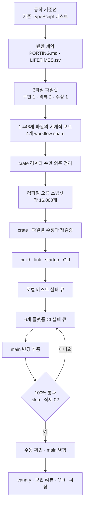
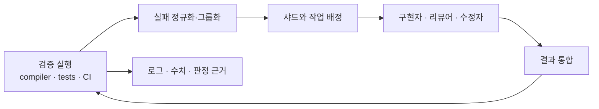
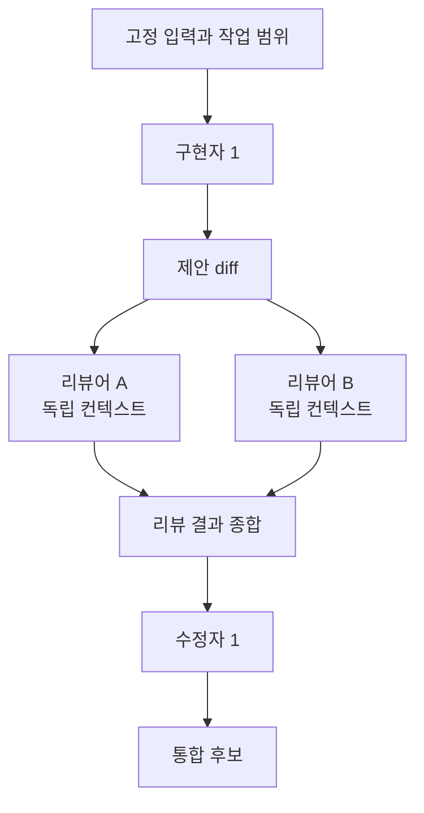
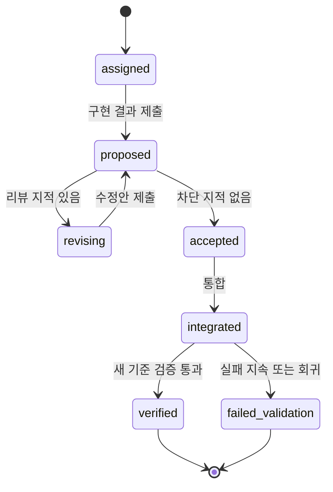
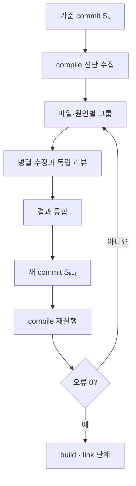

# 대규모 포팅 오케스트레이션 역설계

> **문서 성격:** 이 문서는 Bun의 공개 회고와 병합 커밋에 남은 workflow를 바탕으로 대규모 포팅 오케스트레이터의 구조와 작동 방식을 역설계한다. 실행 가능한 구현 명세, 개발 계획, API 계약을 제시하는 문서가 아니다.

## 1. 분석 범위

공개 자료에서는 Bun이 사용한 dynamic workflow 런타임 자체가 보이지 않는다. 확인할 수 있는 것은 공식 회고가 설명한 실행 과정, 병합 트리에 남은 workflow와 스크립트, PR과 commit의 결과다. 따라서 이 문서는 다음 두 층을 구분한다.

- **관찰:** Bun 공식 회고, PR, 공개 workflow에서 직접 확인되는 동작
- **역설계:** 관찰된 동작을 일관된 시스템으로 설명하기 위해 도출한 개념 모델

역설계 층의 queue, epoch, 통합 장벽, 상태 저장은 Bun 내부 구현의 명칭이나 실제 데이터 모델을 복원한 것이 아니다. 공개된 여러 workflow가 어떤 공통 원리로 작동했는지 설명하기 위한 분석 어휘다. 사실 근거와 확인할 수 없는 부분은 [근거와 한계](03-verification.md)에 정리한다.

이 문서가 답하려는 질문은 네 가지다.

1. 1,448개 파일과 약 16,000개 컴파일 오류를 어떤 단위로 나눴는가?
2. 최대 약 64개의 동시 세션이 서로의 변경을 덮어쓰지 않게 한 경계는 무엇인가?
3. 컴파일·테스트 실패 목록이 어떻게 반복 작업 큐가 됐는가?
4. 전체 재작성이 성립하려면 어떤 검증 조건이 필요했는가?

## 2. 전체 흐름



이 흐름에서 파일 포트는 시작 단계일 뿐이다. 파일이 모두 Rust로 바뀐 뒤에 crate 구조, 컴파일, 링크, 실행, 기능, 플랫폼 검증이 순차적으로 열린다. 따라서 “코드를 옮긴 상태”와 “대체 가능한 프로그램이 된 상태”는 서로 다르다.

## 3. 병렬화를 가능하게 한 세 가지 경계

### 3.1 변환 범위의 경계

Bun은 Rust다운 재설계보다 Zig 구현을 기계적으로 보존하는 쪽으로 목표를 좁혔다. 아키텍처, 자료구조, 기능을 동시에 바꾸지 않았기 때문에 파일별 작업이 같은 변환 규칙을 공유할 수 있었다.

`PORTING.md`는 Zig 패턴을 Rust 표현으로 옮기는 공통 규칙이었고, `LIFETIMES.tsv`는 필드와 참조 관계의 수명 판단을 작업자 밖에서 공유하는 장치였다. 작업자는 매번 전체 소유권 모델을 다시 설계하는 대신 고정된 변환 결정을 입력으로 받았다.

### 3.2 쓰기 범위의 경계

첫 시도에서는 여러 세션이 같은 저장소에서 `stash`, `stash pop`, `reset --hard`를 실행해 변경을 잃었다. 세션마다 worktree를 하나씩 만드는 방식은 저장 공간과 통합 비용이 컸다. 최종 구조는 네 workflow shard와 네 worktree를 두고, 각 worktree 안에서 최대 16개 세션이 제한된 파일을 처리하는 방식이었다.

여기서 worktree 수와 작업자 수는 같지 않다. worktree는 큰 격리 경계이고, 파일·crate·테스트는 그 안의 작업 배정 경계다. 공개 workflow의 세부 정책은 단계마다 다르지만, 작업자에게 고정된 범위를 주고 공용 Git·Cargo 조작을 제한했다는 공통점이 있다.

### 3.3 검증 범위의 경계

작업자가 완료했다고 보고하는 것과 프로그램의 실패가 사라진 것은 다르다. Bun은 특정 시점의 컴파일 또는 테스트 실패를 파일로 고정해 나눠 처리하고, 결과를 모은 뒤 다시 검증해 다음 실패 목록을 만들었다.

```text
기준 상태에서 검증
  → 실패 목록 고정
  → 파일·원인별 배정
  → 구현·리뷰·수정
  → 결과 통합
  → 새 기준 상태에서 검증
```

한 오류를 고치면 뒤의 오류가 함께 사라지거나 새 오류가 드러날 수 있다. 따라서 오래 유지되는 단일 backlog보다 검증 라운드마다 다시 만들어지는 스냅샷으로 이해하는 편이 공식 회고의 흐름과 맞는다.

## 4. 역설계한 오케스트레이터 구조

공개 workflow를 하나의 시스템으로 정리하면 다음 책임으로 나뉜다.



| 책임 | 관찰되는 입력과 출력 | 역설계한 의미 |
|---|---|---|
| 검증 실행 | `cargo check`, 명령별 stacktrace, 로컬 테스트, CI 결과 | 다음 작업 목록을 만드는 기준점 |
| 실패 정규화 | 파일별 compiler error, panic·ASAN·leak signature | 중복 실패를 작업 단위로 바꾸는 과정 |
| 샤딩 | 파일, crate, 테스트 폴더, 플랫폼, main commit | 단계마다 달라지는 병렬화 키 |
| 작업 셀 | 구현자 1, 독립 리뷰어 2, 수정자 1 | 작성과 검증의 컨텍스트 분리 |
| 통합 | 파일·crate 단위 commit과 worktree 결과 결합 | 병렬 변경을 다시 하나의 기준 상태로 만드는 장벽 |
| 재검증 | 새 compile·test·CI 실행 | 이전 실패의 소멸과 새 실패의 출현 판정 |

실제 Bun 런타임이 중앙 DB, lease, fencing token을 사용했는지는 공개 자료로 확인되지 않는다. 그런 장치는 동일한 구조를 일반 시스템으로 구현할 때 선택할 수 있는 방법이지, Bun 사례의 관찰 사실은 아니다.

## 5. 작업 단위와 역할 셀

### 5.1 작업 단위

역설계 모델에서 한 작업은 다음 정보로 설명할 수 있다.

- 작업이 만들어진 기준 commit
- 원본과 포팅 결과의 대상 파일 또는 실패 원인
- 읽을 수 있는 범위와 수정할 수 있는 범위
- 적용할 포팅 규칙과 관련 수명 판단
- compiler·test 진단 원문
- 구현 결과와 리뷰 결과
- 통합 뒤 재검증 결과

이 정보가 필요한 이유는 작업자가 보지 못한 저장소 상태나 다른 작업자의 변경을 전제로 수정하지 않게 하기 위해서다. 동일한 파일이나 공유 설정을 여러 작업이 동시에 바꾸면 파일 단위 샤딩의 전제가 무너진다.

### 5.2 1-2-1 역할 셀



리뷰어는 구현자의 대화와 추론을 보지 않고 diff를 중심으로 검토했다. 이는 “작성 의도가 타당한가”보다 “원본 동작과 다르거나 실제로 깨지는 부분이 있는가”를 찾기 위한 컨텍스트 분리다.

공식 회고는 모든 줄이 두 리뷰어를 거쳤다고 집계하지만, 병합 트리에 남은 개별 workflow에는 리뷰어가 하나인 변형도 있다. 공개 자료만으로 모든 파일의 리뷰 계보를 재구성할 수는 없다.

### 5.3 상태의 개념적 흐름

구현 세부를 제외하면 작업의 수명은 다음처럼 요약된다.



중요한 구분은 `accepted`, `integrated`, `verified`다. 리뷰를 통과했거나 branch에 들어갔다는 사실은 검증 성공과 같지 않다.

## 6. 컴파일 오류를 큐로 바꾸는 방식

### 6.1 수집 단위

공식 회고의 최종 설명은 crate별로 `cargo check`를 실행하고 출력을 파일별로 묶는 방식이다. 공개된 [`phase-d-build-queue.workflow.js`](https://github.com/oven-sh/bun/blob/23427dbc12fdcff30c23a96a3d6a66d62fdc091d/.claude/workflows/phase-d-build-queue.workflow.js)와 [`phase-d-crate-shard.workflow.js`](https://github.com/oven-sh/bun/blob/23427dbc12fdcff30c23a96a3d6a66d62fdc091d/.claude/workflows/phase-d-crate-shard.workflow.js)는 명령과 분배 방식이 다르지만, 먼저 오류 목록을 고정하고 파일별 작업으로 바꾼다는 구조는 같다.

Cargo의 [`--message-format=json`](https://doc.rust-lang.org/cargo/reference/external-tools.html)은 package, target, diagnostic code, source span, child diagnostic을 보존한다. 텍스트 출력만 처리하는 workflow보다 구조화된 진단이 어떤 정보를 유지할 수 있는지를 보여주는 비교 기준이다.

### 6.2 정규화와 grouping

오류 메시지 전체를 그대로 식별자로 쓰면 절대 경로와 줄 번호가 바뀔 때 같은 원인도 다른 작업으로 보인다. 반대로 `error`나 `failed` 같은 일반 문구만 남기면 관계없는 실패가 하나로 합쳐진다. 안정적인 그룹은 보통 다음 정보를 함께 본다.

- package 또는 crate
- 오류 코드와 정규화한 메시지
- 원본 파일과 관련 symbol
- panic·sanitizer의 첫 application frame
- 같은 원인임을 보여주는 stacktrace나 재현 결과

기본 단위는 파일이지만, 한 원인이 여러 파일이나 테스트를 깨뜨린 근거가 있으면 원인별로 합칠 수 있다. 공개 crate shard workflow는 오류가 많은 파일을 약 800줄 구간으로 나누기도 했다. 같은 파일의 두 구간이 실제로 독립적인지는 공개 자료가 보장하지 않으므로, 이는 관찰된 최적화이지 안전한 일반 규칙으로 볼 수 없다.

### 6.3 라운드 단위 수명



이 한 라운드를 편의상 `epoch`라고 부를 수 있다. epoch라는 명칭과 영속 상태 모델은 역설계 어휘이며, Bun이 같은 이름의 객체를 사용했다는 뜻은 아니다.

## 7. 샤딩과 스케줄링

단계가 바뀌면 유효한 샤드 키도 바뀐다.

| 단계 | 관찰된 샤드 키 | 완료를 판단하는 경계 |
|---|---|---|
| 수명 분류 | Zig 파일·필드 | 분류 결과 검토 |
| 기계적 포트 | 원본 Zig 파일 → Rust 파일 | 파일 포트와 리뷰 완료 |
| 컴파일 복구 | crate → 진단 파일 | crate별 `cargo check` 재실행 |
| 로컬 테스트 | 테스트 폴더·파일 | 테스트 묶음 재실행 |
| CI 복구 | 플랫폼·실패 원인 | 플랫폼 CI 재실행 |
| main 추종 | branch point 이후 commit | 원본 변경과 Rust 대응 변경의 동등성 확인 |

역설계한 스케줄러의 핵심 성질은 특정 알고리즘보다 다음 세 가지다.

1. 같은 입력 목록에서는 작업 경계가 임의로 바뀌지 않는다.
2. 동시에 실행되는 작업의 쓰기 범위가 겹치지 않는다.
3. 다음 wave는 앞 wave의 통합과 재검증 뒤에 열린다.

crate 의존 그래프에 순환이 남아 있으면 세션 수를 늘려도 유효한 병렬성이 생기지 않는다. Bun이 약 100개 crate의 순환을 먼저 분류하고 경계를 조정한 것은 파일 수보다 의존 구조가 컴파일 병렬성의 상한을 정한다는 점을 보여준다.

## 8. 통합, 재시작, 롤백

### 8.1 통합 장벽

병렬 작업자는 서로 다른 기준 상태를 만들 수 있으므로, 검증 전에 결과를 하나의 commit 계보로 모아야 한다. 공개 자료에서 정확한 통합 transaction은 보이지 않지만, crate 단위로 commit이 들어간 뒤 오류 수가 갱신되는 흐름은 작업 중간의 보고가 아니라 통합된 저장소 상태를 검증 기준으로 삼았음을 보여준다.

역설계 모델에서는 다음 세 상태를 구분하면 흐름을 설명하기 쉽다.

```text
제안됨 → 통합됨 → 검증됨
```

충돌이 발생했을 때 작업자가 임의로 공용 branch를 고치면 어느 입력에서 어떤 리뷰를 거쳤는지 추적하기 어려워진다. 따라서 통합은 병렬 작성과 분리된 직렬 경계로 해석할 수 있다.

### 8.2 재시작

Bun의 정확한 작업 임대, 재시도, crash recovery 기록은 공개되지 않았다. 다만 장시간 workflow가 계속 실행되고 디스크 고갈과 IOPS 문제로 여러 번 중단됐다는 점에서, 실제 실행에는 진행 상태를 복구하는 장치가 필요했음을 추론할 수 있다.

일반화한 상태 모델은 다음 정보를 분리한다.

- 어느 commit에서 실패 목록을 만들었는가
- 어떤 파일과 원인이 배정됐는가
- 어떤 결과가 리뷰와 통합을 거쳤는가
- 마지막으로 완전하게 통과한 검증은 무엇인가

이 정보는 재시작 설계의 분석 단위다. DB 종류, lease 방식, idempotency key 같은 선택은 공개 Bun 사례에서 결정할 수 없다.

### 8.3 롤백

공식 회고는 main 병합과 안정판 출시를 구분하고, 병합 뒤 canary·보안 리뷰·Miri·퍼징을 이어 갔다. 여기서 도출되는 롤백 경계도 하나가 아니다.

| 경계 | 되돌아가는 상태 |
|---|---|
| 작업 라운드 | 마지막으로 검증된 포팅 commit |
| 전체 포팅 branch | 포팅 시작 전 기준점 |
| canary·release | 이전에 검증된 배포 artifact와 설정 |

소스 branch를 되돌리는 것과 배포 상태를 복원하는 것은 다른 문제다. Bun이 실제로 사용한 release rollback 절차는 공개 자료에 없으므로, 이 표는 전체 재작성 과정의 상태 경계를 설명하는 역설계 모델이다.

## 9. 검증 사다리와 전체 재작성 조건

`cargo check` 성공은 최종 codegen을 포함하지 않으므로 build와 link 성공을 보장하지 않는다. 마찬가지로 build 성공은 프로세스 시작, CLI 동작, 기존 테스트, 플랫폼 동등성, 메모리 안전성을 보장하지 않는다. Bun 사례의 단계는 다음 사다리로 정리할 수 있다.

| 단계 | Bun에서 관찰된 검사 | 이 단계가 분리되는 이유 |
|---|---|---|
| 변환 기준 | `PORTING.md`, `LIFETIMES.tsv`, 3파일 파일럿 | 작업자마다 다른 언어·수명 결정을 내리지 않게 함 |
| 파일 포트 | 1,448개 파일의 기계적 변환과 리뷰 | 구조 변경과 언어 변환을 분리 |
| 타입 검사 | crate별 `cargo check` | 대량 진단을 병렬 작업으로 전환 |
| build·link | codegen과 linker 오류 | `cargo check`가 보지 않는 실패 확인 |
| startup·CLI | `bun --version`, subcommand | 실행 초기화와 기능 진입점 확인 |
| 로컬 테스트 | 폴더별 무작위 테스트와 실패 queue | 빠른 기능 수렴과 무거운 테스트 분리 |
| 전 플랫폼 CI | macOS·Linux·Windows, x64·arm64 | 플랫폼별 조건부 동작과 테스트 확인 |
| 병합 조건 | 100% 통과, skip·삭제 0, 사람의 실행 확인 | 테스트 우회로 만든 성공 배제 |
| 병합 이후 | canary, 보안 리뷰, Miri 확대, 퍼징 | CI green이 안전성의 최종 증명은 아님 |

이 사례에서 전체 재작성이 성립한 조건은 다음과 같이 읽을 수 있다.

- 기존 테스트가 구현 언어와 독립적이었다.
- 목표를 기계적 동작 보존으로 좁힐 수 있었다.
- 변환 규칙과 수명 판단을 작업자 밖에서 공유할 수 있었다.
- 파일·crate·테스트·플랫폼별로 작업 입력을 나눌 수 있었다.
- 구현자와 리뷰어의 컨텍스트를 분리할 수 있었다.
- 통합된 기준 상태에서 compiler와 test를 반복 실행할 수 있었다.
- 테스트 삭제와 skip을 허용하지 않는 병합 기준이 있었다.
- 장기 branch가 기존 `main`의 변경을 계속 따라갈 수 있었다.
- CPU, 메모리, PID, 디스크, IOPS를 감당할 실행 환경이 있었다.

반대로 이 조건들이 약한 프로젝트에서 “4개 worktree와 64개 세션”만 복제해도 같은 결과가 나온다고 볼 근거는 없다.

## 10. 테스트 실패와 main 변경의 큐

### 10.1 테스트 실패 큐

컴파일 오류는 대개 source span을 제공하지만 테스트 실패는 수정할 파일을 직접 알려주지 않는다. 공개 [`categorize-ci-failures.ts`](https://github.com/oven-sh/bun/blob/23427dbc12fdcff30c23a96a3d6a66d62fdc091d/scripts/categorize-ci-failures.ts)는 panic, ASAN, leak 등의 signature를 정규화해 같은 원인의 테스트를 묶는다.

이를 역설계하면 테스트 큐는 두 판단을 거친다.

1. 실패 stacktrace와 로그에서 원인 후보와 관련 파일을 찾는다.
2. 같은 원인이라는 근거가 있는 실패만 하나의 수정 단위로 합친다.

`timeout`, `failed`, `exit 1`처럼 일반적인 문구만으로 묶으면 관계없는 실패를 한 작업자가 건드리게 된다. 반대로 같은 panic 위치나 sanitizer의 첫 application frame을 공유하면 여러 테스트의 중복 수정을 줄일 수 있다.

### 10.2 main 변경 추종

11일 동안 기존 `main`에도 수정과 기능이 들어온다. 공개 [`phase-h-main-parity.workflow.js`](https://github.com/oven-sh/bun/blob/23427dbc12fdcff30c23a96a3d6a66d62fdc091d/.claude/workflows/phase-h-main-parity.workflow.js)는 branch point 이후 commit을 Rust 쪽의 동등 변경 또는 제외 판단으로 대응시킨다.

```text
원본 main commit
  → 관련성 분류
  → Rust 대응 변경 또는 해당 없음 판단
  → 리뷰
  → 동등성 검증
```

이 큐가 없으면 테스트가 통과하더라도 포팅 branch는 이미 이전 제품 동작을 구현한 상태가 될 수 있다.

## 11. 자원 제약과 처리량

Bun의 로컬 테스트에는 1분 이상 걸리는 통합 테스트, 최대 소켓을 소모하는 테스트, GB 단위 디스크 I/O, 약 10,000개 프로세스를 만드는 테스트가 있었다. 팀은 `systemd-run` cgroup과 PID namespace를 사용했지만 디스크 고갈과 EC2 IOPS 설정 문제로 workflow가 멈추기도 했다.

따라서 병렬성의 상한은 모델 세션 수만으로 결정되지 않는다.

| 자원 | 실패 형태 |
|---|---|
| CPU·메모리 | build·test 지연, OOM, 서로 다른 shard의 간섭 |
| PID·file descriptor | process·socket 테스트 실패 |
| 디스크 용량 | workflow와 build 전체 중단 |
| IOPS | 간단한 검색도 전체 작업을 막는 병목 |
| 플랫폼 runner | macOS·Windows·ARM 검증의 긴 대기열 |

공식 회고의 분당 약 1,300줄은 최고 순간 처리량이다. 분석 지표로는 생성한 LOC보다 새 검증에서 사라진 오류, 통과한 테스트, 플랫폼별 수렴 시간, 회귀 수가 더 직접적이다.

## 12. 확인할 수 없는 내부 구현

공개 자료는 다음을 보여주지 않는다.

- dynamic workflow 런타임의 scheduler와 영속 상태
- 작업 임대, timeout, 재시작, 중복 적용 방지 방식
- 11일 동안 바뀐 prompt와 workflow의 정확한 버전 계보
- 최종 `LIFETIMES.tsv`와 전체 작업 원장
- 모든 줄의 두 차례 리뷰를 연결하는 기록
- worktree 결과를 합친 정확한 충돌 해결 규칙
- canary와 안정판의 실제 rollback 절차

따라서 이 문서의 구조는 공개된 실행 흔적을 설명하는 하나의 일관된 모델이지, Bun 내부 오케스트레이터의 완전한 복제본이 아니다. 특히 lease, DB transaction, branch CAS 같은 구현 방식을 Bun이 사용했다고 주장할 수 없다.

## 13. 종합

Bun 사례의 핵심은 64개 세션이 아니라 병렬 작업을 가능하게 한 경계다. 변환 목표를 기계적 포트로 좁히고, 수명과 타입 결정을 공유 입력으로 만들고, 파일·crate·테스트·플랫폼에 맞춰 샤드 키를 바꾸고, 구현과 독립 리뷰를 분리하고, 통합된 기준 상태에서 실패 목록을 반복 생성했다.

공개 workflow는 이 구조의 일부를 구체적으로 보여주지만, 재시작과 통합의 실제 런타임까지 공개하지는 않는다. 따라서 재사용할 수 있는 것은 특정 worker 수나 DB schema가 아니라 작업 경계, 검증 경계, 사실과 추론을 분리하는 방식이다.
