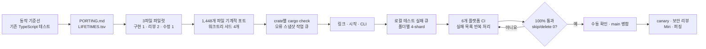

# Bun Rust 재작성 워크플로우

Bun이 Zig 구현을 Rust로 옮긴 과정을 AI 병렬 처리, 샤딩, 컴파일·테스트 오류 작업 큐 관점에서 분석한 문서다. 사실의 기준은
[Bun 공식 회고](https://bun.com/blog/bun-in-rust)와 병합된
[PR #30412](https://github.com/oven-sh/bun/pull/30412)이며, 병합 커밋에 남은 workflow와 CI 스크립트로 실행 흐름을
교차 확인했다.

> **조사 기준일:** 2026-07-26
> **출시 상태:** Rust 포트는 2026-05-14 `main`에 병합됐고 canary에서 사용 중이다. 조사 기준
> [GitHub 최신 안정 릴리스](https://github.com/oven-sh/bun/releases/latest)는 v1.3.14이며 Zig 구현이다. 공식 글은
> v1.4.0을 첫 Rust
> 안정 버전으로 예고했지만 아직 출시 완료 상태로 다루면 안 된다.
> **검증 상태:** 같은 날 GitHub API와 1차 자료로 전수 대조했고 불일치는 없었다. 절차와 결과는
> [검증 기록](03-verification.md)에 있다.

## 결론

Bun 사례의 핵심은 에이전트 수가 아니다. 다음 세 가지가 병렬화를 가능하게 했다.

1. 기존 아키텍처와 동작을 보존하는 기계적 포트로 목표를 좁혔다.
2. 컴파일러와 테스트 러너의 실패 목록을 라운드마다 다시 만드는 작업 큐로 사용했다.
3. 파일·crate·테스트·플랫폼 단위로 작업 입력을 나누고, 구현자와 리뷰어의 역할과 컨텍스트를 분리했다.

공개 자료만으로 Bun의 11일 실행을 그대로 재현할 수는 없다. `LIFETIMES.tsv`, dynamic workflow 런타임, 정확한 재시작·병합
규칙이 빠져 있기 때문이다. 다만 공개 workflow까지 함께 읽으면 범용 마이그레이션 오케스트레이터와 3파일 파일럿의 상세
설계를 시작할 수 있다. 전체 재작성에 착수하려면 대상 프로젝트의 기준선, 단일 작성자 계약, 내구성 있는 큐, 전 플랫폼
검증과 롤백 절차를 추가로 고정해야 한다.

## 문서 구성

| 문서 | 내용 |
|---|---|
| [아키텍처와 실행 다이어그램](00-diagram.md) | 전체 포팅 단계, 1-2-1 작업 셀, 오류 큐 재생성 루프, 샤드 경계 |
| [공식 사례 분석](01-analysis.md) | 전환 동기, 실제 11일 흐름, 수치, 출처 교차 검증, 한계 |
| [구현 플로우와 준비도](02-implementation-flow.md) | 재사용 가능한 큐·작업·샤드 계약, 상태 머신, 게이트, 의사코드, 착수 판정 |
| [검증 기록](03-verification.md) | API·1차 자료 대조 결과, 문서 간 정합성 대조, 발견한 결함, 착수 판정 근거 |

## 사례 한눈에 보기

| 항목 | 공식 회고 기준 |
|---|---|
| 원본 범위 | 주석 제외 Zig 535,496줄, 포팅 대상 `.zig` 파일 1,448개 |
| 목표 | 아키텍처·자료구조·기능을 유지하는 기계적 전체 포트 |
| 준비 산출물 | `PORTING.md`, `LIFETIMES.tsv`, 3파일 파일럿 |
| 최대 동시성 | 워크플로 샤드 4개, 워크트리당 Claude 세션 16개, 최대 약 64개 |
| 기본 작업 셀 | 구현자 1 → 독립 리뷰어 2 → 수정자 1 |
| 컴파일 단계 | 약 100개 crate를 목표로 분리, 약 16,000개 오류를 crate·파일별로 처리 |
| 실행 기간 | 2026-05-03~05-14, 11일 |
| 병합 조건 | 6개 플랫폼의 기존 테스트 100%, 삭제·skip 0, 사람이 실행 여부 확인 |
| 비용 | API 가격 환산 약 165,000달러 |

`약 100만 줄`은 원본 Zig LOC가 아니다. 공식 글의 병합 변경량은 `+1,009,272`이고 GitHub PR API는
`+1,009,257 / -4,024`, 변경 파일 2,188개로 집계한다. 집계 기준과 시점이 달라 수치 정의를 붙여 써야 한다.

## 전체 흐름



## 오류 목록이 큐라는 뜻

공식 회고의 컴파일 단계는 Kafka나 데이터베이스에 쌓인 영구 backlog가 아니다. 특정 commit에서 `cargo check`를 한 번
실행해 실패를 파일로 고정하고, 그 스냅샷을 병렬 작업으로 나눈 뒤, 결과를 통합하고 다시 실행해 다음 큐를 만든다. 로컬·CI
테스트도 실패 stacktrace와 로그를 task로 바꿨지만, 같은 불변 epoch 계약을 썼다는 기록은 없다. 테스트에도 이 계약을
적용하는 부분은 재현성과 재시작을 위한 권장 설계다.

```text
검증 실행 → 실패 정규화·그룹화 → 샤드 배정 → 수정·리뷰·적용
          ↑                                      ↓
          └──────── 통합 후 새 commit에서 재실행 ────────┘
```

한 오류를 고치면 다른 오류가 사라지거나 새로 드러난다. 따라서 이전 목록의 항목을 개별적으로 `done` 처리하는 것보다, 새
검증 스냅샷에서 사라졌는지를 완료 조건으로 삼는 편이 정확하다.

## 출처 위계

| 등급 | 자료 | 사용 방식 |
|---|---|---|
| 1차 | [Bun 공식 회고](https://bun.com/blog/bun-in-rust) | 기간, 단계, 역할, 테스트, 결과의 기준 |
| 1차 | [PR #30412](https://github.com/oven-sh/bun/pull/30412)와 [병합 당시 workflow](https://github.com/oven-sh/bun/tree/23427dbc12fdcff30c23a96a3d6a66d62fdc091d/.claude/workflows) | 코드량, 실제 오케스트레이션·샤딩·CI task 변환 확인 |
| 외부 검증 | [Prisma Compute 운영 보고서](https://www.prisma.io/blog/bun-rust-rewrite-prisma-compute) | 특정 메모리 누수와 pause/resume 실패가 Rust canary에서 재현되지 않았음을 좁은 범위로 확인 |
| 2차 | [GeekNews 요약](https://news.hada.io/topic?id=31263) | 공식 글의 한국어 색인과 요약 |
| 2차 | [WikiDocs 글](https://wikidocs.net/blog/@jaehong/13487/) | 2026-05-15 당시의 초기 스냅샷. 2026-07-26 재검증 시 접근 불가 |

GeekNews는 공식 글을 충실히 요약하지만 독립 검증 자료는 아니다. WikiDocs는 재검증 시점에 Cloudflare 차단으로 본문을
읽을 수 없었으므로, `6~9일`, `99.8%`, `약 96만 줄 Zig`, `unsafe 13,044개`를 이 문서의 근거로 쓰지 않는다. 모두 5월
중간 시점의 서로 다른 집계 기준에서 나온 값이며, 최종 회고의 `11일`, 전 플랫폼 `100%`, 주석 제외 `535,496 Zig LOC`와
섞어 쓰지 않는다.

## 적용 범위

이 문서는 두 층을 분리한다.

- **관찰된 사실:** Bun 공식 글, PR, 공개 workflow에서 직접 확인한 내용
- **권장 설계:** Bun의 시행착오를 바탕으로 작업 큐, 작업 임대(lease), 작업 셀 단일 작성자, 재시작, 롤백 계약을 보완한 내용

`02-implementation-flow.md`의 설계는 Bun이 모두 사용했다고 주장하는 기록이 아니다. 공개되지 않은 부분을 임의로 사실화하지
않고, 다른 프로젝트에서 구현할 때 빠지면 안 되는 계약으로 제시한다.
