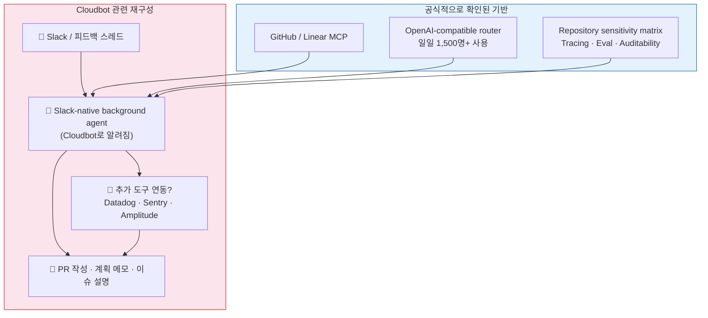
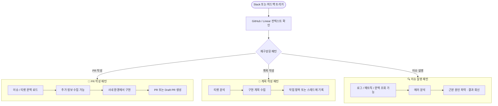
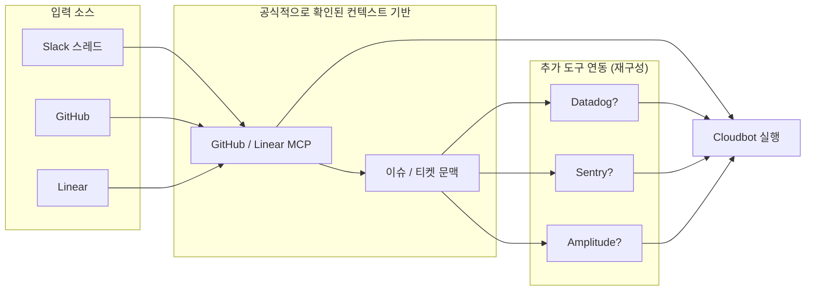
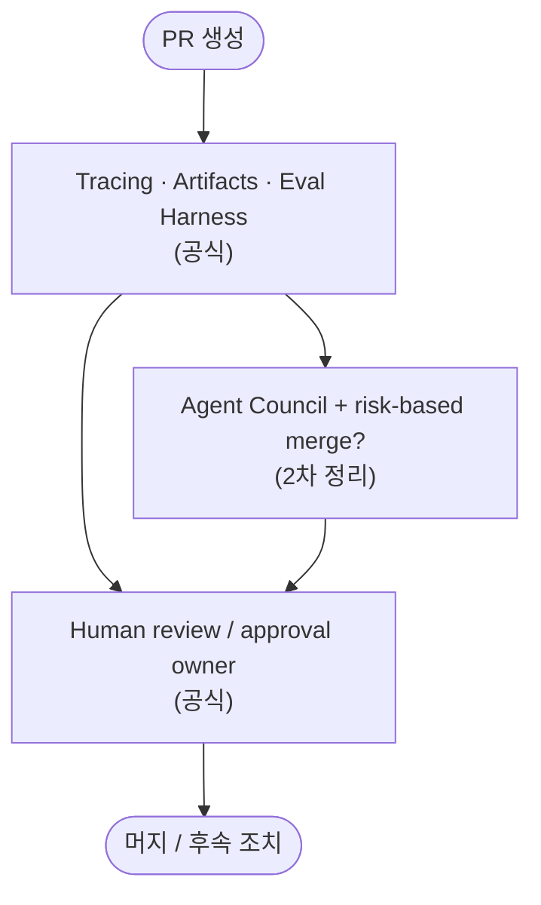
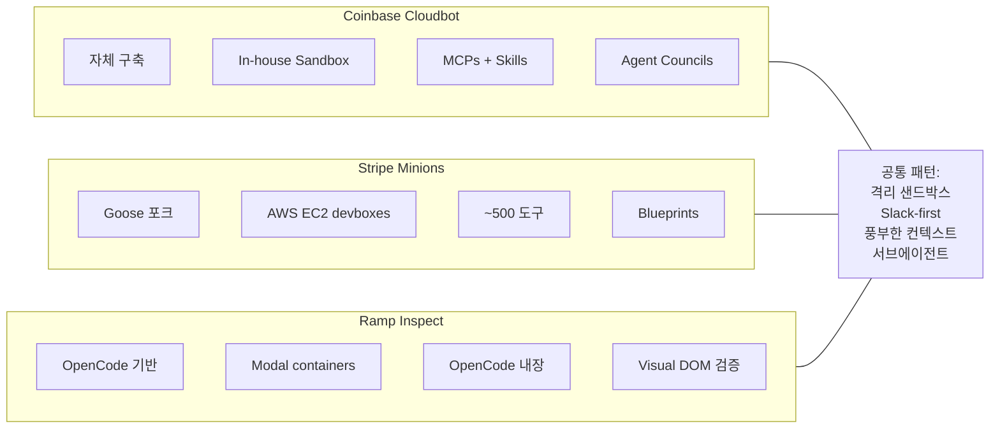

# Cloudbot 아키텍처 다이어그램

> 아래 다이어그램은 공개 인터뷰, LangChain 블로그 비교표, 2차 분석 자료를 종합하여 재구성한 것이다.
> Coinbase 공식 문서에서 Cloudbot 내부 아키텍처를 직접 공개한 사례는 확인되지 않았다.
> 공식 블로그로 직접 확인된 기반과, Cloudbot 관련 공개 발언에서 재구성한 흐름을 구분해 읽는 것이 안전하다.

## 1. 공개 자료 기준 전체 그림

## 2. 공개 자료에 반복 등장하는 상호작용 패턴

> `Create PR / Plan / Explain`이라는 명칭과 분류는 공개 발언과 2차 정리를 바탕으로 재구성한 것이다.
> Coinbase 공식 문서에서 내부 명령어 또는 제품 명세 형태로 공개한 것은 아니다.

## 3. 컨텍스트 파이프라인

공개 발언 기준으로는 Linear가 중요한 컨텍스트 허브로 반복 등장한다.
공식 문서로 직접 확인되는 것은 GitHub/Linear MCP 통합이며, 추가 도구 연동은 공개 발언과 2차 정리에 더 의존한다.

## 4. 검증 및 병합 파이프라인

> 공식 블로그로 직접 확인되는 것은 tracing, evaluation harness, human-in-the-loop, immutable record다.
> `Agent Councils + Auto-merge`는 LangChain 비교표와 외부 정리에서 반복되지만, 내부 동작 상세는 공개되지 않았다.

## 5. 3사 내부 코딩 에이전트 비교

