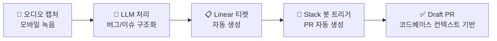
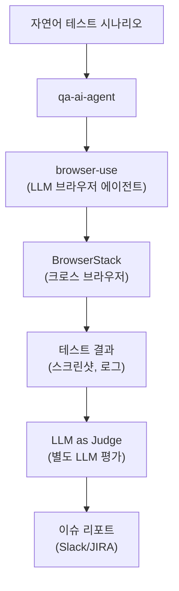
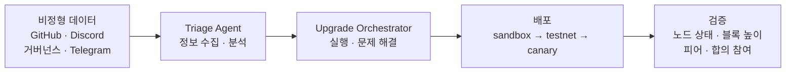

# Coinbase AI 에이전트 생태계

Cloudbot과 직접 연결되거나, Coinbase가 공개적으로 설명한 인접 AI 에이전트 사례를 정리한다.

## 1. 피드백-to-PR 파이프라인

사용자 피드백을 수집하고 자동으로 PR까지 생성하는 end-to-end 파이프라인이다.
ChatPRD 인터뷰(Chintan Turakhia)에서 공개되었다.
다만 이 흐름이 `Cloudbot` 자체와 동일한 시스템인지, 혹은 별도의 workflow automation인지까지는 공개 자료만으로 분리되지 않는다.

### 워크플로우

1. **오디오 캡처**: 피드백 세션에서 사용자 음성을 모바일로 녹음
2. **LLM 처리**: 오디오를 LLM에 전송, 버그/이슈를 구조화하여 요약
3. **티켓 생성**: Linear에 자동 티켓 생성 (제목, 사용자 여정 태그 포함)
4. **PR 생성**: Slack에서 봇 트리거, 코드베이스 컨텍스트 기반으로 Draft PR 자동 생성

### 특징

- 팀 내 누구든 Slack에서 PR 생성을 트리거할 수 있음
- Slack bot과 Linear 중심의 연결이 반복적으로 설명됨
- 추가 운영/제품 데이터 연동은 가능성이 시사되지만 직접 공개 근거는 약함
- 피드백에서 기능 배포까지의 사이클을 수 주 → 수 분으로 단축

---

## 2. QA AI Agent (qa-ai-agent)

제품 품질 테스트를 위한 AI 에이전트. Coinbase 공식 블로그에서 상세히 공개했다.
이 섹션의 아키텍처와 성과 수치는 Coinbase 공식 블로그 기준으로 정리했다.

### 아키텍처

| 구성 요소     | 기술                               |
|-----------|----------------------------------|
| 브라우저 에이전트 | browser-use (오픈소스 LLM 브라우저 에이전트) |
| 통신        | gRPC + WebSocket                 |
| 데이터 저장    | MongoDB                          |
| 인프라       | BrowserStack (크로스 브라우저)          |
| LLM       | Claude + OpenAI (멀티 모델)          |

### 핵심 설계

- **라이브 UI 관찰**: 코드 생성(text-to-code) 대신, 라이브 UI를 직접 관찰하여 다음 액션 결정. DOM 셀렉터에 의존하지 않아 더 견고함.
- **자연어 테스트**: `"coinbase 브라질 테스트 계정에 로그인하여 BTC 10 BRL 구매"` 형태로 시나리오 작성
- **LLM as Judge 패턴**: 에이전트가 버그를 발견하면, **별도 LLM**이 스크린샷과 설명을 평가하여 신뢰도 점수를 부여. 낮은 신뢰도의 false positive를 필터링.

### 성과

| 지표        | 수치                            |
|-----------|-------------------------------|
| 버그 탐지율    | 인간 대비 **300% 증가** (동일 시간 기준)  |
| 정확도       | 75% (인간 80%)                  |
| 테스트 생성 시간 | 15분 (검증된 프롬프트) / ~1.5시간 (미검증) |
| 비용 절감     | 수동 테스팅 대비 **86% 절감**          |
| 운영 규모     | 40개 테스트 시나리오 프로덕션             |
| 주간 이슈 발견  | ~10건                          |
| 목표        | 수동 테스팅의 **75% 대체**            |

### 평가 프레임워크

A/B 테스트 방법론으로 4가지 핵심 지표 측정:

- **Productivity**: 기간당 이슈 수
- **Correctness**: 개발팀 수용률
- **Scalability**: 신규 테스트 통합 속도
- **Cost-effectiveness**: 테스트당 토큰 비용

### 한계

- 인간 대비 5%p 정확도 갭 (75% vs 80%)
- 실제 인간 상호작용이 필요한 테스트 불가 (신원 확인, 생체 인식 등)
- 미검증 프롬프트는 약 90분의 엔지니어링 정제 필요

---

## 3. NodeSmith

블록체인 노드 업그레이드를 자동화하는 AI 시스템.

- **60개 이상 블록체인** 대상, 최근 3개월간 **500건 이상** 업그레이드 처리
- 엔지니어링 업그레이드 노력 **30% 감소**, 필수 업그레이드 누락 제거
- **2단계 AI 구조**:
    - **Triage Agent**: 비정형 데이터(GitHub release notes, Discord, 온체인 거버넌스, Telegram)에서 정보 수집·분석
    - **Upgrade Orchestrator**: AI 추론과 결정론적 코드를 결합하여 실행·문제 해결
- 배포는 sandbox → testnet → canary 순으로, 검증 후 프로덕션 적용

---

## 4. Claude 기반 고객 지원

개발자용 코딩 에이전트와는 별개의 고객 지원 AI 활용 사례지만, Coinbase의 전사 AI 운영 방식을 보여주는 인접 사례라서 함께 정리한다.

Coinbase는 Claude를 활용한 고객 지원 시스템을 운영한다.

| 채널             | 역할              | 출처                        |
|----------------|-----------------|---------------------------|
| AI 챗봇          | 일상적 고객 문의 자동 처리 | 공식 (claude.com/customers) |
| Agent assist   | 상담원 지원 도구       | 공식                        |
| Help center 검색 | AI 강화 검색        | 공식                        |

### 주요 지표

- 고객 상호작용의 **64% 자동화**라는 수치는 Bank Automation News 보도에 등장하며, 이번 문서에서는 공식 확정 수치로 간주하지 않는다.
- 시간당 수천 건 메시지 처리, **100개 이상 지역**, 수백만 사용자 지원
- 멀티 클라우드 배포 (AWS Bedrock + Google Vertex AI)로 **99.9999% 가용성 목표**
- 금융 컴플라이언스 가드레일 적용

---

## 5. Open SWE와의 관계

LangChain이 공개한 **Open SWE** 프레임워크는 Coinbase, Stripe, Ramp가 독립적으로 발견한 패턴을 오픈소스로 구현한 것이다.
즉, Open SWE는 Coinbase 내부 구현 그 자체가 아니라, 외부에서 공통 패턴을 일반화한 프레임워크다.

> "핵심 패턴은 동일하다. 차이점은 조직별 통합(org-specific integrations)뿐이다."

| 항목      | Open SWE                                  |
|---------|-------------------------------------------|
| 기반      | Deep Agents + LangGraph                   |
| 샌드박스    | Modal, Daytona, Runloop, LangSmith (플러거블) |
| 도구      | ~15개 큐레이션 (실행, API, 버전 관리)                |
| 컨텍스트    | AGENTS.md + 이슈/스레드 정보                     |
| 오케스트레이션 | 서브에이전트 + 미들웨어                             |
| 트리거     | Slack, Linear, GitHub                     |
| 라이선스    | MIT                                       |

---

## 참고 자료

- [Coinbase: How We are Improving Product Quality at Coinbase with AI Agents](https://www.coinbase.com/blog/How-We-are-Improving-Product-Quality-at-Coinbase-with-AI-agents)
- [Coinbase: NodeSmith — AI-Driven Automation for Blockchain Node Upgrades](https://www.coinbase.com/blog/NodeSmith-AI-Driven-Automation-for-Blockchain-Node-Upgrades)
- [Claude Customer Story: Coinbase](https://claude.com/customers/coinbase)
- [Bank Automation News: Coinbase Automates 64% of Customer Interactions](https://bankautomationnews.com/allposts/crypto/coinbase-automates-64-of-all-customer-interactions-with-gen-ai/)
- [ChatPRD: Build an Automated User Feedback to Pull Request Pipeline](https://www.chatprd.ai/how-i-ai/workflows/build-an-automated-user-feedback-to-pull-request-pipeline)
- [LangChain: Open SWE — Open-Source Framework for Internal Coding Agents](https://blog.langchain.com/open-swe-an-open-source-framework-for-internal-coding-agents/)
