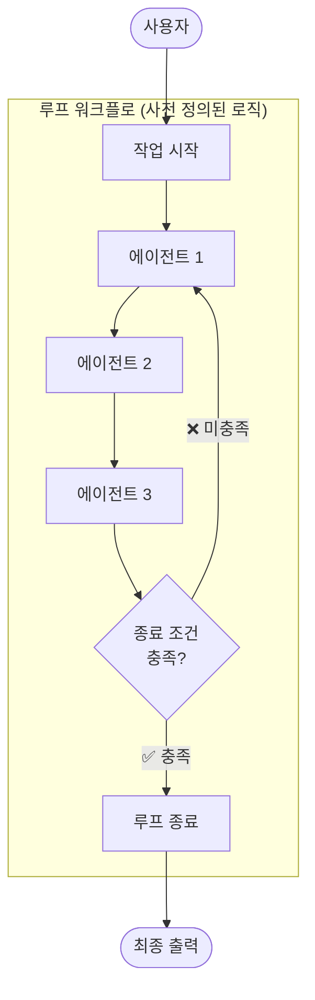
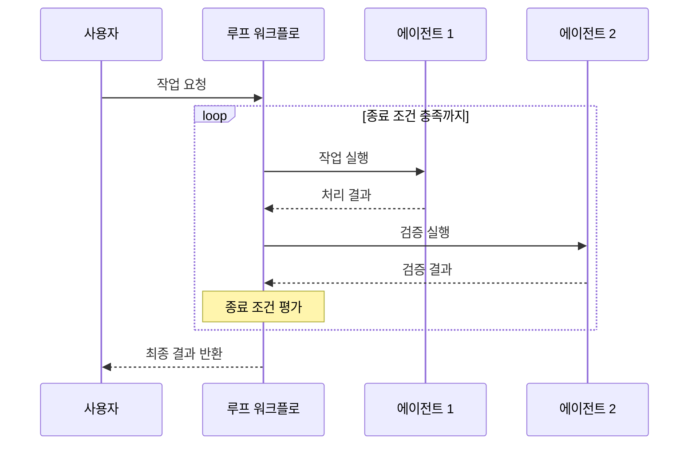

# 루프 패턴 (Loop Pattern)

## 개요

루프 패턴은 종료 조건이 충족될 때까지 전문화된 하위 에이전트 시퀀스를 반복적으로 실행하는 멀티 에이전트 패턴입니다.

**핵심 특징:**

- 사전 정의된 로직으로 작동하며, AI 모델을 오케스트레이션에 사용하지 않음
- 종료 조건(최대 반복 횟수, 품질 기준 충족 등)에 의해 루프 제어
- 각 반복마다 동일한 에이전트 시퀀스를 실행
- 무한 루프 방지를 위한 명시적 종료 조건 필수

**적합한 상황:**

- 반복적인 자동 검사가 필요한 작업
- 품질 기준을 충족할 때까지 반복 처리가 필요할 때
- 예측할 수 없는 반복 횟수의 작업

---

## 아키텍처

### 작동 흐름

---

## 사용 예시

### 1. 데이터 품질 검증

데이터 파이프라인에서 반복적 품질 검사:

- **에이전트 1**: 데이터 정합성 검사 실행
- **에이전트 2**: 오류 수정 및 재처리
- **종료 조건**: 오류율이 허용 임계값 이하로 떨어질 때

### 2. 자동화된 테스트 실행

CI/CD 파이프라인에서 테스트 반복:

- **에이전트 1**: 테스트 스위트 실행
- **에이전트 2**: 실패한 테스트에 대한 코드 수정
- **종료 조건**: 모든 테스트 통과 또는 최대 반복 횟수 도달

### 3. 웹 크롤링 및 데이터 수집

페이지네이션이 있는 데이터 수집:

- **에이전트 1**: 현재 페이지 데이터 추출
- **에이전트 2**: 다음 페이지 존재 여부 확인
- **종료 조건**: 더 이상 페이지가 없거나 목표 데이터 수량 달성

---

## 장단점

| 구분    | 내용                     |
|-------|------------------------|
| ✅ 장점  | AI 오케스트레이션 없이 동작하여 효율적 |
| ✅ 장점  | 반복적 작업의 자동화에 적합        |
| ✅ 장점  | 예측 가능한 실행 로직           |
| ⚠️ 단점 | 무한 루프 위험 (종료 조건 필수)    |
| ⚠️ 단점 | 종료 조건 불명확 시 비용 폭증      |
| ⚠️ 단점 | 지연 시간 예측 어려움           |

---

## 위험 관리

- **최대 반복 횟수 설정**: 무한 루프 방지를 위해 반드시 상한선 지정
- **비용 한도 설정**: 반복당 토큰 사용량 모니터링 및 예산 한도 적용
- **타임아웃 메커니즘**: 전체 실행 시간에 대한 타임아웃 설정

---

## 참고 자료

- [Google Cloud: Agentic AI Design Patterns](https://docs.cloud.google.com/architecture/choose-design-pattern-agentic-ai-system)
- [Google ADK: Loop Agents](https://google.github.io/adk-docs/agents/workflow-agents/loop-agents/)
