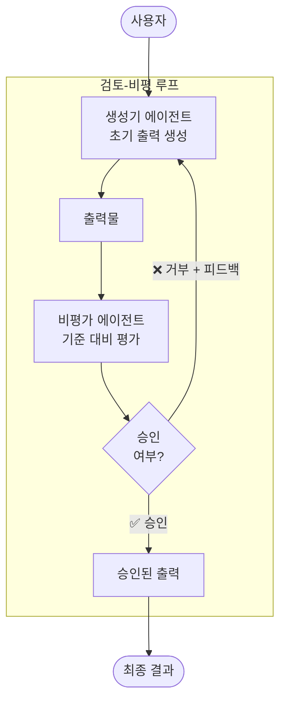
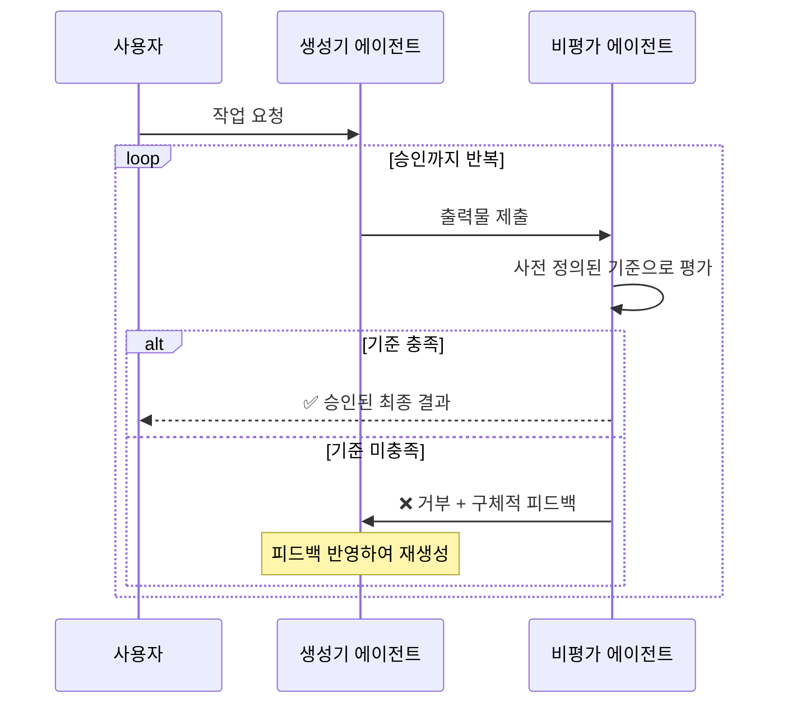

# 검토-비평 패턴 (Review and Critique Pattern)

## 개요

검토-비평 패턴은 생성기(Generator) 에이전트가 초기 출력을 생성하고, 비평가(Critic) 에이전트가 사전 정의된 기준으로 해당 출력을 평가한 뒤, 기준을 충족하지 못하면 생성기에게 피드백을 보내 재생성하는
루프 패턴의 구체적 구현입니다.

**핵심 특징:**

- 생성기 에이전트와 비평가 에이전트의 명확한 역할 분리
- 사전 정의된 평가 기준에 따른 체계적 검증
- 승인/거부/수정의 명확한 피드백 루프
- 루프 패턴의 특수한 형태로, 별도 검증 단계가 있는 경우에 적합

**적합한 상황:**

- 생성된 출력에 대한 독립적 검증이 필요할 때
- 보안 감시, 규정 준수 등 엄격한 기준 충족이 필요할 때
- 문서 요약, 코드 생성 등에서 별도 검증이 필요할 때

---

## 아키텍처

### 작동 흐름

---

## 사용 예시

### 1. 코드 생성 후 보안 감시

- **생성기**: 기능 요구사항에 따른 코드 생성
- **비평가**: 보안 취약점, 코딩 표준 위반 여부 평가
- **기준**: OWASP 보안 가이드라인, 팀 코딩 규칙
- **효과**: 보안 취약점이 포함된 코드 배포 방지

### 2. 문서 요약 검증

- **생성기**: 긴 문서의 요약본 생성
- **비평가**: 핵심 정보 누락, 사실 왜곡, 편향성 평가
- **기준**: 원문 대비 정확성, 핵심 포인트 포함 여부

### 3. 규정 준수 콘텐츠 생성

- **생성기**: 마케팅 카피, 약관 문서 등 생성
- **비평가**: 법적 컴플라이언스, 금지 표현, 규제 요건 검증
- **기준**: 관할 법령, 업계 규제 가이드라인

---

## 장단점

| 구분    | 내용                        |
|-------|---------------------------|
| ✅ 장점  | 출력 품질과 신뢰성 향상             |
| ✅ 장점  | 독립적 검증으로 객관적 품질 보장        |
| ✅ 장점  | 명확한 기준 기반의 체계적 평가         |
| ⚠️ 단점 | 각 검증마다 추가 모델 호출로 지연 시간 증가 |
| ⚠️ 단점 | 반복 수정 시 누적 비용 발생          |
| ⚠️ 단점 | 비평가 자체의 평가 오류 가능성         |

---

## 참고 자료

- [Google Cloud: Agentic AI Design Patterns](https://docs.cloud.google.com/architecture/choose-design-pattern-agentic-ai-system)
- [Google ADK: Loop Agents (검토-비평 패턴의 기반)](https://google.github.io/adk-docs/agents/workflow-agents/loop-agents/)
