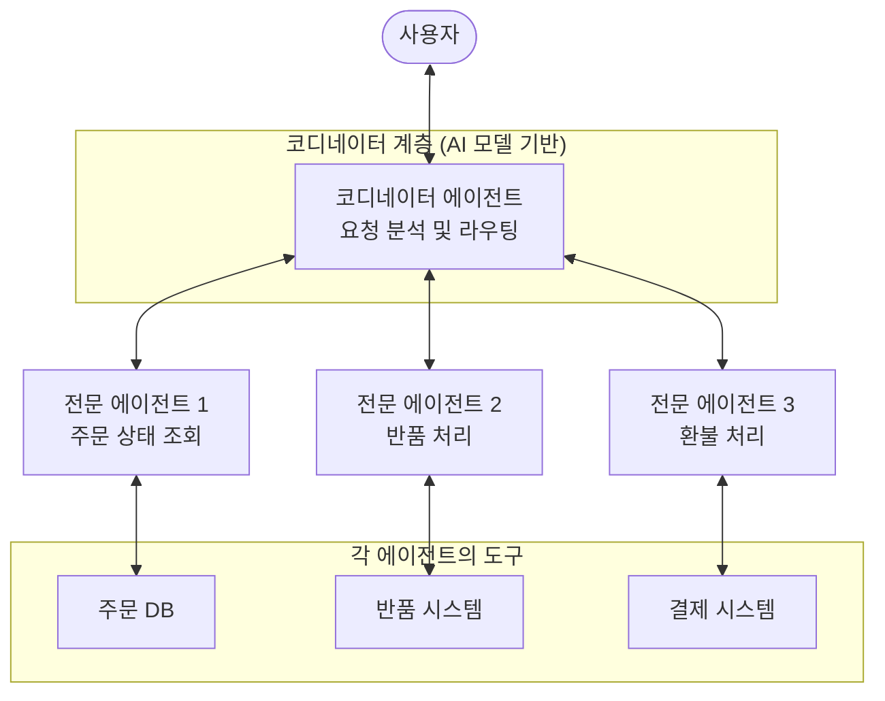
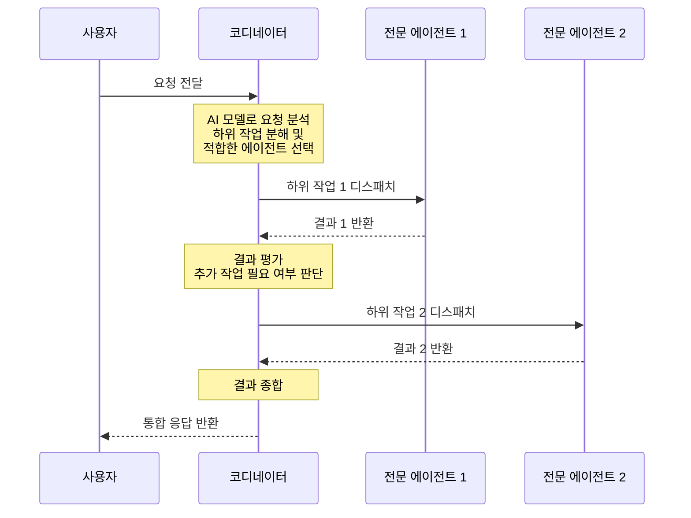

# 코디네이터 패턴 (Coordinator Pattern)

## 개요

코디네이터 패턴은 중앙의 코디네이터 에이전트가 AI 모델을 사용하여 사용자 요청을 분석하고, 하위 작업으로 분해한 뒤, 각 하위 작업을 전문 에이전트에 동적으로 디스패치하는 멀티 에이전트 패턴입니다.

**핵심 특징:**

- AI 모델로 작업을 동적으로 오케스트레이션 (병렬 패턴과의 핵심 차이)
- 코디네이터가 런타임에 어떤 에이전트를 호출할지 결정
- 다양한 입력 유형에 유연하게 대응
- 결과를 종합하여 통합된 응답 생성

**적합한 상황:**

- 다양한 유형의 입력에 대한 동적 라우팅이 필요할 때
- 런타임에 워크플로를 조정해야 할 때
- 적응형 라우팅이 필요한 구조화된 비즈니스 프로세스

---

## 아키텍처

### 작동 흐름

---

## 사용 예시

### 1. 고객 서비스 센터

요청 유형에 따른 동적 라우팅:

- **코디네이터**: 고객 메시지의 의도를 분석하여 적합한 에이전트로 라우팅
- **에이전트 A**: 주문 상태 문의 → 주문 DB 조회
- **에이전트 B**: 반품/교환 → 반품 프로세스 실행
- **에이전트 C**: 환불 요청 → 결제 시스템 연동

### 2. IT 헬프데스크

기술 지원 요청 분류 및 처리:

- **코디네이터**: 문제 유형 분석 (네트워크, 소프트웨어, 하드웨어)
- **에이전트 A**: 네트워크 진단 및 해결
- **에이전트 B**: 소프트웨어 설치/설정 지원
- **에이전트 C**: 하드웨어 장애 접수 및 에스컬레이션

### 3. 금융 상품 상담

고객 프로필에 따른 맞춤형 안내:

- **코디네이터**: 고객 니즈 분석 및 적합한 상품 카테고리 결정
- **에이전트 A**: 예금/적금 상품 안내
- **에이전트 B**: 대출 상품 심사 및 안내
- **에이전트 C**: 투자 상품 추천 및 리스크 설명

---

## 장단점

| 구분    | 내용                          |
|-------|-----------------------------|
| ✅ 장점  | 다양한 입력에 대한 유연한 처리           |
| ✅ 장점  | 런타임 워크플로 동적 조정 가능           |
| ✅ 장점  | 새로운 전문 에이전트 추가 용이           |
| ⚠️ 단점 | 코디네이터 오케스트레이션에 추가 토큰 소비     |
| ⚠️ 단점 | 단일 에이전트 대비 운영 비용 및 지연 시간 증가 |
| ⚠️ 단점 | 코디네이터의 라우팅 오류 시 전체 처리 품질 저하 |

---

## 병렬 패턴과의 차이

| 관점      | 병렬 패턴           | 코디네이터 패턴                        |
|---------|-----------------|---------------------------------|
| 오케스트레이션 | 사전 정의된 로직       | AI 모델 기반 동적 결정                  |
| 에이전트 실행 | 모든 에이전트 동시 실행   | 필요한 에이전트만 선택적/동시 실행 (AI 모델이 결정) |
| 유연성     | 고정된 작업 분배       | 런타임에 적응적 분배                     |
| 비용      | 예측 가능 (고정 병렬 수) | 변동 (입력에 따라 다름)                  |

---

## 참고 자료

- [Google Cloud: Agentic AI Design Patterns](https://docs.cloud.google.com/architecture/choose-design-pattern-agentic-ai-system)
- [Google ADK: Multi-Agent Patterns](https://google.github.io/adk-docs/agents/multi-agents/)
- [Developer's guide to multi-agent patterns in ADK](https://developers.googleblog.com/developers-guide-to-multi-agent-patterns-in-adk/)
