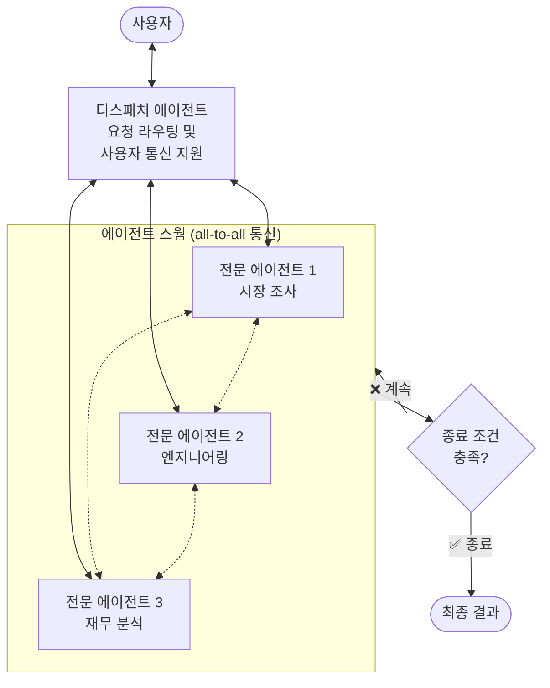
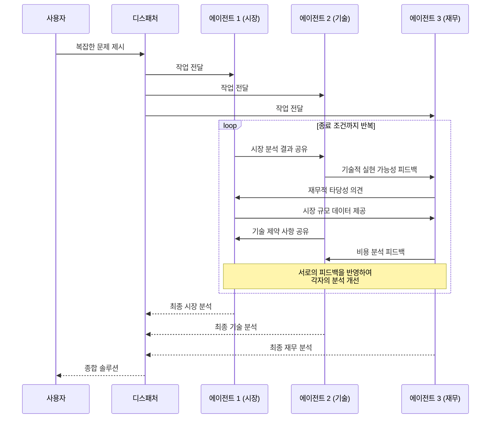

# 스웜 패턴 (Swarm Pattern)

## 개요

스웜 패턴은 여러 전문 에이전트가 all-to-all 통신 방식으로 협업하여 솔루션을 반복적으로 개선하는 멀티 에이전트 패턴입니다. 중앙 코디네이터 없이 에이전트들이 발견 사항을 공유하고, 서로 비판하며, 협력적으로
솔루션을 구축합니다.

**핵심 특징:**

- 디스패처 에이전트는 초기 요청 전달과 사용자 응답 전달만 담당하며, 에이전트 간 협업을 지시하거나 제어하지 않음 (코디네이터와의 핵심 차이)
- 에이전트 간 발견 사항 공유, 상호 비판, 협력적 개선
- 중앙 코디네이터 없는 분산형 협업
- 명시적 종료 조건 필수 (반복 횟수, 합의, 목표 달성 등)

**적합한 상황:**

- 다중 전문가의 토론과 반복적 개선이 필요한 작업
- 창의적 솔루션이 필요한 복잡한 문제
- 여러 분야의 전문 지식을 통합해야 하는 경우

---

## 아키텍처

### 작동 흐름

---

## 사용 예시

### 1. 신제품 설계

다분야 전문가 팀 시뮬레이션:

- **시장 조사 에이전트**: 시장 니즈, 경쟁 현황, 타겟 고객 분석
- **엔지니어링 에이전트**: 기술적 실현 가능성, 프로토타입 설계
- **재무 에이전트**: 비용 분석, 수익 모델, ROI 예측
- **상호 작용**: 각 에이전트가 서로의 분석을 비판하고 보완하여 통합 제안 도출

### 2. 정책 수립

복잡한 정책 분석과 제안:

- **법률 에이전트**: 법적 타당성, 규제 환경 분석
- **경제 에이전트**: 경제적 영향, 비용-편익 분석
- **사회 에이전트**: 사회적 영향, 이해관계자 분석
- **상호 작용**: 각 관점에서의 충돌을 토론하며 균형 잡힌 정책 제안

### 3. 복잡한 시스템 설계

엔터프라이즈 아키텍처 설계:

- **보안 에이전트**: 보안 요구사항, 위협 모델링
- **성능 에이전트**: 성능 요구사항, 확장성 설계
- **비용 에이전트**: 인프라 비용, 운영 비용 최적화
- **상호 작용**: 보안-성능-비용 간 트레이드오프 토론

---

## 장단점

| 구분    | 내용                              |
|-------|---------------------------------|
| ✅ 장점  | 전문가 팀의 협업을 시뮬레이션하여 높은 품질의 솔루션   |
| ✅ 장점  | 다양한 관점의 통합으로 맹점(blind spot) 최소화 |
| ✅ 장점  | 창의적이고 종합적인 결과 도출                |
| ⚠️ 단점 | 가장 복잡하고 비용이 많이 드는 패턴            |
| ⚠️ 단점 | 비생산적 루프나 미수렴 위험                 |
| ⚠️ 단점 | 에이전트 간 통신 관리의 높은 복잡성            |
| ⚠️ 단점 | 다중 턴 대화의 높은 운영 비용과 지연 시간        |

---

## 코디네이터 패턴과의 차이

| 관점     | 코디네이터 패턴          | 스웜 패턴                     |
|--------|-------------------|---------------------------|
| 통신 구조  | 허브-스포크 (코디네이터 중심) | All-to-all (에이전트 간 직접 통신) |
| 의사결정   | 코디네이터가 중앙 결정      | 에이전트들의 분산 합의              |
| 적합한 작업 | 구조화된 작업 분배        | 토론과 창의적 협업                |
| 복잡도    | 높음                | 매우 높음                     |
| 비용     | 높음                | 매우 높음                     |

---

## 참고 자료

- [Google Cloud: Agentic AI Design Patterns](https://docs.cloud.google.com/architecture/choose-design-pattern-agentic-ai-system)
- [OpenAI: Swarm (Deprecated → Agents SDK로 대체)](https://github.com/openai/swarm)
- [Google ADK: Multi-Agent Patterns](https://google.github.io/adk-docs/agents/multi-agents/)
