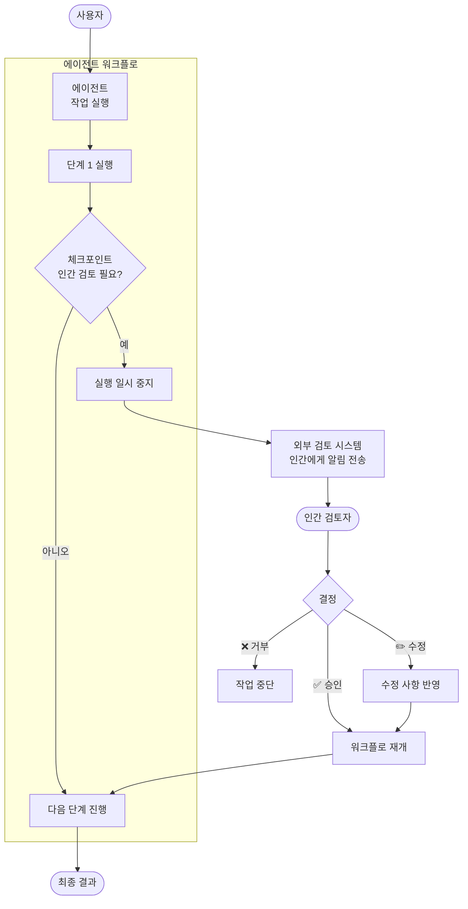
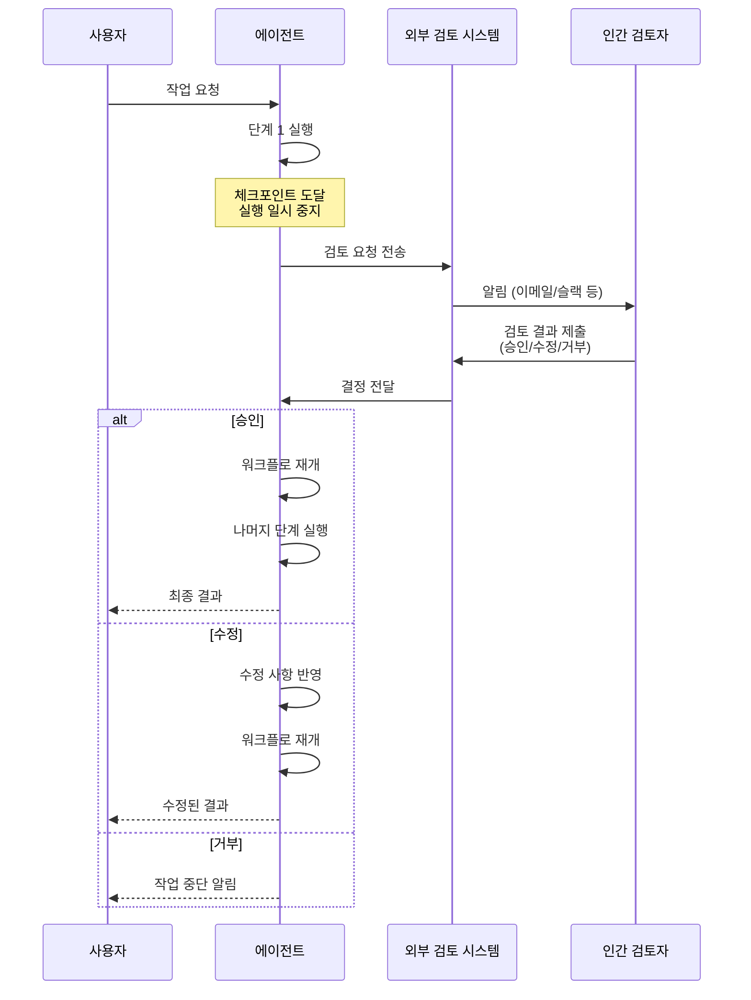

# 인간 참여형 패턴 (Human-in-the-Loop Pattern)

## 개요

인간 참여형 패턴은 에이전트 워크플로에 인간의 개입 지점을 직접 통합하는 패턴입니다. 미리 정의된 체크포인트에서 에이전트의 실행을 일시 중지하고, 외부 시스템을 통해 사람의 검토를 기다린 후, 승인/수정/입력을 받아
실행을 재개합니다.

> **참고**: 이 패턴은 독립적으로 사용될 수 있으며, 다른 패턴(순차, 코디네이터 등)의 특정 단계에 체크포인트로 삽입하여 결합할 수도 있습니다.

**핵심 특징:**

- 미리 정의된 체크포인트에서 에이전트 실행 일시 중지
- 외부 시스템을 통해 인간 검토자에게 알림 전송
- 승인, 수정, 추가 입력 등 다양한 형태의 인간 피드백 수용
- 인간 결정 후 워크플로 재개

**적합한 상황:**

- 중요한 결정에 인간의 판단이 필요할 때
- 안전성과 신뢰성이 최우선인 작업
- 주관적 판단이 요구되는 경우 (광고 소재 검증, 콘텐츠 승인)
- 규정 준수를 위해 인간 승인이 필수인 경우

---

## 아키텍처

### 작동 흐름

---

## 사용 예시

### 1. 대규모 금융 거래 승인

고액 거래의 안전 보장:

- **에이전트**: 거래 요청 분석, 리스크 평가 실행
- **체크포인트**: 일정 금액 이상의 거래 시 실행 일시 중지
- **인간 검토**: 재무 담당자가 거래 내용, 리스크 점수 확인 후 승인/거부
- **효과**: 자동화된 효율성과 인간의 안전 판단 결합

### 2. 민감한 문서 요약 검증

기밀 또는 법적 문서 처리:

- **에이전트**: 문서 자동 요약 생성
- **체크포인트**: 요약 결과를 인간 검토자에게 제출
- **인간 검토**: 핵심 정보 누락, 오해 소지 표현, 기밀 사항 노출 여부 확인
- **효과**: AI 효율성을 활용하면서 정확성과 보안 보장

### 3. 광고 소재 승인

마케팅 캠페인의 품질 관리:

- **에이전트**: 타겟 고객 기반 광고 카피 및 이미지 생성
- **체크포인트**: 생성된 소재를 크리에이티브 팀에 제출
- **인간 검토**: 브랜드 가이드라인 적합성, 톤 앤 매너, 문화적 적절성 판단
- **효과**: 주관적 품질 판단이 필요한 영역에서 인간 전문성 활용

### 4. 환자 데이터 익명화

의료 데이터 처리:

- **에이전트**: 환자 기록에서 개인 식별 정보(PII) 자동 제거
- **체크포인트**: 익명화된 데이터를 전문가에게 최종 검증 요청
- **인간 검토**: 잔존하는 식별 가능 정보 확인, 데이터 유용성 평가
- **효과**: 개인정보 보호 규정 준수 보장

---

## 장단점

| 구분    | 내용                    |
|-------|-----------------------|
| ✅ 장점  | 중요 결정 지점에 인간 판단 삽입 가능 |
| ✅ 장점  | 자동화의 효율성과 인간의 안전성 결합  |
| ✅ 장점  | 규정 준수 및 감사 추적 용이      |
| ✅ 장점  | AI 오류의 영향 최소화         |
| ⚠️ 단점 | 외부 사용자 상호작용 시스템 구축 필요 |
| ⚠️ 단점 | 아키텍처 복잡성 증가           |
| ⚠️ 단점 | 인간 응답 대기로 인한 지연 시간 발생 |
| ⚠️ 단점 | 검토자 가용성에 따른 병목 현상 가능  |

---

## 설계 고려사항

- **체크포인트 위치**: 위험도가 높은 결정 지점에 전략적으로 배치
- **타임아웃 정책**: 인간 검토자의 미응답 시 대안 처리 방법 정의
- **에스컬레이션 경로**: 검토자가 판단하기 어려운 경우의 상위 에스컬레이션 절차
- **감사 로그**: 모든 인간 결정과 그 근거를 기록하여 추적 가능성 확보

---

## 참고 자료

- [Google Cloud: Agentic AI Design Patterns](https://docs.cloud.google.com/architecture/choose-design-pattern-agentic-ai-system)
- [Google ADK Documentation](https://google.github.io/adk-docs/)
