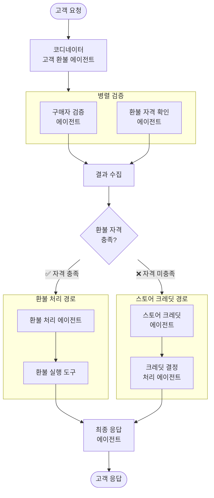
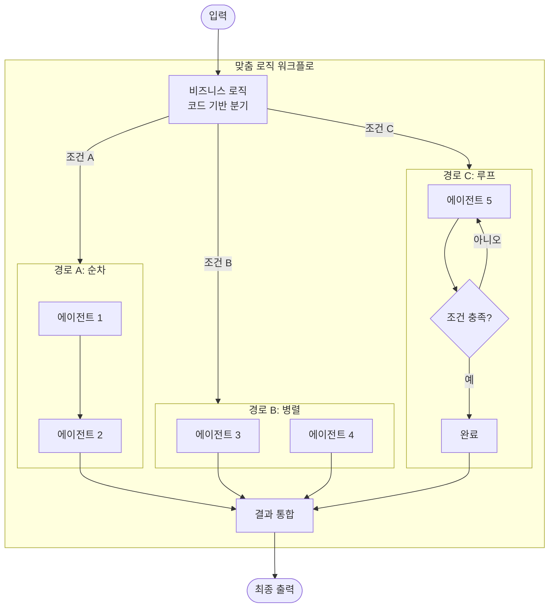
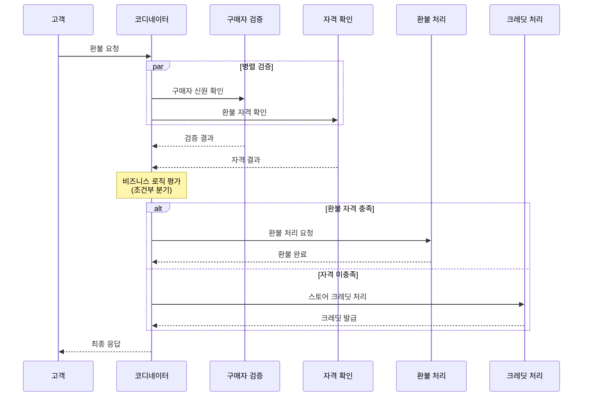

# 맞춤 로직 패턴 (Custom Logic Pattern)

## 개요

맞춤 로직 패턴은 조건문 등 코드를 사용하여 여러 분기 경로가 있는 복잡한 워크플로를 구현하는 패턴입니다. 표준 패턴으로는 표현하기 어려운 고유한 비즈니스 로직을 직접 설계할 때 사용합니다.

**핵심 특징:**

- 코드 기반의 조건 분기 로직으로 세밀한 실행 제어
- 여러 표준 패턴(순차, 병렬, 루프)의 혼합 사용
- 미리 정의된 규칙과 모델 추론의 결합
- 최대 유연성 제공

**적합한 상황:**

- 선형 시퀀스를 넘어선 복잡한 분기 로직이 필요할 때
- 표준 패턴 템플릿에 맞지 않는 워크플로
- 비즈니스 규칙에 따른 조건부 처리가 필요한 경우
- 최대한의 실행 제어가 필요할 때

---

## 아키텍처

### 고객 환불 프로세스 예시

### 일반화된 맞춤 로직 흐름

### 작동 흐름

---

## 사용 예시

### 1. 환불 프로세스 자동화

위의 아키텍처 다이어그램과 같이:

- 구매자 검증과 환불 자격 확인을 **병렬**로 실행
- 결과에 따라 환불 경로 또는 스토어 크레딧 경로로 **조건 분기**
- 각 경로 내에서 **순차적** 처리

### 2. 보험 청구 처리

복잡한 규칙 기반 의사결정:

- **병렬**: 서류 유효성 검증 + 보험 가입 이력 확인 + 사고 사실 확인
- **조건 분기**: 청구 금액에 따라 자동 승인 / 전문가 심사 / 현장 조사
- **루프**: 추가 서류 요청 시 서류 제출까지 반복

### 3. 채용 프로세스 자동화

다단계 채용 파이프라인:

- **순차**: 이력서 스크리닝 → 기술 평가 → 면접 일정 조율
- **조건 분기**: 경력 수준에 따라 주니어/시니어 평가 트랙 분리
- **병렬**: 레퍼런스 체크 + 백그라운드 체크 동시 실행

---

## 장단점

| 구분    | 내용                        |
|-------|---------------------------|
| ✅ 장점  | 세밀한 실행 제어로 복잡한 비즈니스 로직 구현 |
| ✅ 장점  | 여러 표준 패턴의 자유로운 혼합         |
| ✅ 장점  | 고유한 요구사항에 맞춤 최적화          |
| ⚠️ 단점 | 개발 및 유지보수 복잡성 증가          |
| ⚠️ 단점 | 오류 발생 가능성 높음              |
| ⚠️ 단점 | 표준 패턴 대비 개발 노력 증가         |
| ⚠️ 단점 | 워크플로 변경 시 코드 수정 필요        |

---

## 설계 고려사항

- **표준 패턴 우선 검토**: 맞춤 로직 전에 표준 패턴으로 해결 가능한지 확인
- **모듈화**: 각 분기 경로를 독립적 모듈로 설계하여 유지보수성 확보
- **에러 핸들링**: 모든 분기 경로에 대한 예외 처리 정의
- **테스트 전략**: 모든 분기 조합에 대한 테스트 케이스 작성

---

## 참고 자료

- [Google Cloud: Agentic AI Design Patterns](https://docs.cloud.google.com/architecture/choose-design-pattern-agentic-ai-system)
- [Google ADK: Custom Agents](https://google.github.io/adk-docs/agents/custom-agents/)
