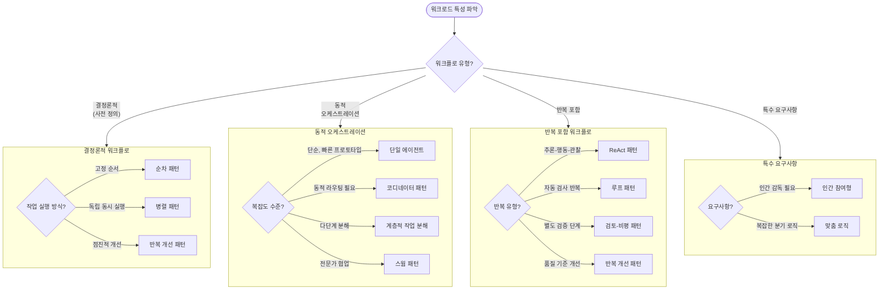

# 에이전틱 AI 시스템 설계 패턴

[Google Cloud - Choose a design pattern for an agentic AI system](https://docs.cloud.google.com/architecture/choose-design-pattern-agentic-ai-system)
문서를 기반으로 정리한 에이전틱 AI 시스템의 설계 패턴입니다.

---

## 패턴 개요

### 단일 에이전트 시스템

| 패턴                                            | 핵심 개념                        | 적합한 상황                   |
|-----------------------------------------------|------------------------------|--------------------------|
| [단일 에이전트](/design-pattern/01-single-agent.md) | AI 모델 + 도구 + 시스템 프롬프트로 자율 처리 | 빠른 프로토타입, 도구 수가 적은 단순 작업 |

### 멀티 에이전트 시스템

| 패턴                                                     | 핵심 개념                         | 적합한 상황                    |
|--------------------------------------------------------|-------------------------------|---------------------------|
| [순차 패턴](/design-pattern/02-sequential.md)              | 에이전트 출력이 다음 에이전트의 입력으로 전달     | 고정된 작업 순서, 모델 오케스트레이션 불필요 |
| [병렬 패턴](/design-pattern/03-parallel.md)                | 여러 에이전트가 동시에 독립적으로 작업 수행      | 독립 작업의 동시 처리, 지연 시간 단축    |
| [루프 패턴](/design-pattern/04-loop.md)                    | 종료 조건까지 에이전트 시퀀스 반복 실행        | 자동 검사, 반복 처리가 필요한 작업      |
| [검토-비평 패턴](/design-pattern/05-review-critique.md)      | 생성 에이전트 + 비평 에이전트의 검증 루프      | 엄격한 품질 기준, 보안 검증 필요       |
| [반복 개선 패턴](/design-pattern/06-iterative-refinement.md) | 다중 사이클에 걸친 점진적 결과물 개선         | 코드 작성, 문서 초안, 창작 글쓰기      |
| [코디네이터 패턴](/design-pattern/07-coordinator.md)          | 중앙 에이전트가 동적으로 작업 분배           | 다양한 입력의 동적 라우팅, 적응형 워크플로  |
| [계층적 작업 분해 패턴](/design-pattern/08-hierarchical.md)     | 다단계 계층으로 복잡한 작업을 점진적 분해       | 광범위한 계획, 다단계 추론 필요        |
| [스웜 패턴](/design-pattern/09-swarm.md)                   | 에이전트 간 all-to-all 협업으로 솔루션 개선 | 다중 전문가 토론, 창의적 솔루션        |

### 반복 포함 워크플로

| 패턴                                      | 핵심 개념           | 적합한 상황             |
|-----------------------------------------|-----------------|--------------------|
| [ReAct 패턴](/design-pattern/10-react.md) | 추론-행동-관찰의 반복 루프 | 지속적 계획과 적응이 필요한 작업 |

### 특수 요구사항 패턴

| 패턴                                                   | 핵심 개념                    | 적합한 상황               |
|------------------------------------------------------|--------------------------|----------------------|
| [인간 참여형 패턴](/design-pattern/11-human-in-the-loop.md) | 워크플로에 인간 개입 체크포인트 통합     | 중요 결정, 안전, 주관적 판단 필요 |
| [맞춤 로직 패턴](/design-pattern/12-custom-logic.md)       | 코드 기반 조건 분기로 복잡한 워크플로 구현 | 복잡한 분기 로직, 최대 제어 필요  |

---

## 패턴 선택 가이드

### 요구사항 평가 체크리스트

패턴을 선택하기 전에 다음 질문을 고려하세요:

1. **작업 특성**: 사전 정의된 워크플로인가, 개방형 작업인가?
2. **지연 시간**: 빠른 응답이 중요한가, 품질이 우선인가?
3. **비용**: 다중 모델 호출에 대한 예산이 있는가?
4. **인간 개입**: 중요 결정에 사람의 승인이 필요한가?

> **참고**: 워크로드가 예측 가능하고, 구조화되어 있으며, 단일 모델 호출로 실행 가능하다면 에이전트가 아닌 솔루션(요약, 번역, 분류 등)을 먼저 고려하세요.

### 워크플로 유형별 선택

> **참고**: 반복 개선 패턴은 결정론적 워크플로와 반복 포함 워크플로 양쪽에서 활용 가능합니다. 사전 정의된 개선 루프로 사용하면 결정론적, 품질 기준에 따른 동적 반복으로 사용하면 반복 포함 워크플로에
> 해당합니다.

---

## 복잡도 및 비용 비교

> 아래 표는 Google Cloud 원문의 각 패턴별 설명을 바탕으로 재구성한 요약입니다.

| 패턴        | 복잡도   | 비용    | 지연 시간  | 자율성   |
|-----------|-------|-------|--------|-------|
| 순차 패턴     | 낮음    | 낮음    | 짧음     | 낮음    |
| 병렬 패턴     | 낮음    | 중간    | 짧음     | 낮음    |
| 루프 패턴     | 낮음    | 변동    | 변동     | 낮음    |
| 단일 에이전트   | 중간    | 낮음    | 변동     | 중간    |
| 검토-비평     | 중간    | 중간    | 중간     | 중간    |
| 반복 개선     | 중간    | 중간    | 중간     | 중간    |
| 코디네이터     | 높음    | 높음    | 중간     | 높음    |
| ReAct     | 높음    | 중간    | 긴 편    | 높음    |
| 계층적 작업 분해 | 매우 높음 | 높음    | 긴 편    | 높음    |
| 스웜        | 매우 높음 | 매우 높음 | 매우 긴 편 | 매우 높음 |

---

## 참고 자료

- [Google Cloud: Choose a design pattern for an agentic AI system](https://docs.cloud.google.com/architecture/choose-design-pattern-agentic-ai-system)
- [Google Cloud: Choose your agentic AI architecture components](https://docs.cloud.google.com/architecture/choose-agentic-ai-architecture-components)
- [Google ADK Documentation](https://google.github.io/adk-docs/)
- [Developer's guide to multi-agent patterns in ADK](https://developers.googleblog.com/developers-guide-to-multi-agent-patterns-in-adk/)
