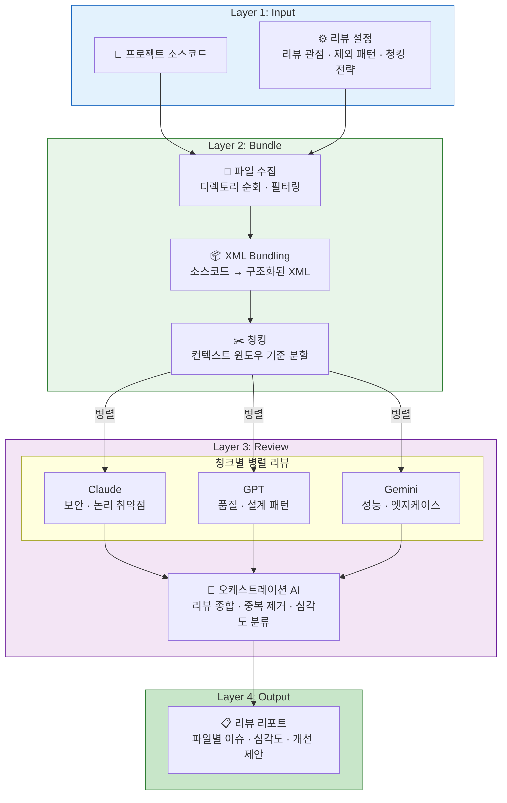
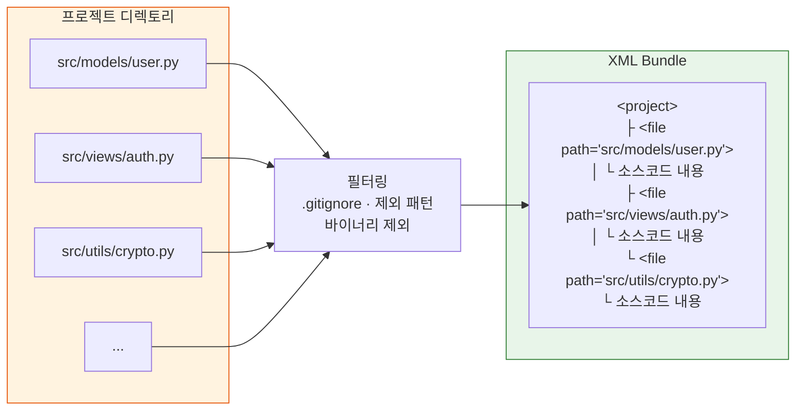
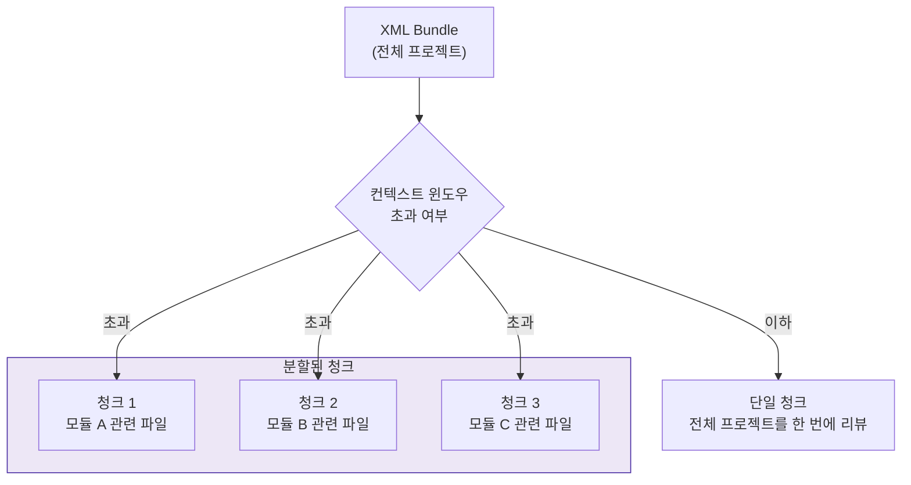
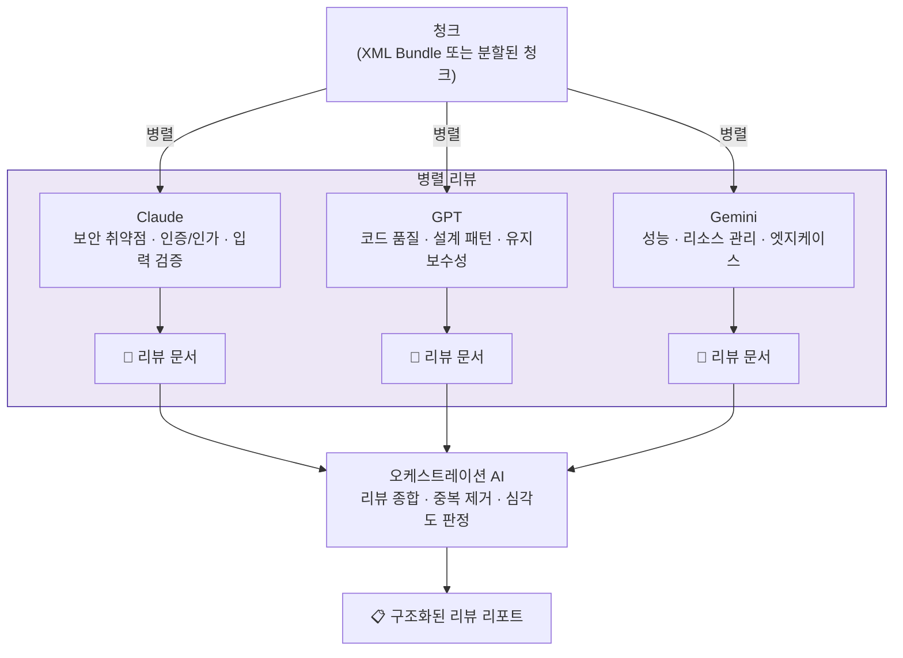
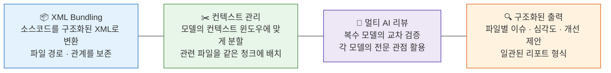

# 프로젝트 코드 리뷰 워크플로우

## 아키텍처

```mermaid
graph TB
    subgraph L1["Layer 1: Input"]
        SRC["📁 프로젝트 소스코드"]
        CFG["⚙️ 리뷰 설정<br/>리뷰 관점 · 제외 패턴 · 청킹 전략"]
    end

    subgraph L2["Layer 2: Bundle"]
        COLLECT["📂 파일 수집<br/>디렉토리 순회 · 필터링"]
        XML["📦 XML Bundling<br/>소스코드 → 구조화된 XML"]
        CHUNK["✂️ 청킹<br/>컨텍스트 윈도우 기준 분할"]
    end

    subgraph L3["Layer 3: Review"]
        subgraph REVIEW_UNIT["청크별 병렬 리뷰"]
            R1["Claude<br/>보안 · 논리 취약점"]
            R2["GPT<br/>품질 · 설계 패턴"]
            R3["Gemini<br/>성능 · 엣지케이스"]
        end
        AGG["🤖 오케스트레이션 AI<br/>리뷰 종합 · 중복 제거 · 심각도 분류"]
    end

    subgraph L4["Layer 4: Output"]
        REPORT["📋 리뷰 리포트<br/>파일별 이슈 · 심각도 · 개선 제안"]
    end

    SRC & CFG --> COLLECT
    COLLECT --> XML
    XML --> CHUNK
    CHUNK -->|" 병렬 "| R1 & R2 & R3
    R1 & R2 & R3 --> AGG
    AGG --> REPORT

    style L1 fill:#e3f2fd,stroke:#1565C0
    style L2 fill:#e8f5e9,stroke:#2E7D32
    style L3 fill:#f3e5f5,stroke:#6A1B9A
    style L4 fill:#c8e6c9,stroke:#2E7D32
```

## XML Bundling

```mermaid
graph LR
    subgraph Source["프로젝트 디렉토리"]
        F1["src/models/user.py"]
        F2["src/views/auth.py"]
        F3["src/utils/crypto.py"]
        FN["..."]
    end

    FILTER["필터링<br/>.gitignore · 제외 패턴<br/>바이너리 제외"]

    subgraph Bundle["XML Bundle"]
        XML_DOC["&lt;project&gt;<br/>├ &lt;file path='src/models/user.py'&gt;<br/>│ └ 소스코드 내용<br/>├ &lt;file path='src/views/auth.py'&gt;<br/>│ └ 소스코드 내용<br/>└ &lt;file path='src/utils/crypto.py'&gt;<br/>  └ 소스코드 내용"]
    end

    F1 & F2 & F3 & FN --> FILTER --> XML_DOC

    style Source fill:#fff3e0,stroke:#E65100
    style Bundle fill:#e8f5e9,stroke:#2E7D32
```

## 청킹 전략

```mermaid
graph TD
    XML["XML Bundle<br/>(전체 프로젝트)"]

    CHECK{컨텍스트 윈도우<br/>초과 여부}

    SINGLE["단일 청크<br/>전체 프로젝트를 한 번에 리뷰"]

    subgraph CHUNKS["분할된 청크"]
        C1["청크 1<br/>모듈 A 관련 파일"]
        C2["청크 2<br/>모듈 B 관련 파일"]
        C3["청크 3<br/>모듈 C 관련 파일"]
    end

    XML --> CHECK
    CHECK -->|" 이하 "| SINGLE
    CHECK -->|" 초과 "| C1 & C2 & C3

    style CHUNKS fill:#ede7f6,stroke:#4527A0
```

## 멀티 AI 리뷰

```mermaid
graph TD
    INPUT["청크<br/>(XML Bundle 또는 분할된 청크)"]

    subgraph Reviewers["병렬 리뷰"]
        R1["Claude<br/>보안 취약점 · 인증/인가 · 입력 검증"] --> D1["📄 리뷰 문서"]
        R2["GPT<br/>코드 품질 · 설계 패턴 · 유지보수성"] --> D2["📄 리뷰 문서"]
        R3["Gemini<br/>성능 · 리소스 관리 · 엣지케이스"] --> D3["📄 리뷰 문서"]
    end

    AGG["오케스트레이션 AI<br/>리뷰 종합 · 중복 제거 · 심각도 판정"]
    INPUT -->|" 병렬 "| R1 & R2 & R3
    D1 & D2 & D3 --> AGG
    AGG --> REPORT["📋 구조화된 리뷰 리포트"]

    style Reviewers fill:#ede7f6,stroke:#4527A0
```

## 설계 원칙

```mermaid
graph LR
    P1["📦 XML Bundling<br/>소스코드를 구조화된 XML로 변환<br/>파일 경로 · 관계를 보존"]
    P2["✂️ 컨텍스트 관리<br/>모델의 컨텍스트 윈도우에 맞게 분할<br/>관련 파일을 같은 청크에 배치"]
    P3["🤖 멀티 AI 리뷰<br/>복수 모델의 교차 검증<br/>각 모델의 전문 관점 활용"]
    P4["🔍 구조화된 출력<br/>파일별 이슈 · 심각도 · 개선 제안<br/>일관된 리포트 형식"]

    P1 --- P2 --- P3 --- P4

    style P1 fill:#e3f2fd,stroke:#1565C0
    style P2 fill:#e8f5e9,stroke:#2E7D32
    style P3 fill:#ede7f6,stroke:#4527A0
    style P4 fill:#fff3e0,stroke:#E65100
```
