# 로컬 개발 자동화 에이전트 아키텍처 Diagram

Stripe Minions의 하네스 중심 설계, Open SWE의 상태/샌드박스 관리, OpenCode Worktree의 격리 실행,
Oh My OpenAgent의 위임·폴백 체계, Agentic Workflow / Design Pattern 문서의 패턴 분류를 바탕으로 재구성한 아키텍처입니다.

핵심은 특정 모델 하나를 고도화하는 것이 아니라, **AI CLI를 역할별 컴포넌트로 배치하고 그 주변에 권한, 게이트, 상태, 재시도, 에스컬레이션을 구조로 강제하는 것**입니다.

> Minions: "Not exotic — just great engineering"
> 로컬 에이전트: 에이전트를 만드는 것이 아니라, **에이전트가 동작하는 환경을 설계**한다.

---

## 전체 아키텍처

7개 레이어를 따라, 여러 AI CLI 세션이 서로 다른 권한으로 협력합니다.
`입력 수집 → 실행 문맥 생성 → 컨텍스트/기획 → 승인 → 격리 실행 → 검증/복구 → 산출물 발행`

- 🧠 = LLM 단계 (창의적 판단)
- 🔒 = Gate 단계 (결정론적 검증 — 우회 불가)
- 👤 = Human 단계 (사람의 판단)
- ❌ → = 실패 경로 (재시도 또는 에스컬레이션)

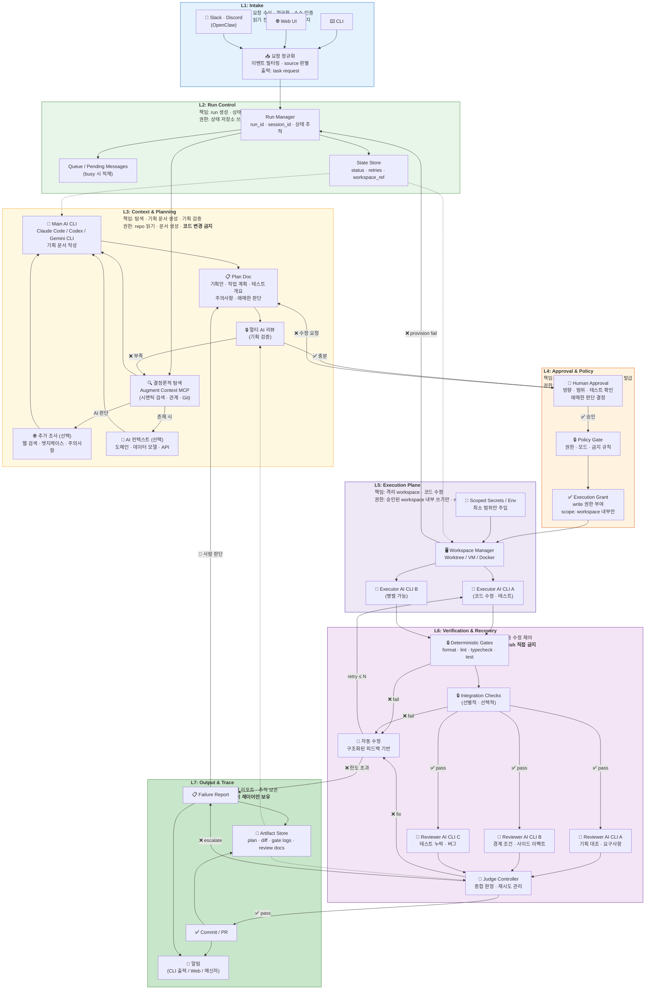

---

## 레이어별 책임 · 입력 · 출력 · 권한 · 실패 전이

| 레이어                            | 책임                               | 주요 입력                                  | 주요 출력                                | 허용 권한                              | 실패 시 전이                                                     | 참조 시스템                                                          |
|--------------------------------|----------------------------------|----------------------------------------|--------------------------------------|------------------------------------|-------------------------------------------------------------|-----------------------------------------------------------------|
| **L1 Intake**                  | 요청 정규화 · source 인증               | CLI/Web/메신저 이벤트                        | task request                         | 읽기 전용                              | 잘못된 입력 → 즉시 거부                                              | Open SWE (webhook 서명), Minions (4 Entry)                        |
| **L2 Run Control**             | run 생성 · 상태 · 큐잉 · 동시 실행 조율      | task request · 현재 상태                   | run context · session state          | 상태 저장소 쓰기                          | busy → queue 적재, 상태 손상 → infra recovery                     | Open SWE (Thread 상태 축적), OMO (Atlas 7-gate)                     |
| **L3 Context & Planning**      | 탐색 · 기획 생성 · 기획 검증               | run context · repo · docs              | context packet · plan doc            | repo 읽기 · 문서 생성 · **코드 변경 금지**     | 컨텍스트 부족 → 재탐색, 리뷰 실패 → 기획 반복                                | Minions (Context Hydration), LangChain (Progressive Disclosure) |
| **L4 Approval & Policy**       | 사람 승인 · 정책 적용 · 권한 토큰 발급         | plan doc · review 결과 · 정책              | execution grant · 승인/반려              | 승인 전 write 금지                      | 반려 → L3 회귀, 정책 위반 → block                                   | Cloudbot (Agent Council), design-pattern (Human-in-the-Loop)    |
| **L5 Execution Plane**         | 격리 workspace · AI CLI 실행 · 코드 수정 | execution grant · plan doc · workspace | diff · workspace logs                | workspace 내부만 쓰기                   | provision 실패 → reprovision, CLI crash → retry               | Minions (Devbox), OpenCode (Worktree 격리)                        |
| **L6 Verification & Recovery** | 결정론적 검증 · 병렬 리뷰 · 자동 수정 루프       | diff · test logs · review artifacts    | gate report · review docs · 판정       | 검증 실행 · review 생성 · **publish 금지** | gate fail → self-fix, review fail → fix loop, 초과 → escalate | Minions (3-Tier), OMO (모델 폴백 + Circuit Breaker)                 |
| **L7 Output & Trace**          | commit/PR · 실패 리포트 · 추적 보존       | 최종 판정 · gate 결과                        | commit · PR · failure report · trace | **publish 권한은 이 레이어만**             | publish 실패 → 재시도/사람 전달                                      | Open SWE (commit_and_open_pr), Minions (PR 템플릿)                 |

---

## AI CLI 역할 분리

AI CLI는 단일 주체가 아니라 **역할별 런타임**입니다.
같은 CLI를 써도 세션과 권한을 분리해야 하며, 오케스트레이터 · 실행자 · 리뷰어가 같은 권한을 공유하면 구조가 무너집니다.
OMO의 9 에이전트 + 역할별 도구 제한, Open SWE의 Thread 기반 세션 격리를 참조합니다.

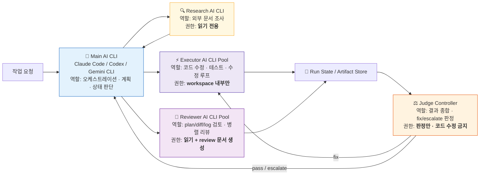

### 역할별 권한 계약

| 역할                   | 권한                                       | 금지 사항                          |
|----------------------|------------------------------------------|--------------------------------|
| **Main AI CLI**      | 요청 해석, 기획 문서 작성, 워크플로우 분기 결정             | 승인 전 코드 수정, 직접 publish         |
| **Research AI CLI**  | 문서/레퍼런스 탐색, 읽기 전용 분석                     | 코드 수정, commit, PR              |
| **Executor AI CLI**  | 승인된 workspace 안에서 코드 수정, 테스트 실행          | main repo 직접 쓰기, 승인 없는 publish |
| **Reviewer AI CLI**  | plan doc · diff · gate logs 검토, 리뷰 문서 생성 | 코드 수정, commit, PR              |
| **Judge Controller** | pass/fix/escalate 판정, 재시도 카운트 관리         | 코드 직접 수정                       |

---

## 시퀀스 흐름

액터 간 시간 순서의 상호작용입니다.
7개 레이어를 통과하는 전체 실행 흐름을 보여줍니다.

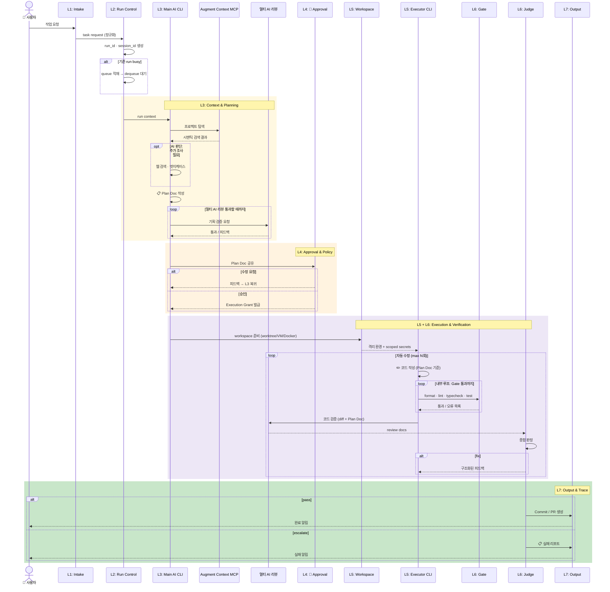

---

## 상태 전이와 실패 전이

`요청 수신`에서 `PR 발행` 또는 `실패 보고`까지의 핵심 경로와, 각 실패가 어디로 되돌아가는지를 보여줍니다.

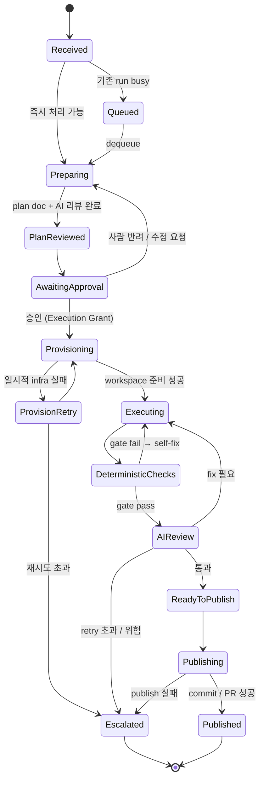

---

## 오류 분류와 처리 정책

| 오류 클래스             | 예시                              | 감지 레이어          | 기본 처리                       | 최종 전이                    |
|--------------------|---------------------------------|-----------------|-----------------------------|--------------------------|
| **입력 오류**          | source 포맷 불일치, 필수 정보 누락         | L1 Intake       | 즉시 reject 또는 보완 요청          | 종료 또는 Received           |
| **상태 충돌**          | 기존 run busy, 중복 요청              | L2 Run Control  | queue 적재 또는 interrupt       | Queued                   |
| **컨텍스트 부족**        | 관련 파일 식별 실패, 문서 부족              | L3 Context      | 재탐색, 추가 조사                  | Preparing                |
| **기획 리뷰 실패**       | 기획 논리 부족, 완성도 미달                | L3 멀티 AI 리뷰     | 피드백 반영 후 재작성                | Preparing                |
| **승인 실패**          | 범위 과다, plan 부실                  | L4 Approval     | plan 수정 후 재제출               | Preparing                |
| **정책 위반**          | 승인 없는 publish, 금지 경로 수정         | L4 Policy Gate  | 즉시 block                    | Escalated                |
| **workspace 실패**   | worktree 생성 실패, sandbox boot 실패 | L5 Execution    | infra retry                 | Provisioning / Escalated |
| **CLI runtime 오류** | 프로세스 crash, JSON 파싱 실패          | L5/L6           | same-run retry, CLI 재시작     | Executing / Escalated    |
| **Gate 실패**        | lint/test/typecheck 실패          | L6 Verification | self-fix loop (내부 루프)       | Executing                |
| **리뷰 실패**          | 요구사항 누락, 회귀 위험                  | L6 Verification | structured fix loop (외부 루프) | Executing / Escalated    |

---

## 검증 · 리뷰 · 자동 수정 파이프라인 (L6)

핵심은 **빠른 내부 루프**(결정론적 Gate)와 **비싼 외부 루프**(멀티 AI 리뷰)를 분리하는 것입니다.
Minions의 3-Tier(Local Lint → CI → Self-Fix)와 OMO의 다층 회복을 조합합니다.

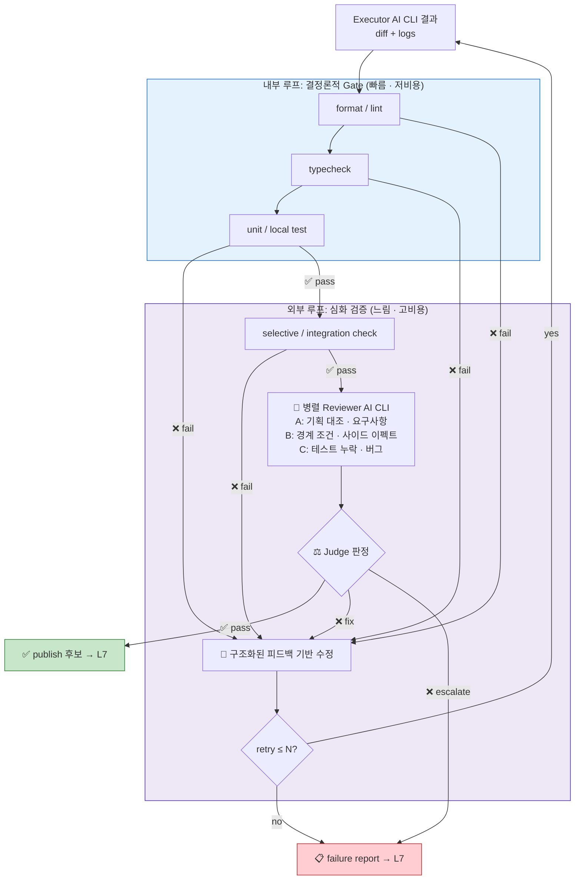

### 재시도 규칙

| 실패 유형                       | 처리 방식                       | 카운트                   |
|-----------------------------|-----------------------------|-----------------------|
| lint / type / local test 실패 | executor 즉시 수정 후 재실행        | 내부 루프 (별도 카운트 또는 저비용) |
| integration / selective 실패  | self-fix 루프 진입              | 외부 retry 카운트          |
| AI review 실패                | structured feedback 기반 수정   | 외부 retry 카운트          |
| reviewer 간 불일치              | judge가 escalate 또는 보수적 fail | retry 미소비 또는 1회 소모    |
| retry 한도 초과                 | failure report 작성 → 사람 전달   | 종료                    |

---

## 멀티 AI 리뷰 모듈 (공유 컴포넌트)

L3(기획 검증)과 L6(코드 검증)에서 **동일 모듈을 재사용**합니다.
Minions(단일 AI Review)와 달리 복수 모델의 교차 검증으로 사각지대를 보완합니다.

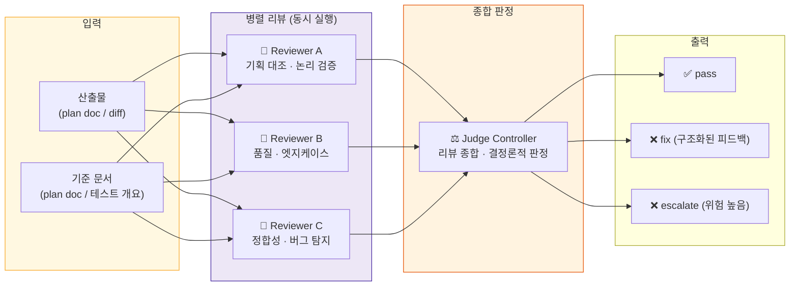

---

## 실행 경계와 권한 모델

workspace 유형이 **실행 권한과 실패 영향 범위**를 결정합니다.
`workspace boundary = permission boundary` 원칙입니다.

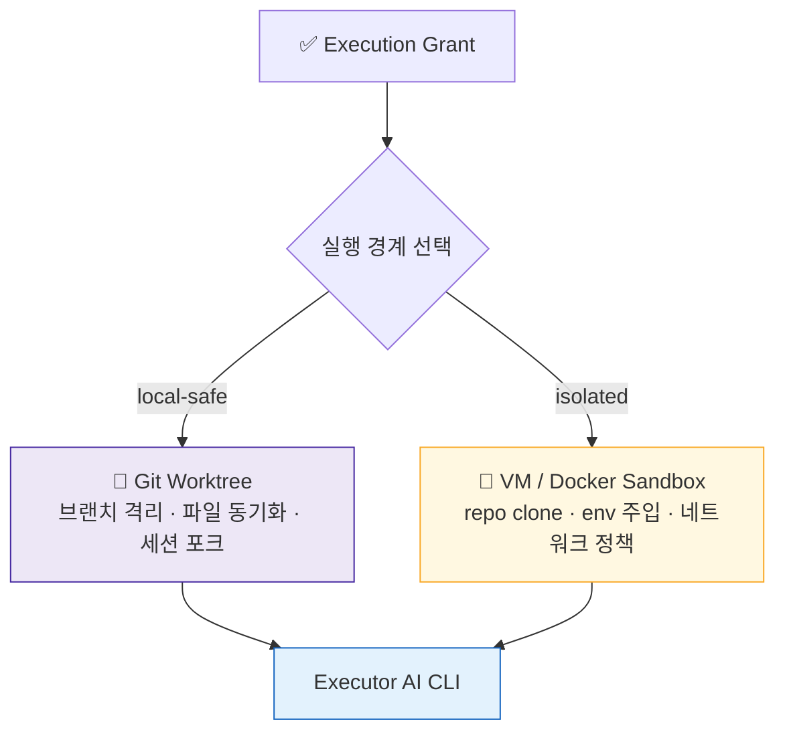

### 실행 경계별 권한 매트릭스

| 경계                    | 읽기                        | 쓰기               | 네트워크            | 비밀정보          | Git publish |
|-----------------------|---------------------------|------------------|-----------------|---------------|-------------|
| **L3 Prepare / Plan** | repo · docs · Git history | plan doc만        | 외부 문서 조회 가능     | 불필요           | 금지          |
| **L6 Review**         | plan doc · diff · logs    | review doc만      | 모델 API 호출 수준    | 불필요           | 금지          |
| **L5 Local Worktree** | worktree 내부 전체            | worktree 내부만     | 프로젝트 정책에 따름     | 최소 env        | 금지          |
| **L5 VM / Docker**    | sandbox 내부 repo           | sandbox 내부만      | 차단 또는 allowlist | scoped secret | 금지          |
| **L7 Output**         | final diff · gate report  | commit · PR body | Git hosting 접근  | publish 최소 토큰 | **허용**      |

---

## Plan Doc 구조

Plan Doc은 시스템의 핵심 산출물이자 계층 간 계약(contract)입니다.

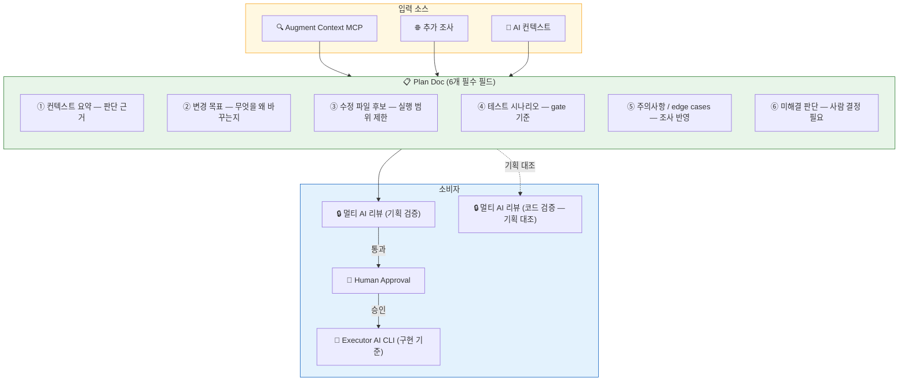

---

## 핵심 산출물 데이터 흐름

단계별 산출물을 생산하고 다음 레이어가 소비하는 구조입니다.

```mermaid
graph LR
    A1["Task Request"]
    A2["Run Context<br/>source · repo · session"]
    A3["Context Packet<br/>관련 파일 · docs · Git"]
    A4["Plan Doc<br/>범위 · 수정 계획 · 테스트"]
    A5["Execution Grant<br/>approve · scope"]
    A6["Workspace Handle<br/>worktree / sandbox id"]
    A7["Patch / Diff"]
    A8["Gate Report<br/>lint · test · typecheck"]
    A9["Review Pack<br/>review docs · judge result"]
    A10["Commit / PR"]
    A11["Failure Report"]
    A1 --> A2 --> A3 --> A4 --> A5 --> A6 --> A7 --> A8 --> A9
    A9 -->|" pass "| A10
    A9 -->|" escalate "| A11
    style A4 fill: #e8f5e9, stroke: #2E7D32
    style A6 fill: #ede7f6, stroke: #4527A0
    style A8 fill: #fff8e1, stroke: #F9A825
    style A9 fill: #fff3e0, stroke: #E65100
    style A10 fill: #c8e6c9, stroke: #2E7D32
    style A11 fill: #ffcdd2, stroke: #C62828
```

---

## 안전성 모델 비교

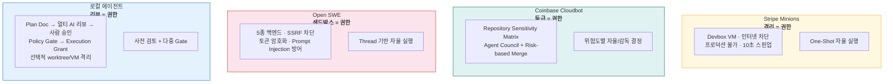

---

## 피드백 루프 비교

```mermaid
graph TB
    subgraph Minions_FB["Minions: 비용 기반 3-Tier"]
        direction LR
        MT1["Tier 1: Local Lint<br/>< 5초"]
        MT2["Tier 2: CI Selective<br/>100만+ 중 선별"]
        MT3["Tier 3: Self-Fix<br/>max 2회"]
        MT1 --> MT2 --> MT3
    end

    subgraph OMO_FB["OMO: 다층 회복 4-Tier"]
        direction LR
        OT1["Tier 1: Hook 방어<br/>Before/After 46개"]
        OT2["Tier 2: 모델 폴백<br/>3-4개 체인"]
        OT3["Tier 3: Boulder<br/>지수 백오프"]
        OT4["Tier 4: Circuit Breaker<br/>무한 루프 강제 정지"]
        OT1 --> OT2 --> OT3 --> OT4
    end

    subgraph Local_FB["로컬 에이전트: 결정론적 → LLM 2-Tier"]
        direction LR
        LT1["내부: Gate<br/>format · lint · type · test"]
        LT2["외부: 멀티 AI 리뷰<br/>교차 검증 + Judge 판정"]
        LT3["자동 수정<br/>max N회 → escalate"]
        LT1 --> LT2 --> LT3
    end

    style Minions_FB fill: #fff8e1, stroke: #F9A825
    style OMO_FB fill: #fce4ec, stroke: #C62828
    style Local_FB fill: #e3f2fd, stroke: #1565C0
```

---

## Stripe Minions 계층 대응

| 구분         | Stripe Minions                  | 로컬 에이전트                               | 핵심 차이                        |
|------------|---------------------------------|---------------------------------------|------------------------------|
| 레이어 수      | 6계층                             | 7계층                                   | Run Control · Policy Gate 분리 |
| 안전성        | VM 격리 (격리 = 권한)                 | 리뷰 + Policy Gate (리뷰 = 권한)            | 격리 vs 검토                     |
| 에이전트 코어    | Goose Fork (커스텀 단일)             | AI CLI 역할 분리 (Main/Exec/Review/Judge) | 단일 vs 다역할                    |
| 컨텍스트       | Toolshed MCP (400+ → 15개)       | Augment Context MCP (시맨틱)             | 큐레이션 vs 시맨틱 검색               |
| 코드 검증      | Review (단일 AI)                  | 멀티 AI 리뷰 (병렬 교차 검증)                   | 단일 vs 교차                     |
| 피드백 루프     | 3-Tier (Lint → CI → Self-Fix 2) | 2-Tier (Gate → Review+Fix N)          | 비용 계층 vs Gate 순서             |
| publish 권한 | Agent Core가 직접                  | L7 Output만 보유                         | 분산 vs 분리                     |
| 상태 관리      | 없음 (One-Shot)                   | Run Control (큐 · 상태 · 세션)             | 없음 vs 명시                     |

---

## 적용 패턴 매핑

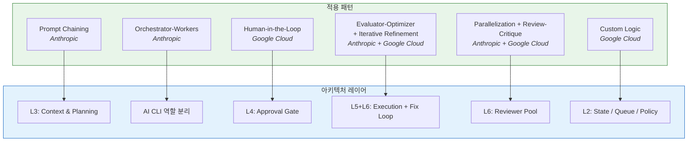

---

## 에이전트 시스템 포지셔닝

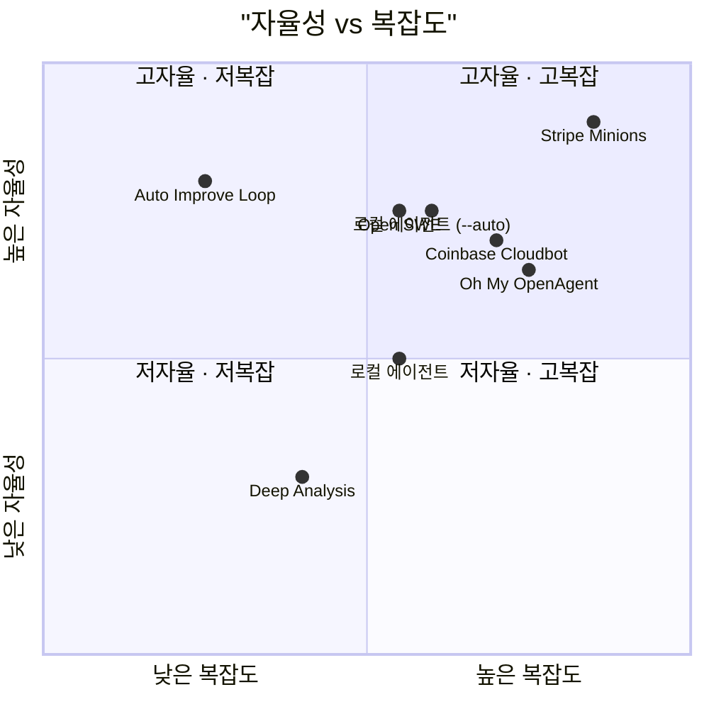

---

## 설계 원칙

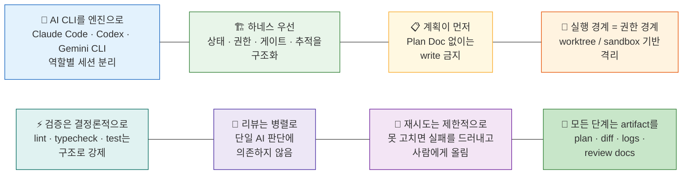
