# 로컬 개발 자동화 에이전트 아키텍처 다이어그램

이 문서는 초안 `00-diagram.md`와 보강본 `00-diagram-claude.md`, `00-diagram-codex.md`를 종합해 정리한 최종 구조입니다.
핵심 참조축은 `Stripe Minions`의 하네스 우선 설계, `Open SWE`의 run/state/sandbox 구조, `OpenCode Worktree`의 실행 경계, `Oh My OpenAgent`의 역할
분리와 복구 체계, `Agentic Workflow`와 `Design Pattern`의 패턴 분류입니다.

핵심 원칙은 단순합니다.
**AI CLI를 역할별 런타임으로 분해하고, 그 주변에 상태, 권한, 게이트, 재시도, 승인, 발행을 구조로 강제해야 운영 가능한 개발 자동화 시스템이 됩니다.**

---

## 1. 전체 시스템 구조

이 시스템은 단일 AI가 처음부터 끝까지 직접 처리하는 구조가 아닙니다.
`입력 수집 → 실행 문맥 생성 → 컨텍스트/기획 → 승인 → 격리 실행 → 검증/복구 → 산출물 발행`의 7개 레이어를 따라, 여러 AI CLI 세션이 서로 다른 권한으로 협력합니다.

- `🧠` = LLM 판단 단계
- `🔒` = 결정론적 게이트
- `👤` = 사람 승인 또는 개입

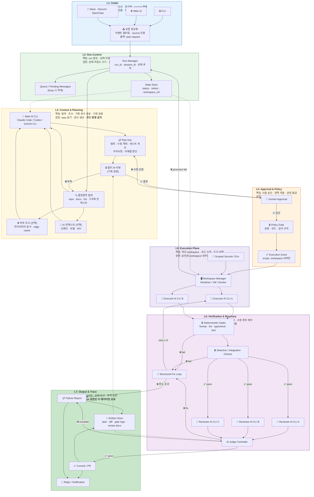

---

## 2. 레이어별 운영 계약

아래 표가 이 아키텍처의 운영 계약입니다.
각 레이어는 무엇을 받아서 무엇을 내보내는지, 어디까지 권한을 가지는지, 실패하면 어디로 되돌아가는지가 명시되어야 합니다.

| 레이어                            | 책임                                | 주요 입력                                       | 주요 출력                                              | 허용 권한                                       | 실패 시 전이                                                         |
|--------------------------------|-----------------------------------|---------------------------------------------|----------------------------------------------------|---------------------------------------------|-----------------------------------------------------------------|
| **L1 Intake**                  | 요청 정규화, source별 필터링, 실행 진입점 통합    | CLI/Web/메신저 이벤트                             | `task request`                                     | 읽기 전용, 저장소 쓰기 금지                            | 잘못된 입력은 즉시 거부 또는 보완 요청                                          |
| **L2 Run Control**             | run 생성, 상태 저장, 큐잉, 동시 실행 조율       | `task request`, 현재 run 상태                   | `run context`, `session state`, queue item         | 상태 저장소 쓰기, 실행 plane 직접 쓰기 금지                | busy면 queue 적재, 상태 손상 시 infra recovery                          |
| **L3 Context & Planning**      | 코드/문서/Git 탐색, 계획 생성, 계획 리뷰 조립     | `run context`, repo 읽기, docs, 구조화 컨텍스트      | `context packet`, `plan doc`, `plan review pack`   | repo 읽기, 문서 생성 가능, 코드 변경 금지                 | 컨텍스트 부족 시 재탐색, 기획 리뷰 실패 시 준비 단계 반복                              |
| **L4 Approval & Policy**       | 사람 승인, 실행 모드 결정, 권한 토큰 발급         | `plan doc`, review 결과, 정책 규칙                | `execution grant`, 승인/반려 결정                        | 승인 전 publish/write 금지                       | 반려 시 L3로 회귀, 정책 위반 시 block                                      |
| **L5 Execution Plane**         | 격리 workspace 준비, AI CLI 실행, 코드 수정 | `execution grant`, `plan doc`, workspace 설정 | `diff`, `workspace logs`, intermediate patch       | 승인된 workspace 내부 쓰기만 허용                     | workspace 생성 실패 시 reprovision, CLI crash 시 runtime retry        |
| **L6 Verification & Recovery** | 결정론적 검증, 병렬 리뷰, 자동 수정 루프 제어       | `diff`, 테스트 로그, review artifacts            | `gate report`, `review docs`, pass/fix/escalate 판정 | 검증 도구 실행, review artifact 생성, publish 직접 금지 | gate fail은 self-fix, review fail은 fix loop, retry 초과 시 escalate |
| **L7 Output & Trace**          | commit/PR 생성, 실패 리포트 작성, 알림/추적 보존 | 최종 판정, gate 통과 결과, review 결과                | `commit`, `PR`, `failure report`, trace artifacts  | publish 권한은 이 레이어만 보유                       | publish 실패 시 재시도 또는 사람에게 전달                                     |

---

## 3. AI CLI 역할 분리

AI CLI는 단일 주체가 아니라 역할별 런타임입니다.
같은 종류의 CLI를 써도 세션과 권한을 분리해야 하며, `메인 오케스트레이터`, `실행자`, `리뷰어`, `판정자`가 같은 디렉토리와 같은 권한을 공유하면 구조가 무너집니다.

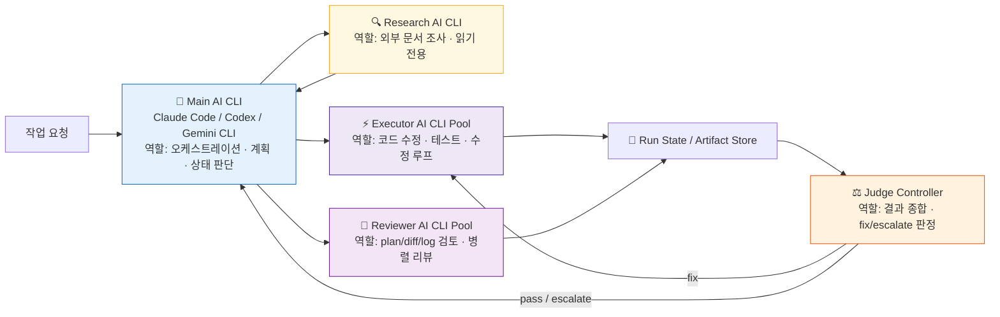

### 역할별 권한 계약

| 역할                   | 권한                                     | 금지 사항                          |
|----------------------|----------------------------------------|--------------------------------|
| **Main AI CLI**      | 요청 해석, 기획 문서 작성, 워크플로우 분기 결정           | 승인 전 코드 수정, 직접 publish         |
| **Research AI CLI**  | 문서/레퍼런스 탐색, 읽기 전용 분석                   | 코드 수정, commit, PR              |
| **Executor AI CLI**  | 승인된 workspace 안에서 코드 수정, 테스트 실행        | main repo 직접 쓰기, 승인 없는 publish |
| **Reviewer AI CLI**  | plan doc, diff, gate logs 검토, 리뷰 문서 생성 | 코드 수정, commit, PR              |
| **Judge Controller** | pass/fix/escalate 판정, 재시도 카운트 관리       | 코드 직접 수정                       |

---

## 4. 시퀀스 흐름

정적 구조와 별개로, 실제 런타임에서는 아래 순서로 상호작용이 진행됩니다.
핵심은 `Main AI CLI`가 전체 흐름을 조율하되, `plan review`, `human approval`, `workspace execution`, `deterministic gate`, `publish`가
명확히 분리된다는 점입니다.

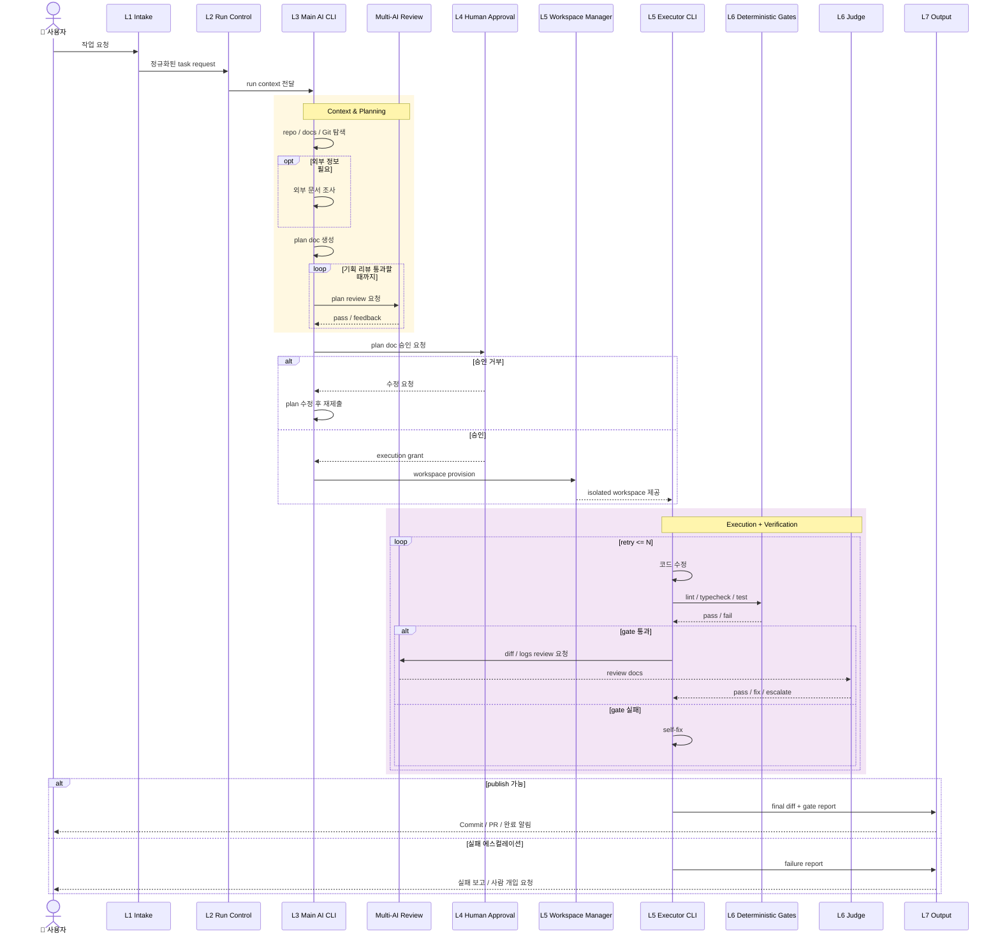

---

## 5. 컨텍스트 수집과 Plan Doc 계약

준비 단계는 `Prompt Chaining`에 가까운 결정론적 파이프라인으로 설계합니다.
핵심은 **코드 쓰기 전에 Plan Doc을 산출물로 고정**하고, plan review와 human approval을 통과해야만 write 권한이 열리도록 하는 것입니다.

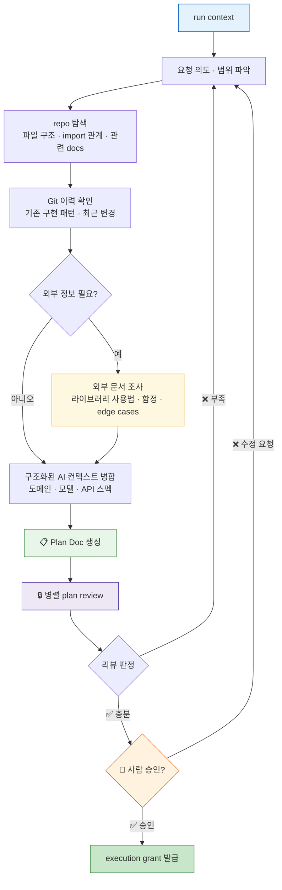

### Plan Doc 필수 필드

| 필드                    | 목적                          |
|-----------------------|-----------------------------|
| **컨텍스트 요약**           | 어떤 코드, 문서, 이력을 근거로 판단했는지 기록 |
| **변경 목표**             | 무엇을 왜 바꾸는지 고정               |
| **수정 파일 후보**          | 실행 범위를 제한하고 리뷰 근거 제공        |
| **테스트 시나리오**          | 실행 단계의 gate 기준 제공           |
| **주의사항 / edge cases** | 외부 조사와 도메인 지식의 반영 여부를 추적    |
| **미해결 판단**            | 사람이 결정해야 할 항목 분리            |

### Plan Doc 소비자

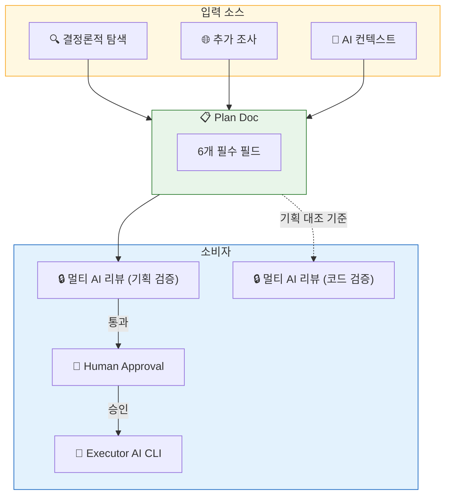

---

## 6. 실행 워크스페이스 · 권한 모델 · 실행 모드

실행 plane의 핵심 원칙은 `workspace boundary = permission boundary`입니다.
초안의 `로컬 / VM / Docker` 선택은 단순한 환경 옵션이 아니라, **실행 권한과 실패 영향 범위를 결정하는 아키텍처 요소**로 취급해야 합니다.

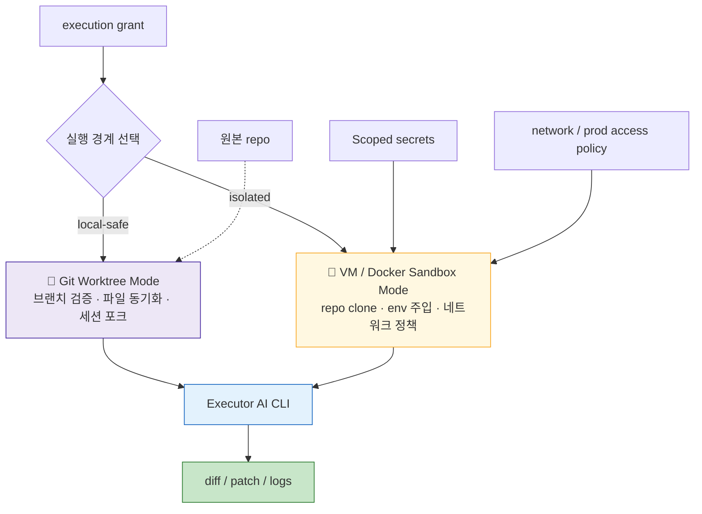

### 실행 경계별 권한 매트릭스

| 경계                       | 읽기                      | 쓰기                       | 네트워크              | 비밀정보           | Git publish |
|--------------------------|-------------------------|--------------------------|-------------------|----------------|-------------|
| **Prepare / Plan**       | repo, docs, Git history | plan doc만                | 외부 문서 조회 가능       | 원칙적으로 불필요      | 금지          |
| **Review**               | plan doc, diff, logs    | review doc만              | 모델 API 호출 수준      | 불필요            | 금지          |
| **Local Worktree**       | worktree 내부 전체          | worktree 내부만             | 프로젝트 정책에 따름       | 최소 범위 env만     | 금지          |
| **Isolated VM / Docker** | sandbox 내부 repo         | sandbox 내부만              | 차단 또는 allowlist   | scoped secret만 | 금지          |
| **Output**               | final diff, gate report | commit metadata, PR body | Git hosting 접근 허용 | publish 최소 토큰  | 허용          |

### 권한 모델의 핵심 규칙

1. **승인 전 write 금지**: plan 단계 AI CLI는 코드 수정 권한이 없습니다.
2. **workspace 밖 쓰기 금지**: executor는 main repo가 아니라 worktree 또는 sandbox 안에서만 수정합니다.
3. **publish 권한 분리**: commit / PR 생성은 output layer만 수행합니다.
4. **secret scope 축소**: execution에 꼭 필요한 환경변수만 주입합니다.
5. **네트워크 정책 외부화**: executor 프롬프트가 아니라 infra 정책으로 제어합니다.

### 실행 모드 선택

실행 모드는 단순 UX 옵션이 아니라, 승인 경로와 권한 범위를 바꾸는 정책 스위치입니다.
기본값은 `human-reviewed`이고, `--auto`는 격리 조건이 충분할 때만 열리는 고위험 모드로 취급합니다.

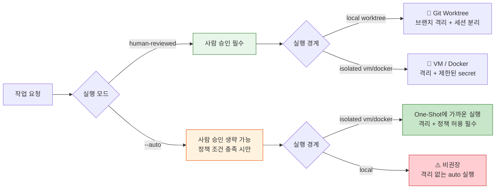

### 운영 관점의 모드 비교

| 모드                 | 승인     | 권장 경계                        | 적합한 상황           | 비고                     |
|--------------------|--------|------------------------------|------------------|------------------------|
| **human-reviewed** | 필수     | local worktree / VM / Docker | 기본 개발 자동화, 팀 환경  | 현재 아키텍처의 기본값           |
| **--auto**         | 조건부 생략 | VM / Docker 우선               | 반복적이고 범위가 명확한 작업 | policy gate에서 별도 허용 필요 |
| **local + auto**   | 생략     | 로컬                           | 특별한 경우 외 비권장     | 격리 부재로 권한 경계가 약함       |

---

## 7. 검증 · 리뷰 · 자동 수정 파이프라인

검증 plane은 `Stripe Minions`의 결정론적 게이트와 `Evaluator-Optimizer` 패턴을 조합한 구조입니다.
핵심은 **빠른 내부 루프**와 **비싼 외부 루프**를 분리하는 것입니다.

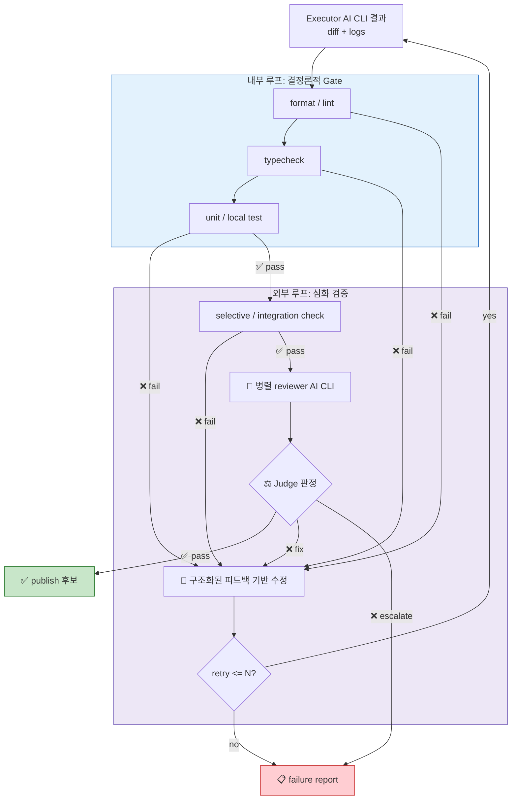

### Reviewer AI CLI의 분업 예시

| 리뷰어            | 입력               | 주 임무                   |
|----------------|------------------|------------------------|
| **Reviewer A** | plan doc + diff  | 계획 대비 요구사항 충족 여부       |
| **Reviewer B** | diff + gate logs | 경계 조건, 사이드 이펙트, 회귀 위험  |
| **Reviewer C** | diff + 테스트 개요    | 테스트 누락, 구현 정합성, 버그 가능성 |

### 재시도 규칙

| 실패 유형                               | 처리 방식                          | 카운트 방식                     |
|-------------------------------------|--------------------------------|----------------------------|
| **lint / type / local test 실패**     | executor가 즉시 수정 후 재실행          | 내부 루프, 별도 카운트 또는 낮은 비용 카운트 |
| **integration / selective test 실패** | self-fix 루프 진입                 | 외부 retry 카운트               |
| **AI review 실패**                    | structured feedback 기반 수정      | 외부 retry 카운트               |
| **reviewer 간 불일치**                  | judge가 escalate 또는 보수적 fail 선택 | retry 미소비 또는 1회 소모         |
| **retry 한도 초과**                     | failure report 작성 후 사람에게 전달    | 종료                         |

---

## 8. 멀티 AI 리뷰 모듈

`plan review`와 `code review`는 서로 다른 시스템이 아니라, 같은 review harness를 다른 입력으로 재사용하는 구조입니다.
이 모듈은 병렬 리뷰어, 결과 집계기, 판정 규칙으로 구성되며 준비 단계와 실행 단계 모두에서 호출됩니다.

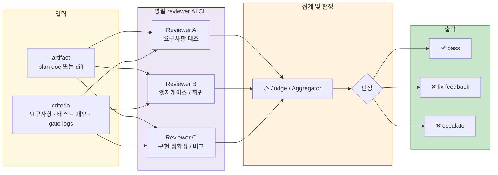

### 단계별 재사용 방식

| 호출 위치          | 입력 artifact        | 판정 기준                  | 실패 시                 |
|----------------|--------------------|------------------------|----------------------|
| **Prepare 단계** | `plan doc`         | 범위 적절성, 실행 가능성, 누락 여부  | 기획 단계 재진입            |
| **Execute 단계** | `diff + gate logs` | 요구사항 충족, 회귀 위험, 테스트 누락 | fix loop 또는 escalate |

---

## 9. 상태 전이 · 오류 처리 · 실패 전이

운영 가능한 시스템은 상태 전이를 명시해야 합니다.
아래 상태도는 `요청 수신`에서 `PR 발행` 또는 `실패 보고`까지의 핵심 경로와, 각 실패가 어디로 되돌아가는지를 보여줍니다.

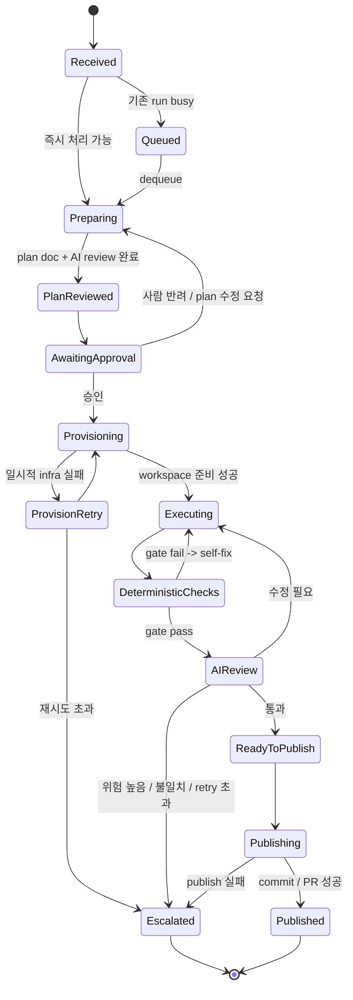

### 오류 분류와 처리 정책

| 오류 클래스                        | 예시                               | 감지 레이어               | 기본 처리                        | 최종 전이                     |
|-------------------------------|----------------------------------|----------------------|------------------------------|---------------------------|
| **입력 오류**                     | source 포맷 불일치, 필수 정보 누락          | Intake               | 즉시 reject 또는 보완 요청           | 종료 또는 Received 재진입        |
| **상태 충돌**                     | 기존 run busy, 중복 요청               | Run Control          | queue 적재 또는 interrupt 정책 적용  | Queued                    |
| **컨텍스트 부족**                   | 관련 파일 식별 실패, 문서 부족               | Context & Planning   | 재탐색, 추가 조사                   | Preparing                 |
| **기획 리뷰 실패**                  | 기획 논리 부족, 누락, 실행 불가              | Context & Planning   | 피드백 반영 후 재작성                 | Preparing                 |
| **승인 실패**                     | 범위 과다, plan 부실                   | Approval             | plan 수정 후 재제출                | Preparing                 |
| **정책 위반**                     | 승인 없는 publish, forbidden path 수정 | Policy Gate          | 즉시 block                     | Escalated                 |
| **workspace provisioning 실패** | worktree 생성 실패, sandbox boot 실패  | Execution Plane      | 제한된 infra retry              | Provisioning 또는 Escalated |
| **CLI runtime 오류**            | 프로세스 crash, JSON 파싱 실패           | Execution / Recovery | same-run retry, 필요 시 CLI 재시작 | Executing 또는 Escalated    |
| **결정론적 gate 실패**              | lint/test/typecheck 실패           | Verification         | self-fix loop                | Executing                 |
| **리뷰 실패**                     | 요구사항 누락, 회귀 위험                   | Verification         | structured fix loop          | Executing 또는 Escalated    |
| **fatal auth / secret 오류**    | publish token 없음, secret 주입 실패   | Output / Execution   | 재시도 최소화, 사람 전달               | Escalated                 |

---

## 10. 핵심 산출물 데이터 흐름

이 시스템은 코드만 만드는 것이 아니라, 단계별 산출물을 생산하고 다음 레이어가 그 산출물을 입력으로 소비하는 구조입니다.
그래서 `입력/출력`이 불분명하면 아키텍처가 아니라 프롬프트 모음이 됩니다.

```mermaid
graph LR
    A1["Task Request"]
    A2["Run Context<br/>source · repo · session"]
    A3["Context Packet<br/>관련 파일 · docs · Git 이력"]
    A4["Plan Doc<br/>범위 · 수정 계획 · 테스트 개요"]
    A5["Approval Decision<br/>approve / reject / restrict"]
    A6["Workspace Handle<br/>worktree path / sandbox id"]
    A7["Patch / Diff"]
    A8["Gate Report<br/>lint · test · typecheck"]
    A9["Review Pack<br/>review docs · judge result"]
    A10["Commit / PR"]
    A11["Failure Report"]
    A1 --> A2 --> A3 --> A4 --> A5 --> A6 --> A7 --> A8 --> A9
    A9 -->|" pass "| A10
    A9 -->|" escalate "| A11
    style A4 fill: #e8f5e9, stroke: #2E7D32
    style A6 fill: #ede7f6, stroke: #4527A0
    style A8 fill: #fff8e1, stroke: #F9A825
    style A9 fill: #fff3e0, stroke: #E65100
    style A10 fill: #c8e6c9, stroke: #2E7D32
    style A11 fill: #ffcdd2, stroke: #C62828
```

### 산출물별 소비자

| 산출물                  | 다음 소비자                       | 용도                  |
|----------------------|------------------------------|---------------------|
| **Context Packet**   | Main AI CLI                  | 계획 생성의 근거           |
| **Plan Doc**         | 사람, reviewer AI, executor AI | 승인 기준이자 구현 계약       |
| **Workspace Handle** | executor AI                  | 수정 가능한 경계 지정        |
| **Gate Report**      | judge, reviewer AI           | 코드 품질의 결정론적 근거      |
| **Review Pack**      | judge, output layer          | publish 가능 여부 최종 판단 |
| **Failure Report**   | 사람                           | 재시도 대신 수동 개입 판단     |

---

## 11. 참조 시스템 비교

여기서부터는 본문 아키텍처의 설계 근거를 비교 관점에서 정리합니다.
핵심 본문은 1-10절이고, 아래 내용은 외부 시스템과의 차이를 통해 왜 이런 구조를 선택했는지 설명하는 보조 섹션입니다.

### 안전성 모델 비교

이 최종 구조는 `격리 기반`, `등급 기반`, `샌드박스 기반`, `리뷰 기반` 모델의 중간지점에 위치합니다.
기본값은 `리뷰 = 권한`이지만, 실행 모드와 실행 경계에 따라 `격리 = 권한` 방향으로 이동할 수 있게 설계합니다.

```mermaid
graph TB
    subgraph M["Stripe Minions<br/><b>격리 = 권한</b>"]
        direction TB
        M1["Devbox VM · 인터넷 차단<br/>프로덕션 접근 불가"]
        M2["One-Shot 자율 실행"]
    end

    subgraph C["Coinbase Cloudbot<br/><b>등급 = 권한</b>"]
        direction TB
        C1["Repository Sensitivity Matrix"]
        C2["위험도별 자율/감독 결정"]
    end

    subgraph S["Open SWE<br/><b>샌드박스 = 권한</b>"]
        direction TB
        S1["Sandbox backend + thread state"]
        S2["thread 기반 자율 실행"]
    end

    subgraph L["로컬 개발 자동화<br/><b>리뷰 = 권한</b>"]
        direction TB
        L1["Plan Doc → 멀티 AI 리뷰 → 사람 승인"]
        L2["Policy Gate → Execution Grant → 선택적 격리"]
    end

    style M fill: #fff8e1, stroke: #F9A825
    style C fill: #e0f2f1, stroke: #00695C
    style S fill: #fce4ec, stroke: #C62828
    style L fill: #e3f2fd, stroke: #1565C0
```

### 피드백 루프 비교

```mermaid
graph TB
    subgraph Minions_FB["Stripe Minions: 비용 기반 3-Tier"]
        direction LR
        MT1["Tier 1: Local Lint"]
        MT2["Tier 2: CI Selective Tests"]
        MT3["Tier 3: Self-Fix"]
        MT1 --> MT2 --> MT3
    end

    subgraph OMO_FB["Oh My OpenAgent: 다층 회복"]
        direction LR
        OT1["Hook 방어"]
        OT2["모델 폴백"]
        OT3["연속 실행 / 백오프"]
        OT4["Circuit Breaker"]
        OT1 --> OT2 --> OT3 --> OT4
    end

    subgraph Local_FB["최종 로컬 구조: 결정론적 → 멀티 리뷰"]
        direction LR
        LT1["내부: Gate<br/>format · lint · type · test"]
        LT2["외부: 멀티 AI 리뷰<br/>교차 검증 + Judge 판정"]
        LT3["자동 수정<br/>max N회 → escalate"]
        LT1 --> LT2 --> LT3
    end

    style Minions_FB fill: #fff8e1, stroke: #F9A825
    style OMO_FB fill: #fce4ec, stroke: #C62828
    style Local_FB fill: #e3f2fd, stroke: #1565C0
```

---

### 참조 시스템 매핑

현재 아키텍처는 단일 원본을 베낀 것이 아니라, 각 시스템에서 유효했던 구조 요소를 선택적으로 결합한 것입니다.
아래 표는 어떤 요소를 어디서 가져왔는지, 그리고 현재 구조에서 무엇으로 치환했는지를 보여줍니다.

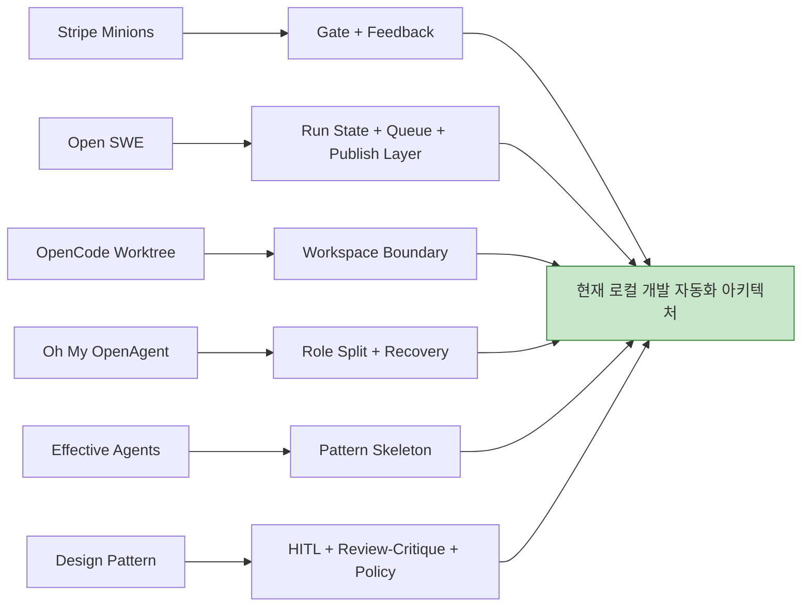

| 참조 시스템                                  | 가져온 핵심 요소                                                  | 현재 문서에서의 대응                                                         |
|-----------------------------------------|------------------------------------------------------------|---------------------------------------------------------------------|
| **Stripe Minions**                      | 결정론적 gate, feedback loop, harness 우선                       | `검증 · 리뷰 · 자동 수정 파이프라인`, `설계 원칙`                                    |
| **Open SWE**                            | run context, queue/state, sandbox 재사용, publish layer 분리    | `전체 시스템 구조`, `레이어별 운영 계약`                                           |
| **OpenCode Worktree**                   | worktree 기반 실행 경계, 세션 분리, 브랜치 격리                           | `실행 워크스페이스 · 권한 모델 · 실행 모드`                                         |
| **Oh My OpenAgent**                     | 역할 분리, 폴백/재시도, 복구 컨트롤러                                     | `AI CLI 역할 분리`, `참조 시스템 비교`, `상태 전이 · 오류 처리 · 실패 전이`                |
| **Agentic Workflow / Effective Agents** | prompt chaining, orchestrator-workers, evaluator-optimizer | `컨텍스트 수집과 Plan Doc 계약`, `적용 패턴 매핑`                                  |
| **Design Pattern**                      | human-in-the-loop, review-critique, custom logic           | `실행 워크스페이스 · 권한 모델 · 실행 모드`, `멀티 AI 리뷰 모듈`, `상태 전이 · 오류 처리 · 실패 전이` |

### Stripe Minions 계층 대응

| 구분         | Stripe Minions    | 최종 로컬 구조                 | 핵심 차이                             |
|------------|-------------------|--------------------------|-----------------------------------|
| 레이어 수      | 6계층               | 7계층                      | Run Control · Approval/Policy를 분리 |
| 안전성        | VM 격리 중심          | 리뷰 + Policy Gate 중심      | 격리 우선 vs 리뷰 우선                    |
| 에이전트 코어    | 단일 Goose 기반       | 역할 분리된 AI CLI 세션         | 단일 코어 vs 다역할                      |
| 컨텍스트       | Toolshed MCP 큐레이션 | repo/docs/Git + 구조화 컨텍스트 | 큐레이션 vs 탐색 조합                     |
| 코드 검증      | 단일 Review         | 멀티 AI 리뷰 + Judge         | 단일 검토 vs 교차 검증                    |
| 피드백 루프     | 3-Tier 비용 계층      | Gate → Review → Fix      | 비용 계층 vs 운영 계약                    |
| publish 권한 | agent core와 가까움   | L7 Output에만 존재           | 분산 vs 분리                          |
| 상태 관리      | one-shot 성향       | run 상태/큐/세션 명시           | 암묵적 vs 명시적                        |

---

## 12. 적용 패턴 매핑

이 아키텍처는 하나의 패턴으로 설명되지 않습니다.
레이어별로 서로 다른 패턴을 조합해야 전체 시스템이 안정적으로 동작합니다.

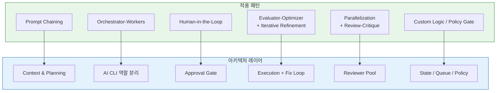

### 레이어별 패턴 해석

| 레이어                        | 주요 패턴                                      | 이유                                |
|----------------------------|--------------------------------------------|-----------------------------------|
| **Context & Planning**     | Prompt Chaining                            | 순차 탐색과 중간 검증이 중요                  |
| **AI CLI 역할 분리**           | Orchestrator-Workers                       | 메인 CLI가 실행/리뷰 CLI를 동적으로 조율        |
| **Approval Gate**          | Human-in-the-Loop                          | 권한 부여가 사람 승인과 결합됨                 |
| **Execution + Fix Loop**   | Evaluator-Optimizer / Iterative Refinement | 생성-검증-수정 반복                       |
| **Reviewer Pool**          | Parallelization / Review-Critique          | 독립 관점 리뷰를 병렬 수행                   |
| **State / Queue / Policy** | Custom Logic                               | 상태 전이, 큐, 권한, 금지 규칙은 코드 기반 제어가 필요 |

---

## 13. 설계 원칙

이 문서에서 제안하는 최종 구조를 한 줄로 줄이면, `AI CLI를 엔진으로 쓰고 하네스를 시스템으로 설계한다`입니다.
초안의 문제의식은 유지하되, 최종본에서는 실제 운영 구조로 바꾸기 위해 원칙을 아래처럼 고정합니다.

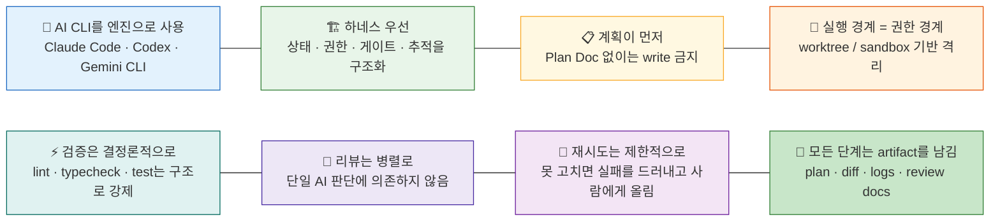
