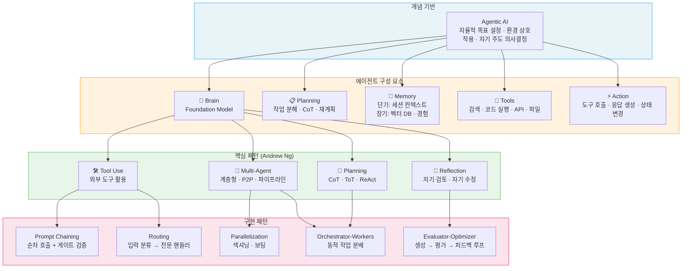
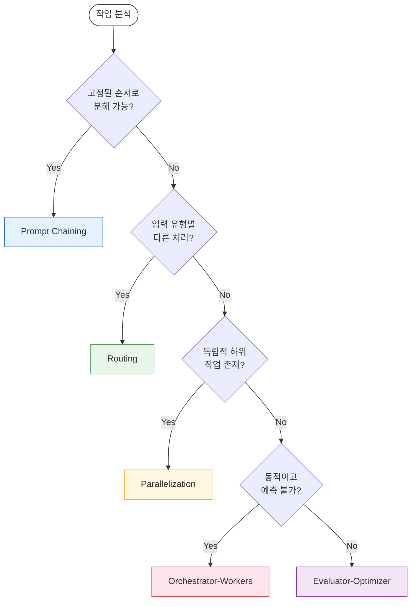

# Agentic Workflow Diagram

에이전틱 워크플로우의 개념, 에이전트 구성 요소, 핵심 패턴, 구현 패턴을 종합한 다이어그램입니다.

---

## 전체 구조

에이전틱 워크플로우는 **개념 → 구성 요소 → 핵심 패턴 → 구현 패턴**의 계층 구조로 이루어져 있습니다. 에이전트는 Brain, Planning, Memory, Tools, Action 5개 모듈로 구성되며,
Andrew Ng의 4가지 핵심 패턴(Reflection, Tool Use, Planning, Multi-Agent)을 기반으로 5가지 구현 패턴(Prompt Chaining, Routing,
Parallelization, Orchestrator-Workers, Evaluator-Optimizer)으로 실체화됩니다.

## 구현 패턴 선택 흐름

작업 특성에 따라 적합한 구현 패턴을 선택하는 의사결정 흐름입니다.

