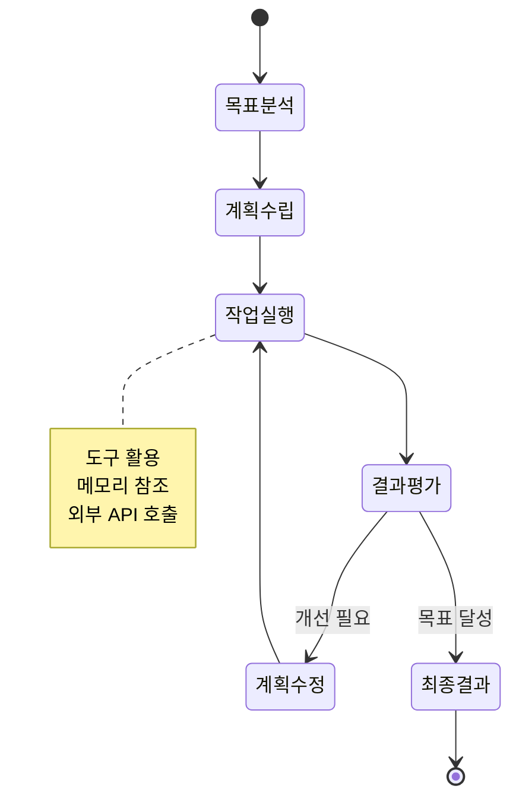
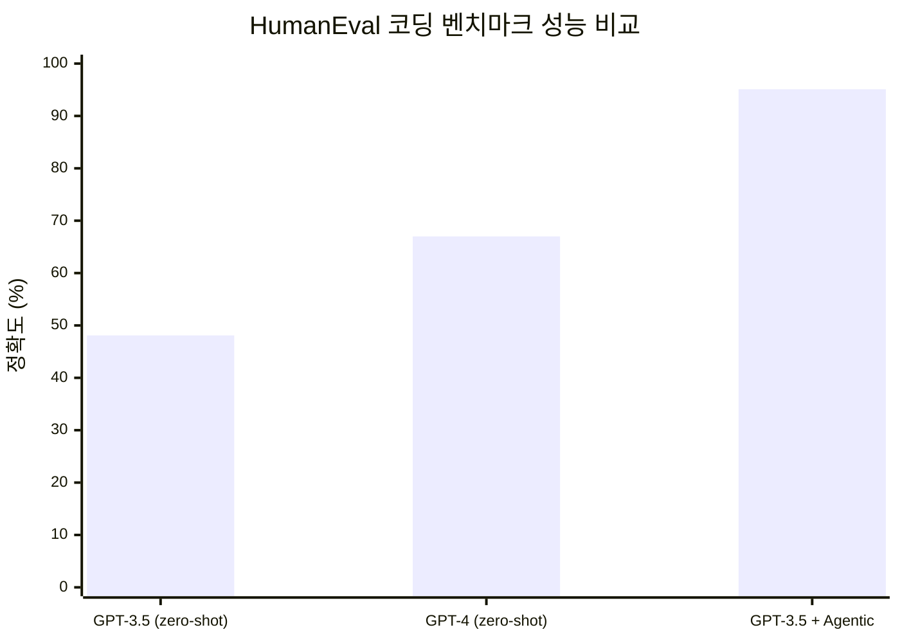

# 개념 및 정의

## Agentic AI란?

Agentic AI는 단순히 사용자의 프롬프트에 응답하는 수준을 넘어, **자율적으로 목표를 설정하고, 환경과 상호작용하며, 스스로 의사결정을 내리는** AI 시스템을 의미합니다.

기존 생성형 AI(Generative AI)가 "질문에 답하는" 역할에 머물렀다면, Agentic AI는 "스스로 판단하고 행동하는" 단계로 진화한 것입니다.

**핵심 특성:**

- **자율성 (Autonomy)**: 사람의 개입 없이 독립적으로 작업 수행
- **목표 지향성 (Goal-oriented)**: 명확한 목표를 향해 단계적으로 작업 수행
- **적응성 (Adaptability)**: 환경 변화와 피드백에 따라 전략 조정
- **도구 활용 (Tool Use)**: 외부 API, 데이터베이스, 코드 실행 등 다양한 도구 활용

---

## Agentic Workflow란?

Agentic Workflow는 **AI 에이전트가 복잡한 작업을 수행하기 위해 거치는 일련의 체계적인 과정**입니다.

단일 LLM 호출로 결과를 생성하는 기존 방식과 달리, Agentic Workflow에서는 에이전트가:

1. 작업을 분석하고 **계획을 수립**
2. 단계별로 **작업을 실행**
3. 중간 결과를 **평가하고 반성**
4. 필요시 **계획을 수정**하여 반복

이 반복적 과정을 통해 결과의 품질을 점진적으로 향상시킵니다.

---

## 전통적 AI vs Agentic Workflow

| 구분         | 전통적 AI (Zero-shot) | Agentic Workflow       |
|------------|--------------------|------------------------|
| **처리 방식**  | 단일 프롬프트 → 단일 응답    | 다단계 계획 → 반복 실행 → 개선    |
| **자율성**    | 낮음 (사용자 지시 의존)     | 높음 (자율적 판단과 실행)        |
| **도구 활용**  | 제한적                | 적극적 (API, DB, 코드 실행 등) |
| **오류 처리**  | 없음 (재질문 필요)        | 자체 검증 및 수정             |
| **결과 품질**  | 일회성 (편차 큼)         | 반복 개선으로 안정적            |
| **적합한 작업** | 단순 질의응답, 번역, 요약    | 복잡한 분석, 코드 작성, 연구      |

### 성능 비교 (Andrew Ng의 연구 결과)

Andrew Ng은 Agentic Workflow가 기존 zero-shot 방식 대비 **획기적인 성능 향상**을 보인다고 발표했습니다:

- GPT-3.5 (zero-shot): 48.1% (HumanEval 코딩 벤치마크)
- GPT-4 (zero-shot): 67.0%
- **GPT-3.5 + Agentic Workflow: 95.1%**

이는 에이전틱 워크플로우를 적용하면, 이전 세대 모델로도 최신 모델의 zero-shot 성능을 크게 뛰어넘을 수 있음을 보여줍니다.

---

## Agentic Workflow의 핵심 원리

### 1. 반복적 개선 (Iterative Refinement)

사람이 글을 쓸 때 초안을 작성하고 여러 번 수정하듯, Agentic Workflow에서도 AI가 결과물을 반복적으로 검토하고 개선합니다.

### 2. 도구 증강 (Tool Augmentation)

LLM의 한계(최신 정보 부재, 계산 오류 등)를 외부 도구를 통해 보완합니다. 웹 검색, 코드 실행, 데이터베이스 조회 등을 통해 더 정확하고 최신의 정보를 활용할 수 있습니다.

### 3. 계획 기반 실행 (Plan-and-Execute)

복잡한 작업을 하위 작업으로 분해하고, 각 단계를 순서대로 실행하며, 전체 진행 상황을 관리합니다.

### 4. 자기 반성 (Self-Reflection)

생성된 결과를 스스로 평가하고, 오류나 개선점을 식별하여 다음 반복에 반영합니다.

---

## 실제 적용 분야

| 분야           | 적용 사례                         |
|--------------|-------------------------------|
| **소프트웨어 개발** | 코드 생성, 디버깅, 테스트 작성, 코드 리뷰 자동화 |
| **데이터 분석**   | 복잡한 데이터 파이프라인 구축, 탐색적 데이터 분석  |
| **고객 서비스**   | 다단계 문의 처리, 에스컬레이션 관리          |
| **콘텐츠 제작**   | 연구 기반 글쓰기, 기술 문서 작성           |
| **금융**       | 리스크 분석, 투자 보고서 생성, 규정 준수 검토   |
| **과학 연구**    | 문헌 조사, 실험 설계, 결과 분석           |

---

## 참고 자료

- [Samsung SDS: Agentic Workflow - Agentic AI 이후의 새로운 패러다임](https://www.samsungsds.com/kr/insights/agentic-workflow-a-new-paradigm-after-agentic-ai.html)
- [Andrew Ng: Agentic Design Patterns (DeepLearning.AI)](https://www.deeplearning.ai/the-batch/how-agents-can-improve-llm-performance/)
- [Andrew Ng: "What's next for AI agentic workflows" (Sequoia Capital)](https://www.youtube.com/watch?v=sal78ACtGTc)
