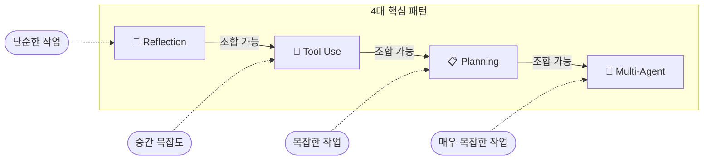
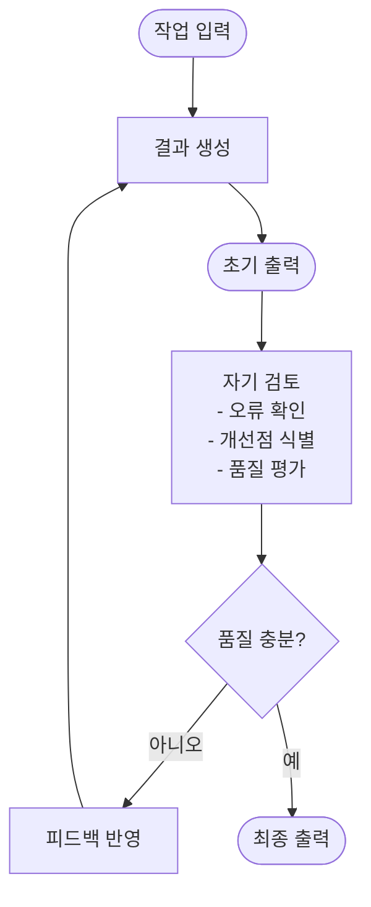
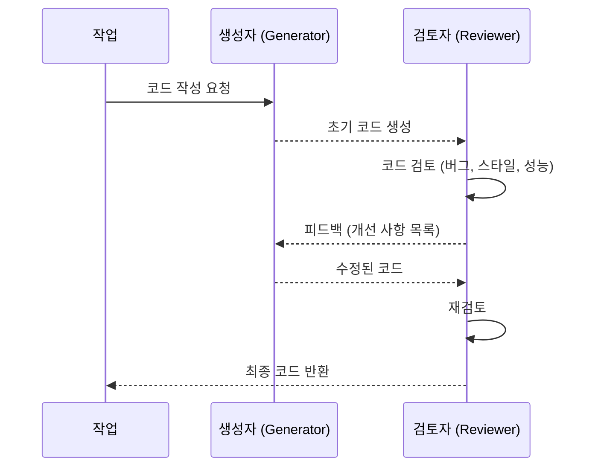
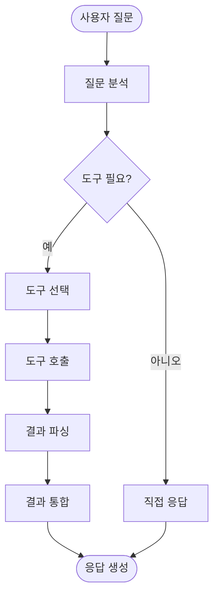
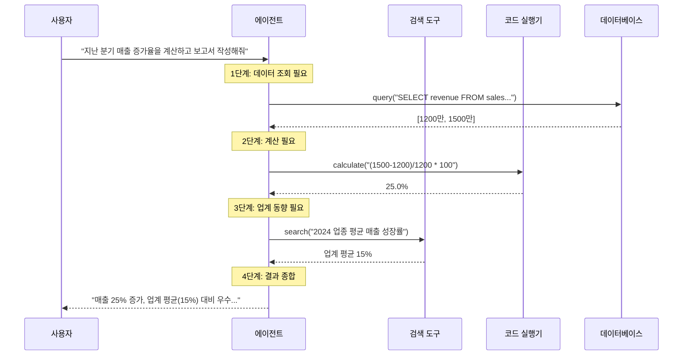
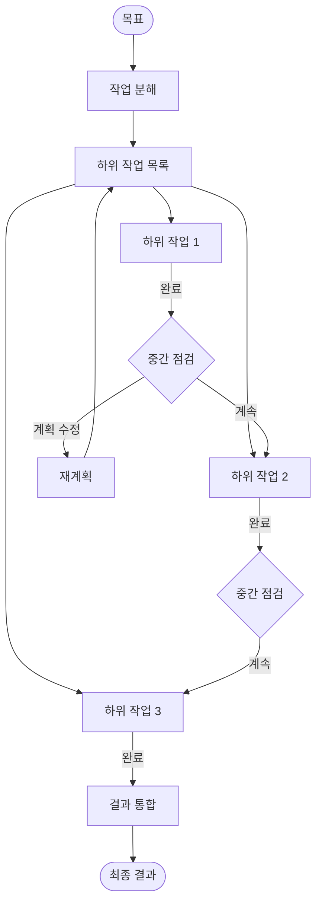
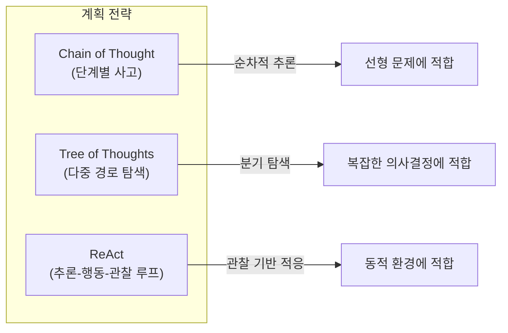
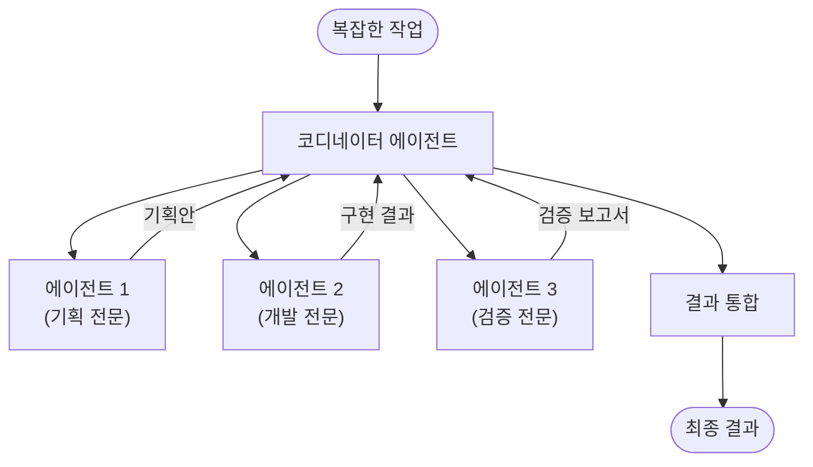
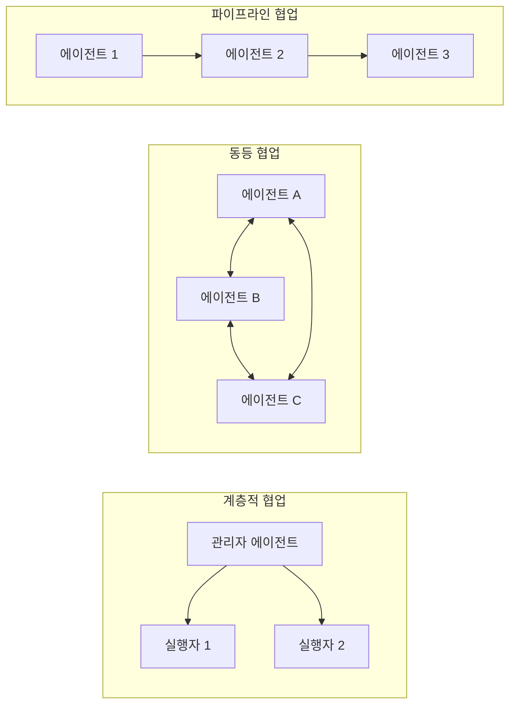
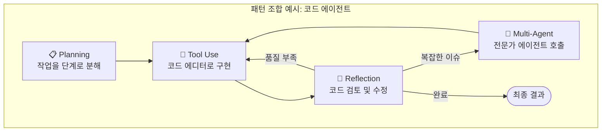

# 핵심 디자인 패턴

Andrew Ng이 제시한 4가지 핵심 Agentic Workflow 디자인 패턴을 정리합니다.
이 패턴들은 AI 에이전트의 성능을 크게 향상시키는 기본 빌딩 블록으로, 단독 또는 조합하여 활용할 수 있습니다.

---

## 패턴 개요

| 패턴 | 핵심 개념 | 적합한 상황 |
|------|-----------|-------------|
| [Reflection](#1-reflection-반성) | 생성 결과를 스스로 검토하고 개선 | 코드 작성, 글쓰기 등 품질 개선이 필요한 경우 |
| [Tool Use](#2-tool-use-도구-활용) | 외부 도구를 호출하여 LLM의 한계 보완 | 최신 정보, 정확한 계산, 외부 시스템 연동이 필요한 경우 |
| [Planning](#3-planning-계획-수립) | 작업을 하위 단계로 분해하여 순차 실행 | 복잡한 다단계 작업을 수행해야 하는 경우 |
| [Multi-Agent](#4-multi-agent-collaboration-다중-에이전트-협업) | 여러 에이전트가 역할을 분담하여 협업 | 다양한 전문성이 필요한 복잡한 작업 |

---

## 1. Reflection (반성)

### 정의

Reflection은 **에이전트가 자신의 출력을 스스로 검토하고, 오류나 개선점을 찾아 수정하는** 패턴입니다.

사람이 글을 작성한 뒤 퇴고(推敲)하는 과정과 유사합니다. 한 번의 시도로 완벽한 결과를 내기 어려운 작업에서, 반복적인 자기 검토를 통해 품질을 향상시킵니다.

### 근거 (Rationale)

- LLM은 한 번의 생성으로 완벽한 결과를 보장하지 않음
- 자기 검토를 통해 논리적 오류, 누락된 정보, 스타일 문제를 발견할 수 있음
- 추가 비용 대비 결과 품질 향상 효과가 큼

### 작동 흐름

### 상세 흐름 (시퀀스)

### 실제 사용 예시

| 분야 | 적용 사례 |
|------|-----------|
| **코드 작성** | 코드 생성 → 버그/보안 취약점 검토 → 수정 반복 |
| **글쓰기** | 초안 작성 → 문법/논리 검토 → 개선된 버전 작성 |
| **번역** | 번역 수행 → 자연스러움/정확성 검토 → 재번역 |
| **데이터 분석** | 분석 수행 → 결과 타당성 검증 → 분석 보완 |

### 장단점

| 구분 | 내용 |
|------|------|
| ✅ **장점** | 결과물 품질을 자동으로 개선 |
| ✅ **장점** | 구현이 비교적 단순 (프롬프트 추가만으로 가능) |
| ✅ **장점** | 다른 패턴과 조합하여 시너지 효과 |
| ⚠️ **단점** | 반복 횟수에 비례하여 비용과 지연 시간 증가 |
| ⚠️ **단점** | LLM이 자신의 오류를 항상 발견하지는 못함 |

---

## 2. Tool Use (도구 활용)

### 정의

Tool Use는 **에이전트가 외부 도구(API, 데이터베이스, 코드 인터프리터 등)를 호출하여 LLM만으로는 수행할 수 없는 작업을 처리하는** 패턴입니다.

LLM은 학습 데이터의 시점까지의 지식만 보유하며, 정확한 수학 계산이나 실시간 데이터 접근이 어렵습니다. 도구를 통해 이러한 한계를 극복합니다.

### 근거 (Rationale)

- LLM의 학습 데이터는 특정 시점에 고정되어 있어 최신 정보 부재
- 복잡한 수학 연산이나 정밀 계산에서 오류 발생 가능
- 외부 시스템(DB, API)과의 상호작용은 도구 없이는 불가능

### 작동 흐름

### 도구 호출 과정

### 실제 사용 예시

| 분야 | 적용 사례 |
|------|-----------|
| **개발** | 코드 실행, 테스트 수행, 패키지 설치, Git 작업 |
| **데이터** | SQL 조회, 스프레드시트 처리, 시각화 생성 |
| **검색** | 웹 검색, 문서 검색(RAG), 뉴스 조회 |
| **자동화** | 이메일 발송, 일정 관리, 파일 업로드 |

### 장단점

| 구분 | 내용 |
|------|------|
| ✅ **장점** | LLM의 근본적 한계(최신 정보, 정밀 계산) 극복 |
| ✅ **장점** | 외부 시스템과의 실질적인 상호작용 가능 |
| ✅ **장점** | 에이전트의 활용 범위를 크게 확장 |
| ⚠️ **단점** | 도구 정의 및 관리 비용 |
| ⚠️ **단점** | 잘못된 도구 호출 시 부작용 위험 |
| ⚠️ **단점** | 외부 서비스 의존에 따른 장애 가능성 |

---

## 3. Planning (계획 수립)

### 정의

Planning은 **에이전트가 복잡한 목표를 달성하기 위해 작업을 하위 단계로 분해하고, 실행 순서를 결정하는** 패턴입니다.

사람이 프로젝트를 관리할 때 작업 목록을 만들고 우선순위를 정하는 것과 유사합니다. 에이전트는 전체 작업을 조망하며 효율적인 실행 경로를 설계합니다.

### 근거 (Rationale)

- 복잡한 작업을 한 번에 처리하면 오류 확률이 높아짐
- 단계별 분해를 통해 각 단계의 난이도를 낮추고 추적 가능성 확보
- 실행 중 상황에 따라 계획을 동적으로 조정할 수 있음

### 작동 흐름

### 계획 수립 전략

**주요 전략 설명:**

| 전략 | 설명 | 적합한 상황 |
|------|------|-------------|
| **Chain of Thought (CoT)** | "먼저 A를 하고, 그 다음 B를 하고…" 순차적 추론 | 단계가 명확한 문제 |
| **Tree of Thoughts (ToT)** | 여러 가능한 경로를 탐색하고 최적 경로 선택 | 여러 해법이 가능한 복잡한 문제 |
| **ReAct** | 추론(Reason) → 행동(Act) → 관찰(Observe) 반복 | 환경 피드백이 필요한 동적 작업 |

### 실제 사용 예시

| 분야 | 적용 사례 |
|------|-----------|
| **여행 계획** | 목적지 선정 → 항공편 검색 → 숙소 예약 → 일정 구성 |
| **소프트웨어 개발** | 요구사항 분석 → 설계 → 구현 → 테스트 → 배포 |
| **연구 보고서** | 주제 선정 → 자료 수집 → 분석 → 초안 → 검토 → 완성 |
| **마케팅 캠페인** | 타겟 분석 → 콘텐츠 기획 → 제작 → 배포 → 성과 측정 |

### 장단점

| 구분 | 내용 |
|------|------|
| ✅ **장점** | 복잡한 작업을 체계적으로 처리 |
| ✅ **장점** | 진행 상황 추적 및 디버깅 용이 |
| ✅ **장점** | 상황에 따른 동적 재계획 가능 |
| ⚠️ **단점** | 계획 수립 자체에 시간과 비용 소요 |
| ⚠️ **단점** | 잘못된 초기 계획이 전체 결과에 영향 |
| ⚠️ **단점** | 과도한 분해는 오히려 비효율적일 수 있음 |

---

## 4. Multi-Agent Collaboration (다중 에이전트 협업)

### 정의

Multi-Agent Collaboration은 **서로 다른 역할과 전문성을 가진 여러 에이전트가 협력하여 복잡한 작업을 수행하는** 패턴입니다.

실제 팀이 역할을 분담하여 프로젝트를 진행하듯, 각 에이전트가 고유한 전문 분야를 담당하고, 서로 소통하며 최종 결과를 만들어냅니다.

### 근거 (Rationale)

- 단일 에이전트로 처리하기 어려운 복잡한 작업을 분업으로 해결
- 각 에이전트가 특화된 프롬프트와 도구를 사용하여 전문성 확보
- 역할 분리를 통해 에이전트 간 간섭을 줄이고 성능 향상

### 작동 흐름

### 협업 방식

**협업 방식 비교:**

| 방식 | 설명 | 적합한 상황 |
|------|------|-------------|
| **계층적 (Hierarchical)** | 상위 에이전트가 하위 에이전트에게 작업 위임 | 명확한 역할 구분, 대규모 작업 |
| **동등 (Peer-to-Peer)** | 에이전트 간 대등한 위치에서 토론/협업 | 창의적 작업, 다중 관점 필요 |
| **파이프라인 (Pipeline)** | 한 에이전트의 출력이 다음 에이전트의 입력 | 순차적 처리가 필요한 워크플로 |

### 실제 사용 예시

| 분야 | 적용 사례 |
|------|-----------|
| **소프트웨어 개발** | PM 에이전트(기획) + 개발 에이전트(구현) + QA 에이전트(테스트) |
| **콘텐츠 제작** | 리서처(조사) + 작가(집필) + 에디터(편집) + 디자이너(시각화) |
| **고객 서비스** | 분류 에이전트(라우팅) + 기술 지원 + 결제 지원 + 에스컬레이션 |
| **투자 분석** | 데이터 수집 에이전트 + 재무 분석 에이전트 + 보고서 작성 에이전트 |

### 대표 프레임워크

| 프레임워크 | 개발사 | 특징 |
|------------|--------|------|
| **AutoGen** | Microsoft | 대화 기반 다중 에이전트 프레임워크 |
| **CrewAI** | CrewAI | 역할 기반 에이전트 팀 구성 |
| **LangGraph** | LangChain | 그래프 기반 멀티 에이전트 오케스트레이션 |
| **Swarm** | OpenAI | 경량 멀티 에이전트 오케스트레이션 |

### 장단점

| 구분 | 내용 |
|------|------|
| ✅ **장점** | 복잡한 작업을 전문화된 역할로 분업 |
| ✅ **장점** | 각 에이전트의 독립적 최적화 가능 |
| ✅ **장점** | 다양한 관점에서의 검토로 결과 품질 향상 |
| ⚠️ **단점** | 에이전트 간 커뮤니케이션 오버헤드 |
| ⚠️ **단점** | 시스템 복잡도 및 디버깅 난이도 증가 |
| ⚠️ **단점** | 비용이 에이전트 수에 비례하여 증가 |

---

## 패턴 조합 가이드

실제 시스템에서는 단일 패턴보다 **여러 패턴을 조합**하여 사용하는 경우가 많습니다.

| 조합 | 사용 시나리오 |
|------|--------------|
| **Reflection + Tool Use** | 코드 생성 후 실행하여 오류 확인, 수정 반복 |
| **Planning + Tool Use** | 연구 작업을 단계별로 분해하고, 각 단계에서 검색 도구 활용 |
| **Planning + Multi-Agent** | 복잡한 프로젝트를 하위 작업으로 분해하고 각 에이전트에 할당 |
| **전체 조합** | 기업용 AI 어시스턴트: 계획 → 도구 활용 → 협업 → 반성 사이클 |

---

## 참고 자료

- [ByteByteGo: Top AI Agentic Workflow Patterns](https://blog.bytebytego.com/p/top-ai-agentic-workflow-patterns)
- [Andrew Ng: Agentic Design Patterns (DeepLearning.AI)](https://www.deeplearning.ai/the-batch/how-agents-can-improve-llm-performance/)
- [Samsung SDS: Agentic Workflow - Agentic AI 이후의 새로운 패러다임](https://www.samsungsds.com/kr/insights/agentic-workflow-a-new-paradigm-after-agentic-ai.html)
- [Anthropic: Building Effective Agents](https://www.anthropic.com/research/building-effective-agents)
