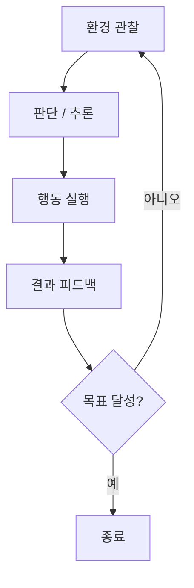
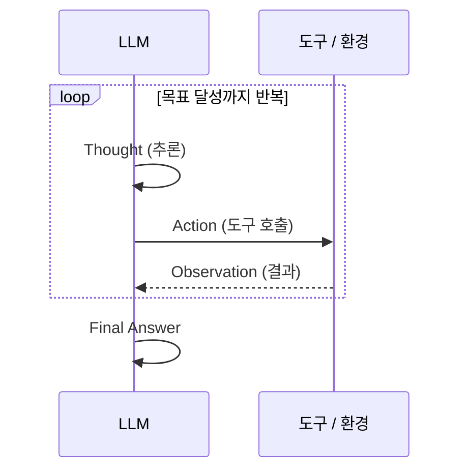
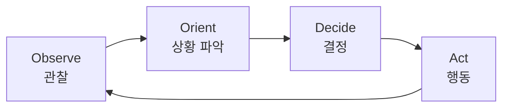
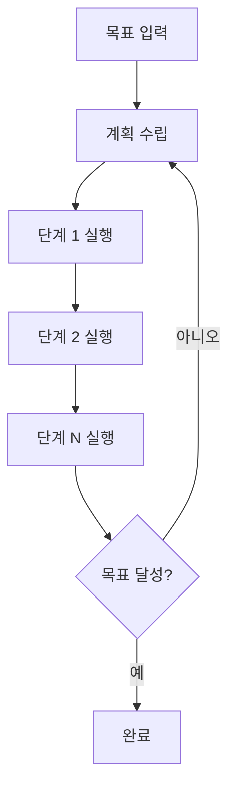
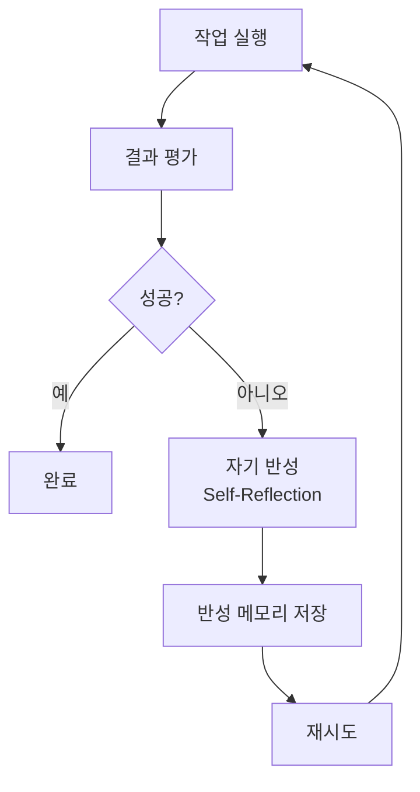
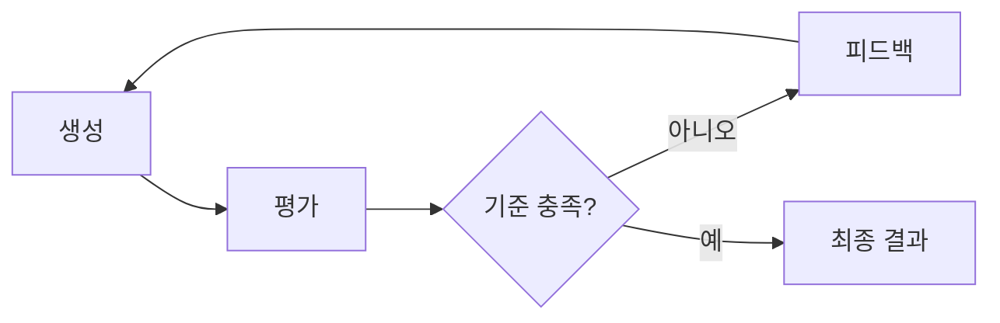
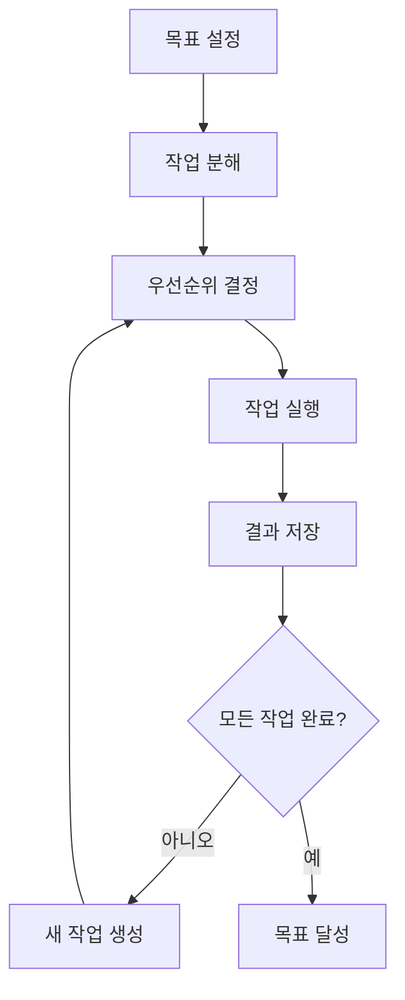

# Agent Loop 개념 및 워크플로우 패턴

## Agent Loop란?

Agent Loop는 AI 에이전트가 **관찰 → 판단 → 행동 → 피드백** 사이클을 반복하며 목표를 달성하는 실행 구조이다.
단일 프롬프트-응답이 아닌, 환경과 상호작용하며 결과를 관찰하고 다음 행동을 결정하는 루프 기반 패턴이다.

## 주요 Agent Loop 패턴

### 1. ReAct (Reasoning + Acting)

LLM이 **추론(Thought)과 행동(Action)을 교차 실행**하는 패턴이다.
사고 과정을 명시적으로 생성한 뒤, 도구를 호출하고, 결과를 관찰하여 다음 사고로 이어진다.

- **핵심**: 추론과 행동의 명시적 인터리빙(interleaving)
- **장점**: 사고 과정이 추적 가능하여 디버깅 용이
- **참고**: Yao et al., "ReAct: Synergizing Reasoning and Acting in Language Models" (2022)

### 2. OODA Loop (Observe-Orient-Decide-Act)

군사 전략에서 유래한 의사결정 루프를 에이전트에 적용한 패턴이다.

- **Observe**: 환경 상태, 데이터, 피드백 수집
- **Orient**: 수집된 정보를 기존 지식과 결합하여 상황 분석
- **Decide**: 가능한 행동 중 최적 선택
- **Act**: 결정을 실행하고 환경에 반영

### 3. Plan-Execute 패턴

먼저 전체 계획을 수립한 뒤, 각 단계를 순차 실행하는 패턴이다.
실행 중 문제가 발생하면 계획을 재수립(replan)할 수 있다.

- **핵심**: 실행 전 전체 계획을 먼저 생성
- **장점**: 복잡한 다단계 작업에 적합
- **단점**: 초기 계획이 잘못되면 전체 실행에 영향

### 4. Reflexion (자기 반성)

에이전트가 실행 결과를 **자기 반성(self-reflection)**하여 다음 시도에 반영하는 패턴이다.
실패 경험을 언어적 피드백으로 변환하여 이후 시도의 성능을 개선한다.

- **핵심**: 실패를 언어적 피드백으로 변환하여 메모리에 저장
- **장점**: 시도 횟수가 늘수록 성능 향상
- **참고**: Shinn et al., "Reflexion: Language Agents with Verbal Reinforcement Learning" (NeurIPS 2023)

### 5. Evaluator-Optimizer 루프

별도의 **평가자(Evaluator)**가 생성 결과를 평가하고, **최적화자(Optimizer)**가 피드백을 반영하여 개선하는 패턴이다.

- **핵심**: 생성과 평가의 역할 분리
- **장점**: 품질 기준을 명확히 정의 가능
- **활용**: 코드 리뷰, 문서 작성, 테스트 생성 등

### 6. Autonomous Agent 루프

AutoGPT, BabyAGI 등에서 사용하는 **완전 자율 실행** 패턴이다.
에이전트가 목표를 하위 작업으로 분해하고, 우선순위를 정하여 순차 실행한다.

- **핵심**: 작업 생성 → 우선순위 → 실행 → 새 작업 생성의 무한 루프
- **장점**: 복잡한 목표를 자율적으로 분해하여 달성
- **단점**: 컨텍스트 관리, 무한 루프 위험, 비용 제어가 어려움

## 패턴 비교

| 패턴 | 자율성 | 복잡도 | 추적 가능성 | 주요 사용처 |
|------|--------|--------|-------------|------------|
| ReAct | 중간 | 낮음 | 높음 | 질의응답, 도구 사용 |
| OODA | 중간 | 중간 | 중간 | 실시간 의사결정 |
| Plan-Execute | 중간 | 중간 | 높음 | 다단계 작업 |
| Reflexion | 중간 | 중간 | 높음 | 반복 개선 작업 |
| Evaluator-Optimizer | 낮음 | 낮음 | 높음 | 품질 관리 |
| Autonomous Agent | 높음 | 높음 | 낮음 | 범용 자율 작업 |
