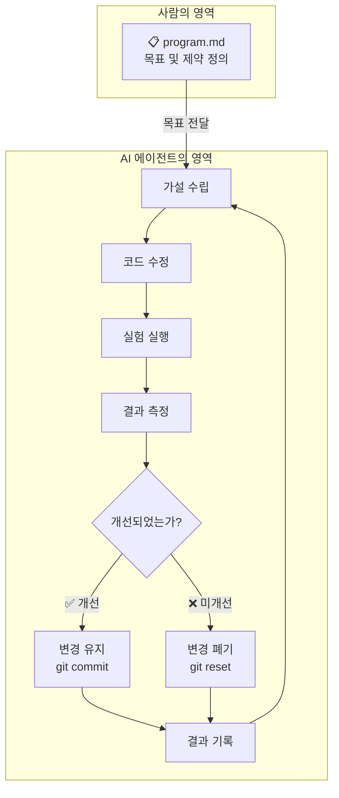
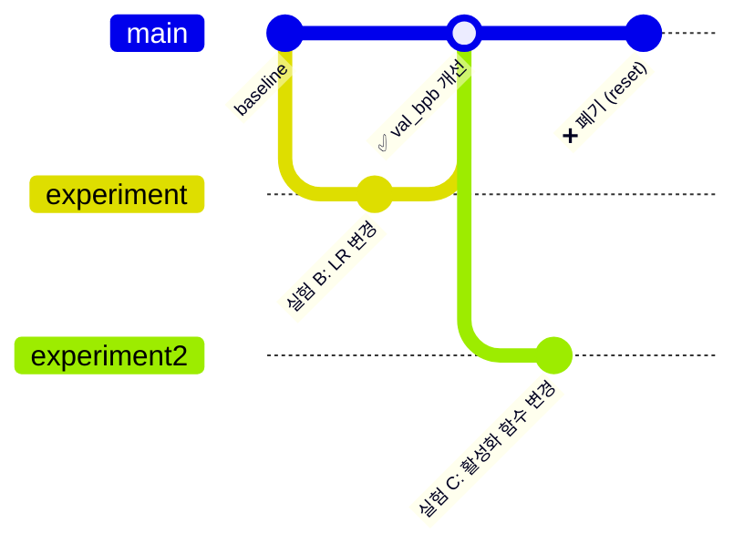
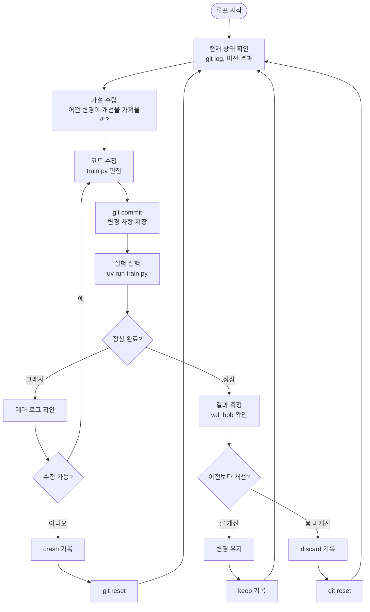

# Auto Improve Loop 설계

## 개요

Auto Improve Loop는 [karpathy/autoresearch](https://github.com/karpathy/autoresearch)에서 차용한 핵심 아이디어로,
**사람이 목표만 정의하면 AI 에이전트가 자율적으로 실험-측정-판단을 반복**하는 자기 개선 루프이다.

기존의 에이전트 루프(ReAct, Plan-Execute 등)가 단일 작업 완료에 집중한다면,
Auto Improve Loop는 **동일 시스템의 반복적 개선**에 초점을 맞춘다.

## 핵심 구조



## autoresearch의 설계 원칙

### 1. 역할 분리: 사람 vs AI

| | 사람 (Human) | AI (Agent) |
|---|---|---|
| **역할** | 무엇을(What) 정의 | 어떻게(How) 실행 |
| **산출물** | `program.md` | 코드 변경, 실험 로그 |
| **판단** | 목표 및 제약 조건 설정 | 실험 설계, 실행, 평가 |
| **개입 시점** | 시작 전, 결과 확인 시 | 루프 전체 (자율) |

### 2. 고정된 평가 기준

모든 실험은 **동일한 조건과 지표**로 비교해야 한다.

- **고정 시간 예산**: 모든 실험은 동일한 시간(예: 5분) 동안 실행
- **단일 평가 지표**: 하나의 명확한 수치(예: `val_bpb`)로 성과 비교
- **불변 평가 코드**: 평가 로직은 에이전트가 수정할 수 없음 (별도 파일 분리, 수정 대상에서 제외)

```
실험 A: val_bpb = 0.997 (baseline)
실험 B: val_bpb = 0.993 → ✅ 개선, 유지
실험 C: val_bpb = 1.005 → ❌ 미개선, 폐기
실험 D: val_bpb = 0.000 → 💥 크래시, 폐기
```

### 3. 안전한 롤백 메커니즘

Git을 활용하여 실패한 실험을 안전하게 되돌린다.



### 4. 실험 로그 관리

모든 실험 결과를 구조화된 형식으로 기록한다.

```
commit   val_bpb    memory_gb  status   description
a1b2c3d  0.997900   44.0       keep     baseline
b2c3d4e  0.993200   44.2       keep     increase LR to 0.04
c3d4e5f  1.005000   44.0       discard  switch to GeLU activation
d4e5f6g  0.000000   0.0        crash    double model width (OOM)
```

## 실험 루프 상세 플로우



## 적용 범위 확장

autoresearch는 LLM 학습 최적화에 특화되어 있지만, Auto Improve Loop 패턴은 다양한 영역에 적용 가능하다.

| 적용 영역 | 수정 대상 | 평가 지표 | 예시 |
|-----------|----------|----------|------|
| 모델 학습 | 학습 코드 (하이퍼파라미터, 아키텍처) | val_bpb, accuracy | autoresearch |
| 프롬프트 최적화 | 프롬프트 템플릿 | 응답 품질 점수 | DSPy |
| 코드 품질 | 소스 코드 | 테스트 통과율, 성능 벤치마크 | CI/CD 파이프라인 |
| 문서 개선 | 문서 내용 | 가독성 점수, 링크 유효성 | 기술 문서 |
| 설정 최적화 | 시스템 설정값 | 응답 시간, 처리량 | 인프라 튜닝 |

## 설계 시 고려사항

### ✅ 필수 조건

1. **측정 가능한 평가 지표**: 자동으로 계산 가능한 정량적 지표
2. **재현 가능한 환경**: 동일 조건에서 반복 실행 가능
3. **안전한 롤백**: 실패 시 이전 상태로 복원 가능
4. **결과 기록**: 모든 실험의 이력 추적 가능

### ⚠️ 주의사항

1. **평가 지표 조작 방지**: 에이전트가 평가 코드 자체를 수정하지 못하도록 제한
2. **리소스 제한**: 시간, 메모리, 비용의 상한선 설정
3. **무한 루프 방지**: 최대 실험 횟수 또는 시간 제한
4. **복잡도 관리**: 작은 개선을 위한 과도한 복잡도 증가 경계
