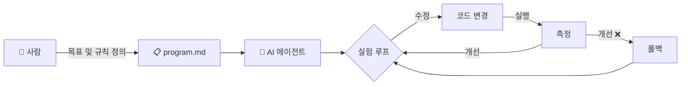

# Auto Improve Loop

> 사람은 **무엇을, 어떤 규칙으로** 개선할지 정의하고, AI가 **어떻게** 개선할지 스스로 실험하고, 측정하고, 유지하거나 폐기한다.

## 개요

Auto Improve Loop는 AI 에이전트가 자율적으로 코드를 수정하고, 실험하고, 결과를 측정하여 개선 여부를 판단하는 반복 루프이다.
[karpathy/autoresearch](https://github.com/karpathy/autoresearch)의 핵심 아이디어를 기반으로,
사람이 목표와 운영 규칙(program.md)을 작성하면 AI가 나머지를 수행하는 구조를 정리한다.

## 문서 구조

| 문서                                                   | 설명                   |
|------------------------------------------------------|----------------------|
| [01-auto-improve-loop.md](./01-auto-improve-loop.md) | Auto Improve Loop 설계 |
| [02-references.md](./02-references.md)               | 관련 자료 및 레퍼런스         |

## 핵심 원칙

1. **사람은 목표와 규칙을 정의** — 무엇을(What), 어떤 제약으로(Constraints) 명시
2. **AI가 방법을 결정** — 어떻게 개선할지(How)는 에이전트가 자율 판단
3. **실험은 측정 가능** — 모든 변경은 정량적 지표로 평가
4. **실패는 안전하게 폐기** — 개선되지 않으면 롤백하고 다음 실험으로 이동
