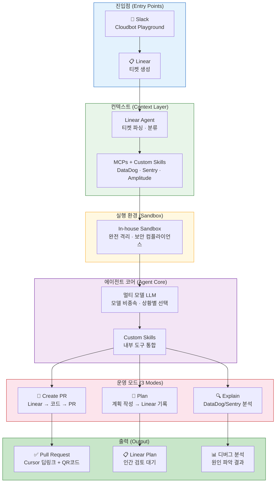
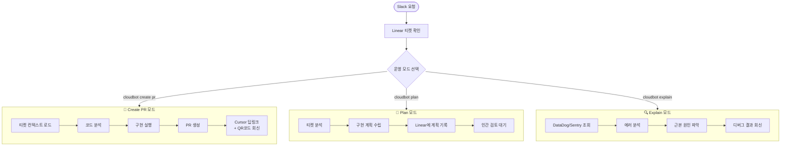
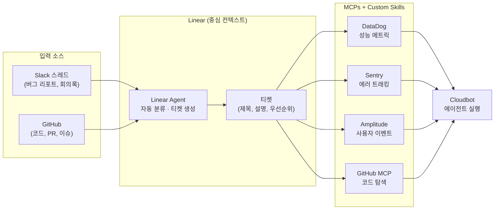
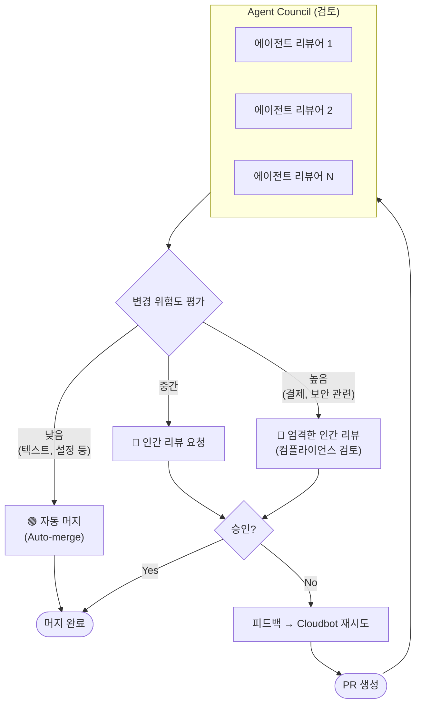
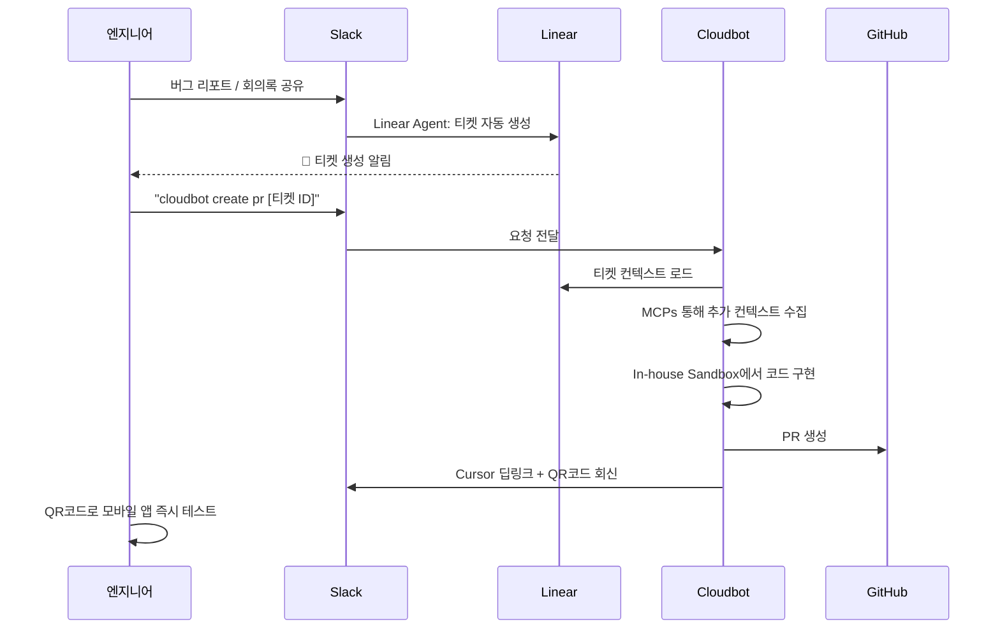

# Cloudbot 아키텍처 다이어그램

## 1. 전체 시스템 아키텍처

Cloudbot은 Slack → Linear → In-house Sandbox → MCPs → PR 의 흐름으로 동작합니다.

## 2. 3가지 운영 모드

## 3. 컨텍스트 파이프라인 (Linear-first)

Cloudbot의 모든 컨텍스트는 Linear를 단일 진실 공급원(Single Source of Truth)으로 삼습니다.

## 4. 검증 및 병합 파이프라인

## 5. Slack 네이티브 워크플로우

