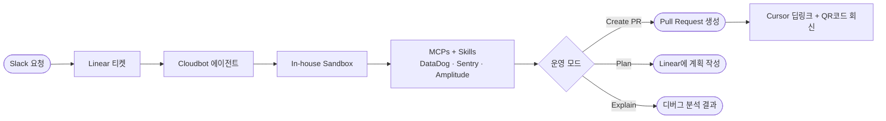

# Coinbase Cloudbot

Coinbase가 내부적으로 구축한 AI 코딩 에이전트 Cloudbot의 아키텍처와 워크플로우를 정리한 문서입니다.

---

## 문서 구성

| 문서 | 내용 |
|---|---|
| [아키텍처 다이어그램](./00-diagram.md) | 전체 시스템 흐름, 3가지 모드, 컨텍스트 파이프라인 |
| [설계 및 워크플로우 분석](./01-cloudbot.md) | 구축 배경, 핵심 설계 결정, 3가지 운영 모드, 도입 전략 |

---

## Cloudbot 개요

Coinbase의 Cloudbot은 금융 플랫폼의 보안·컴플라이언스 요건에 맞춰 **완전 자체 구축(Built from Scratch)**한 내부 AI 코딩 에이전트다.
Slack에서 Linear 티켓을 기반으로 자율적으로 PR을 생성하며, 1,000명 이상의 엔지니어가 일상적인 개발 워크플로우에서 활용한다.

### 핵심 특징

- **완전 자체 구축**: 외부 에이전트 프레임워크 미사용, 자체 설계 아키텍처
- **멀티 모델**: Claude에 종속되지 않고 여러 LLM을 상황에 맞게 활용
- **Linear 중심 컨텍스트**: 모든 작업의 맥락을 Linear 티켓 하나로 통일
- **Slack 네이티브**: 엔지니어가 이미 사용하는 도구에서 마찰 없이 호출
- **3가지 운영 모드**: Create PR / Plan / Explain

---

## 참고 자료

- [Coinbase: Building Enterprise AI Agents at Coinbase](https://www.coinbase.com/blog/building-enterprise-AI-agents-at-Coinbase)
- [How I AI: Coinbase Podcast (Chintan Turakhia, Sr. Director of Engineering)](https://www.youtube.com/watch?v=tidINuXB7PA)
- [LangChain: Open SWE — Open-Source Framework for Internal Coding Agents](https://blog.langchain.com/open-swe-an-open-source-framework-for-internal-coding-agents/)
- [Enough About Harnesses, Your Org Needs Its Own Coding Agent (@kishan_dahya)](https://x.com/kishan_dahya/status/2028971339974099317)
