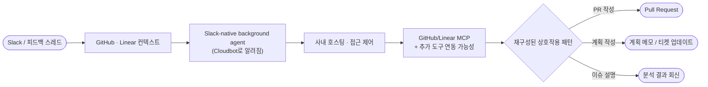

# Coinbase Cloudbot

Coinbase 내부 코딩/백그라운드 에이전트로 알려진 `Cloudbot`을 공개 자료 기준으로 재구성한 문서입니다.

> **출처 안내**: Coinbase 공식 블로그는 `Cloudbot`라는 이름과 세부 모드를 직접 설명하지 않는다.
> 공식 문서가 강하게 확인해 주는 것은 `background agents`, GitHub/Linear MCP, OpenAI-compatible router, 접근 제어와 auditability 같은 기반 인프라다.
> Cloudbot의 상세 워크플로우는 인터뷰 쇼노트, 공개 발언, 2차 분석 자료에 더 많이 의존한다.

---

## 문서 구성

| 문서                                           | 내용                                                    |
|----------------------------------------------|-------------------------------------------------------|
| [아키텍처 다이어그램](./00-diagram.md)                | 전체 시스템 흐름, 재구성된 상호작용 패턴, 컨텍스트 파이프라인, 검증 파이프라인         |
| [설계 및 워크플로우 분석](./01-cloudbot.md)            | 구축 배경, 핵심 설계 결정, 공개 자료에 반복 등장하는 상호작용 패턴, AI 도입 전략, 성과 |
| [Coinbase AI 에이전트 생태계](./02-ai-ecosystem.md) | QA AI Agent, NodeSmith, 피드백-to-PR 파이프라인, 고객 지원 AI     |

---

## Cloudbot 개요

공개 자료를 종합하면, Cloudbot은 Slack과 Linear를 중심으로 PR 작성과 이슈 분석을 자동화하는 Coinbase 내부 코딩/백그라운드 에이전트로 보인다.
다만 아래 흐름은 공식 제품 문서가 아니라, 공식 블로그의 기반 인프라 설명과 공개 발언을 조합한 재구성이다.

### 공식적으로 확인된 기반

| 항목         | 내용                                                               | 출처                              |
|------------|------------------------------------------------------------------|---------------------------------|
| 개발자용 AI 도구 | Cursor, Copilot, Claude Code 등을 전사적으로 도입                         | 공식 블로그, 2025-08-06              |
| 내부 MCP 통합  | GitHub, Linear 중심 MCP 통합                                         | 공식 블로그, 2025-08-06              |
| 모델 인프라     | OpenAI-compatible router, 일일 1,500명+ 사용                          | 공식 블로그, 2025-08-06              |
| 안전성        | repository sensitivity matrix, tracing, evaluation, auditability | 공식 블로그, 2025-08-06 / 2025-12-22 |
| 에이전트 운영 원칙 | code-first, observability-first, human-in-the-loop               | 공식 블로그, 2025-12-22              |

### Cloudbot 관련 재구성 포인트

| 항목              | 내용                                      | 출처 신뢰도 |
|-----------------|-----------------------------------------|--------|
| 완전 자체 구축        | 외부 비교표와 공개 발언에서 일관되게 언급                 | 중간     |
| Slack 네이티브      | 스레드에서 호출하는 background agent 패턴          | 중간~높음  |
| Linear 중심 컨텍스트  | Linear가 핵심 컨텍스트 허브로 반복 등장               | 중간     |
| PR / 계획 / 설명 패턴 | 공개 발언과 2차 정리에 반복 등장하는 상호작용 방식           | 중간     |
| 추가 도구 연동        | Datadog, Sentry, Amplitude 등은 직접 확인이 약함 | 낮음~중간  |

---

## 참고 자료

### 공식 문서

- [Coinbase: Building Enterprise AI Agents at Coinbase](https://www.coinbase.com/blog/building-enterprise-AI-agents-at-Coinbase)
- [Coinbase: How We are Improving Product Quality at Coinbase with AI Agents](https://www.coinbase.com/blog/How-We-are-Improving-Product-Quality-at-Coinbase-with-AI-agents)
- [Coinbase: Tools for Developer Productivity at Coinbase](https://www.coinbase.com/blog/Tools-for-Developer-Productivity-at-Coinbase)
- [Coinbase: NodeSmith — AI-Driven Automation for Blockchain Node Upgrades](https://www.coinbase.com/blog/NodeSmith-AI-Driven-Automation-for-Blockchain-Node-Upgrades)

### 인터뷰 및 공개 발언

- [How I AI: Coinbase Podcast (Chintan Turakhia, Sr. Director of Engineering)](https://www.youtube.com/watch?v=tidINuXB7PA)
- [Lenny's Newsletter: How Coinbase Scaled AI to 1,000+ Engineers](https://www.lennysnewsletter.com/p/how-coinbase-scaled-ai-to-1000-engineers)
- [ChatPRD: Playbook for AI Engineering Adoption at Coinbase](https://www.chatprd.ai/how-i-ai/playbook-for-ai-engineering-adoption-at-coinbase)
- [ChatPRD: Build an Automated User Feedback to Pull Request Pipeline](https://www.chatprd.ai/how-i-ai/workflows/build-an-automated-user-feedback-to-pull-request-pipeline)

### 외부 분석

- [LangChain: Open SWE — Open-Source Framework for Internal Coding Agents](https://blog.langchain.com/open-swe-an-open-source-framework-for-internal-coding-agents/)
- [Open SWE: Build Your Own Internal Coding Agent in 10 Minutes](https://www.mager.co/blog/2026-03-17-open-swe-coding-agents/)
- [Ry Walker Research: Coinbase Cloudbot](https://rywalker.com/research/coinbase-claudebot)
- [ZenML: Coinbase AI Agents for Automated Product Quality Testing](https://www.zenml.io/llmops-database/ai-agents-for-automated-product-quality-testing-and-bug-detection)
