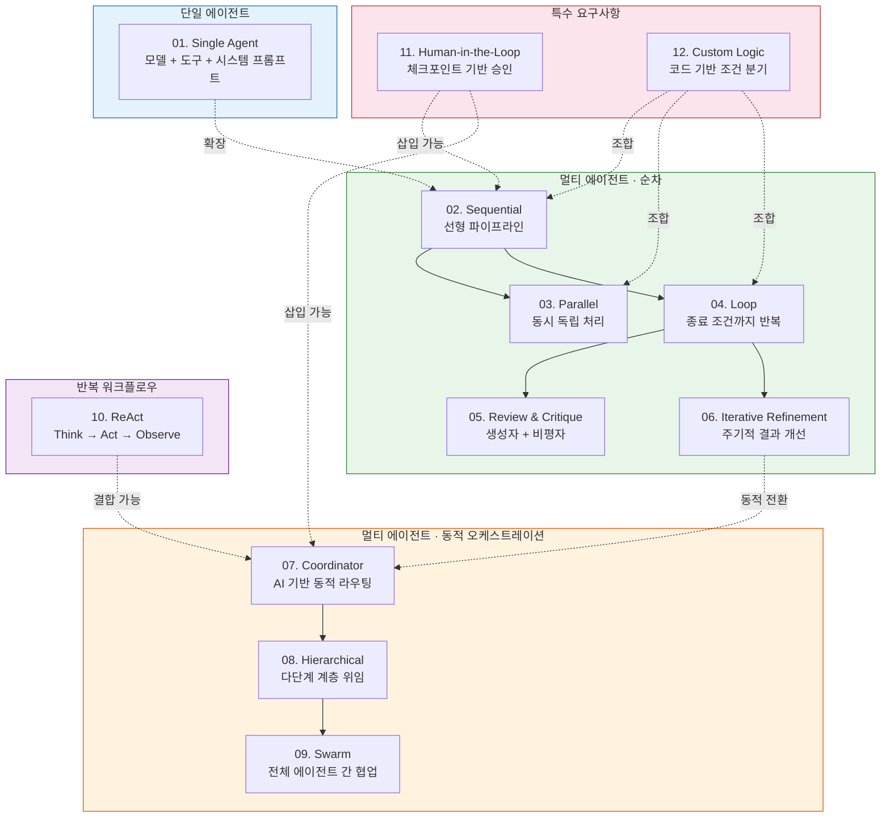
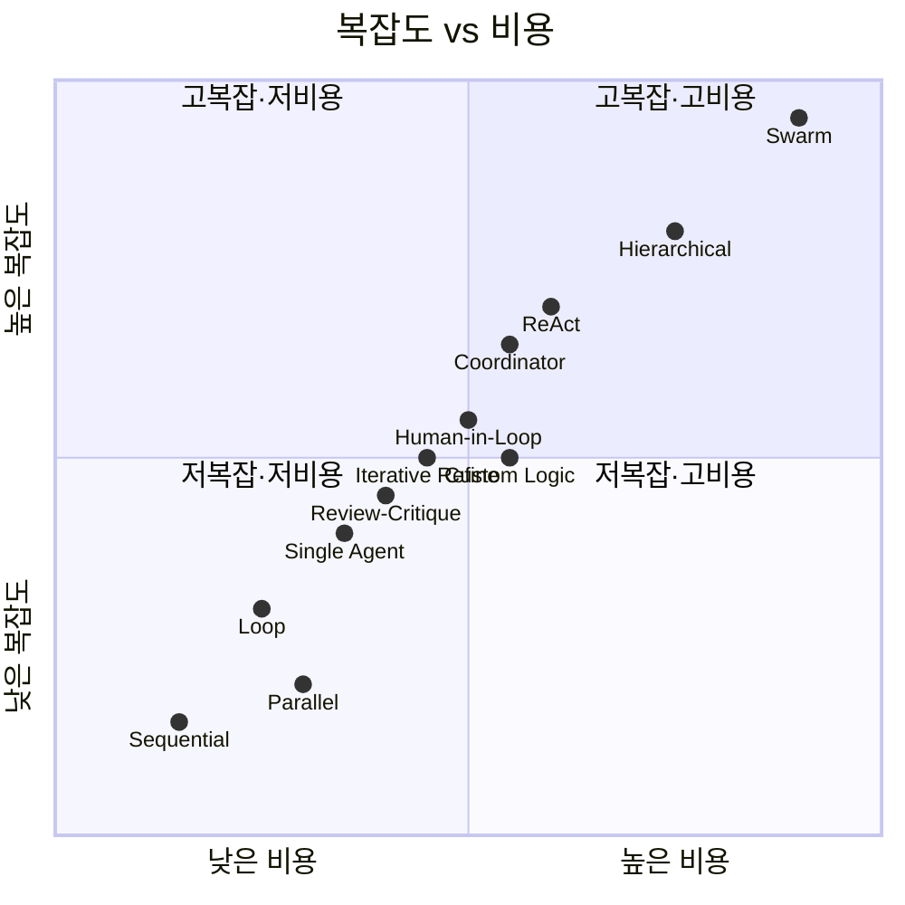

# Design Pattern Diagram

Google Cloud 기반 에이전틱 AI 디자인 패턴 12가지를 분류와 오케스트레이션 방식에 따라 종합한 다이어그램입니다.

---

## 전체 패턴 분류

12가지 패턴은 **단일 에이전트**, **멀티 에이전트(순차)**, **멀티 에이전트(동적 오케스트레이션)**, **반복 워크플로우**, **특수 요구사항** 5개 카테고리로 분류됩니다. 오케스트레이션 방식은 코드
기반, AI 기반, 하이브리드로 나뉩니다.

## 복잡도·비용·오케스트레이션 비교

패턴 선택 시 복잡도, 비용, 오케스트레이션 방식을 종합적으로 고려해야 합니다.

