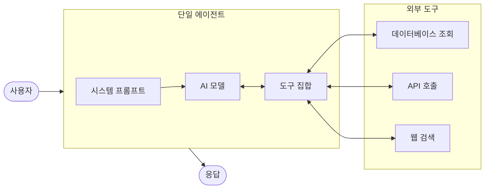
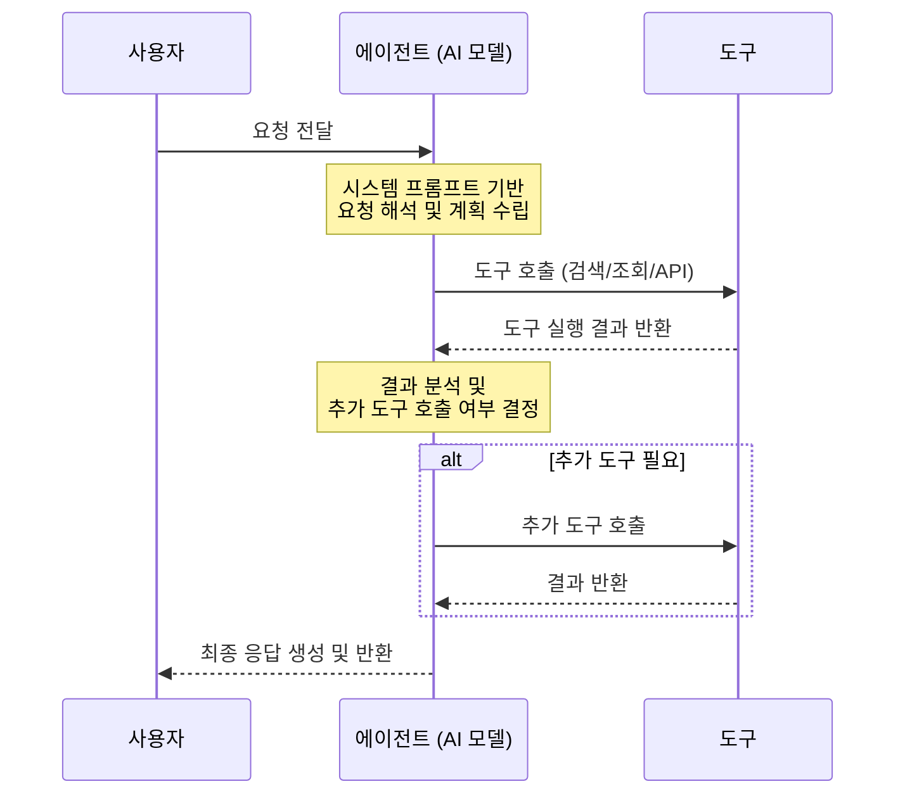

# 단일 에이전트 시스템 (Single-Agent System)

## 개요

단일 에이전트 시스템은 하나의 AI 모델, 정의된 도구 집합, 포괄적인 시스템 프롬프트를 사용하여 사용자 요청을 자율적으로 처리하는 가장 기본적인 에이전트 패턴입니다.

**핵심 특징:**
- 모델의 추론 기능으로 사용자 요청을 해석하고 단계별 계획 수립
- 정의된 도구 집합에서 적절한 도구를 선택하여 실행
- 시스템 프롬프트가 에이전트의 동작과 역할을 형성
- 단일 추론-행동 루프로 작업 완수

**적합한 상황:**
- 빠른 프로토타입 개발이 필요할 때
- 도구 수가 제한적이고 작업이 단순할 때
- 개념 증명(PoC)을 위한 초기 개발 단계

---

## 아키텍처

### 작동 흐름

---

## 사용 예시

### 1. 고객 지원 챗봇
- 에이전트가 고객 질문을 해석하고, 주문 데이터베이스를 조회하여 배송 상태를 확인한 후 응답

### 2. 연구 보조 에이전트
- 사용자의 질문에 대해 API를 호출하여 최신 뉴스와 논문을 검색하고 요약 제공

### 3. 개인 비서 에이전트
- 일정 관리, 이메일 요약, 알림 설정 등 단순 도구를 조합하여 일상 업무 지원

---

## 장단점

| 구분 | 내용 |
|------|------|
| ✅ 장점 | 구현이 간단하고 빠른 프로토타입 개발 가능 |
| ✅ 장점 | 단일 모델 호출로 비용 효율적 |
| ✅ 장점 | 디버깅과 유지보수가 용이 |
| ⚠️ 단점 | 도구 수 증가 시 모델 성능 저하 |
| ⚠️ 단점 | 복잡한 멀티스텝 워크플로에 부적합 |
| ⚠️ 단점 | 전문화된 처리가 어려움 |

---

## 참고 자료

- [Google Cloud: Agentic AI Design Patterns](https://cloud.google.com/architecture/choose-design-pattern-agentic-ai-system)
- [Google ADK: Single Agent](https://google.github.io/adk-docs/)
