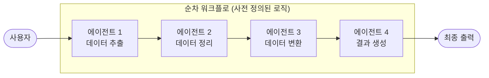
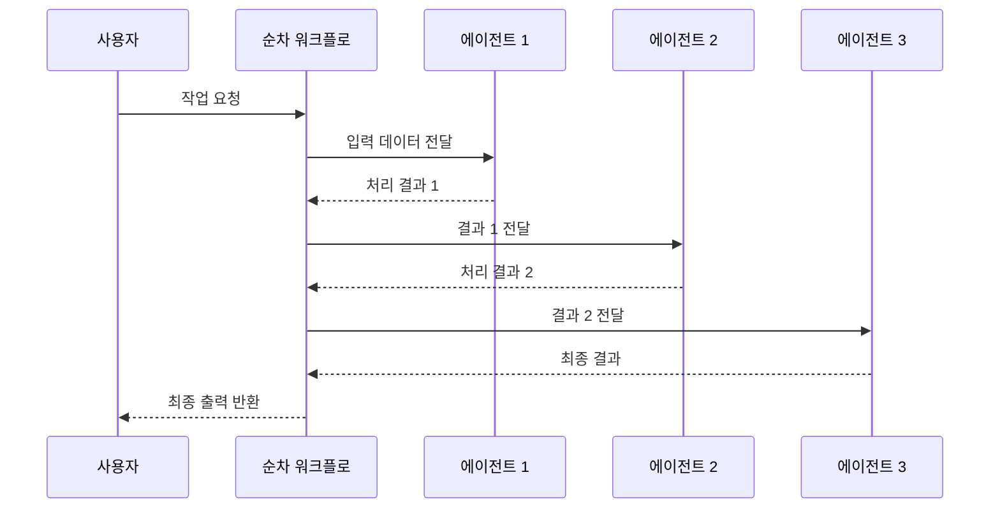

# 순차 패턴 (Sequential Pattern)

## 개요

순차 패턴은 여러 전문화된 에이전트를 사전 정의된 선형 순서로 실행하여, 한 에이전트의 출력이 다음 에이전트의 입력으로 직접 전달되는 멀티 에이전트 패턴입니다.

**핵심 특징:**
- 사전 정의된 로직에 따라 작동하며, AI 모델을 오케스트레이션에 사용하지 않음
- 각 에이전트는 특정 역할에 전문화된 처리 수행
- 고정된 파이프라인 구조로 예측 가능한 실행 흐름
- 지연 시간 감소 및 운영 비용 절감

**적합한 상황:**
- 작업이 고정된 순서로 처리되어야 할 때
- 모델 기반 오케스트레이션이 불필요할 때
- 데이터 처리 파이프라인 (추출 → 정리 → 로드)

---

## 아키텍처

### 작동 흐름

---

## 사용 예시

### 1. 데이터 처리 파이프라인 (ETL)
- **에이전트 1**: 원본 데이터 소스에서 데이터 추출
- **에이전트 2**: 결측값 처리, 형식 통일 등 데이터 정리
- **에이전트 3**: 비즈니스 규칙에 따른 데이터 변환 및 적재

### 2. 문서 생성 파이프라인
- **에이전트 1**: 주제와 타겟 독자 기반 개요 작성
- **에이전트 2**: 개요를 바탕으로 초안 작성
- **에이전트 3**: 브랜드 톤과 SEO 가이드라인에 맞게 편집

### 3. 번역 및 현지화
- **에이전트 1**: 원문 텍스트 직역
- **에이전트 2**: 문화적 맥락에 맞게 의역
- **에이전트 3**: 현지 어투와 스타일로 최종 검수

---

## 장단점

| 구분 | 내용 |
|------|------|
| ✅ 장점 | AI 오케스트레이션 없이 동작하여 지연 시간 감소 |
| ✅ 장점 | 운영 비용 절감 (추가 모델 호출 없음) |
| ✅ 장점 | 예측 가능한 실행 흐름으로 디버깅 용이 |
| ✅ 장점 | 각 단계의 독립적 최적화 가능 |
| ⚠️ 단점 | 유연성 부족 (동적 조건 적응 어려움) |
| ⚠️ 단점 | 불필요한 단계를 건너뛸 수 없음 |
| ⚠️ 단점 | 앞 단계 오류가 뒤 단계에 전파될 위험 |

---

## 참고 자료

- [Google Cloud: Agentic AI Design Patterns](https://cloud.google.com/architecture/choose-design-pattern-agentic-ai-system)
- [Google ADK: Sequential Agents](https://google.github.io/adk-docs/)
