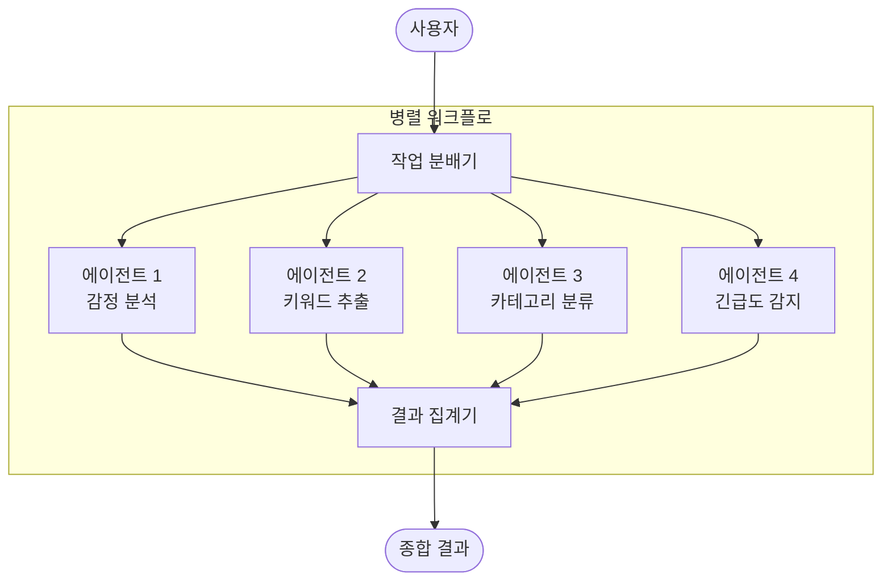
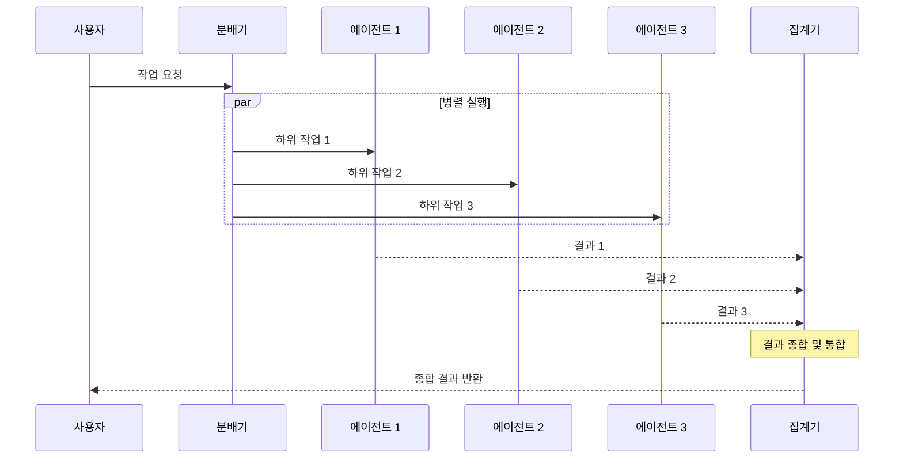

# 병렬 패턴 (Parallel Pattern)

## 개요

병렬 패턴은 여러 전문화된 하위 에이전트가 동시에 독립적으로 작업을 수행하고, 그 결과를 종합하여 최종 출력을 생성하는 멀티 에이전트 패턴입니다.

**핵심 특징:**
- 독립적인 하위 작업을 동시에 실행하여 전체 지연 시간 단축
- 각 에이전트의 출력을 종합하는 집계(aggregation) 단계 필요
- 다양한 관점에서의 분석을 통한 포괄적 결과 생성
- 사전 정의된 로직으로 작동하며, 모델 오케스트레이션 불필요

**적합한 상황:**
- 독립적으로 처리 가능한 하위 작업이 존재할 때
- 처리 속도가 중요하고 동시 실행이 가능할 때
- 다양한 관점이나 분석이 필요한 경우

---

## 아키텍처

### 작동 흐름

---

## 사용 예시

### 1. 고객 의견 다층 분석
고객 피드백을 여러 관점에서 동시에 분석:
- **에이전트 1**: 감정 분석 (긍정/부정/중립)
- **에이전트 2**: 핵심 키워드 추출
- **에이전트 3**: 카테고리 분류 (제품/서비스/배송)
- **에이전트 4**: 긴급도 감지
- **집계**: 종합 고객 인사이트 리포트 생성

### 2. 코드 보안 감사
대규모 코드베이스를 모듈별로 동시 분석:
- 각 에이전트가 서로 다른 모듈의 보안 취약점을 병렬로 분석
- 집계기가 전체 보안 감사 보고서와 우선순위별 수정 사항 정리

### 3. 다국어 콘텐츠 처리
동일 콘텐츠를 여러 언어로 동시 번역:
- 각 에이전트가 서로 다른 언어로 번역 수행
- 집계기가 모든 번역 결과를 통합 관리

---

## 장단점

| 구분 | 내용 |
|------|------|
| ✅ 장점 | 전체 처리 시간 획기적 단축 |
| ✅ 장점 | 다양한 관점의 포괄적 분석 가능 |
| ✅ 장점 | 각 에이전트의 독립적 확장 용이 |
| ⚠️ 단점 | 동시 실행으로 즉각적인 리소스/토큰 사용 증가 |
| ⚠️ 단점 | 비용이 병렬 수에 비례하여 상승 |
| ⚠️ 단점 | 충돌하는 결과를 합성하는 집계 로직 복잡성 |

---

## 참고 자료

- [Google Cloud: Agentic AI Design Patterns](https://cloud.google.com/architecture/choose-design-pattern-agentic-ai-system)
- [Google ADK: Parallel Agents](https://google.github.io/adk-docs/)
