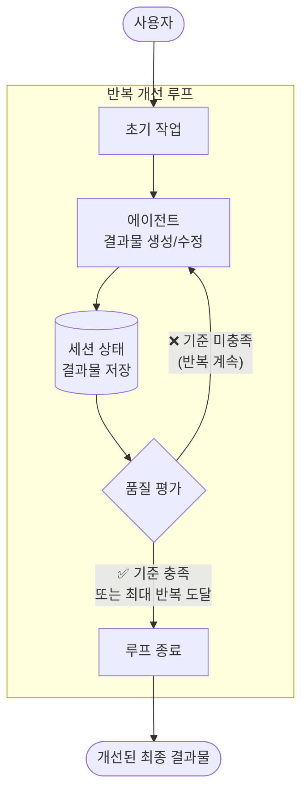
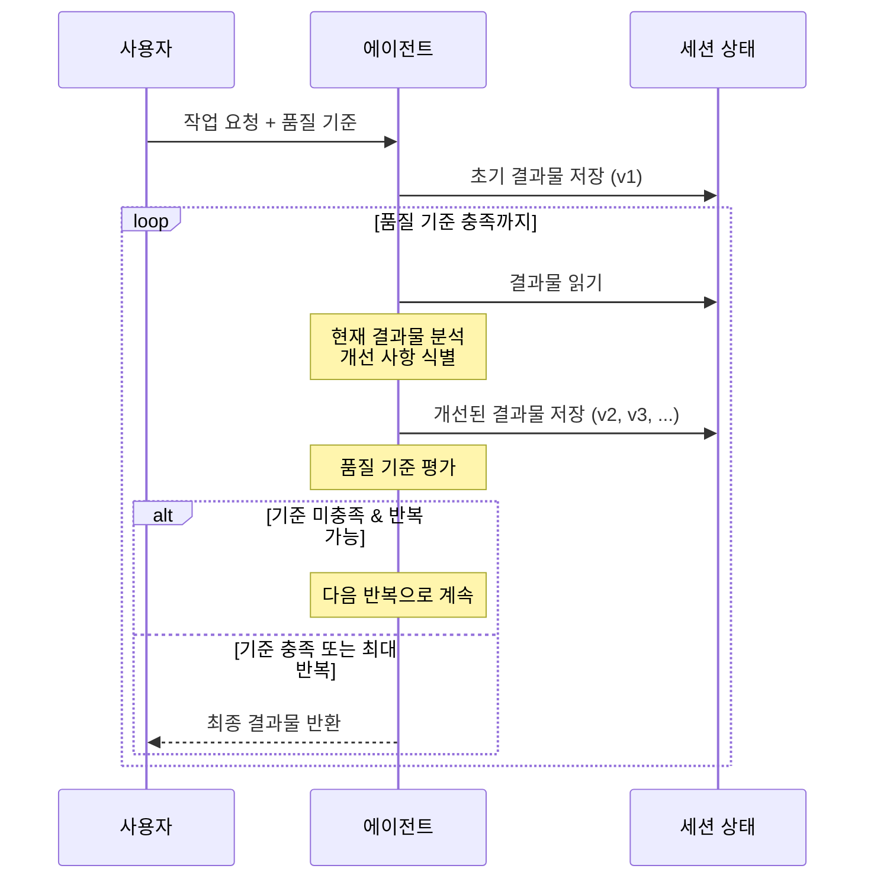

# 반복 개선 패턴 (Iterative Refinement Pattern)

## 개요

반복 개선 패턴은 하나 이상의 에이전트가 루프 내에서 세션 상태에 저장된 결과물을 여러 사이클에 걸쳐 점진적으로 개선하는 멀티 에이전트 패턴입니다.

**핵심 특징:**
- 루프 내 에이전트가 각 반복마다 세션 상태의 결과물을 수정
- 품질 기준 충족 또는 최대 반복 횟수 도달 시 종료
- 단일 단계에서 달성하기 어려운 정교한 출력 생성 가능
- 검토-비평 패턴과 달리, 결과물 자체를 점진적으로 향상시키는 데 초점

**적합한 상황:**
- 코드 작성 및 디버깅
- 계획 수립 및 전략 문서 작성
- 문서 초안의 반복적 개선
- 창작 글쓰기 (초안 → 비판 → 개작 반복)

---

## 아키텍처

### 작동 흐름

---

## 사용 예시

### 1. 코드 작성 및 디버깅
- **에이전트**: 기능 요구사항에 따라 코드 생성
- **반복**: 테스트 실행 → 실패 분석 → 코드 수정 → 재테스트
- **종료 조건**: 모든 테스트 통과 또는 최대 5회 반복

### 2. 창작 글쓰기
- **에이전트**: 주제에 따른 글 작성
- **반복**: 초안 작성 → 자체 비판 → 문체/논리 개선 → 재작성
- **종료 조건**: 품질 점수 기준 충족

### 3. 전략 문서 작성
- **에이전트**: 비즈니스 전략 문서 작성
- **반복**: 초안 → 논리적 일관성 검토 → 데이터 보강 → 수정
- **종료 조건**: 모든 검토 항목 통과

### 4. 프레젠테이션 자료 제작
- **에이전트**: 슬라이드 콘텐츠 생성
- **반복**: 초안 → 메시지 명확성 평가 → 시각적 구조 개선
- **종료 조건**: 핵심 메시지 전달력 기준 충족

---

## 장단점

| 구분 | 내용 |
|------|------|
| ✅ 장점 | 단일 단계에서 어려운 정교한 출력 생성 가능 |
| ✅ 장점 | 반복을 통한 점진적 품질 향상 |
| ✅ 장점 | 세션 상태를 통한 결과물 이력 관리 |
| ⚠️ 단점 | 각 사이클마다 지연 시간과 비용 증가 |
| ⚠️ 단점 | 아키텍처 복잡성 추가 |
| ⚠️ 단점 | 신중한 종료 조건 설계 필수 |

---

## 검토-비평 패턴과의 차이

| 관점 | 검토-비평 패턴 | 반복 개선 패턴 |
|------|---------------|---------------|
| 초점 | 독립적 검증/승인 | 결과물 점진적 향상 |
| 에이전트 역할 | 생성기 + 비평가 분리 | 단일 또는 다수 에이전트 |
| 상태 관리 | 출력 전달 | 세션 상태에 저장/수정 |
| 종료 | 비평가 승인 | 품질 기준 또는 최대 반복 |

---

## 참고 자료

- [Google Cloud: Agentic AI Design Patterns](https://cloud.google.com/architecture/choose-design-pattern-agentic-ai-system)
- [Google ADK: Loop Agents](https://google.github.io/adk-docs/)
