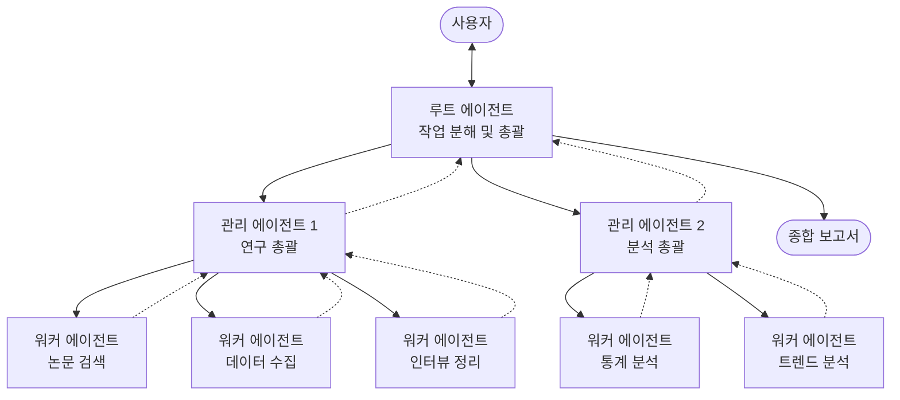
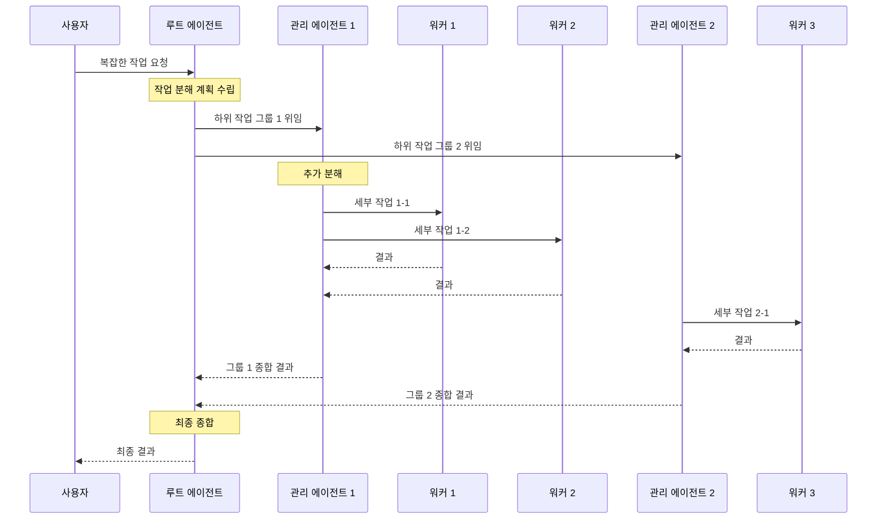

# 계층적 작업 분해 패턴 (Hierarchical Task Decomposition Pattern)

## 개요

계층적 작업 분해 패턴은 광범위한 계획이 필요한 복잡한 문제를 다단계 계층 구조로 에이전트를 조직하여 해결하는 멀티 에이전트 패턴입니다. 루트 에이전트가 작업을 관리 가능한 하위 작업으로 분해하고, 각 하위 작업이
직접 실행 가능할 때까지 반복적으로 위임합니다.

**핵심 특징:**

- 루트 에이전트가 복잡한 작업을 관리 가능한 하위 작업으로 분해
- 다층 위임: 하위 에이전트가 다시 하위 에이전트에게 위임 가능
- 작업이 직접 실행 가능할 때까지 점진적으로 세분화
- 결과가 계층 구조를 따라 상위로 전파

**적합한 상황:**

- 다단계 추론이 필요한 작업 (연구, 계획, 종합)
- 복잡한 연구 프로젝트 (정보 수집 → 분석 → 보고서 합성)
- 포괄적이고 고품질의 결과가 필요한 경우

---

## 아키텍처

### 작동 흐름

---

## 사용 예시

### 1. 복잡한 연구 프로젝트

시장 조사 및 경쟁 분석:

- **루트 에이전트**: 전체 연구 계획 수립 및 결과 종합
- **관리 에이전트 1 (시장 조사)**: 시장 규모, 성장률, 트렌드 조사 총괄
    - 워커: 산업 보고서 검색, 통계 데이터 수집
- **관리 에이전트 2 (경쟁 분석)**: 경쟁사 분석 총괄
    - 워커: 경쟁사 재무 분석, 제품 비교, 전략 분석

### 2. 대규모 소프트웨어 아키텍처 설계

엔터프라이즈 시스템 설계:

- **루트 에이전트**: 전체 아키텍처 설계 방향 수립
- **관리 에이전트 1 (프론트엔드)**: UI/UX 아키텍처
    - 워커: 컴포넌트 설계, 상태 관리, API 인터페이스
- **관리 에이전트 2 (백엔드)**: 서버 아키텍처
    - 워커: 데이터베이스 스키마, API 설계, 인프라 구성

### 3. 종합 보고서 작성

연차 보고서 자동 생성:

- **루트 에이전트**: 보고서 전체 구조 설계 및 최종 편집
- **관리 에이전트 1 (재무)**: 재무 분석 섹션
    - 워커: 재무제표 분석, 비율 계산, 그래프 생성
- **관리 에이전트 2 (운영)**: 운영 성과 섹션
    - 워커: KPI 수집, 프로젝트 현황, 인력 현황

---

## 장단점

| 구분    | 내용                          |
|-------|-----------------------------|
| ✅ 장점  | 매우 복잡한 문제를 체계적으로 분해하여 해결    |
| ✅ 장점  | 각 계층에서의 전문화된 처리             |
| ✅ 장점  | 포괄적이고 고품질의 결과 생성            |
| ⚠️ 단점 | 아키텍처가 매우 복잡하여 구축 난이도 높음     |
| ⚠️ 단점 | 디버깅과 유지보수 어려움               |
| ⚠️ 단점 | 다단계 모델 호출로 지연 시간과 비용이 크게 증가 |

---

## 코디네이터 패턴과의 차이

| 관점     | 코디네이터 패턴             | 계층적 작업 분해 패턴           |
|--------|----------------------|------------------------|
| 구조     | 단일 계층 (코디네이터 → 에이전트) | 다단계 계층 (루트 → 관리자 → 워커) |
| 분해 수준  | 1단계 하위 작업 분배         | 점진적 세분화 (여러 계층)        |
| 적합한 작업 | 동적 라우팅이 필요한 작업       | 광범위한 계획과 추론이 필요한 작업    |
| 복잡도    | 중간                   | 매우 높음                  |

---

## 참고 자료

- [Google Cloud: Agentic AI Design Patterns](https://docs.cloud.google.com/architecture/choose-design-pattern-agentic-ai-system)
- [Google ADK: Multi-Agent Patterns](https://google.github.io/adk-docs/agents/multi-agents/)
