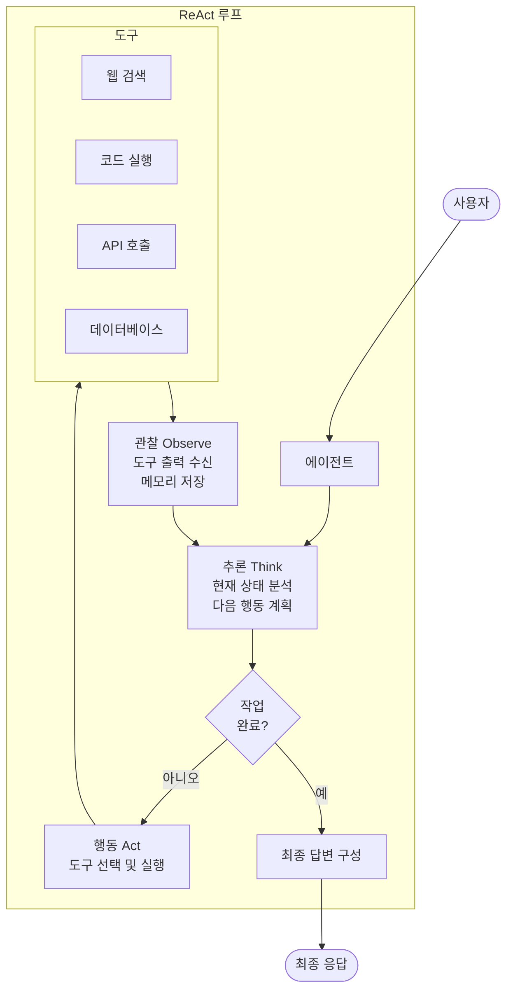
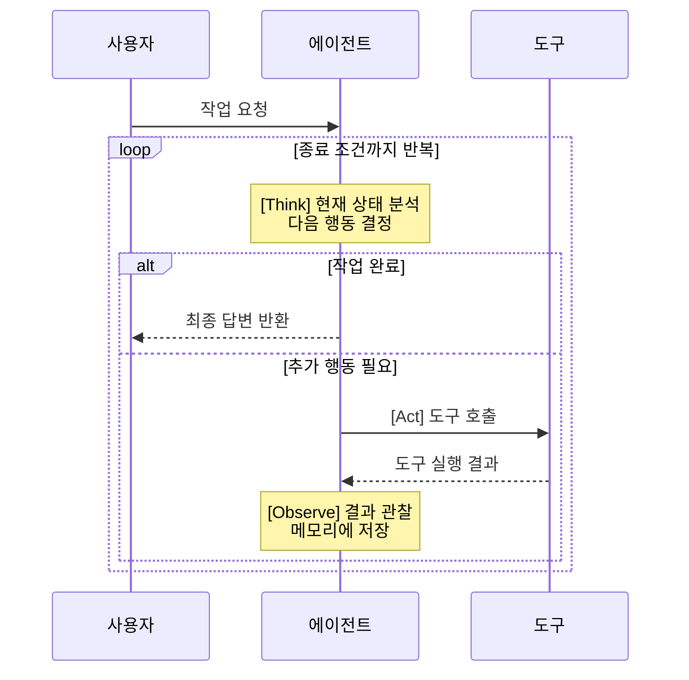
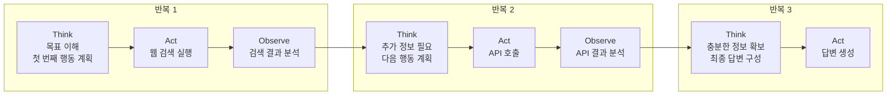

# ReAct 패턴 (Reason and Act Pattern)

## 개요

ReAct 패턴은 AI 모델을 사용하여 사고 과정(Reasoning)과 행동(Acting)을 자연어 상호작용의 시퀀스로 구성하는 패턴입니다. 에이전트는 추론(Think) → 행동(Act) → 관찰(Observe)의 반복 루프를 통해 작업을 수행합니다.

**핵심 특징:**
- 3단계 반복 루프: Think → Act → Observe
- 모델이 매 단계에서 작업 완료 여부를 평가하고 다음 행동 결정
- 도구 호출 결과를 관찰하고 메모리에 저장
- 결정적 답변 발견, 최대 반복 도달, 또는 오류 시 루프 종료

**적합한 상황:**
- 지속적인 계획과 적응이 필요한 작업
- 추론과 행동의 반복적 사이클이 필요할 때
- 정확성이 속도보다 중요한 경우

---

## 아키텍처

### 작동 흐름

### 상세 사고 과정

---

## 사용 예시

### 1. 로봇 에이전트 경로 생성
자율 로봇의 목표 달성:
- **Think**: 현재 위치와 목표 위치 분석, 장애물 확인
- **Act**: 이동 경로 계산 및 이동 명령 실행
- **Observe**: 새로운 장애물 감지, 현재 위치 업데이트
- **특징**: 동적 제약 조건(새 장애물)에 실시간 적응

### 2. 복잡한 질문 응답
다단계 추론이 필요한 정보 검색:
- **Think**: 질문 분석, 필요한 정보 식별
- **Act**: 관련 데이터베이스/API에서 정보 검색
- **Observe**: 검색 결과 평가, 추가 검색 필요 여부 판단
- **특징**: 단계적으로 정보를 축적하며 정확한 답변 구성

### 3. 자동화된 디버깅
코드 오류 진단 및 수정:
- **Think**: 오류 메시지 분석, 가능한 원인 추론
- **Act**: 로그 확인, 코드 검사, 테스트 실행
- **Observe**: 실행 결과 분석, 가설 검증
- **특징**: 가설 기반으로 체계적 디버깅 진행

---

## 장단점

| 구분 | 내용 |
|------|------|
| ✅ 장점 | 단순한 멀티 에이전트 시스템보다 구현/유지보수 간단 |
| ✅ 장점 | 모델의 사고 과정이 디버깅에 도움 |
| ✅ 장점 | 동적 제약 조건에 실시간 적응 가능 |
| ✅ 장점 | 추론 과정의 투명성 제공 |
| ⚠️ 단점 | 단일 쿼리 대비 엔드 투 엔드 지연 시간 증가 |
| ⚠️ 단점 | 모델 추론 품질에 크게 좌우 |
| ⚠️ 단점 | 도구 오류나 잘못된 결과가 전파될 위험 |

---

## 루프 종료 조건

1. **결정적 답변 발견**: 충분한 정보로 최종 답변 구성 가능
2. **최대 반복 횟수 도달**: 사전 정의된 반복 상한에 도달
3. **진행 불가 오류 발생**: 복구할 수 없는 오류 발생

---

## 참고 자료

- [Google Cloud: Agentic AI Design Patterns](https://cloud.google.com/architecture/choose-design-pattern-agentic-ai-system)
- [ReAct: Synergizing Reasoning and Acting in Language Models](https://arxiv.org/abs/2210.03629)
- [Google ADK Documentation](https://google.github.io/adk-docs/)
