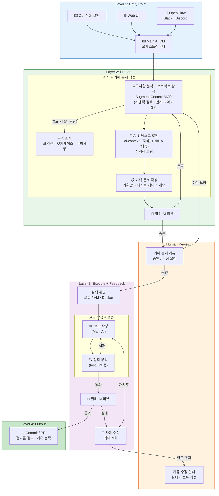
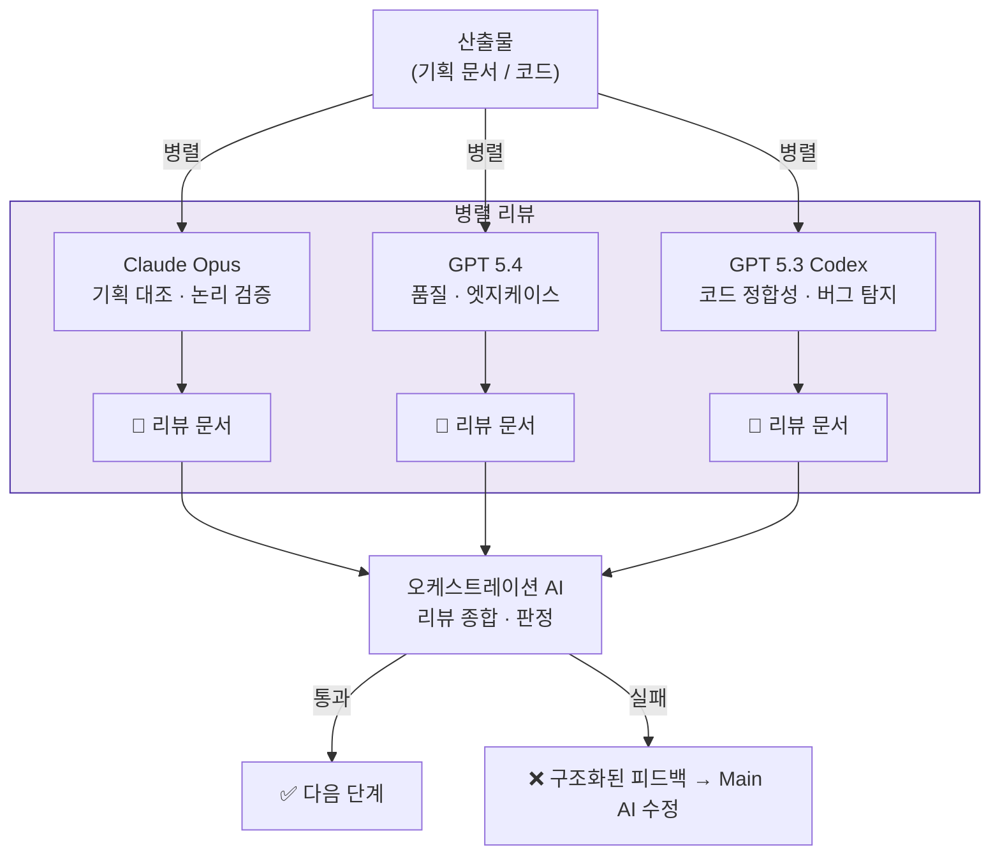
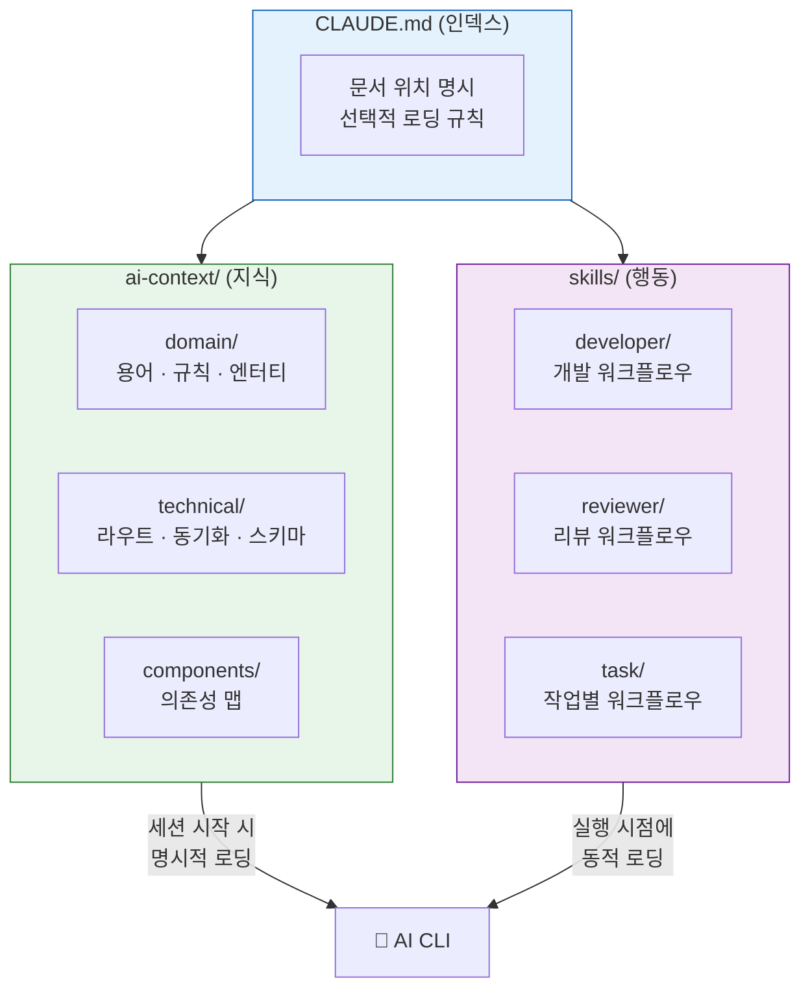
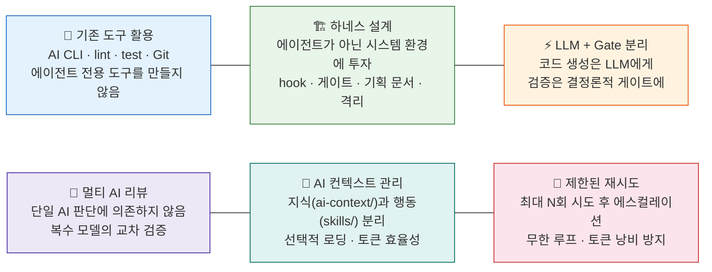

# 로컬 개발 에이전트 워크플로우

## 아키텍처

```mermaid
graph TB
    subgraph L1["Layer 1: Entry Point"]
        EP1["⌨️ CLI 직접 실행"]
        EP2["🌐 Web UI"]
        EP3["💬 OpenClaw<br/>Slack · Discord"]
        AI["⌨️ Main AI CLI<br/>오케스트레이터"]
    end

    subgraph L2["Layer 2: Prepare"]
        subgraph PLAN_DRAFT["조사 + 기획 문서 작성"]
            CC1["요구사항 분석 + 프로젝트 탐색<br/>Augment Context MCP<br/>(시맨틱 검색 · 관계 파악 · Git)"]
            CC2["추가 조사<br/>웹 검색 · 엣지케이스 · 주의사항"]
            CTX["📂 AI 컨텍스트 로딩<br/>ai-context/ (지식) + skills/ (행동)<br/>선택적 로딩"]
            PLAN["📋 기획 문서 작성<br/>기획안 + 테스트 케이스 개요"]
        end
        PLAN_REVIEW["🤖 멀티 AI 리뷰"]
    end

    subgraph LR["👤 Human Review"]
        HR1["기획 문서 리뷰<br/>승인 / 수정 요청"]
        HR2["자동 수정 실패<br/>실패 리포트 작성"]
    end

    subgraph L3["Layer 3: Execute + Feedback"]
        ENV["실행 환경<br/>로컬 / VM / Docker"]
        subgraph CODE_GATE["코드 작성 + 검증"]
            WRITE["✏️ 코드 작성<br/>(Main AI)"]
            LINT["🔍 정적 분석<br/>(test, lint 등)"]
        end
        MULTI_REVIEW["🤖 멀티 AI 리뷰"]
        RETRY["🔄 자동 수정<br/>최대 N회"]
    end

    subgraph L4["Layer 4: Output"]
        PR["✅ Commit / PR<br/>결과물 정리 · 기획 충족"]
    end

    EP1 & EP2 & EP3 --> AI
    AI --> CC1
    CC1 -->|" 필요 시 (AI 판단) "| CC2
    CC1 --> CTX
    CTX --> PLAN
    PLAN --> PLAN_REVIEW
    PLAN_REVIEW -->|" 부족 "| CC1
    PLAN_REVIEW -->|" 충분 "| HR1
    HR1 -->|" 수정 요청 "| CC1
    HR1 -->|" 승인 "| ENV
    ENV --> WRITE --> LINT
    LINT -->|" 실패 "| WRITE
    LINT -->|" 통과 "| MULTI_REVIEW
    MULTI_REVIEW -->|" 실패 "| RETRY -->|" 재시도 "| WRITE
    MULTI_REVIEW -->|" 통과 "| PR
    RETRY -->|" 한도 초과 "| HR2
    style L1 fill: #e3f2fd, stroke: #1565C0
    style L2 fill: #e8f5e9, stroke: #2E7D32
    style LR fill: #fff3e0, stroke: #E65100
    style L3 fill: #f3e5f5, stroke: #6A1B9A
    style L4 fill: #c8e6c9, stroke: #2E7D32
```

## 멀티 AI 리뷰

```mermaid
graph TD
    OUTPUT["산출물<br/>(기획 문서 / 코드)"]

    subgraph Reviewers["병렬 리뷰"]
        R1["Claude Opus<br/>기획 대조 · 논리 검증"] --> D1["📄 리뷰 문서"]
        R2["GPT 5.4<br/>품질 · 엣지케이스"] --> D2["📄 리뷰 문서"]
        R3["GPT 5.3 Codex<br/>코드 정합성 · 버그 탐지"] --> D3["📄 리뷰 문서"]
    end

    AGG["오케스트레이션 AI<br/>리뷰 종합 · 판정"]
    OUTPUT -->|" 병렬 "| R1 & R2 & R3
    D1 & D2 & D3 --> AGG
    AGG -->|" 통과 "| PASS["✅ 다음 단계"]
    AGG -->|" 실패 "| FAIL["❌ 구조화된 피드백 → Main AI 수정"]
    style Reviewers fill: #ede7f6, stroke: #4527A0
```

## AI 컨텍스트 관리

```mermaid
graph TB
    subgraph CLAUDE["CLAUDE.md (인덱스)"]
        IDX["문서 위치 명시<br/>선택적 로딩 규칙"]
    end

    subgraph KNOWLEDGE["ai-context/ (지식)"]
        D1["domain/<br/>용어 · 규칙 · 엔터티"]
        D2["technical/<br/>라우트 · 동기화 · 스키마"]
        D3["components/<br/>의존성 맵"]
    end

    subgraph BEHAVIOR["skills/ (행동)"]
        S1["developer/<br/>개발 워크플로우"]
        S2["reviewer/<br/>리뷰 워크플로우"]
        S3["task/<br/>작업별 워크플로우"]
    end

    CLAUDE --> KNOWLEDGE
    CLAUDE --> BEHAVIOR
    KNOWLEDGE -->|" 세션 시작 시<br/>명시적 로딩 "| AI["🤖 AI CLI"]
    BEHAVIOR -->|" 실행 시점에<br/>동적 로딩 "| AI
    style CLAUDE fill: #e3f2fd, stroke: #1565C0
    style KNOWLEDGE fill: #e8f5e9, stroke: #2E7D32
    style BEHAVIOR fill: #f3e5f5, stroke: #6A1B9A
```

## 설계 원칙

```mermaid
graph LR
    P1["🔧 기존 도구 활용<br/>AI CLI · lint · test · Git<br/>에이전트 전용 도구를 만들지 않음"]
    P2["🏗️ 하네스 설계<br/>에이전트가 아닌 시스템 환경에 투자<br/>hook · 게이트 · 기획 문서 · 격리"]
    P3["⚡ LLM + Gate 분리<br/>코드 생성은 LLM에게<br/>검증은 결정론적 게이트에"]
    P4["🤖 멀티 AI 리뷰<br/>단일 AI 판단에 의존하지 않음<br/>복수 모델의 교차 검증"]
    P5["📂 AI 컨텍스트 관리<br/>지식(ai-context/)과 행동(skills/) 분리<br/>선택적 로딩 · 토큰 효율성"]
    P6["🚫 제한된 재시도<br/>최대 N회 시도 후 에스컬레이션<br/>무한 루프 · 토큰 낭비 방지"]
    P1 --- P2 --- P3
    P4 --- P5 --- P6
    style P1 fill: #e3f2fd, stroke: #1565C0
    style P2 fill: #e8f5e9, stroke: #2E7D32
    style P3 fill: #fff3e0, stroke: #E65100
    style P4 fill: #ede7f6, stroke: #4527A0
    style P5 fill: #e0f2f1, stroke: #00695C
    style P6 fill: #fce4ec, stroke: #C62828
```
