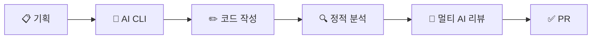

# 로컬 개발 에이전트 워크플로우

> 에이전트를 만드는 것이 아니라, **에이전트가 동작하는 환경을 설계**한다.

## 개요

AI CLI를 에이전트 코어로 활용하는 로컬 개발 자동화 워크플로우이다.
[Stripe Minions](/docs/stripe-minions/01-stripe-minions.md)의 아키텍처를 로컬 환경에 맞게 변형하고,
[컬리 OMS팀의 Claude AI 활용 방법](https://helloworld.kurly.com/blog/oms-claude-ai-workflow/)을 적용하여 AI 컨텍스트 관리를 체계화한다.



## 문서 구조

| 문서                                   | 설명                                    |
|--------------------------------------|---------------------------------------|
| [00-diagram.md](./00-diagram.md)     | 아키텍처 다이어그램, 멀티 AI 리뷰, 설계 원칙, AI 컨텍스트 |
| [01-detail.md](./01-detail.md)       | 레이어별 상세 설명, 컬리 OMS 적용, Minions 비교     |

## 핵심 공식

```text
AI CLI (기존 도구 활용) + AI 컨텍스트 관리 (지식/행동 분리) + 멀티 AI 리뷰 + 하네스 (hook · 게이트 · 기획 문서) + 사람 리뷰 = 로컬 개발 자동화
```

## 핵심 원칙

1. **기존 도구 활용** — AI CLI, lint, test, Git을 그대로 사용
2. **하네스 설계** — 에이전트가 아닌 시스템 환경에 투자
3. **AI 컨텍스트 관리** — 지식(ai-context/)과 행동(skills/) 분리, 선택적 로딩
4. **멀티 AI 리뷰** — 단일 AI 판단에 의존하지 않는 복수 모델 교차 검증
5. **제한된 재시도** — 무한 루프 · 토큰 낭비 방지

## 참고 자료

- [Stripe Minions 개요](/docs/stripe-minions/01-stripe-minions.md)
- [Stripe Minions 시스템 설계](/docs/stripe-minions/02-stripe-minions-part2.md)
- [컬리 OMS팀의 Claude AI 활용](https://helloworld.kurly.com/blog/oms-claude-ai-workflow/)
- [에이전틱 AI 설계 패턴 (Anthropic)](/docs/effective-agents/README.md)
- [에이전트 디자인 패턴 (Google Cloud)](/docs/design-pattern/README.md)
